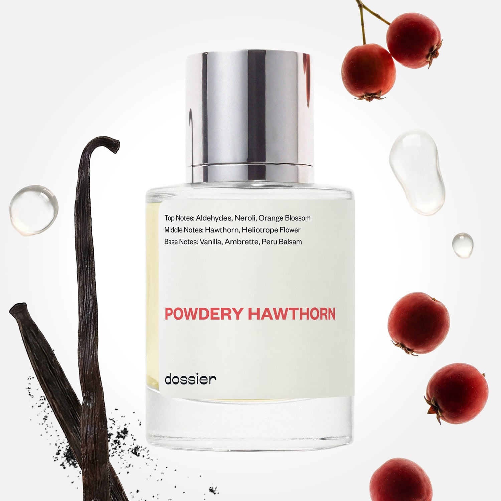

# Powdery Hawthorn

- **Dossier Inspired by Tom Ford's Metallique**
- **URL:** https://dossier.co/products/powdery-hawthorn
- **SEO title:** Tom Ford's Metallique Dupe Perfume: Powdery Hawthorn - Dossier Perfumes

## Pricing (sizes)

| Size/SKU | Member price | List price | Currency |
|---|---|---|---|
| 32017675583555 | 28.8 | 32 | USD |

## Content (scent notes, about, editorial)

Back Home / Perfumes / Dossier Impressions / POWDERY HAWTHORN 

Women 

Sold out 

Powdery Hawthorn

Eau de Parfum. Size: 50ml / 1.7oz 

members: $28.80

Guest:
$32

Inspired by Tom Ford's Metallique Inspired by Tom Ford's Metallique 
Inspired by Tom Ford's Metallique 

Retail price 180 Crafted in France 
Scent Family: warm 

Notify Me 

Scent Notes This perfume is: Vintage vibes reimagined 
Main Notes:

Aldehydes

Neroli

Orange Blossom

Vanilla

Ambrette

Peru Balsam

top: The first notes you smell 
Aldehydes, Neroli, Orange Blossom 
middle: The heart of the perfume 
Hawthorn, Heliotrope Flower 
base: The notes that linger all day 
Vanilla, Ambrette, Peru Balsam 
ingredients: Alcohol, Water, Parfum/Perfume, Amyl Cinnamal, Hexyl Cinnamal, alpha-iso-Methylionone, Anise Alcohol, Benzyl alcohol, Benzyl Benzoate, Benzyl Cinnamate, Cinnamyl alcohol, Citral, Coumarin, Limonene, Farnesol, Geraniol, Hydroxycitronellal, Linalool. 

Vegan
Cruelty-free

Clean ingredients

About Powdery Hawthorn (inspired by Tom Ford's Metallique) re-creates the powdery scent of ancient cosmetics and fragrances, blending flowers that are no longer common, like hawthorn and heliotrope. Paired with warm vanilla, balm, and Aldehydes (synthetic molecules discovered more than a century ago), this scent is energized with floral notes, adding a dazzling and metallic touch. 

Luminous and surprising, like a second skin, Powdery Hawthorn (our impression of Tom Ford's Metallique) is an incredible journey through time, revisiting a vintage fragrance structure with a futuristic metallic twist.

Scent Intensity: Significant 

Concentration: 18%

Gender: Feminine 

Shipping
Free shipping with 2+ items. 

Standard Shipping (with 2+ items) Auto-selected with 2+ items 
FREE 

Standard Shipping Auto-selected under 2 items 
$3.95 

Express shipping: 2 business days Select in checkout 
$19.00 

Returns
Free exchanges for all. Free returns with 

Exchanges
Free exchange, 1 time per order for all.

Returns
D+ members get 1 FREE return per order.
Non-members incur a $3.99/bottle return fee, 1 time per order.
Returns must be postmarked within 30 days of the initial order. Learn More 

FAQs Are these fragrances long lasting? They are designed to be very long lasting, just like designer fragrances, in some cases even longer, depending on the composition. 
When does the new packaging come out? We'll begin rolling out our new packaging across the U.S. and international markets soon! If you want to shop IRL - our new packaging first hits stores on January 11, 2026 at Walmart. Please note that if you are shopping online, you may receive a combination of our current and new packaging while we transition our inventory. 
How will I know what scent I like? We get it, shopping for perfumes online is hard! That's why we created a scent quiz, which will find the perfect scent for you Take the quiz (opens in new tab) 
Unsure about something? Ask us! help@dossier.co 

Details We are not associated or affiliated with the brands mentioned here in any way.
Powdery Hawthorn

A spritz of modern femininity and fearlessness

An indulging coalescence of floral saccharine and deep vanilla, the allure of the Tom Ford Metallique Eau de Parfum (the fragrance that Dossier’s Powdery Hawthorn is inspired by) is akin to bathing in the falls of Skógafoss. Although sometimes marketed as a feminine fragrance, this is a unisex perfume that can be worn by both men and women. In fact, it packs a punch with gender-neutral richness and intoxicating appeal. It is a definitive take on bold veracity and fearlessness.

A novel perfume released in a cosmopolitan world where sophistication and intrepidity run the game, this fragrance reminds you of the beauty of modern life. From time immemorial, nature has evolved from one state to the other – and the luxury fragrance that Powdery Hawthorn is inspired by mimics this evolution in the most flattering of ways. Right from the first spritz, the fragrance continues to evolve, surprising you with successive notes and causing those around to fall in love.

Opening with subtly light top notes of bergamot and metallic aldehydes, the scent revives your olfactories like a gust of fresh air. It then combines the depth and power of woody vanilla and creamy sandalwood into an aroma that unlocks your inner verve and vitality. The floral notes of white hawthorn and lily-of-the-valley also blend through seamlessly to create an intricately designed fusion of flowery woodland.

The complexity of the luxury fragrance that Powdery Hawthorn is inspired by is quite sharply contrasted by the simple bottle that holds it. The bottle is a meek and sleek housing that exudes character and charisma. It is a style classic that pays homage to humility. 
The very attitude of this Eau de Parfum is reminiscent of admirable leaders. It is not unlike a Tom Ford Eau de Parfum to command respect and provide a long-lasting scent of tenacity and self-assurance – and this fragrance knows all about it.

If you’re eager to don this glorious fragrance, log on to your favorite e-retailer now. You can buy the Tom Ford Metallique Eau de Parfum in the smaller 50 ml size for $165.00 and a larger 100 ml (3.4 oz) size for $210.00. The 3 ml travel size costs $19.80 and is applied with a rollerball for your convenience and longevity. To spoil yourself or your loved ones on those special occasions, consider the gift set. It includes the 50 ml Eau de Parfum and smaller rollerball and goes for $108.00.

To indulge in the luxury of tenacity and fearlessness but for less money, consider turning to Dossier’s Powdery Hawthorn. Laced with the essence of power and charm, our Tom Ford Metallique dupe coats the skin effortlessly and bedazzles you in beguiling intrigue. We designed this to recreate the classic scent of an American jewel with a modern twist. Wearing it is like wearing an olfactory equivalent of the bubble-gum pink lake. Discover alluring notes of metallic aldehydes, creamy vanilla, hawthorn, and heliotrope, as they reinvigorate your senses, spice up your mood, and translate you to the sand dunes of Lençóis Maranhenses. Don’t get it twisted: Powdery Hawthorn is a classic scent that pays homage to modernity.

Best Layered With Combine 2 of our perfumes to create a third scent with layering, curated by our nose. Learn more 

You Might Love 

4.3 

Rated 4.3 out of 5 stars 

Based on 610 reviews 

Reviews 610 (tab expanded) Questions 3 (tab collapsed) 

Filters 
Write a Review (Opens in a new window) 

610 reviews 
Sort Highest Rating Most Helpful Photos & Videos Most Recent Oldest Lowest Rating Least Helpful 

R 

Rebecca 

Verified Buyer 

12/30/25 

Rated 5 out of 5 stars 

Calm and Fresh
I had zero intention on buying this one, but I got it as my free scent in my big Christmas haul and we love it. It is so gentle and classy and calm. I can see it working in all seasons. No headache. Can't speak to how accurate of a dupe it is, but it's perfect for my 15 year old daughter who doesn't go for anything too perfume-y. This is a modern scent.

Read More Read more about this review 

Was this helpful? Yes, this review from Rebecca was helpful. 0 people voted yes No, this review from Rebecca was not helpful. 0 people voted no 

DP 

Dossier Perfumes 
12/30/25 
Hey Rebecca! That surprise scent really stole the show for you and your daughter, so glad it’s gentle, classy, and headache-free, ready to shine all year long 😊

LV 

Lucille V. 

Verified Buyer 

12/21/25 

Rated 5 out of 5 stars 

mellow scent
antoher great scent.

Read More Read more about this review 

Was this helpful? Yes, this review from Lucille V. was helpful. 0 people voted yes No, this review from Lucille V. was not helpful. 0 people voted no 

DP 

Dossier Perfumes 
12/21/25 
Hey Lucille, thanks for loving another mellow vibe! We’re so happy you enjoy it 😊

DH 

Dezmorel H. 

Verified Buyer 

12/20/25 

Rated 5 out of 5 stars 

AMAZING!!!
My flabber was gasted lol. These smell so GREAT. The tom ford is my favorite hands down! ❤️️

Read More Read more about this review 

Was this helpful? Yes, this review from Dezmorel H. was helpful. 0 people voted yes No, this review from Dezmorel H. was not helpful. 0 people voted no 

DP 

Dossier Perfumes 
12/20/25 
Dezmorel, yay we’re so thrilled you’re loving us! It warms our hearts to know these scents hit the spot, and we can’t wait for you to play around more. 💛

PJ 

Paulette J. 

Verified Buyer 

12/18/25 

Rated 5 out of 5 stars 

TRY SOMETHING NEW
It's different than my usual however, I love it!!!!!!!

Read More Read more about this review 

Was this helpful? Yes, this review from Paulette J. was helpful. 0 people voted yes No, this review from Paulette J. was not helpful. 0 people voted no 

DP 

Dossier Perfumes 
12/18/25 
Paulette, so glad you stepped outside your comfort zone and loved it!

M 

Maria 
Verified Buyer 

12/17/25 

Rated 5 out of 5 stars 

5 Stars
Always the best scents from
Dossier

Read More Read more about this review 

Was this helpful? Yes, this review from Maria was helpful. 0 people voted yes No, this review from Maria was not helpful. 0 people voted no 

DP 

Dossier Perfumes 
12/17/25 
Maria, you just made our day! Thanks for always choosing our scents 😊

Loading... 

Loading... 

Show More 

Inspired by  Baccarat Rouge 540 
Inspired by  Black Opium 
Inspired by  Love, Don't Be Shy 
Inspired by  Good Girl 
Inspired by  Libre 
Inspired by  Flowerbomb 
Inspired by  Light Blue 
Inspired by  Not a Perfume 
Inspired by  Aventus 
Inspired by  Bleu de Chanel 
Inspired by  Mon Paris 
Inspired by  Coco Mademoiselle 
Inspired by  Tom Ford for Men 
Inspired by  For Her 
Inspired by  J'Adore Dior 
Inspired by  Alien 
Inspired by  Black Opium Perfume 
Inspired by  Lost Cherry Perfume 

GET UP TO 30% OFF 

Find us at these retailers. 

Be the first to know. 
Submit 

Shop the following countries. United States 

Discover.
AI Scent Finder 
Blog (opens in new tab) 
Scent Family 
Layering 
Scent Quiz 

Help.
Contact Us 
Returns 
FAQ 
Testimonials 
Accessibility 

More.
Store Locator 
Boutique 
Refer A Friend 
Index 

Download our app now.

Find us at these retailers. 

Be the first to know. 
Submit 

Shop the following countries. United States 

Discover.
AI Scent Finder 
Blog (opens in new tab) 
Scent Family 
Layering 
Scent Quiz 

Help.
Contact Us 
Returns 
FAQ 
Testimonials 
Accessibility 

More.

## Main Image

