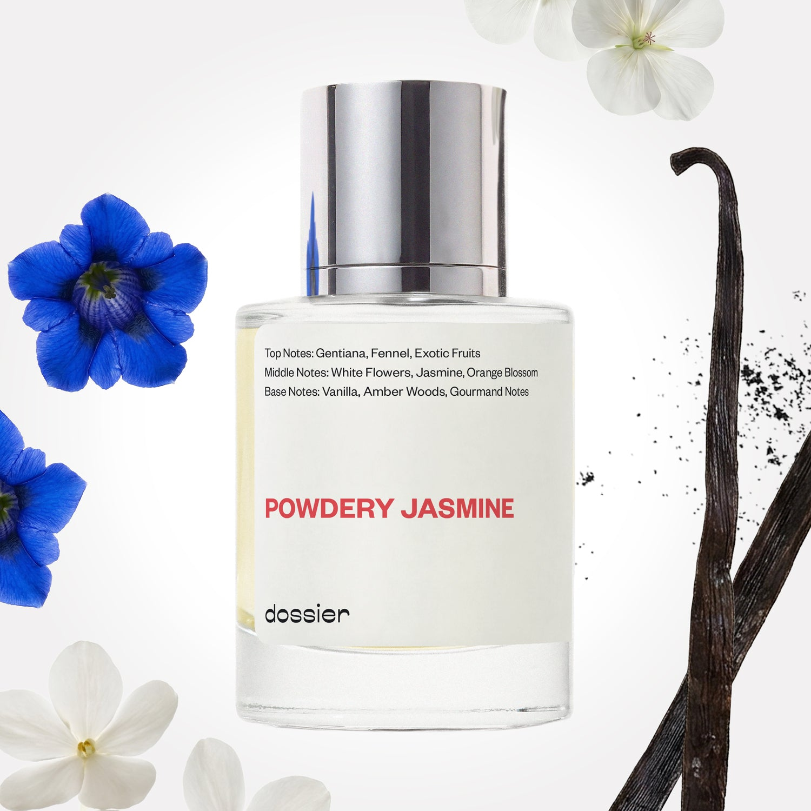

# Powdery Jasmine

- **Dossier Inspired by Viktor&Rolf’s Good Fortune**
- **URL:** https://dossier.co/products/powdery-jasmine
- **SEO title:** Viktor&Rolf’s Good Fortune Dupe Perfume: Powdery Jasmine - Dossier Perfumes

## Pricing (sizes)

| Size/SKU | Member price | List price | Currency |
|---|---|---|---|
| POJA050IMUSP2XX | 28.8 | 32 | USD |

## Content (scent notes, about, editorial)

Back Home / Perfumes / Dossier Impressions / POWDERY JASMINE 

Women 

Sold out 

Powdery Jasmine

Eau de Parfum. Size: 50ml / 1.7oz 

members: $28.80

Guest:
$32

Inspired by Viktor&Rolf's Good Fortune Inspired by Viktor&Rolf's Good Fortune 
Inspired by Viktor&Rolf's Good Fortune 

Retail price 145 Crafted in France 
Scent Family: flowery 

Notify Me 

Scent Notes Main Notes:

Gentiana

White Flowers

Vanilla

top: The first notes you smell 
Gentiana, Fennel, Exotic Fruits 
middle: The heart of the perfume 
White Flowers, Jasmine, Orange Blossom 
base: The notes that linger all day 
Vanilla, Amber Woods, Gourmand Notes 
ingredients: Alcohol, Water, Parfum/Perfume, Hexyl Cinnamal, alpha-iso-Methylionone, Benzyl alcohol, Benzyl Benzoate, Benzyl Salicylate, Citral, Coumarin, Citronellol, Limonene, Eugenol, Geraniol, Hydroxycitronellal, Linalool. 

Vegan
Cruelty-free

Clean ingredients

About Powdery Jasmine’s opening features two rare raw materials: gentiana (a wild flower growing on European mountain tops, whose roots are distilled) and fennel. Both bring to the fragrance an original aromatic flicker, slightly aniseed and bitter, made cheerful thanks to a sprinkling of exotic fruits. The fragrance then evolves into a voluptuous floral heart of white flowers, highlighting jasmine, resting on warm vanilla from Madagascar and coated with gourmand notes.

Sensual, enveloping, Powdery Jasmine is a resolutely feminine fragrance, combining a velvety feel with a touch of mystery and originality.
Scent Intensity: Significant 

Concentration: 18%

Gender: Feminine 

Shipping
Free shipping with 2+ items. 

Standard Shipping (with 2+ items) Auto-selected with 2+ items 
FREE 

Standard Shipping Auto-selected under 2 items 
$3.95 

Express shipping: 2 business days Select in checkout 
$19.00 

Returns
Free exchanges for all. Free returns with 

Exchanges
Free exchange, 1 time per order for all.

Returns
D+ members get 1 FREE return per order.
Non-members incur a $3.99/bottle return fee, 1 time per order.
Returns must be postmarked within 30 days of the initial order. Learn More 

FAQs Are these fragrances long lasting? They are designed to be very long lasting, just like designer fragrances, in some cases even longer, depending on the composition. 
When does the new packaging come out? We'll begin rolling out our new packaging across the U.S. and international markets soon! If you want to shop IRL - our new packaging first hits stores on January 11, 2026 at Walmart. Please note that if you are shopping online, you may receive a combination of our current and new packaging while we transition our inventory. 
How will I know what scent I like? We get it, shopping for perfumes online is hard! That's why we created a scent quiz, which will find the perfect scent for you Take the quiz (opens in new tab) 
Unsure about something? Ask us! help@dossier.co 

You Might Love 

4.5 

Rated 4.5 out of 5 stars 

Based on 203 reviews 

Reviews 203 (tab expanded) Questions 1 (tab collapsed) 

Filters 
Write a Review (Opens in a new window) 

203 reviews 
Sort Highest Rating Most Helpful Photos & Videos Most Recent Oldest Lowest Rating Least Helpful 

ZV 

Zamira V. 

Verified Buyer 

12/12/25 

Rated 5 out of 5 stars 

Love It!
Excellent scent, great match and price out beats the competition

Read More Read more about this review 

Was this helpful? Yes, this review from Zamira V. was helpful. 0 people voted yes No, this review from Zamira V. was not helpful. 0 people voted no 

DP 

Dossier Perfumes 
12/12/25 
Thanks Zamira! We’re so happy the scent and price hit the spot 😊

L 

Lee 

Verified Buyer 

12/1/25 

Rated 5 out of 5 stars 

This one is addictive
I find this fragrance addictive. I have a back up and just purchased another on the tik tok live. She's a sexy beast. Good longevity. I am a fan. This is an honest review because some of Dossier fragrances have been horrible for me. This one is awesome if you love a bold, sexy scent.

Read More Read more about this review 

Was this helpful? Yes, this review from Lee was helpful. 0 people voted yes No, this review from Lee was not helpful. 0 people voted no 

DP 

Dossier Perfumes 
12/1/25 
Hey Lee, we’re thrilled this one’s become a bold favorite and that its longevity won you over. Thanks for sharing honesty—it means a lot to know you found a standout.

BM 

Brittany M. 

9/5/25 

Rated 5 out of 5 stars 

Love it
The perfume makes me want to wear this out to daily things

Read More Read more about this review 

Was this helpful? Yes, this review from Brittany M. was helpful. 0 people voted yes No, this review from Brittany M. was not helpful. 0 people voted no 

DP 

Dossier Perfumes 
9/9/25 
That’s the spirit, Brittany! Spritz on and go take on the world smelling amazing! 🚀🌸

MM 

Monica M. 

8/31/25 

Rated 5 out of 5 stars 

Beautifully delicate
This scent is so clean and delicate. I absolutely love mixing it with vitamin oil so it lasts. The smell is light enough for everyday where and lingers most of the day. In love!

Read More Read more about this review 

Was this helpful? Yes, this review from Monica M. was helpful. 0 people voted yes No, this review from Monica M. was not helpful. 0 people voted no 

DP 

Dossier Perfumes 
9/1/25 
Wow! That's a genius pro tip, Monica! So glad to hear this scent is your perfect everyday match. ✨

KS 

Kira S. 

8/30/25 

Rated 5 out of 5 stars 

Powdery and lasting
I love powdery scents and this is a great balance of delicate floral and soft powder, almost calming. I love this one!

Read More Read more about this review 

Was this helpful? Yes, this review from Kira S. was helpful. 0 people voted yes No, this review from Kira S. was not helpful. 0 people voted no 

DP 

Dossier Perfumes 
9/1/25 
Lasting power with a gentle vibe? That’s a keeper, Kira 💫

Loading... 

Loading... 

Show More 

Inspired by  Baccarat Rouge 540 
Inspired by  Black Opium 
Inspired by  Love, Don't Be Shy 
Inspired by  Good Girl 
Inspired by  Libre 
Inspired by  Flowerbomb 
Inspired by  Light Blue 
Inspired by  Not a Perfume 
Inspired by  Aventus 
Inspired by  Bleu de Chanel 
Inspired by  Mon Paris 
Inspired by  Coco Mademoiselle 
Inspired by  Tom Ford for Men 
Inspired by  For Her 
Inspired by  J'Adore Dior 
Inspired by  Alien 
Inspired by  Black Opium Perfume 
Inspired by  Lost Cherry Perfume 

GET UP TO 30% OFF 

Find us at these retailers. 

Be the first to know. 
Submit 

Shop the following countries. United States 

Discover.
AI Scent Finder 
Blog (opens in new tab) 
Scent Family 
Layering 
Scent Quiz 

Help.
Contact Us 
Returns 
FAQ 
Testimonials 
Accessibility 

More.
Store Locator 
Boutique 
Refer A Friend 
Index 

Download our app now.

Find us at these retailers. 

Be the first to know. 
Submit 

Shop the following countries. United States 

Discover.
AI Scent Finder 
Blog (opens in new tab) 
Scent Family 
Layering 
Scent Quiz 

Help.
Contact Us 
Returns 
FAQ 
Testimonials 
Accessibility 

More.

## Main Image

