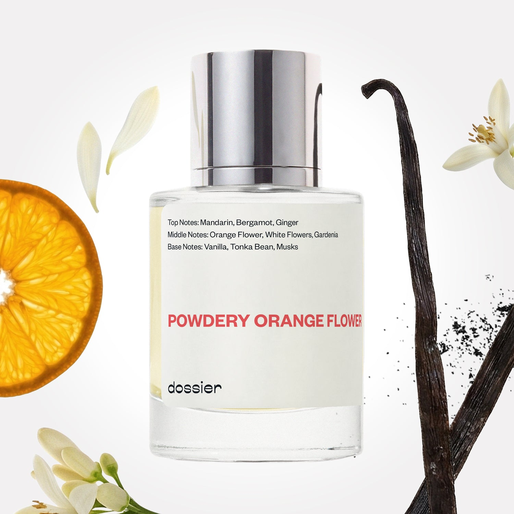

# Powdery Orange Flower

- **Dossier Inspired by Valentino's Voce Viva**
- **URL:** https://dossier.co/products/powdery-orange-flower
- **SEO title:** Valentino's Voce Viva Dupe Perfume: Powdery Orange Flower - Dossier Perfumes

## Pricing (sizes)

| Size/SKU | Member price | List price | Currency |
|---|---|---|---|
| 39454543970371 | 28.8 | 32 | USD |

## Content (scent notes, about, editorial)

Back Home / Perfumes / Dossier Impressions / POWDERY ORANGE FLOWER 

Women 

Sold out 

Powdery Orange Flower

Eau de Parfum. Size: 50ml / 1.7oz 

members: $28.80

Guest:
$32

Inspired by Valentino's Voce Viva Inspired by Valentino's Voce Viva 
Inspired by Valentino's Voce Viva 

Retail price 140 Crafted in France 
Scent Family: flowery 

Notify Me 

Scent Notes This perfume is: Orange candy, subtly sultry 
Main Notes:

Mandarin

Bergamot

Ginger

Vanilla

top: The first notes you smell 
Mandarin, Bergamot, Ginger 
middle: The heart of the perfume 
Orange Flower, White Flowers, Gardenia 
base: The notes that linger all day 
Vanilla, Tonka Bean, Musks 
ingredients: Alcohol, Water, Parfum/Perfume, Benzyl alcohol, Benzyl Benzoate, Benzyl Salicylate, Citral, Coumarin, Citronellol, Limonene, Eugenol, Farnesol, Geraniol, Hydroxycitronellal, Isoeugenol, Linalool. 

Vegan
Cruelty-free

Clean ingredients

About Powdery Orange Flower (inspired by Valentino's Voce Viva) celebrates the encounter of two raw materials that perfectly meld together—orange blossom and vanilla. This duet flourishes with harmonizing notes of bergamot, ginger, and mandarin illuminating the floral opening. In the background, tonka bean and musk reinforce the creamy sensuality of vanilla.

Assertive and sensual, Powdery Orange Flower (our impression of Valentino's Voce Viva) is a sunlit fragrance surrounding you with an opulent and sexy vanilla floral bouquet.

Scent Intensity: Significant 

Concentration: 18%

Gender: Feminine 

Shipping
Free shipping with 2+ items. 

Standard Shipping (with 2+ items) Auto-selected with 2+ items 
FREE 

Standard Shipping Auto-selected under 2 items 
$3.95 

Express shipping: 2 business days Select in checkout 
$19.00 

Returns
Free exchanges for all. Free returns with 

Exchanges
Free exchange, 1 time per order for all.

Returns
D+ members get 1 FREE return per order.
Non-members incur a $3.99/bottle return fee, 1 time per order.
Returns must be postmarked within 30 days of the initial order. Learn More 

FAQs Are these fragrances long lasting? They are designed to be very long lasting, just like designer fragrances, in some cases even longer, depending on the composition. 
When does the new packaging come out? We'll begin rolling out our new packaging across the U.S. and international markets soon! If you want to shop IRL - our new packaging first hits stores on January 11, 2026 at Walmart. Please note that if you are shopping online, you may receive a combination of our current and new packaging while we transition our inventory. 
How will I know what scent I like? We get it, shopping for perfumes online is hard! That's why we created a scent quiz, which will find the perfect scent for you Take the quiz (opens in new tab) 
Unsure about something? Ask us! help@dossier.co 

Details We are not associated or affiliated with the brands mentioned here in any way.
Powdery Orange Flower

A Floral Tribute to A Multi-Faceted Femininity

Composed of color, couture, and coolness, Valentino Voce Viva Eau de Parfum (the fragrance that inspired Dossier’s Powdery Orange Flower) embodies the beauty and energy of a woman who is fulfilled and confident. Designed to celebrate female individuality, the luxury fragrance that Powdery Orange Flower is inspired by conveys the house’s conviction that perfume should be personal, intimate, and memorable – much like a voice.

Combined, the notes in Valentino Voce Viva create a powerhouse floral bouquet with an addictive crystal moss accord. 

The luxury fragrance that Powdery Orange Flower is inspired by absolutely floors its opening notes, combining sweet mandarin orange with a soothing bergamot scent to create an uplifting yet refreshing fragrance. At its heart, the luxury fragrance that Powdery Orange Flower is inspired by blooms into a bouquet of opulent florals, tinged with a delicate, white gardenia that brings a soft, young tone to the fragrance. The fragrance is fresh and delightfully contemporary in the dry down – a medley of crystal moss and vanilla that evokes a woodsy aura. With a creamy and velvety touch, it’s a finish that’s undeniably sensual and flirtatious.

As a whole, the luxury fragrance that Powdery Orange Flower is inspired by has a distinctive and intimate character, making it a rather popular perfume for women. If you want to see why so many women love it, simply spray a little on your wrist and close your eyes. Almost immediately, the luxury fragrance that Powdery Orange Flower is inspired by evokes the scent of cool sunshine and beautiful meadows. It perfectly captures the essence of an idyllic spring afternoon, infused with the scent of fresh woods.

With that vivid imagery in mind, it’s no surprise that a scent like this is particularly suitable for spring or fall. Its light, delicate scent seems too overpowering either, so it’s plenty casual enough to wear to work, parties, or anywhere else.

Valentino Voce Viva Eau de Parfum is priced at $80 for a 30 ml (1 oz) bottle. There’s also a Mini Perfume Set that will make a wonderful addition to your perfume collection, or simply as a gift for a fellow perfume lover. This gift set comes with a 15 ml (0.5 oz) Eau de Parfum Spray and a travel size 7 ml (0.24 oz) Deluxe Mini Eau de Parfum bottle. For something more potent, there’s also an Intensa Gift Set that comes with the updated Intensa Eau de Parfum in both 15 ml (0.5 oz) and 50 ml (1.7 oz) bottle sizes.

Assertive and sensual, Powdery Orange Flower is a Valentino Voce Viva dupe that surrounds you with an opulent and sexy vanilla floral bouquet. Equally floral and equally intoxicating, our replica is, in many ways, a renewed celebration of all that is sensual and uplifting about a woman’s individuality. 

Best Layered With Combine 2 of our perfumes to create a third scent with layering, curated by our nose. Learn more 

You Might Love 

4.6 

Rated 4.6 out of 5 stars 

Based on 836 reviews 

Reviews 836 (tab expanded) Questions (tab collapsed) 

Filters 
Write a Review (Opens in a new window) 

836 reviews 
Sort Highest Rating Most Helpful Photos & Videos Most Recent Oldest Lowest Rating Least Helpful 

LB 

Laura B. 
Verified Buyer 

5/8/26 

Rated 5 out of 5 stars 

Fantastic!
I love this fragrance. I will be wearing it all summer. Citrus/orange heaven in a bottle!!

Read More Read more about this review 

Was this helpful? Yes, this review from Laura B. was helpful. 0 people voted yes No, this review from Laura B. was not helpful. 0 people voted no 

DP 

Dossier Perfumes 
5/8/26 
Laura, we’re so happy this feels like a burst of sunshine for your days. Enjoy every sunny spritz! 💛

M 

Misty 
Verified Reviewer 

5/6/26 

Rated 5 out of 5 stars 

Love it!
The smell is wonderful and it’s now my new favorite. Scent lasts!

Read More Read more about this review 

Was this helpful? Yes, this review from Misty was helpful. 0 people voted yes No, this review from Misty was not helpful. 0 people voted no 

DP 

Dossier Perfumes 
5/6/26 
Hey there! So happy it’s become your new favorite and lasts 😊

EC 

Erika C. 
Verified Buyer 

4/27/26 

Rated 5 out of 5 stars 

Love this scent!
I just discovered this brand. And I have to say I am impressed. Love how long lasting it is and it’s affordable!

Read More Read more about this review 

Was this helpful? Yes, this review from Erika C. was helpful. 0 people voted yes No, this review from Erika C. was not helpful. 0 people voted no 

DP 

Dossier Perfumes 
4/27/26 
Erika! We’re thrilled you found us and love that it lasts and fits your budget. Happy spritzing!

MJ 

Madison J. 
Verified Buyer 

4/8/26 

Rated 5 out of 5 stars 

Beautiful 
I smelled the original Voce Viva and this is VERY similar. I love it. It’s airy, sweet, light. Perfect for daily wear. 

Read More Read more about this review 

Was this helpful? Yes, this review from Madison J. was helpful. 0 people voted yes No, this review from Madison J. was not helpful. 0 people voted no 

DP 

Dossier Perfumes 
4/8/26 
Madison! We’re thrilled you find it airy and sweet for everyday wear, and glad it delivers that feeling.

K 

Karla 

3/24/26 

Rated 5 out of 5 stars 

5 Stars
My husband and I loved the smell. Perfect fot Cocktails and dinner time. Love it!!
And delivery on time❣️

Read More Read more about this review 

Was this helpful? Yes, this review from Karla was helpful. 0 people voted yes No, this review from Karla was not helpful. 0 people voted no 

Loading... 

Loading... 

Show More 

Inspired by  Baccarat Rouge 540 
Inspired by  Black Opium 
Inspired by  Love, Don't Be Shy 
Inspired by  Good Girl 
Inspired by  Libre 
Inspired by  Flowerbomb 
Inspired by  Light Blue 
Inspired by  Not a Perfume 
Inspired by  Aventus 
Inspired by  Bleu de Chanel 
Inspired by  Mon Paris 
Inspired by  Coco Mademoiselle 
Inspired by  Tom Ford for Men 
Inspired by  For Her 
Inspired by  J'Adore Dior 
Inspired by  Alien 
Inspired by  Black Opium Perfume 
Inspired by  Lost Cherry Perfume 

GET UP TO 30% OFF 

Find us at these retailers. 

Be the first to know. 
Submit 

Shop the following countries. United States 

Discover.
AI Scent Finder 
Blog (opens in new tab) 
Scent Family 
Layering 
Scent Quiz 

Help.
Contact Us 
Returns 
FAQ 
Testimonials 
Accessibility 

More.
Store Locator 
Boutique 
Refer A Friend 
Index 

Download our app now.

Find us at these retailers. 

Be the first to know. 
Submit 

Shop the following countries. United States 

Discover.
AI Scent Finder 
Blog (opens in new tab) 
Scent Family 
Layering 
Scent Quiz 

Help.
Contact Us 
Returns 
FAQ 
Testimonials 
Accessibility 

More.

## Main Image

