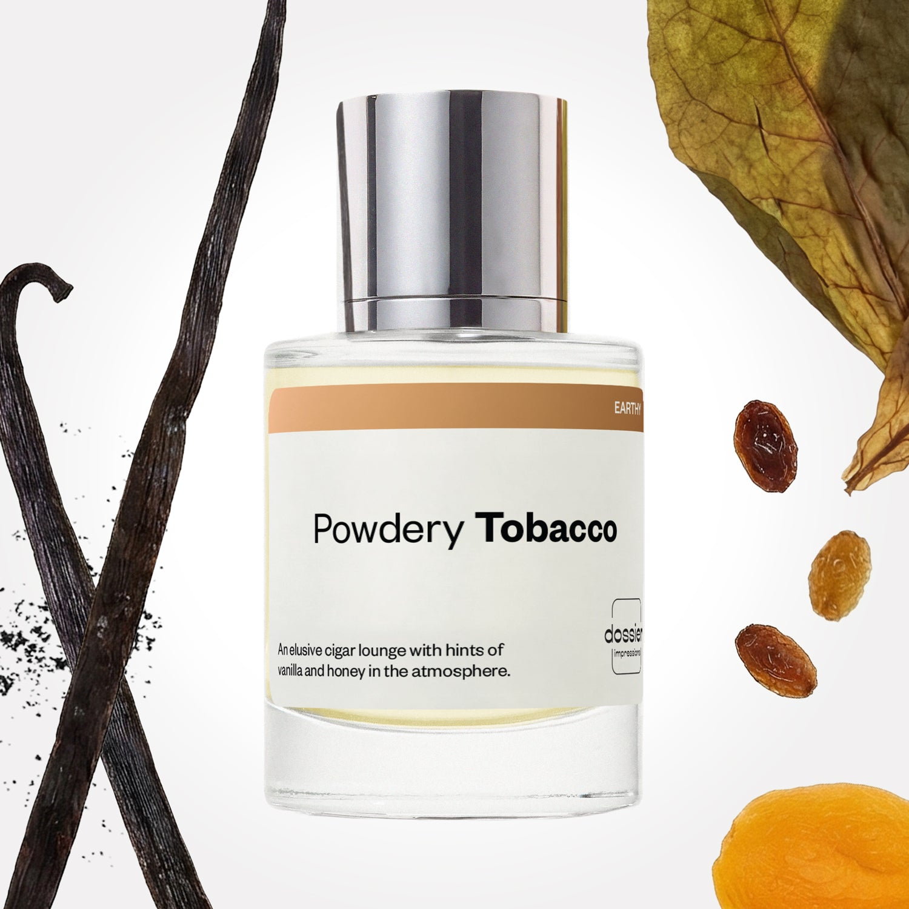

# Powdery Tobacco

- **Dossier Inspired by Tom Ford's Tobacco Vanille**
- **URL:** https://dossier.co/products/powdery-tobacco
- **SEO title:** Tom Ford's Tobacco Vanille Dupe Dupe Perfume: Powdery Tobacco - Dossier Perfumes

## Pricing (sizes)

| Size/SKU | Member price | List price | Currency |
|---|---|---|---|
| DI50PTUS | 35.1 | 39 | USD |

## Content (scent notes, about, editorial)

Back Home / Perfumes / Dossier Impressions / POWDERY TOBACCO 

Unisex 

Bestseller 

Powdery Tobacco

Eau de Parfum. Size: 50ml / 1.7oz 

members: $35.10

Guest:
$39

Inspired by Tom Ford's Tobacco Vanille Inspired by Tom Ford's Tobacco Vanille 
Inspired by Tom Ford's Tobacco Vanille 

Retail price 300 Crafted in France 
Scent Family: earthy 

Add to Cart 

Scent Notes This perfume is: Vibing in a cozy cigar lounge 
Main Notes:

Tobacco

Ginger

Apricot

Honey

Vanilla

Cocoa

Dry Fruits

top: The first notes you smell 
Tobacco, Ginger, Apricot 
middle: The heart of the perfume 
Honey, Vanilla, Cocoa 
base: The notes that linger all day 
Tonka Bean, Dry Fruits, Blond Woods 
ingredients: Alcohol, Water, Parfum/Perfume, Benzyl alcohol, Benzyl Benzoate, Benzyl Cinnamate, Cinnamaldehyde, Cinnamyl alcohol, Citral, Coumarin, Citronellol,
Limonene, Eugenol, Geraniol, Isoeugenol, Linalool. 

Vegan
Cruelty-free

Clean ingredients

About Powdery Tobacco (inspired by Tom Ford's Tobacco Vanille) sublimates the unique scent of tobacco leaves. Fruity and sweet honey facets of tobacco are highlighted, and lit up by a touch of ginger. Then, the fragrance unfolds at the base for more depth thanks to vanilla, tonka bean, and gourmand notes of dry fruit and cacao.

Opulent, highly qualitative, and assertive, Powdery Tobacco (our impression of Tom Ford's Tobacco Vanille) perfectly reinvents the cozy atmosphere of the lounge in a London club.

Scent Intensity: Statement 

Concentration: 18%

Gender: Unisex 

Shipping
Free shipping with 2+ items. 

Standard Shipping (with 2+ items) Auto-selected with 2+ items 
FREE 

Standard Shipping Auto-selected under 2 items 
$3.95 

Express shipping: 2 business days Select in checkout 
$19.00 

Returns
Free exchanges for all. Free returns with 

Exchanges
Free exchange, 1 time per order for all.

Returns
D+ members get 1 FREE return per order.
Non-members incur a $3.99/bottle return fee, 1 time per order.
Returns must be postmarked within 30 days of the initial order. Learn More 

FAQs Are these fragrances long lasting? They are designed to be very long lasting, just like designer fragrances, in some cases even longer, depending on the composition. 
When does the new packaging come out? We'll begin rolling out our new packaging across the U.S. and international markets soon! If you want to shop IRL - our new packaging first hits stores on January 11, 2026 at Walmart. Please note that if you are shopping online, you may receive a combination of our current and new packaging while we transition our inventory. 
How will I know what scent I like? We get it, shopping for perfumes online is hard! That's why we created a scent quiz, which will find the perfect scent for you Take the quiz (opens in new tab) 
Unsure about something? Ask us! help@dossier.co 

Details We are not associated or affiliated with the brands mentioned here in any way.
Powdery Tobacco

An intoxicating blend of opulence and charm

Capturing the soothing smell of opulence, the contemporary classic Tom Ford’s Tobacco Vanille (the fragrance that Dossier’s Powdery Tobacco is inspired by) hurls you to the Gower Peninsula – with the sparkling blue waters and the pretty goldcrests. It is a no-brainer first pick for when you’re vacationing on Mount Desert Island.

This is a distinct scent that compels, seduces, and mesmerizes. Plus, it is stylish and adaptable enough to meet the needs of both men and women. Delve into the most adventurous roots of love as top notes of tobacco leaf and spice massage your olfactories. Release your inherent verve as middle notes of vanilla, cacao, and tonka bean imbue you with youthfulness. Receive inspiring visions of glacier-carved cliffs and granite hills as base notes of dried fruits and woody notes tease your senses.

Wear it when you’re heading out to meet that special someone. Just clothe up, spritz, and bring out your best, most confident self. Tom Ford’s Tobacco Vanille is suitable for those who truly appreciate life’s little pleasures. It is a tender floral in the palm of your hand that arouses your senses and heals your soul. It is addictive and invigorating while yet being appropriate for every function.

Only few scents are capable of providing sensory immersion as this perfume does. It is zesty enough to summon a wide awake feeling akin to touring the cliff-hanging, whitewashed villas of Santorini Caldera. Feel the essences of love, beauty, glitz, and glamor as they stroke you gently in the face. It is an otherworldly affair from first opening to the last. If you want to smell as fresh as midwinter virtually all the time, the luxury fragrance that Powdery Tobacco is inspired by is the scent for you.
You can get the Tom Ford Private Blend Tobacco Vanille Eau de Parfum for $138.55 – $310.25

Finally, if you want a taste of opulence at an affordable price, turn to Dossier’s Powdery Tobacco. Our Tom Ford’s Tobacco Vanille dupe channels the spirits of tobacco leaves, vanilla, tonka bean, dry fruit, and cacao into a fragrance that permeates you with cherub-like exuberance. Taste the sweetness of budding florals and aromatic petals as this bouquet spices up your mood. Powdery Tobacco is your best choice if you wish to revel in the fruity and sweet honey facets of tobacco. It is your best chance for a quick escape into the alpine and subalpine ecosystems of Mount Rainier. Dip your finger into an intoxicating blend of opulence and charm.

Best Layered With Combine 2 of our perfumes to create a third scent with layering, curated by our nose. Learn more 

You Might Love 

4.3 

Rated 4.3 out of 5 stars 

Based on 1,804 reviews 

Reviews 1,804 (tab expanded) Questions 4 (tab collapsed) 

Filters 
Write a Review (Opens in a new window) 

1,804 reviews 
Sort Highest Rating Most Helpful Photos & Videos Most Recent Oldest Lowest Rating Least Helpful 

SC 

Shamika C. 
Verified Buyer 

6/29/26 

Rated 5 out of 5 stars 

Earthy Unisex
Very Cinnamon like.. More for men I think. But smells great!

Read More Read more about this review 

Was this helpful? Yes, this review from Shamika C. was helpful. 0 people voted yes No, this review from Shamika C. was not helpful. 0 people voted no 

DP 

Dossier Perfumes 
6/29/26 
Shamika, thanks for sharing! Powdery Tobacco’s spicy kick can surprise, but its cozy vibe works on anyone 😊

SR 

Susana R. 
Verified Buyer 

6/20/26 

Rated 5 out of 5 stars 

Powdery Tobacco
A smell of pure cinnamon in the first impression, then the wood and the vanilla aroma come together and will stay with you for hours, very spicy and bold but unique.

Read More Read more about this review 

Was this helpful? Yes, this review from Susana R. was helpful. 0 people voted yes No, this review from Susana R. was not helpful. 0 people voted no 

DP 

Dossier Perfumes 
6/20/26 
Susana, it’s awesome to hear how Powdery Tobacco turns heads and lasts all day. That bold spicy vibe is exactly what makes it stand out. Thanks for sharing your thoughts!

T 

Tony 

6/16/26 

Rated 5 out of 5 stars 

5 Stars
Love the smell pretty close to the original

Read More Read more about this review 

Was this helpful? Yes, this review from Tony was helpful. 0 people voted yes No, this review from Tony was not helpful. 0 people voted no 

MJ 

Marlon J. 
Verified Buyer 

6/13/26 

Rated 5 out of 5 stars 

Love it
Love It 

Read More Read more about this review 

Was this helpful? Yes, this review from Marlon J. was helpful. 0 people voted yes No, this review from Marlon J. was not helpful. 0 people voted no 

DP 

Dossier Perfumes 
6/13/26 
Marlon, thanks for sharing the love, glad you’re enjoying it 🌸

HR 

Haley R. S. 
Verified Buyer 

5/7/26 

Rated 5 out of 5 stars 

sweet and long lasting
I love the way this fragrance settles into a sweet and almost dessert-like scent. 

Read More Read more about this review 

Was this helpful? Yes, this review from Haley R. S. was helpful. 0 people voted yes No, this review from Haley R. S. was not helpful. 0 people voted no 

DP 

Dossier Perfumes 
5/7/26 
We’re so happy it feels dessert-like and long-lasting on your skin, Haley. Thanks for sharing this sweet feedback!

Loading... 

Loading... 

Show More 

Inspired by  Baccarat Rouge 540 
Inspired by  Black Opium 
Inspired by  Love, Don't Be Shy 
Inspired by  Good Girl 
Inspired by  Libre 
Inspired by  Flowerbomb 
Inspired by  Light Blue 
Inspired by  Not a Perfume 
Inspired by  Aventus 
Inspired by  Bleu de Chanel 
Inspired by  Mon Paris 
Inspired by  Coco Mademoiselle 
Inspired by  Tom Ford for Men 
Inspired by  For Her 
Inspired by  J'Adore Dior 
Inspired by  Alien 
Inspired by  Black Opium Perfume 
Inspired by  Lost Cherry Perfume 

GET UP TO 30% OFF 

Find us at these retailers. 

Be the first to know. 
Submit 

Shop the following countries. United States 

Discover.
AI Scent Finder 
Blog (opens in new tab) 
Scent Family 
Layering 
Scent Quiz 

Help.
Contact Us 
Returns 
FAQ 
Testimonials 
Accessibility 

More.
Store Locator 
Boutique 
Refer A Friend 
Index 

Download our app now.

Find us at these retailers. 

Be the first to know. 
Submit 

Shop the following countries. United States 

Discover.
AI Scent Finder 
Blog (opens in new tab) 
Scent Family 
Layering 
Scent Quiz 

Help.
Contact Us 
Returns 
FAQ 
Testimonials 
Accessibility 

More.

## Main Image

