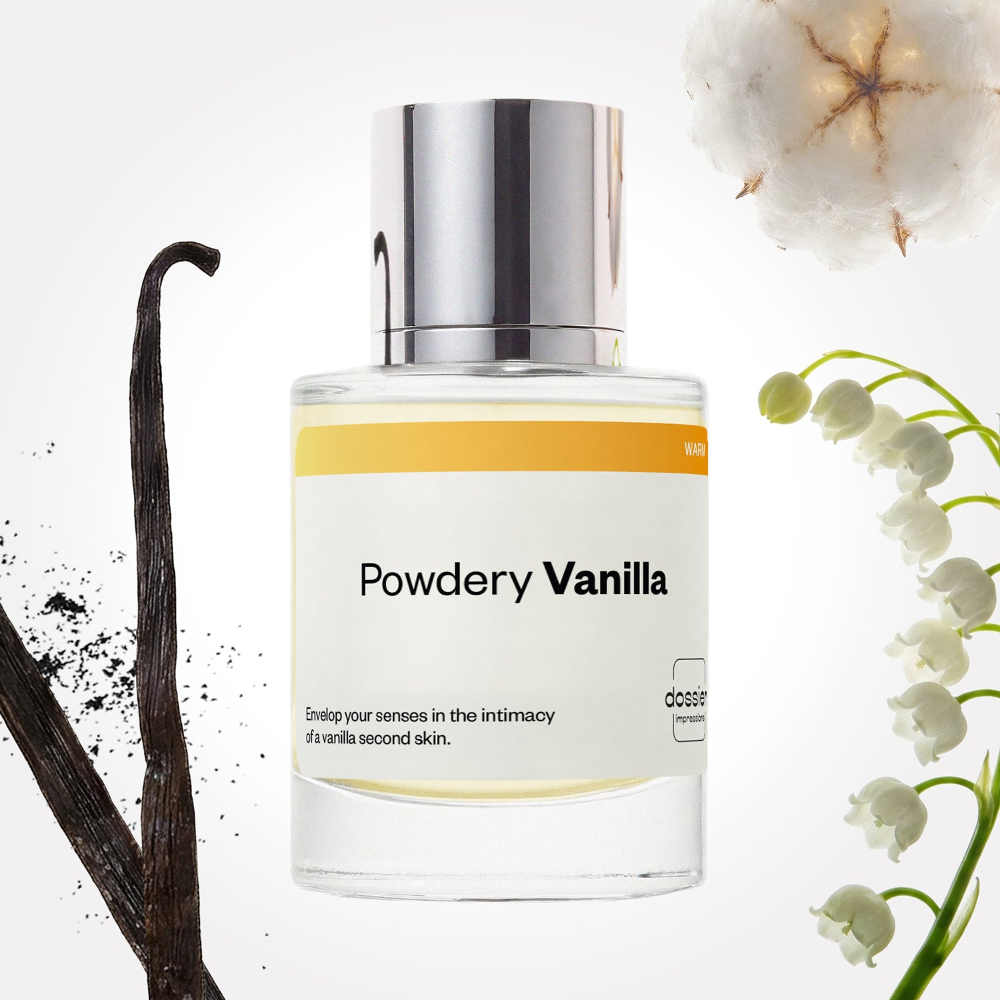

# Powdery Vanilla

- **Dossier Inspired by Phlur’s Vanilla Skin**
- **URL:** https://dossier.co/products/powdery-vanilla
- **SEO title:** Powdery Vanilla

## Pricing (sizes)

| Size/SKU | Member price | List price | Currency |
|---|---|---|---|
| DI50PVAUS | 28.8 | 32 | USD |

## Content (scent notes, about, editorial)

Back Home / Perfumes / Dossier Impressions / POWDERY VANILLA 

Unisex 

New 

Powdery Vanilla

Eau de Parfum. Size: 50ml / 1.7oz 

members: $28.80

Guest:
$32

Inspired by Phlur's Vanilla Skin Inspired by Phlur's Vanilla Skin 
Inspired by Phlur's Vanilla Skin 

Retail price 99 Crafted in France 
Scent Family: warm 

Add to Cart 

Scent Notes Main Notes:

Lily of the Valley

Vanilla

Musks

top: The first notes you smell 
pink pepper, apple 
middle: The heart of the perfume 
lily of the valley, brown sugar, white woods 
base: The notes that linger all day 
vanila, sandalwood, musks, benzoin 
ingredients: Alcohol Denat., Water, Parfum/Perfume, Tetramethyl Acetyloctahydronaphthalenes, Myroxylon Pereirae Oil/ Extract, Pinene, Santalol, Acetyl cedrene, Alpha-isomethyl Ionone, Benzyl Alcohol, Benzyl Benzoate, Benzyl Cinnamate, Beta-caryophyllene, Limonene, Eugenol, Geraniol, Isoeugenol, Linalool, Santalum Album Oil, Terpinolene, Vanillin. 

Vegan
Cruelty-free

Clean ingredients

About Experience the closeness and warm sensory bliss of a vanilla second skin. Powdery Vanilla (inspired by Phlur’s Vanilla Skin) is a vanilla-forward unisex scent that offers the comforts of an embrace. It hugs the skin from start to finish as the scent’s most prominent note. Experience it paired with creamy woody notes and a hint of liveliness at first sniff. The fragrance opens with the crisp zest of pink pepper and apple before unfolding into a heart of lily of the valley, brown sugar, and white woods. Once settled on the skin, the vanilla note becomes its sweetest and most inviting at the base with sandalwood, musk, and benzoin notes. From start to finish, Powdery Vanilla is the ultimate wearable vanilla. Warm softness and a hint of sweetness for all the senses.

Scent Intensity: Significant 

Concentration: 28%

Gender: Unisex 

Shipping
Free shipping with 2+ items. 

Standard Shipping (with 2+ items) Auto-selected with 2+ items 
FREE 

Standard Shipping Auto-selected under 2 items 
$3.95 

Express shipping: 2 business days Select in checkout 
$19.00 

Returns
Free exchanges for all. Free returns with 

Exchanges
Free exchange, 1 time per order for all.

Returns
D+ members get 1 FREE return per order.
Non-members incur a $3.99/bottle return fee, 1 time per order.
Returns must be postmarked within 30 days of the initial order. Learn More 

FAQs Are these fragrances long lasting? They are designed to be very long lasting, just like designer fragrances, in some cases even longer, depending on the composition. 
When does the new packaging come out? We'll begin rolling out our new packaging across the U.S. and international markets soon! If you want to shop IRL - our new packaging first hits stores on January 11, 2026 at Walmart. Please note that if you are shopping online, you may receive a combination of our current and new packaging while we transition our inventory. 
How will I know what scent I like? We get it, shopping for perfumes online is hard! That's why we created a scent quiz, which will find the perfect scent for you Take the quiz (opens in new tab) 
Unsure about something? Ask us! help@dossier.co 

Best Layered With Combine 2 of our perfumes to create a third scent with layering, curated by our nose. Learn more 

You Might Love 

4.6 

Rated 4.6 out of 5 stars 

Based on 91 reviews 

Reviews 91 (tab expanded) Questions (tab collapsed) 

Filters 
Write a Review (Opens in a new window) 

91 reviews 
Sort Highest Rating Most Helpful Photos & Videos Most Recent Oldest Lowest Rating Least Helpful 

EC 

Elena C. 
Verified Buyer 

6/26/26 

Rated 5 out of 5 stars 

Powdery Vanilla is the bomb!
Powdery vanilla is a 10/10!! Legit smells like a Powdery donut or frosted cupcake. People always telling me I smell good, and ask what scent. It's a must have.

Read More Read more about this review 

Was this helpful? Yes, this review from Elena C. was helpful. 0 people voted yes No, this review from Elena C. was not helpful. 0 people voted no 

DP 

Dossier Perfumes 
6/26/26 
Elena, we’re thrilled Powdery Vanilla is your go-to treat and you’re getting all those compliments! Keep enjoying that sweet buzz and have fun exploring more vibes 😊

K 

Kim 

6/17/26 

Rated 5 out of 5 stars 

5 Stars
I love powdery vanilla. I layer it with so many fragrances.

Read More Read more about this review 

Was this helpful? Yes, this review from Kim was helpful. 0 people voted yes No, this review from Kim was not helpful. 0 people voted no 

S 

Sonjay 

6/15/26 

Rated 5 out of 5 stars 

5 Stars
Love it.

Read More Read more about this review 

Was this helpful? Yes, this review from Sonjay was helpful. 0 people voted yes No, this review from Sonjay was not helpful. 0 people voted no 

E 

Emily 
Verified Reviewer 

6/11/26 

Rated 5 out of 5 stars 

Impressive vanilla 
This vanilla has a vintage-y feel to it, not distinctly gourmand, but elegant. A great very day scent. Please don’t discontinue this one! 

Read More Read more about this review 

Was this helpful? Yes, this review from Emily was helpful. 0 people voted yes No, this review from Emily was not helpful. 0 people voted no 

DP 

Dossier Perfumes 
6/11/26 
Emily, thanks so much! We love hearing how Powdery Vanilla brings that elegant vintage vibe to your every day. Your feedback means a lot and keeps us inspired.

ZB 

Zyon B. 
Verified Buyer 

5/28/26 

Rated 5 out of 5 stars 

Sweet good base
Sweet good base fragrance 

Read More Read more about this review 

Was this helpful? Yes, this review from Zyon B. was helpful. 0 people voted yes No, this review from Zyon B. was not helpful. 0 people voted no 

DP 

Dossier Perfumes 
5/28/26 
So glad you love that sweet base. Happy spritzing and exploring more scents!

Loading... 

Loading... 

Show More 

Inspired by  Baccarat Rouge 540 
Inspired by  Black Opium 
Inspired by  Love, Don't Be Shy 
Inspired by  Good Girl 
Inspired by  Libre 
Inspired by  Flowerbomb 
Inspired by  Light Blue 
Inspired by  Not a Perfume 
Inspired by  Aventus 
Inspired by  Bleu de Chanel 
Inspired by  Mon Paris 
Inspired by  Coco Mademoiselle 
Inspired by  Tom Ford for Men 
Inspired by  For Her 
Inspired by  J'Adore Dior 
Inspired by  Alien 
Inspired by  Black Opium Perfume 
Inspired by  Lost Cherry Perfume 

GET UP TO 30% OFF 

Find us at these retailers. 

Be the first to know. 
Submit 

Shop the following countries. United States 

Discover.
AI Scent Finder 
Blog (opens in new tab) 
Scent Family 
Layering 
Scent Quiz 

Help.
Contact Us 
Returns 
FAQ 
Testimonials 
Accessibility 

More.
Store Locator 
Boutique 
Refer A Friend 
Index 

Download our app now.

Find us at these retailers. 

Be the first to know. 
Submit 

Shop the following countries. United States 

Discover.
AI Scent Finder 
Blog (opens in new tab) 
Scent Family 
Layering 
Scent Quiz 

Help.
Contact Us 
Returns 
FAQ 
Testimonials 
Accessibility 

More.

## Main Image

