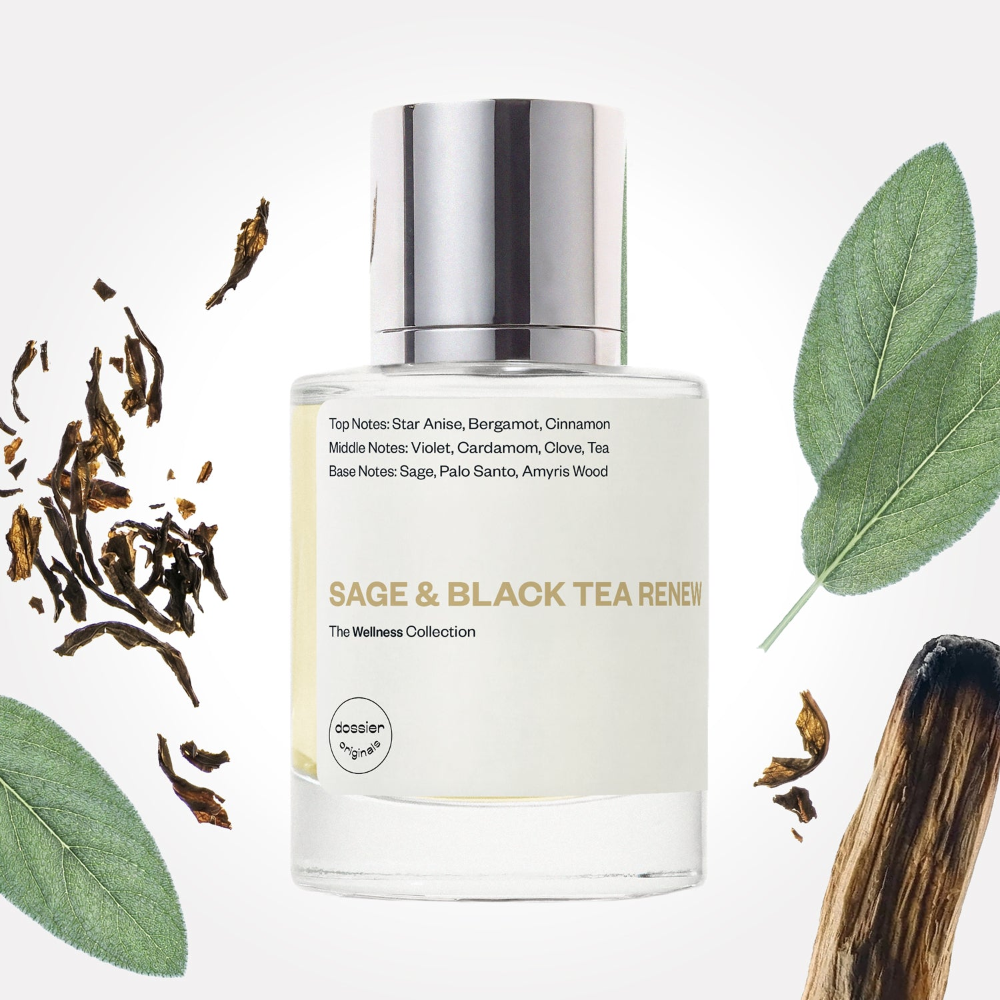

# Sage & Black Tea Renew

- **Dossier Dossier Originals**
- **URL:** https://dossier.co/products/sage-black-tea-renew
- **SEO title:** Sage & Black Tea Renew - Dossier Perfumes

## Pricing (sizes)

| Size/SKU | Member price | List price | Currency |
|---|---|---|---|
| 810086661404 | 35.1 | 39 | USD |
| 810086661398 | 35.1 | 39 | USD |
| 810086661381 | 35.1 | 39 | USD |
| 11 | 0 | 0 | USD |

## Content (scent notes, about, editorial)

Back Home / Perfumes / Dossier Originals / SAGE & BLACK TEA RENEW 

Unisex 

Bestseller 

Sage & Black Tea Renew

Eau de Parfum. Size: 50ml / 1.7oz 

members: $35.10

Guest:
$39

Dossier Originals: The wellness collection 

Refresh, re-energize, and rejuvenate. Aromatic therapy through fragrance for a heightened scent-sory experience. 
Allure 2024 Best of Beauty winner Read the article (opens in new tab) 

Crafted in France 
Scent Family: herbal 

Add to Cart 

Scent Notes Main Notes:

Bergamot

Violet

Sage

Palo Santo

top: The first notes you smell 
Star Anise, Bergamot, Cinnamon 
middle: The heart of the perfume 
Violet, Cardamom, Clove, Tea 
base: The notes that linger all day 
Sage, Palo Santo, Amyris Wood 
ingredients: Alcohol Denat., Water, Parfum/Perfume, Benzyl Alcohol, Cinnamal, Citral, Citronellol, Limonene, Eugenol, Geraniol, Linalool. 

Vegan
Cruelty-free

Clean ingredients

About The Virtue: Sage and black tea are both known for their grounding and clarifying properties.

The Scent: The aromatic fusion of sage and black tea exudes a sense of enchantment, while the woody presence of Palo Santo and Amyris adds a grounding touch. 

This results in a scent that is simultaneously dark and luminous, inviting you on a journey of inner peace. 

Scent Intensity: Significant 

Concentration: 22%

Gender: Unisex 

Shipping
Free shipping with 2+ items. 

Standard Shipping (with 2+ items) Auto-selected with 2+ items 
FREE 

Standard Shipping Auto-selected under 2 items 
$3.95 

Express shipping: 2 business days Select in checkout 
$19.00 

Returns
Free exchanges for all. Free returns with 

Exchanges
Free exchange, 1 time per order for all.

Returns
D+ members get 1 FREE return per order.
Non-members incur a $3.99/bottle return fee, 1 time per order.
Returns must be postmarked within 30 days of the initial order. Learn More 

FAQs Are these fragrances long lasting? They are designed to be very long lasting, just like designer fragrances, in some cases even longer, depending on the composition. 
When does the new packaging come out? We'll begin rolling out our new packaging across the U.S. and international markets soon! If you want to shop IRL - our new packaging first hits stores on January 11, 2026 at Walmart. Please note that if you are shopping online, you may receive a combination of our current and new packaging while we transition our inventory. 
How will I know what scent I like? We get it, shopping for perfumes online is hard! That's why we created a scent quiz, which will find the perfect scent for you Take the quiz (opens in new tab) 
Unsure about something? Ask us! help@dossier.co 

You Might Love 

4.0 

Rated 4.0 out of 5 stars 

Based on 228 reviews 

Reviews 228 (tab expanded) Questions (tab collapsed) 

Filters 
Write a Review (Opens in a new window) 

228 reviews 
Sort Highest Rating Most Helpful Photos & Videos Most Recent Oldest Lowest Rating Least Helpful 

M 

Monica 

6/9/26 

Rated 5 out of 5 stars 

5 Stars
This anotjer one of my favorites to wear for spring and summer.

Read More Read more about this review 

Was this helpful? Yes, this review from Monica was helpful. 0 people voted yes No, this review from Monica was not helpful. 0 people voted no 

J 

Jane 
Verified Buyer 

6/4/26 

Rated 5 out of 5 stars 

A Spiritual Scent
This scent definitely smells like black tea, so black tea lovers rejoice. And it has a spiritual connotation to it. Like a new-age yogi or a masseuse might wear - which must be the Sage. It's an energetic scent combo that may be good for daytime errands and a casual atmosphere -it's not a formal wear scent. Clarity is accurate to describe the scent in that it perks the senses. It's a unique scent that may not be for everyone or for every occasion, but worth trying if you like black tea, sage, spirituality, or even just need some energy in the day for your tasks. 

Read More Read more about this review 

Was this helpful? Yes, this review from Jane was helpful. 0 people voted yes No, this review from Jane was not helpful. 0 people voted no 

DP 

Dossier Perfumes 
6/4/26 
Jane, we’re thrilled you noticed those invigorating tea and sage vibes and that it perks you up for errands. It’s all about finding that everyday boost. Thanks for sharing!

L 

Lisa 
Verified Buyer 

5/23/26 

Rated 5 out of 5 stars 

Perfection
I blind ordered this scent off the Allure recommendation, which was my very first Dossier purchase. With my first sniff, I knew I'd just found my summer signature. If you love herbal and tea scents, this is a serious ******. It's been so difficult to find a tea-based perfume that holds the tea note for longer than a top whiff. In this one, there is no question: black tea has not come to play. The sage adds a warm, outdoorsy freshness, and the touch of cinnamon? Unexpected. Inspired.
It stands beautifully alone, but I've actually been layering this with another Dossier scent I discovered by accident at Target, Gourmand Vanilla (inspired by Tom Ford's Vanilla ***., I'll leave a different review). I didn't think Sage and Black Tea could get any better, but wow. The Gourmand Vanilla adds a sweetness and muskiness to the tea that has me huffing my own clothes. Which makes people look at me oddly, but whatever.
I just ordered three more bottles of Sage and Black Tea in your Memorial Day sale -- score! -- as well as the Originals Discovery set, since this one is so good. Dossier, your Inspirations are great, but what poaches my eggs is how well your team is *nailing* it on the Originals. 

Read More Read more about this review 

Was this helpful? Yes, this review from Lisa was helpful. 0 people voted yes No, this review from Lisa was not helpful. 0 people voted no 

DP 

Dossier Perfumes 
5/23/26 
Lisa, we’re so happy you found a summer signature scent and love how you’ve been layering it with that sweet vanilla twist. Thanks for sharing your layering genius! 🙌

LD 

Leonardo D. T. 
Verified Buyer 

4/14/26 

Rated 5 out of 5 stars 

Da Best....!
The notes hit in every way when I wear this fragrance.....I really don't need to search anymore...this is signature scent and I'm asked all the time of what I'm wearing!

Read More Read more about this review 

Was this helpful? Yes, this review from Leonardo D. T. was helpful. 0 people voted yes No, this review from Leonardo D. T. was not helpful. 0 people voted no 

DP 

Dossier Perfumes 
4/14/26 
Leonardo thanks so much for this lovely feedback! We’re thrilled it’s become your go-to and sparking those compliments. There’s nothing better than feeling confident in your signature scent 🌸

SM 

Stephanie M. 
Verified Buyer 

3/16/26 

Rated 5 out of 5 stars 

I adore it.
It is different that most perfumes. Not over powering. Not flowery. So me!

Read More Read more about this review 

Was this helpful? Yes, this review from Stephanie M. was helpful. 0 people voted yes No, this review from Stephanie M. was not helpful. 0 people voted no 

DP 

Dossier Perfumes 
3/16/26 
Hey Stephanie! We love that it feels just right for you and doesn’t overwhelm, totally your vibe 😊

Loading... 

Loading... 

Show More 

Inspired by  Baccarat Rouge 540 
Inspired by  Black Opium 
Inspired by  Love, Don't Be Shy 
Inspired by  Good Girl 
Inspired by  Libre 
Inspired by  Flowerbomb 
Inspired by  Light Blue 
Inspired by  Not a Perfume 
Inspired by  Aventus 
Inspired by  Bleu de Chanel 
Inspired by  Mon Paris 
Inspired by  Coco Mademoiselle 
Inspired by  Tom Ford for Men 
Inspired by  For Her 
Inspired by  J'Adore Dior 
Inspired by  Alien 
Inspired by  Black Opium Perfume 
Inspired by  Lost Cherry Perfume 

GET UP TO 30% OFF 

Find us at these retailers. 

Be the first to know. 
Submit 

Shop the following countries. United States 

Discover.
AI Scent Finder 
Blog (opens in new tab) 
Scent Family 
Layering 
Scent Quiz 

Help.
Contact Us 
Returns 
FAQ 
Testimonials 
Accessibility 

More.
Store Locator 
Boutique 
Refer A Friend 
Index 

Download our app now.

Find us at these retailers. 

Be the first to know. 
Submit 

Shop the following countries. United States 

Discover.
AI Scent Finder 
Blog (opens in new tab) 
Scent Family 
Layering 
Scent Quiz 

Help.
Contact Us 
Returns 
FAQ 
Testimonials 
Accessibility 

More.

## Main Image

