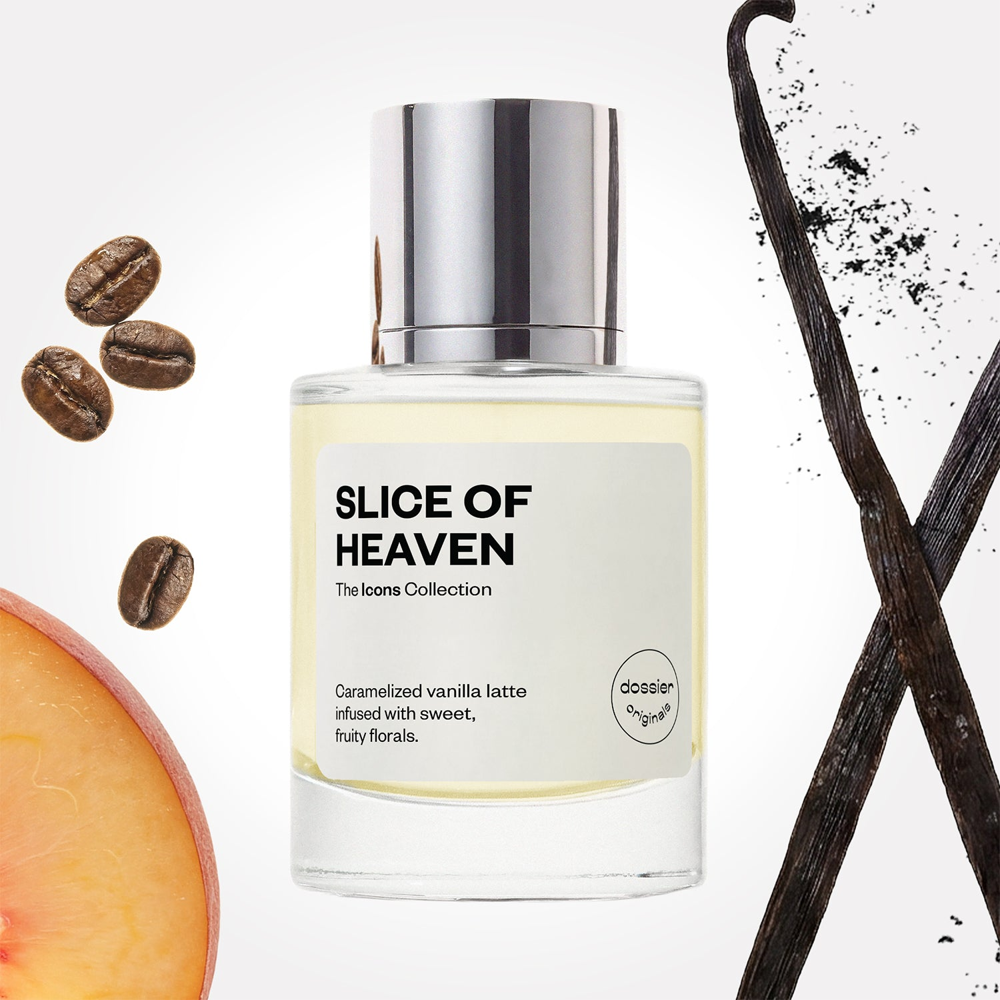

# Slice of Heaven

- **Dossier Dossier Originals**
- **URL:** https://dossier.co/products/slice-of-heaven
- **SEO title:** Slice of Heaven

## Pricing (sizes)

| Size/SKU | Member price | List price | Currency |
|---|---|---|---|
| 41570632073283 | 35.1 | 39 | USD |
| 41570584133699 | 35.1 | 39 | USD |
| 41570582528067 | 35.1 | 39 | USD |
| 42316178718787 | 35.1 | 39 | USD |
| BLFY050ORUSP2XX | 35.1 | 39 | USD |

## Content (scent notes, about, editorial)

Back Home / Perfumes / Dossier Originals / SLICE OF HEAVEN 

Women 

New 

Slice of Heaven

Eau de Parfum. Size: 50ml / 1.7oz 

members: $35.10

Guest:
$39

Dossier Originals: The icons collection 

Our most noteworthy fragrances EVER.
Expertly crafted magic with your most beloved notes via the Creative Lab.

Crafted in France 
Scent Family: gourmand 

Add to Cart 

Scent Notes Main Notes:

Peach

Caramel

Vanilla

Coffee

top: The first notes you smell 
Peach, Pink Pepper, Pear, Blackcurrant 
middle: The heart of the perfume 
Caramel, Jasmine, Orange Blossom 
base: The notes that linger all day 
Vanilla, Coffee, Musks, White Woods, Patchouli 
ingredients: Alcohol Denat., Water, Parfum/Perfume, Citral, Citrus Aurantium Peel Oil, Tetramethyl Acetyloctahydronaphthalenes, Juniperus Virginiana Oil, Pinene, Rose Ketones, Terpineol, 1,1-Dimethyl-2-phenylethyl acetate, Hexamethylindanopyran, Amyl Cinnamal, Hexyl Cinnamal, Alpha-Terpinene, Benzaldehyde, Benzyl Alcohol, Benzyl Benzoate, Benzyl Salicylate, Beta-caryophyllene, Citrus Limon Peel Oil, Citronellol, Limonene, Geraniol, Geranyl Acetate, Hexadecanolactone, Hydroxycitronellal, Linalool, Linalyl Acetate, Pogostemon Cablin Oil, Terpinolene, Vanillin 

Vegan
Cruelty-free

Clean ingredients

About Relish in a Slice of Heaven to smell like decadent caramel vanilla latte cake, coated in a luscious floral glacé. This fragrance epitomizes indulgence with a magic recipe of sweet gourmand and vanilla notes––peppered with touches of juicy peach, rich earthy, floral, and woody notes.

Slice of Heaven opens with naturally sweet top notes––led by juicy peach mixed with pear and pink pepper for a touch of uplifting spice. The fragrance unfolds into a caramel-coated heart of jasmine and orange blossom. Slice of Heaven then warms up and settles on the skin with base notes of vanilla, coffee, musk, white woods, and patchouli. 

Enjoy layers of indulgence for your nose, skin, and (almost) all your senses.

Concentration: 25%

Gender: Feminine 

Shipping
Free shipping with 2+ items. 

Standard Shipping (with 2+ items) Auto-selected with 2+ items 
FREE 

Standard Shipping Auto-selected under 2 items 
$3.95 

Express shipping: 2 business days Select in checkout 
$19.00 

Returns
Free exchanges for all. Free returns with 

Exchanges
Free exchange, 1 time per order for all.

Returns
D+ members get 1 FREE return per order.
Non-members incur a $3.99/bottle return fee, 1 time per order.
Returns must be postmarked within 30 days of the initial order. Learn More 

FAQs Are these fragrances long lasting? They are designed to be very long lasting, just like designer fragrances, in some cases even longer, depending on the composition. 
When does the new packaging come out? We'll begin rolling out our new packaging across the U.S. and international markets soon! If you want to shop IRL - our new packaging first hits stores on January 11, 2026 at Walmart. Please note that if you are shopping online, you may receive a combination of our current and new packaging while we transition our inventory. 
How will I know what scent I like? We get it, shopping for perfumes online is hard! That's why we created a scent quiz, which will find the perfect scent for you Take the quiz (opens in new tab) 
Unsure about something? Ask us! help@dossier.co 

Best Layered With Combine 2 of our perfumes to create a third scent with layering, curated by our nose. Learn more 

You Might Love 

4.4 

Rated 4.4 out of 5 stars 

Based on 248 reviews 

Reviews 248 (tab expanded) Questions 1 (tab collapsed) 

Filters 
Write a Review (Opens in a new window) 

248 reviews 
Sort Highest Rating Most Helpful Photos & Videos Most Recent Oldest Lowest Rating Least Helpful 

SS 

Sherri S. 
Verified Buyer 

6/12/26 

Rated 5 out of 5 stars 

Love!!
I am in love with this original fragrance!! I wore it to work and got so many compliments!! Over seven hours into my shift and I still smell it on my clothes! Thankfully, a little bit goes a long way. Not only is it long-lasting but it seems to smell better every hour! This was a blind buy and I couldn't be happier!

Read More Read more about this review 

Was this helpful? Yes, this review from Sherri S. was helpful. 0 people voted yes No, this review from Sherri S. was not helpful. 0 people voted no 

DP 

Dossier Perfumes 
6/12/26 
Sherri, wow we’re so happy this fragrance kept you glowing through your shift and racking up compliments! A little spritz goes a long way, and it just keeps getting better!

DM 

Delania M. 
Verified Buyer 

6/11/26 

Rated 5 out of 5 stars 

Amazing!
Was a complete blind buy. Didn't know what to expect but lived it so much i immediately bought w more bottles as back up.

Read More Read more about this review 

Was this helpful? Yes, this review from Delania M. was helpful. 0 people voted yes No, this review from Delania M. was not helpful. 0 people voted no 

DP 

Dossier Perfumes 
6/11/26 
Hey Delania! Blind decisions can be the best, right? Now that you’ve stocked up, enjoy every spritz and let us know what else catches your nose any time ✨

D 

DETRI 

6/9/26 

Rated 5 out of 5 stars 

5 Stars
Smells wonderfully amazing, will buy again, goes well with my oils

Read More Read more about this review 

Was this helpful? Yes, this review from DETRI was helpful. 0 people voted yes No, this review from DETRI was not helpful. 0 people voted no 

MM 

MONET M. 
Verified Buyer 

6/8/26 

Rated 5 out of 5 stars 

Smells so good 
I absolutely love this scent it smells delicious and lasts all day and night and I’ve received so many compliments while wearing it i definitely recommend this scent 

Read More Read more about this review 

Was this helpful? Yes, this review from MONET M. was helpful. 0 people voted yes No, this review from MONET M. was not helpful. 0 people voted no 

DP 

Dossier Perfumes 
6/8/26 
Monet! We’re thrilled you’re loving it and enjoying all those compliments throughout the day and into the night. Thanks for sharing and recommending it— we appreciate you spreading the love!

KC 

Krystal C. 
Verified Buyer 

6/7/26 

Rated 5 out of 5 stars 

Absolute fav!
I absolutely love this scent! It is so clean yet fruity. It is long-lasting, and I feel it is longer lasting than the rest I have bought from this company. I can wear it at work, for date night, or even at night for romance.

Read More Read more about this review 

Was this helpful? Yes, this review from Krystal C. was helpful. 0 people voted yes No, this review from Krystal C. was not helpful. 0 people voted no 

DP 

Dossier Perfumes 
6/7/26 
Krystal, we’re thrilled this scent is checking all your boxes and staying strong from desk to date night and beyond! Thanks for sharing how versatile and long-lasting it’s proving!

Loading... 

Loading... 

Show More 

Inspired by  Baccarat Rouge 540 
Inspired by  Black Opium 
Inspired by  Love, Don't Be Shy 
Inspired by  Good Girl 
Inspired by  Libre 
Inspired by  Flowerbomb 
Inspired by  Light Blue 
Inspired by  Not a Perfume 
Inspired by  Aventus 
Inspired by  Bleu de Chanel 
Inspired by  Mon Paris 
Inspired by  Coco Mademoiselle 
Inspired by  Tom Ford for Men 
Inspired by  For Her 
Inspired by  J'Adore Dior 
Inspired by  Alien 
Inspired by  Black Opium Perfume 
Inspired by  Lost Cherry Perfume 

GET UP TO 30% OFF 

Find us at these retailers. 

Be the first to know. 
Submit 

Shop the following countries. United States 

Discover.
AI Scent Finder 
Blog (opens in new tab) 
Scent Family 
Layering 
Scent Quiz 

Help.
Contact Us 
Returns 
FAQ 
Testimonials 
Accessibility 

More.
Store Locator 
Boutique 
Refer A Friend 
Index 

Download our app now.

Find us at these retailers. 

Be the first to know. 
Submit 

Shop the following countries. United States 

Discover.
AI Scent Finder 
Blog (opens in new tab) 
Scent Family 
Layering 
Scent Quiz 

Help.
Contact Us 
Returns 
FAQ 
Testimonials 
Accessibility 

More.

## Main Image

