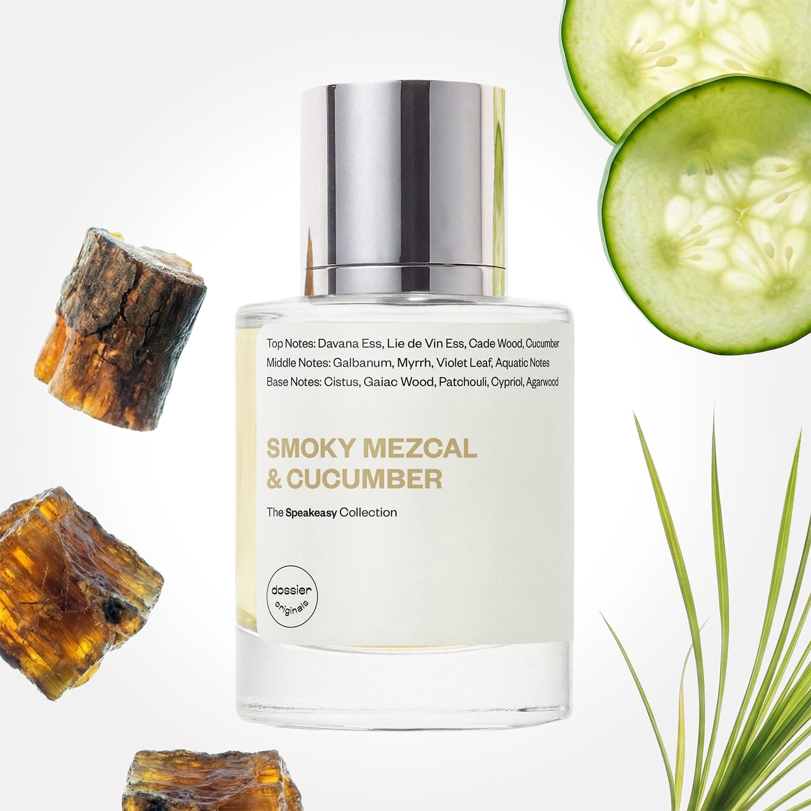

# Smoky Mezcal & Cucumber

- **Dossier Dossier Originals**
- **URL:** https://dossier.co/products/smoky-mezcal-cucumber
- **SEO title:** Smoky Mezcal & Cucumber - Dossier Perfumes

## Pricing (sizes)

| Size/SKU | Member price | List price | Currency |
|---|---|---|---|
| 40442015842371 | 35.1 | 39 | USD |

## Content (scent notes, about, editorial)

Back Home / Perfumes / Dossier Originals / SMOKY MEZCAL & CUCUMBER 

Unisex 

Sold out 

Smoky Mezcal & Cucumber

Eau de Parfum. Size: 50ml / 1.7oz 

members: $35.10

Guest:
$39

Dossier Originals: The speakeasy 

Crafted with celebration on the mind, the Speakeasy Collection captures all the bubbly, warm, or even smokey sensations that come with every sip– or in this case, spritz! 
Crafted in France 
Scent Family: earthy 

Notify Me 

Scent Notes Main Notes:

Cucumber

Aquatic Notes

Guaiac Wood

Cypriol

Agarwood

top: The first notes you smell 
Davana Ess, Lie de Vin Ess, Cade Wood, Cucumber 
middle: The heart of the perfume 
Galbanum, Myrrh, Violet Leaf, Aquatic Notes 
base: The notes that linger all day 
Cistus, Gaiac Wood, Patchouli, Cypriol, Agarwood 
ingredients: Alcohol, Water, Parfum/Perfume, Limonene, Eugenol, Farnesol. 

Vegan
Cruelty-free

Clean ingredients

About This fragrance smells like a boozy vacation in a bottle.

Celebrate with Mezcal’s naturally unique contrast between watery facets (agave), almost cucumber-like, and smoky, intoxicating dry tones. Ready for a one-way ticket to Oaxaca!

Scent Intensity: Statement 

Concentration: 18%

Gender: Unisex 

Shipping
Free shipping with 2+ items. 

Standard Shipping (with 2+ items) Auto-selected with 2+ items 
FREE 

Standard Shipping Auto-selected under 2 items 
$3.95 

Express shipping: 2 business days Select in checkout 
$19.00 

Returns
Free exchanges for all. Free returns with 

Exchanges
Free exchange, 1 time per order for all.

Returns
D+ members get 1 FREE return per order.
Non-members incur a $3.99/bottle return fee, 1 time per order.
Returns must be postmarked within 30 days of the initial order. Learn More 

FAQs Are these fragrances long lasting? They are designed to be very long lasting, just like designer fragrances, in some cases even longer, depending on the composition. 
When does the new packaging come out? We'll begin rolling out our new packaging across the U.S. and international markets soon! If you want to shop IRL - our new packaging first hits stores on January 11, 2026 at Walmart. Please note that if you are shopping online, you may receive a combination of our current and new packaging while we transition our inventory. 
How will I know what scent I like? We get it, shopping for perfumes online is hard! That's why we created a scent quiz, which will find the perfect scent for you Take the quiz (opens in new tab) 
Unsure about something? Ask us! help@dossier.co 

Best Layered With Combine 2 of our perfumes to create a third scent with layering, curated by our nose. Learn more 

You Might Love 

3.0 

Rated 3.0 out of 5 stars 

Based on 133 reviews 

Reviews 133 (tab expanded) Questions 1 (tab collapsed) 

Filters 
Write a Review (Opens in a new window) 

133 reviews 
Sort Highest Rating Most Helpful Photos & Videos Most Recent Oldest Lowest Rating Least Helpful 

SG 

Stephanie G. 

5/4/26 

Rated 5 out of 5 stars 

This scent is PHENOMENAL!!
This truly smells like exactly what it says. It is VERY much smoke heavy. It is a very strong fragrance which I do not mind one bit and it will linger all day long from your initial spray. It has some of the best lasting power of a perfume I’m ever seen. I see by the reviews that many people find it too strong or unpleasently smoky. I saw someone say if you liked By the Fireplace, then you would most likely like this. I do agree, only because I love both and that is one of my top 5 fragrance picks too. This also feels almost like you are standing in the middle of a bar which could be a turnoff for people, but I think is the most pleasant scent combination. There is something so special about this fragrance. I can’t explain why, but smelling this makes me so dang happy. It’s like it literally grabs all my happy receptors in my brain and captivates them. The same thing happens when I smell the Black Shadow perfume and Americana with MGK. I am so happy I got it in the very first advent calendar. I don’t think I would’ve bought it if I didn’t smell it first. I got myself a full sized bottle and also bought one for my sister, who is VERY sensitive to fragrances but LOVES this one as well, for Christmas last year! I see it is currently sold out now and I’m praying it’s only for a limited time and not going away for good. PLEASE 🙏🏼 keep this one around or at least warn me before you take it away so I can stock up! 

Read More Read more about this review 

Was this helpful? Yes, this review from Stephanie G. was helpful. 0 people voted yes No, this review from Stephanie G. was not helpful. 0 people voted no 

DP 

Dossier Perfumes 
5/4/26 
Stephanie, thanks for sharing how this scent ignites your happy receptors, it warms our hearts that you and your sister adore it. We’ll share your enthusiasm with the team!

LS 

Larry S. 

Verified Buyer 

12/21/25 

Rated 5 out of 5 stars 

Latest Dossier Haul
Smoky Mezcal & Cucumber-7/10, lost americana 9/10, Chasing the Sun 9. 5/10, Black Shadow 9. 5/10 (last two are must haves), Dossier Atomizers 17/10!!!!!!!!!! Add another half-point to all Dossier products just for the atomizer!!!!!

Read More Read more about this review 

Was this helpful? Yes, this review from Larry S. was helpful. 0 people voted yes No, this review from Larry S. was not helpful. 0 people voted no 

DP 

Dossier Perfumes 
12/21/25 
Okay, Larry, your breakdown is everything. Love how you rated the whole lineup, and the atomizers stealing the show with a 17/10 made us laugh out loud. Sounds like you built a seriously solid haul, especially with those must-haves in the mix. 🔥

DJ 

Dapheney J. 

Verified Buyer 

12/14/25 

Rated 5 out of 5 stars 

Different I enjoy the cucumber
Different I enjoy the cucumber scent

Read More Read more about this review 

Was this helpful? Yes, this review from Dapheney J. was helpful. 0 people voted yes No, this review from Dapheney J. was not helpful. 0 people voted no 

DP 

Dossier Perfumes 
12/14/25 
So glad you love that refreshing cucumber vibe, Dapheney! Thanks for sharing 😊

A 

Angela 

10/13/25 

Rated 5 out of 5 stars 

Mysterious and refreshing like it's namesake
I paired this with Oud and Rose on Fire and together they smells like a sexy date night out. Imagine getting a unique cocktail at a romantic hot spot you've been dreaming of going to. A perfect balance of masculine and feminine energies to me!!
As for the fragrance on its own the smokey tones start strong like smelling a smoke salt rim of a drink, then the scent dries down and gets balanced out with the cooling cucumber crispness. Highly recommend for wearing on a night out or special occasion

Read More Read more about this review 

Was this helpful? Yes, this review from Angela was helpful. 0 people voted yes No, this review from Angela was not helpful. 0 people voted no 

DP 

Dossier Perfumes 
10/13/25 
Angela that’s giving date-night magic energy😆 Your pairing sounds next-level, and we love how you captured its smoky-to-crisp journey. Keep exploring those combos for unforgettable vibes!

AK 

Angelica K. 

9/19/25 

Rated 5 out of 5 stars 

Smokey and fresh
Absolutely love this scent. It's gives the earthy, woody and smokiness but still light. Not heavy on the cucumber though, definitely more mezcal.

Read More Read more about this review 

Was this helpful? Yes, this review from Angelica K. was helpful. 0 people voted yes No, this review from Angelica K. was not helpful. 0 people voted no 

DP 

Dossier Perfumes 
9/25/25 
Cheers to that, Angelica! You picked a stunner 🍸✨

Loading... 

Loading... 

Show More 

Inspired by  Baccarat Rouge 540 
Inspired by  Black Opium 
Inspired by  Love, Don't Be Shy 
Inspired by  Good Girl 
Inspired by  Libre 
Inspired by  Flowerbomb 
Inspired by  Light Blue 
Inspired by  Not a Perfume 
Inspired by  Aventus 
Inspired by  Bleu de Chanel 
Inspired by  Mon Paris 
Inspired by  Coco Mademoiselle 
Inspired by  Tom Ford for Men 
Inspired by  For Her 
Inspired by  J'Adore Dior 
Inspired by  Alien 
Inspired by  Black Opium Perfume 
Inspired by  Lost Cherry Perfume 

GET UP TO 30% OFF 

Find us at these retailers. 

Be the first to know. 
Submit 

Shop the following countries. United States 

Discover.
AI Scent Finder 
Blog (opens in new tab) 
Scent Family 
Layering 
Scent Quiz 

Help.
Contact Us 
Returns 
FAQ 
Testimonials 
Accessibility 

More.
Store Locator 
Boutique 
Refer A Friend 
Index 

Download our app now.

Find us at these retailers. 

Be the first to know. 
Submit 

Shop the following countries. United States 

Discover.
AI Scent Finder 
Blog (opens in new tab) 
Scent Family 
Layering 
Scent Quiz 

Help.
Contact Us 
Returns 
FAQ 
Testimonials 
Accessibility 

More.

## Main Image

