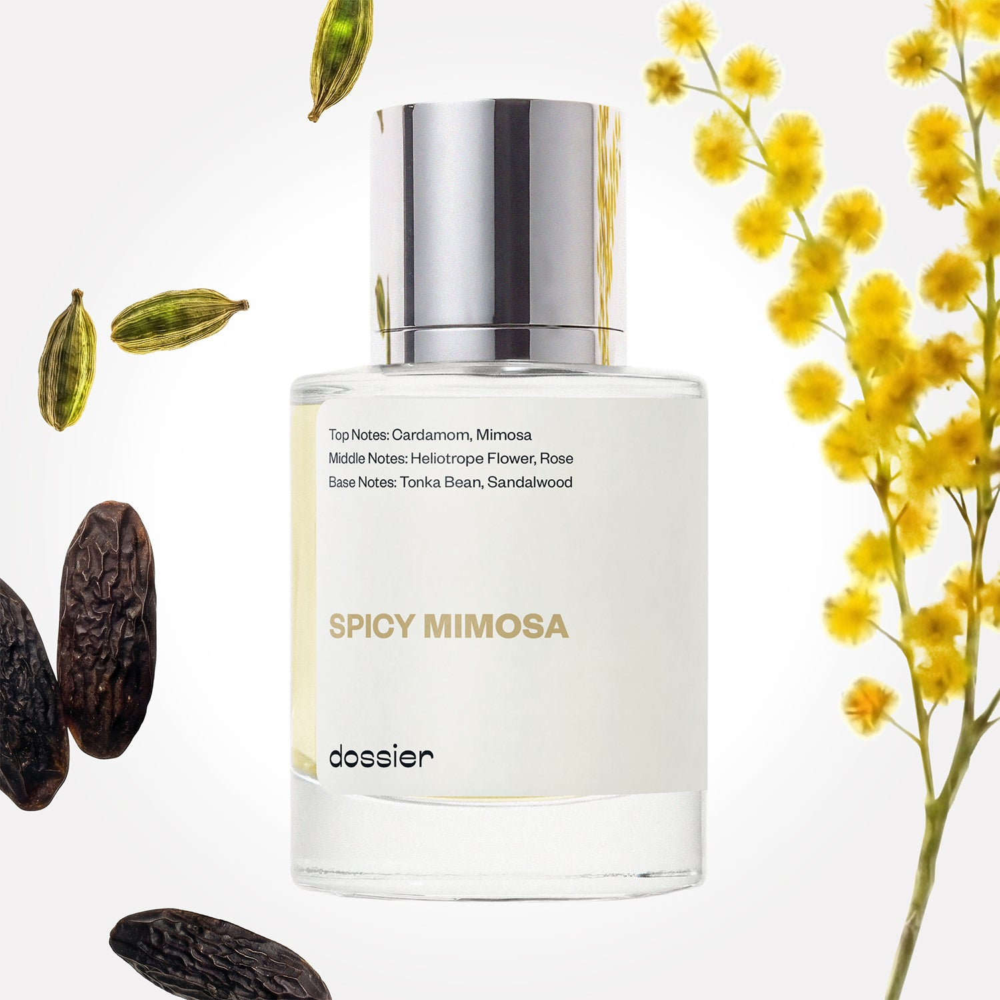

# Spicy Mimosa

- **Dossier Inspired by Jo Malone's Mimosa & Cardamom**
- **URL:** https://dossier.co/products/spicy-mimosa
- **SEO title:** Jo Malone's Mimosa & Cardamom Dupe Perfume: Spicy Mimosa - Dossier Perfumes

## Pricing (sizes)

| Size/SKU | Member price | List price | Currency |
|---|---|---|---|
| SPMI050IMUSP2XX | 28.8 | 32 | USD |

## Content (scent notes, about, editorial)

Back Home / Perfumes / Dossier Impressions / SPICY MIMOSA 

Unisex 

Sold out 

Spicy Mimosa

Eau de Cologne. Size: 50ml / 1.7oz 

members: $28.80

Guest:
$32

Inspired by Jo Malone's Mimosa & Cardamom Inspired by Jo Malone's Mimosa & Cardamom 
Inspired by Jo Malone's Mimosa & Cardamom 

Retail price 168 Crafted in France 
Scent Family: warm 

Notify Me 

Scent Notes This perfume is: The perfect day to night scent 
Main Notes:

Cardamom

Mimosa

Tonka Bean

top: The first notes you smell 
Cardamom, Mimosa 
middle: The heart of the perfume 
Heliotrope flower, Rose 
base: The notes that linger all day 
Tonka bean, Sandalwood 
ingredients: Alcohol, Water, Parfum/Perfume, alpha-iso-Methylionone, Benzyl alcohol, Benzyl Benzoate, Benzyl Salicylate, Cinnamaldehyde, Cinnamyl alcohol, Coumarin, Citronellol, Limonene, Eugenol, Farnesol, Geraniol, Hydroxycitronellal, Isoeugenol, Linalool. 

Vegan
Cruelty-free

Clean ingredients

About Spicy Mimosa (inspired by Jo Malone's Mimosa & Cardamom) is an unexpected combination of mimosa, cardamom and tonka bean. Mimosa, fabulous but fragile yellow pom-pom flowers, typical of the South of France, brings a very particular scent, at the same time bold and delicate, with a warm, honey, orris-like, powdery airiness. Cardamom adds a spicy vibrancy on top of the fragrance, when tonka bean reinforces its creamy powdery feeling on the base. 

Enveloping, caring, Spicy Mimosa (our impression of Jo Malone's Mimosa & Cardamom) is a fragrance of inner sensuality, with a very specific personality, original without ever being provocative.

Scent Intensity: Significant 

Concentration: 18%

Gender: Unisex 

Shipping
Free shipping with 2+ items. 

Standard Shipping (with 2+ items) Auto-selected with 2+ items 
FREE 

Standard Shipping Auto-selected under 2 items 
$3.95 

Express shipping: 2 business days Select in checkout 
$19.00 

Returns
Free exchanges for all. Free returns with 

Exchanges
Free exchange, 1 time per order for all.

Returns
D+ members get 1 FREE return per order.
Non-members incur a $3.99/bottle return fee, 1 time per order.
Returns must be postmarked within 30 days of the initial order. Learn More 

FAQs Are these fragrances long lasting? They are designed to be very long lasting, just like designer fragrances, in some cases even longer, depending on the composition. 
When does the new packaging come out? We'll begin rolling out our new packaging across the U.S. and international markets soon! If you want to shop IRL - our new packaging first hits stores on January 11, 2026 at Walmart. Please note that if you are shopping online, you may receive a combination of our current and new packaging while we transition our inventory. 
How will I know what scent I like? We get it, shopping for perfumes online is hard! That's why we created a scent quiz, which will find the perfect scent for you Take the quiz (opens in new tab) 
Unsure about something? Ask us! help@dossier.co 

Details We are not associated or affiliated with the brands mentioned here in any way.
Spicy Mimosa

Go on a front-row seat tour of the Sunwapta Valley

\Jo Malone’s Mimosa And Cardamom (the fragrance that Dossier’s Spicy Mimosa is inspired by) is a luxurious cologne that radiates pleasure, leisure, and desire.

Launched in 2015, this fragrance combines the enduring appeal of cardamom with the intoxicating allure of mimosa and tonka bean into a scent that traps you in an ethereal dimension of love and affection.

Dazzling and debauched, this floral conjures images of the stunning white sand beaches of the Ölüdeniz. The luxury fragrance that Spicy Mimosa is inspired by is an electrifying blend of panache, excitement, and beauty. It is an up-to-the-minute floral that ticks every quality box and controverts the laws of conventional perfumery in their entirety.

Addiction meets seduction here, and the effect is a fragrance that takes you on a tour of the travertine formations and lush forests of the Plitvice Lake. One spritz is enough to fill the air with the flickering flames of love and teleport you to the terraced marble cliffs of Scala dei Turchi.

Leave a lasting impression on everyone in your locus as the Jo Malone Mimosa and Cardamom lends a love-laced trail as you pass. It is an untainted, unadulterated love-fest in a bottle. It is an elegant classic that encircles you with royalty and majesty.

If you relish a 5-star aromatherapy (and one that dawdles on the skin for hours), look no further than this affection-laced floral-fruit nectar. Open the cap to launch a portal to the sculpted rock spires and unearthly desert landscapes of the De-Na-Zin Wilderness. The secret ingredient is love.

To add this sweet floral to your scent repertoire, log on to your favorite online retailer and browse the inventory under ‘perfumes’. You can get the Jo Malone Mimosa & Cardamom Cologne Spray Fl Oz for Women for $73.64, the Body Crème for $86.00, the Candle for $70.00, and the JBody & Hand Wash for $65.00. You can also get the 3.4 oz Unisex Eau de Cologne for $134.98.

Finally, if you want to experience a regal yet affordable floral, consider Dossier’s Spicy Mimosa. Our Jo Malone London Mimosa and Cardamom dupe channels the essences of mimosa, cardamom, and tonka bean into a fragrance that takes you on a front-row seat tour of the Sunwapta Valley. Discover fabulous yet fragile yellow pom-pom flowers as they trap you in a circle of sensory escapism. Evoke your inner sensuality and vibrancy as you don this beautiful new scent. Step into the light as you imbibe the boldness and confidence this bouquet provides. Spicy Mimosa is both warm and sensual. It is complex and stimulating in a way that draws people of class to you. Spray gently to fill your day with cornflower blue skies.

You Might Love 

4.4 

Rated 4.4 out of 5 stars 

Based on 513 reviews 

Reviews 513 (tab expanded) Questions 1 (tab collapsed) 

Filters 
Write a Review (Opens in a new window) 

513 reviews 
Sort Highest Rating Most Helpful Photos & Videos Most Recent Oldest Lowest Rating Least Helpful 

LH 

Laura H. 
Verified Buyer 

4/22/26 

Rated 5 out of 5 stars 

Summertime Porch Swing
This fragrance is like sitting with your grandma on her porch swing, smelling her perennial flower bushes off the side of the deck as a summer breeze floats by, eating a slice of melon on a warm afternoon. And that's not to say it's an aged floral, it's just that mimosa and heliotrope flowers aren't the most common anymore as the floral stars of fragrances. As such, I found this floral approachable as someone who doesn't love super strong florals but still enjoys a touch of floral with some flair. 
The cardamom spice brings out a certain sweetness from the flowers, that on me reads as melon. The floral notes aren't cloying in this, and smell more like a floral **** that grows on its own each year and not intentionally planted annuals, if you catch my meaning. It's more subtle and not so, "HI! I'M AN ORANGE/WHITE/PURPLE floral." More like a perennial garden floral. 
It wear really well in the summer/heat, and pairs well with spicy musks (like free the musk). The scent does seem to stay in the top and middle, and as such doesn't have extreme longevity, but this scent feels like an intentional 4 hours experience, at which point I like putting on a different perfume on top of any lingering notes. I like to put this on for daytime more than evening, but you could use this as a layering fragrance for the evening in the summer too. 

Read More Read more about this review 

Was this helpful? Yes, this review from Laura H. was helpful. 0 people voted yes No, this review from Laura H. was not helpful. 0 people voted no 

DP 

Dossier Perfumes 
4/22/26 
Laura, this review is pure vibes, feels like that breezy afternoon on the porch. We’re happy it lands just right for daytime wear and layering fun. Thanks for this!

NP 

Nathaly P. 
Verified Buyer 

4/14/26 

Rated 5 out of 5 stars 

On point 
It smells exactly like Jo Malone 

Read More Read more about this review 

Was this helpful? Yes, this review from Nathaly P. was helpful. 0 people voted yes No, this review from Nathaly P. was not helpful. 0 people voted no 

DP 

Dossier Perfumes 
4/14/26 
Thanks for sharing your thoughts! We’re thrilled you’re loving that familiar vibe.

S 

Simone 

4/2/26 

Rated 5 out of 5 stars 

5 Stars
Definitely worth the purchase… im in love with not only the fragrance, but the brand as well

Read More Read more about this review 

Was this helpful? Yes, this review from Simone was helpful. 0 people voted yes No, this review from Simone was not helpful. 0 people voted no 

JP 

Joanna P. T. 
Verified Buyer 

4/1/26 

Rated 5 out of 5 stars 

Best perfume
A live note to yourself 

Read More Read more about this review 

Was this helpful? Yes, this review from Joanna P. T. was helpful. 0 people voted yes No, this review from Joanna P. T. was not helpful. 0 people voted no 

DP 

Dossier Perfumes 
4/1/26 
Joanna, thanks for sharing that live note to yourself, it really makes us smile!

A 

Anna 

Verified Buyer 

1/18/26 

Rated 5 out of 5 stars 

Exact dupe of Jo Malone
Mimosa and cardamom is my absolute favorite every day scent from Jo Malone and I have used up bottles of it. They cost 180usd and I am so glad I found this dupe. This is an exact dupe of the jo malone and lasts a while on me. So happy I don’t need to splurge anymore!

Read More Read more about this review 

Was this helpful? Yes, this review from Anna was helpful. 0 people voted yes No, this review from Anna was not helpful. 0 people voted no 

DP 

Dossier Perfumes 
1/18/26 
Anna, that made our day! We’re so happy this version gives you everything you love, lasts beautifully, and skips the splurge. Enjoy every spritz and thanks for sharing!

Loading... 

Loading... 

Show More 

Inspired by  Baccarat Rouge 540 
Inspired by  Black Opium 
Inspired by  Love, Don't Be Shy 
Inspired by  Good Girl 
Inspired by  Libre 
Inspired by  Flowerbomb 
Inspired by  Light Blue 
Inspired by  Not a Perfume 
Inspired by  Aventus 
Inspired by  Bleu de Chanel 
Inspired by  Mon Paris 
Inspired by  Coco Mademoiselle 
Inspired by  Tom Ford for Men 
Inspired by  For Her 
Inspired by  J'Adore Dior 
Inspired by  Alien 
Inspired by  Black Opium Perfume 
Inspired by  Lost Cherry Perfume 

GET UP TO 30% OFF 

Find us at these retailers. 

Be the first to know. 
Submit 

Shop the following countries. United States 

Discover.
AI Scent Finder 
Blog (opens in new tab) 
Scent Family 
Layering 
Scent Quiz 

Help.
Contact Us 
Returns 
FAQ 
Testimonials 
Accessibility 

More.
Store Locator 
Boutique 
Refer A Friend 
Index 

Download our app now.

Find us at these retailers. 

Be the first to know. 
Submit 

Shop the following countries. United States 

Discover.
AI Scent Finder 
Blog (opens in new tab) 
Scent Family 
Layering 
Scent Quiz 

Help.
Contact Us 
Returns 
FAQ 
Testimonials 
Accessibility 

More.

## Main Image

