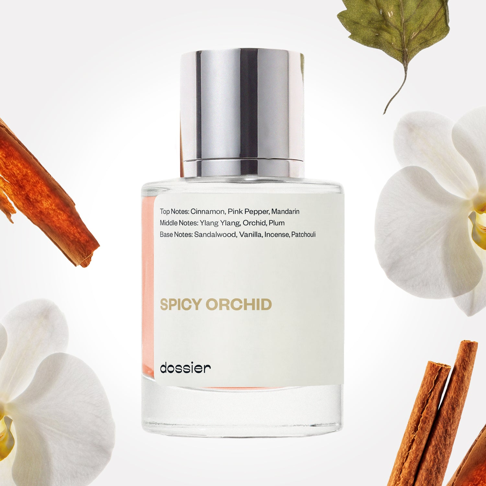

# Spicy Orchid

- **Dossier Inspired by Tom Ford's Black Orchid**
- **URL:** https://dossier.co/products/spicy-orchid
- **SEO title:** Tom Ford's Black Orchid Dupe Perfume: Spicy Orchid - Dossier Perfumes

## Pricing (sizes)

| Size/SKU | Member price | List price | Currency |
|---|---|---|---|
| 31908089856067 | 44.1 | 49 | USD |

## Content (scent notes, about, editorial)

Back Home / Perfumes / Dossier Impressions / SPICY ORCHID 

Unisex 

It's back! 

Spicy Orchid

Eau de Parfum. Size: 50ml / 1.7oz 

members: $44.10

Guest:
$49

Inspired by Tom Ford's Black Orchid Inspired by Tom Ford's Black Orchid 
Inspired by Tom Ford's Black Orchid 

Retail price 200 Crafted in France 
Scent Family: warm 

Add to Cart 

Scent Notes This perfume is: Sipping late night martinis 
Main Notes:

Cinnamon

Pink Pepper

Mandarin

Orchid

Sandalwood

Vanilla

Incense

Patchouli

top: The first notes you smell 
Cinnamon, Pink Pepper, Mandarin 
middle: The heart of the perfume 
Ylang Ylang, Orchid, Plum 
base: The notes that linger all day 
Sandalwood, Vanilla, Incense, Patchouli 
ingredients: Alcohol, Water, Parfum/Perfume, Anise Alcohol, Benzyl alcohol, Benzyl Benzoate Benzyl Cinnamate, Benzyl Salicylate, Cinnamaldehyde, Cinnamyl alcohol, Citral, Coumarin, Citronellol, Limonene, Eugenol, Farnesol, Geraniol, Hydroxycitronellal, Isoeugenol, Linalool. 

Vegan
Cruelty-free

Clean ingredients

About Spicy Orchid (inspired by Tom Ford's Black Orchid) opens with a combination of cinnamon, pink pepper, and ylang-ylang. Together, these pairings drive directly to the orchid heart. Rich and multi-faceted, as the fragrance evaporates, patchouli, creamy sandalwood, plum, and vanilla wrap the orchid in an opulent trail.

Dense, assertive, and sensuous, Spicy Orchid (our impression of Tom Ford's Black Orchid) is an intoxicating floral scent, reminiscent of exotic summer nights.

Scent Intensity: Statement 

Concentration: 18%

Gender: Unisex 

Shipping
Free shipping with 2+ items. 

Standard Shipping (with 2+ items) Auto-selected with 2+ items 
FREE 

Standard Shipping Auto-selected under 2 items 
$3.95 

Express shipping: 2 business days Select in checkout 
$19.00 

Returns
Free exchanges for all. Free returns with 

Exchanges
Free exchange, 1 time per order for all.

Returns
D+ members get 1 FREE return per order.
Non-members incur a $3.99/bottle return fee, 1 time per order.
Returns must be postmarked within 30 days of the initial order. Learn More 

FAQs Are these fragrances long lasting? They are designed to be very long lasting, just like designer fragrances, in some cases even longer, depending on the composition. 
When does the new packaging come out? We'll begin rolling out our new packaging across the U.S. and international markets soon! If you want to shop IRL - our new packaging first hits stores on January 11, 2026 at Walmart. Please note that if you are shopping online, you may receive a combination of our current and new packaging while we transition our inventory. 
How will I know what scent I like? We get it, shopping for perfumes online is hard! That's why we created a scent quiz, which will find the perfect scent for you Take the quiz (opens in new tab) 
Unsure about something? Ask us! help@dossier.co 

Details We are not associated or affiliated with the brands mentioned here in any way.
Spicy Orchid

The Perfect Floral Scent — Sexy and Intoxicating

Tom Ford’s Black Orchid (the fragrance that inspired Dossier’s Spicy Orchid) is an insanely popular scent and the debut fragrance in the House’s beauty line. This iconic scent came out in 2006, so you’ve likely encountered it before. In any case, it’s been talked about and praised for well over a decade now. And even today, years later, it holds a particular spot of fascination among the hardiest noses in the industry.

The luxury fragrance that Spicy Orchid is inspired by was born from Tom Ford’s seemingly impossible quest to find the “perfect flower”. This is a floral ingredient so luxurious, elegant, and sophisticated — an elusive bloom that, when bottled, will never be matched. There’s just one problem: a flower like that doesn’t exist, at least on paper. Yet one whiff of this bottle, and you’re inclined to believe that perhaps he was successful after all. That perhaps, in some recesses of a thick rainforest, Ford had finally discovered the mysterious, perfect floral component. All that was left was to bottle it, slap on a label, and call it something sexy (maybe something like “Black Orchid”?).

Anyhow, this is a striking perfume composition, radiating a uniqueness and depth that defines a modern cologne. The luxury fragrance that Spicy Orchid is inspired by is ambery-floral in nature. It’s a very rich and layered scent, backed by a patchouli and woodsy base. The floral-spice combination is, in a way, very hypnotic. There’s a delicate touch of Mexican chocolate and truffle in there, too. Very sweet; very sensual — this is a perfect dark perfume that smells fresh and streamlined, like a straight blow-dry hairdo with frizz-free strands.

The luxury fragrance that Spicy Orchid is inspired by first spray gives you a fruity-floral mixture with layers of blackcurrant, lemon, and jasmine. The scent is sweet, almost licorice-like. Cut to the heart of the fragrance, which brings with it something immediately earthy and dark. We’d attribute this to the black truffle (mushrooms!). It’s certainly a welcome contrast to the much sweeter opening. As the fragrance fades, you’ll detect patches of patchouli, followed by floral notes and, finally, a creamy vanilla-sandalwood note. The dry down for the luxury fragrance that inspired Spicy Orchid is rather warm and, personally, our favorite phase of the fragrance.

The luxury fragrance that Spicy Orchid is inspired by has excellent longevity, lasting well over eight hours after application. This is potent stuff — no doubt about it. Great projection in the first two to three hours too, with a sillage that trails up to several feet away. And as you might expect, a fragrance of this potency is better reserved for special occasions, rather than being worn every day to work or the gym. An excellent option for a night out, a formal event, or a date.

As a whole, we think this fragrance is an excellent pick for men or women looking to be unique, alluring, and sexy.The luxury fragrance that Spicy Orchid is inspired by is available as both an Eau de Parfum and a Parfum, the latter of which is much more intensified.

Looking for something new and fresh while still maintaining the comfort and familiarity of this much-loved scent? Dossier has created a replica in Spicy Orchid. Ours is a dense, assertive, and sensuous fragrance, reminiscent of the original’s distinctive notes. Featuring the same patchouli and vanilla base notes, our dupe is just a tad spicier with added notes of cinnamon for a unique twist, without taking away from Black Orchid’s sensual vibe.

Best Layered With Combine 2 of our perfumes to create a third scent with layering, curated by our nose. Learn more 

You Might Love 

4.3 

Rated 4.3 out of 5 stars 

Based on 1,272 reviews 

Reviews 1,272 (tab expanded) Questions 1 (tab collapsed) 

Filters 
Write a Review (Opens in a new window) 

1,272 reviews 
Sort Highest Rating Most Helpful Photos & Videos Most Recent Oldest Lowest Rating Least Helpful 

M 

Mary 

5/11/26 

Rated 5 out of 5 stars 

5 Stars
Smells expensive

Read More Read more about this review 

Was this helpful? Yes, this review from Mary was helpful. 0 people voted yes No, this review from Mary was not helpful. 0 people voted no 

K 

Kellie 

5/7/26 

Rated 5 out of 5 stars 

5 Stars
Absolutely perfect as always. Smell is incredible.

Read More Read more about this review 

Was this helpful? Yes, this review from Kellie was helpful. 0 people voted yes No, this review from Kellie was not helpful. 0 people voted no 

FJ 

Fernando J. V. 
Verified Buyer 

5/7/26 

Rated 5 out of 5 stars 

Spicy orchid
One of the best fragrance I ever had. 

Read More Read more about this review 

Was this helpful? Yes, this review from Fernando J. V. was helpful. 0 people voted yes No, this review from Fernando J. V. was not helpful. 0 people voted no 

DP 

Dossier Perfumes 
5/7/26 
Fernando, we’re so happy Spicy Orchid hit the spot for you! 🌸

A 

Anita 

4/30/26 

Rated 5 out of 5 stars 

5 Stars
Love it!

Read More Read more about this review 

Was this helpful? Yes, this review from Anita was helpful. 0 people voted yes No, this review from Anita was not helpful. 0 people voted no 

SM 

Sophia M. 
Verified Reviewer 

4/18/26 

Rated 5 out of 5 stars 

Spicy, Realistic Floral Note, Complex & ******. 
I didn't give this enough credit when I first opened it. I've since learned about letting perfumes macerate and 6 months later this perfume has only gotten better! I'm finding that Dossier makes potent perfumes when compared to other companies like Oakcha and that potency is often misunderstood as too sweet or too jammy or too much in one way or another. Give them time to mature and find another scent to layer with. Layering can fix the flaws in note structure. 

Read More Read more about this review 

Was this helpful? Yes, this review from Sophia M. was helpful. 0 people voted yes No, this review from Sophia M. was not helpful. 0 people voted no 

DP 

Dossier Perfumes 
4/18/26 
Hey Sophia! We love how you gave it time to shine and found potency can surprise you. Layering is such a game-changer. Thanks for sharing your maturing tip!

Loading... 

Loading... 

Show More 

Inspired by  Baccarat Rouge 540 
Inspired by  Black Opium 
Inspired by  Love, Don't Be Shy 
Inspired by  Good Girl 
Inspired by  Libre 
Inspired by  Flowerbomb 
Inspired by  Light Blue 
Inspired by  Not a Perfume 
Inspired by  Aventus 
Inspired by  Bleu de Chanel 
Inspired by  Mon Paris 
Inspired by  Coco Mademoiselle 
Inspired by  Tom Ford for Men 
Inspired by  For Her 
Inspired by  J'Adore Dior 
Inspired by  Alien 
Inspired by  Black Opium Perfume 
Inspired by  Lost Cherry Perfume 

GET UP TO 30% OFF 

Find us at these retailers. 

Be the first to know. 
Submit 

Shop the following countries. United States 

Discover.
AI Scent Finder 
Blog (opens in new tab) 
Scent Family 
Layering 
Scent Quiz 

Help.
Contact Us 
Returns 
FAQ 
Testimonials 
Accessibility 

More.
Store Locator 
Boutique 
Refer A Friend 
Index 

Download our app now.

Find us at these retailers. 

Be the first to know. 
Submit 

Shop the following countries. United States 

Discover.
AI Scent Finder 
Blog (opens in new tab) 
Scent Family 
Layering 
Scent Quiz 

Help.
Contact Us 
Returns 
FAQ 
Testimonials 
Accessibility 

More.

## Main Image

