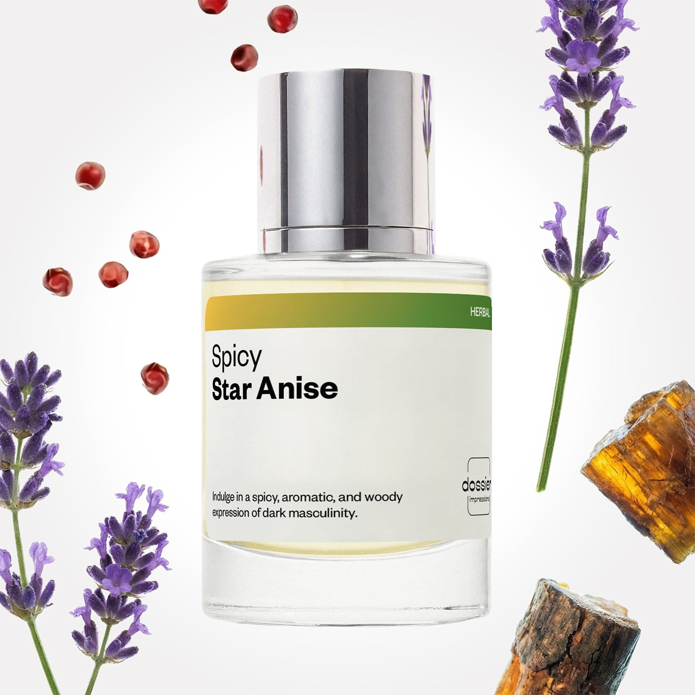

# Spicy Star Anise

- **Dossier Inspired by Dior’s Sauvage Elixir**
- **URL:** https://dossier.co/products/spicy-star-anise
- **SEO title:** Spicy Star Anise

## Pricing (sizes)

| Size/SKU | Member price | List price | Currency |
|---|---|---|---|
| DI50SSAUS | 35.1 | 39 | USD |
| BF202523 | 96.3 | 107 | USD |

## Content (scent notes, about, editorial)

Back Home / Perfumes / Dossier Impressions / SPICY STAR ANISE 

Men 

New 

Spicy Star Anise

Eau de Parfum. Size: 50ml / 1.7oz 

members: $35.10

Guest:
$39

Inspired by Dior's Sauvage Elixir Inspired by Dior's Sauvage Elixir 
Inspired by Dior's Sauvage Elixir 

Retail price 193 Crafted in France 
Scent Family: herbal 

Add to Cart 

Scent Notes Main Notes:

Pink Pepper

Lavender

Oakmoss

Amber Woods

top: The first notes you smell 
pink pepper, pineapple, star anise, cardamom 
middle: The heart of the perfume 
lavender, nutmeg, clove 
base: The notes that linger all day 
oakmoss, amber woods, cistus, vetiver, patchouli 
ingredients: Alcohol Denat., Water, Parfum/Perfume, Camphor, Carvone, Citral, Tetramethyl Acetyloctahydronaphthalenes, Lavandula Oil/ Extract, Myroxylon Pereirae Oil/ Extract, Pinene, Rose Ketones, Terpineol, Sclareol, Alpha-Terpinene, Benzaldehyde, Benzyl Alcohol, Benzyl Benzoate, Benzyl Cinnamate, Beta-caryophyllene, Cinnamal, Cinnamomum Zeylanicum Bark Oil, Citrus Limon Peel Oil, Coumarin, Citronellol, Limonene, Eugenol, Eugenyl Acetate, Farnesol, Geraniol, Pelargonium Graveolens Flower Oil, Isoeugenol, Linalool, Linalyl Acetate, Evernia Prunastri Extract, Pogostemon Cablin Oil, Terpinolene, Vanillin.

Vegan
Cruelty-free

Clean ingredients

About Spicy, warm, woody, and lavender at its very core. Spicy Star Anise is the night to Aromatic Star Anise’s day in any masculine scent lover’s routine. It entrances your senses with a balanced blend of spicy and fiery notes at first sniff before evolving into an intense, hypermasculine, and resinous fragrance. Spicy Star Anise opens with an intense burst of pink pepper with pineapple, star anise, and cardamom. The scent then unfolds to reveal a lavender-forward heart supported by nutmeg and clove notes––a perfect recipe for aromatic bliss. Once settled on the skin, the fragrance’s dark side comes out to play with warm, earthy, and masculine notes of oakmoss, amber woods, cistus, vetiver, and patchouli. Enjoy midnight masculinity translated into a spritz.

Scent Intensity: Statement 

Concentration: 20%

Gender: Masculine 

Shipping
Free shipping with 2+ items. 

Standard Shipping (with 2+ items) Auto-selected with 2+ items 
FREE 

Standard Shipping Auto-selected under 2 items 
$3.95 

Express shipping: 2 business days Select in checkout 
$19.00 

Returns
Free exchanges for all. Free returns with 

Exchanges
Free exchange, 1 time per order for all.

Returns
D+ members get 1 FREE return per order.
Non-members incur a $3.99/bottle return fee, 1 time per order.
Returns must be postmarked within 30 days of the initial order. Learn More 

FAQs Are these fragrances long lasting? They are designed to be very long lasting, just like designer fragrances, in some cases even longer, depending on the composition. 
When does the new packaging come out? We'll begin rolling out our new packaging across the U.S. and international markets soon! If you want to shop IRL - our new packaging first hits stores on January 11, 2026 at Walmart. Please note that if you are shopping online, you may receive a combination of our current and new packaging while we transition our inventory. 
How will I know what scent I like? We get it, shopping for perfumes online is hard! That's why we created a scent quiz, which will find the perfect scent for you Take the quiz (opens in new tab) 
Unsure about something? Ask us! help@dossier.co 

Best Layered With Combine 2 of our perfumes to create a third scent with layering, curated by our nose. Learn more 

You Might Love 

4.6 

Rated 4.6 out of 5 stars 

Based on 51 reviews 

Reviews 51 (tab expanded) Questions (tab collapsed) 

Filters 
Write a Review (Opens in a new window) 

51 reviews 
Sort Highest Rating Most Helpful Photos & Videos Most Recent Oldest Lowest Rating Least Helpful 

SD 

Samuel D. G. 
Verified Buyer 

6/18/26 

Rated 5 out of 5 stars 

I really like Dossier Spicy Star Anise
I loved it 

Read More Read more about this review 
Translated from Spanish Show original 

Was this helpful? Yes, this review from Samuel D. G. was helpful. 0 people voted yes No, this review from Samuel D. G. was not helpful. 0 people voted no 

DP 

Dossier Perfumes 
6/18/26 
Samuel, ¡nos alegra que te encantara! Gracias por compartir ✨

E 

enrique 

6/2/26 

Rated 5 out of 5 stars 

5 Stars
Smells amazing and last a long time

Read More Read more about this review 

Was this helpful? Yes, this review from enrique was helpful. 0 people voted yes No, this review from enrique was not helpful. 0 people voted no 

HL 

Humberto L. 
Verified Buyer 

5/28/26 

Rated 5 out of 5 stars 

Amazing 
Every room I walk into everyone asks “Who’s smells that good?” or “What’s the cologne you use?”. This is such a great long lasting smell. I get compliments everyday about it and one person thought it was the actual brand name. 

Read More Read more about this review 

Was this helpful? Yes, this review from Humberto L. was helpful. 0 people voted yes No, this review from Humberto L. was not helpful. 0 people voted no 

DP 

Dossier Perfumes 
5/28/26 
Humberto, that’s amazing! Getting compliments everywhere you go is the best feeling and we love hearing it. Thanks for sharing how long it lasts and turning heads daily!

AL 

Andrew L. 
Verified Buyer 

5/28/26 

Rated 5 out of 5 stars 

New scent- Major improvement 
From the build quality to the lasting scent… This is my favorite option for men from them. It’s not Dior savage but it is better in almost every way for 1/2 the price.

Read More Read more about this review 

Was this helpful? Yes, this review from Andrew L. was helpful. 0 people voted yes No, this review from Andrew L. was not helpful. 0 people voted no 

DP 

Dossier Perfumes 
5/28/26 
Andrew, thanks a bunch for noticing those quality tweaks and lasting power! We love that it’s become your new go-to men’s scent at half the price. Enjoy every spritz!

DM 

Debbie M. 
Verified Buyer 

5/12/26 

Rated 5 out of 5 stars 

?
Sooo many compliments 

Read More Read more about this review 

Was this helpful? Yes, this review from Debbie M. was helpful. 0 people voted yes No, this review from Debbie M. was not helpful. 0 people voted no 

DP 

Dossier Perfumes 
5/12/26 
Debbie, that’s awesome! Getting compliments never gets old 😊

Loading... 

Loading... 

Show More 

Inspired by  Baccarat Rouge 540 
Inspired by  Black Opium 
Inspired by  Love, Don't Be Shy 
Inspired by  Good Girl 
Inspired by  Libre 
Inspired by  Flowerbomb 
Inspired by  Light Blue 
Inspired by  Not a Perfume 
Inspired by  Aventus 
Inspired by  Bleu de Chanel 
Inspired by  Mon Paris 
Inspired by  Coco Mademoiselle 
Inspired by  Tom Ford for Men 
Inspired by  For Her 
Inspired by  J'Adore Dior 
Inspired by  Alien 
Inspired by  Black Opium Perfume 
Inspired by  Lost Cherry Perfume 

GET UP TO 30% OFF 

Find us at these retailers. 

Be the first to know. 
Submit 

Shop the following countries. United States 

Discover.
AI Scent Finder 
Blog (opens in new tab) 
Scent Family 
Layering 
Scent Quiz 

Help.
Contact Us 
Returns 
FAQ 
Testimonials 
Accessibility 

More.
Store Locator 
Boutique 
Refer A Friend 
Index 

Download our app now.

Find us at these retailers. 

Be the first to know. 
Submit 

Shop the following countries. United States 

Discover.
AI Scent Finder 
Blog (opens in new tab) 
Scent Family 
Layering 
Scent Quiz 

Help.
Contact Us 
Returns 
FAQ 
Testimonials 
Accessibility 

More.

## Main Image

