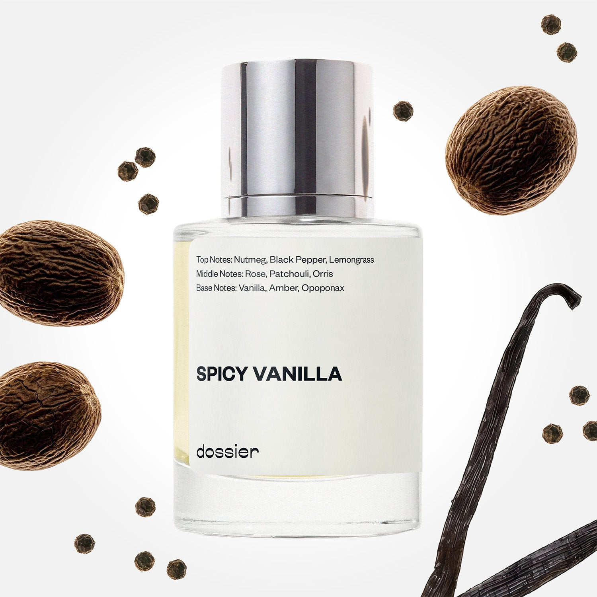

# Spicy Vanilla

- **Dossier Inspired by Tom Ford's Noir**
- **URL:** https://dossier.co/products/spicy-vanilla
- **SEO title:** Tom Ford's Noir Dupe Perfume: Spicy Vanilla - Dossier Perfumes

## Pricing (sizes)

| Size/SKU | Member price | List price | Currency |
|---|---|---|---|
| 32017682956355 | 35.1 | 39 | USD |

## Content (scent notes, about, editorial)

Back Home / Perfumes / Dossier Impressions / SPICY VANILLA 

Men 

It's back! 

Spicy Vanilla

Eau de Parfum. Size: 50ml / 1.7oz 

members: $35.10

Guest:
$39

Inspired by Tom Ford's Noir Inspired by Tom Ford's Noir 
Inspired by Tom Ford's Noir 

Retail price 160 Crafted in France 
Scent Family: warm 

Notify Me 

Scent Notes This perfume is: A true head turning fragrance 
Main Notes:

Nutmeg

Black Pepper

Lemongrass

Vanilla

Amber

Opoponax

top: The first notes you smell 
Nutmeg, Black Pepper, Lemongrass 
middle: The heart of the perfume 
Rose, Patchouli, Orris 
base: The notes that linger all day 
Vanilla, Amber, Opoponax 
ingredients: Alcohol, Water, Parfum/Perfume, alpha-iso-Methylionone, Benzyl alcohol, Benzyl Benzoate, Benzyl Cinnamate, Cinnamaldehyde, Cinnamyl alcohol, Citral, Coumarin, Citronellol, Limonene, Eugenol, Farnesol, Geraniol, Hydroxycitronellal, Isoeugenol, Linalool. 

Vegan
Cruelty-free

Clean ingredients

About Spicy Vanilla (inspired by Tom Ford's Noir) opens with a burst of hot spices, led by nutmeg and black pepper. The scent keeps heating up with the introduction of vanilla, amber, and opoponax (a resin vegetal that’s smoky and soft, luminous and sensual all at once).

Warm and mysterious, Spicy Vanilla (our impression of Tom Ford's Noir) evokes a sense of raw, sensual masculinity. 

Scent Intensity: Statement 

Concentration: 15%

Gender: Masculine 

Shipping
Free shipping with 2+ items. 

Standard Shipping (with 2+ items) Auto-selected with 2+ items 
FREE 

Standard Shipping Auto-selected under 2 items 
$3.95 

Express shipping: 2 business days Select in checkout 
$19.00 

Returns
Free exchanges for all. Free returns with 

Exchanges
Free exchange, 1 time per order for all.

Returns
D+ members get 1 FREE return per order.
Non-members incur a $3.99/bottle return fee, 1 time per order.
Returns must be postmarked within 30 days of the initial order. Learn More 

FAQs Are these fragrances long lasting? They are designed to be very long lasting, just like designer fragrances, in some cases even longer, depending on the composition. 
When does the new packaging come out? We'll begin rolling out our new packaging across the U.S. and international markets soon! If you want to shop IRL - our new packaging first hits stores on January 11, 2026 at Walmart. Please note that if you are shopping online, you may receive a combination of our current and new packaging while we transition our inventory. 
How will I know what scent I like? We get it, shopping for perfumes online is hard! That's why we created a scent quiz, which will find the perfect scent for you Take the quiz (opens in new tab) 
Unsure about something? Ask us! help@dossier.co 

Details We are not associated or affiliated with the brands mentioned here in any way.
Spicy Vanilla

A Blend of Classy Elegance and Edgy Masculinity

Make a powerful statement with Tom Ford’s Noir, the bold Eau de Parfum launched in 2012 and the scent that Dossier’s Spicy Vanilla is inspired by. This perfume maintains a level of class and comfort throughout its lifespan – one that has become synonymous with the popular American/Italian luxury house.

Black is the name of the game here. As its name suggests, Noir (or black) conjures images of a shadowy, mysterious, and intriguing room. But as you adjust your eyes, you see sparkling glimmers all-around – opulent, rich jewels glow in all corners, piercing the darkness. These are the essences of velvety rose bouquets. Combined with warmer spice notes, they fill the once-gloomy room with a sophisticated, dark, and exquisite aroma.

But for something so dark and enigmatic, the luxury fragrance that Spicy Vanilla is inspired by certainly opens with a bright flash. The fragrant sweetness of verbena and the delicious tang of bergamot rise from the spicy heat of pink pepper and caraway. All this is balanced over a cool, aromatic heart of clary sage and geranium. The scent is not all that black or dark in this initial stage. Not yet. Rather, it’s pleasant and well balanced – placing sassy and sweet flowers on one hand and warm, masculine spices on the other. But once the initial sharpness of the luxury fragrance that Spicy Vanilla is inspired by fades, it becomes incredibly powdery, gradually taking on the characteristics of something much richer and more profound. Velvety vanilla and silky amber combine with dark, gourmand accents near the base. The further addition of dark patchouli, along with the golden vanillic glaze, fully transforms the luxury fragrance that Spicy Vanilla is inspired by into a truly dark, foreboding fragrance. Here, the luxury fragrance that Spicy Vanilla is inspired by truly comes into its own – developing into a scent that oozes mystery and a heavy, dark unknown. 

If you’re shopping for a timeless, luxurious fragrance that infuses you with confidence and gives you an irresistible presence, Tom Ford’s Noir perfume is available from most online retailers, where it goes for $205 for a 50 ml (1.7 oz) bottle, $280 for a 100 ml (3.4 oz) bottle, and $495 for a 200 ml (8.45 oz) bottle.

Soon after the original luxury fragrance that Spicy Vanilla is inspired by, Tom Ford introduced the Extreme version, available in a 100 ml (3.4 oz) and a smaller 50 ml (1.7 oz) bottle. Compared to the original, the Extreme variant is more opulent with a deeper, stronger undertone of amber, sandalwood, and vanilla. 

The luxury fragrance that Spicy Vanilla is inspired by is an intoxicating and iconic scent for men who like the idea of discovering the world through its sophisticated prowess. For an equally powerful scent at a quarter of the price, consider Dossier’s Spicy Vanilla. Taking strong cues from the original, our dupe possesses the same air of warmth and mystery that is sure to complete any man’s masculinity.

Best Layered With Combine 2 of our perfumes to create a third scent with layering, curated by our nose. Learn more 

You Might Love 

4.0 

Rated 4.0 out of 5 stars 

Based on 564 reviews 

Reviews 564 (tab expanded) Questions 1 (tab collapsed) 

Filters 
Write a Review (Opens in a new window) 

564 reviews 
Sort Highest Rating Most Helpful Photos & Videos Most Recent Oldest Lowest Rating Least Helpful 

D 

Denise 
Verified Reviewer 

5/22/26 

Rated 5 out of 5 stars 

Top Favorite
Easily my favorite, I rotate between this, Powdery Tobacco, and Ambery Oakwood. My only issue is it's been out of stock for a while now, and I'm having to ration this particular scent.
Please bring this one back!!

Read More Read more about this review 

Was this helpful? Yes, this review from Denise was helpful. 0 people voted yes No, this review from Denise was not helpful. 0 people voted no 

DP 

Dossier Perfumes 
5/22/26 
Denise, we get how frustrating it is when a favorite scent runs dry. We’re sharing your feedback and hope to have it back soon. Thanks for your patience!

ZB 

Zoë B. 

1/7/26 

Rated 5 out of 5 stars 

the best
i always get so many compliments when i wear this scent and it’s just my fav

Read More Read more about this review 

Was this helpful? Yes, this review from Zoë B. was helpful. 0 people voted yes No, this review from Zoë B. was not helpful. 0 people voted no 

DP 

Dossier Perfumes 
1/7/26 
Hey Zoë! It’s awesome those compliments keep rolling in, and we’re thrilled it’s your go-to 😊

JB 

Jennifer B. 

Verified Buyer 

12/29/25 

Rated 5 out of 5 stars 

Hubby Loves It!
My husband wears this almost every day. The scent is so long-lasting, I can still smell it on his skin at the end of the day. Yummy!

Read More Read more about this review 

Was this helpful? Yes, this review from Jennifer B. was helpful. 0 people voted yes No, this review from Jennifer B. was not helpful. 0 people voted no 

DP 

Dossier Perfumes 
12/29/25 
Jennifer, that’s awesome! We’re thrilled it lingers and brings those yummy moments at day’s end. Can’t beat a scent that sticks around like that. Thanks for sharing!

LS 

Larry S. 

Verified Buyer 

12/21/25 

Rated 5 out of 5 stars 

Spicy Vanilla
I love almost all TF's Noire Collection, and this is great!! If it sounds good to you, it will be great to you!

Read More Read more about this review 

Was this helpful? Yes, this review from Larry S. was helpful. 0 people voted yes No, this review from Larry S. was not helpful. 0 people voted no 

LO 

Lateefah O. 

Verified Buyer 

12/20/25 

Rated 5 out of 5 stars 

Live it
Long lasting beautiful sent

Read More Read more about this review 

Was this helpful? Yes, this review from Lateefah O. was helpful. 0 people voted yes No, this review from Lateefah O. was not helpful. 0 people voted no 

DP 

Dossier Perfumes 
12/20/25 
Lateefah, so happy it lasts beautifully on you! Thanks for sharing 😊

Loading... 

Loading... 

Show More 

Inspired by  Baccarat Rouge 540 
Inspired by  Black Opium 
Inspired by  Love, Don't Be Shy 
Inspired by  Good Girl 
Inspired by  Libre 
Inspired by  Flowerbomb 
Inspired by  Light Blue 
Inspired by  Not a Perfume 
Inspired by  Aventus 
Inspired by  Bleu de Chanel 
Inspired by  Mon Paris 
Inspired by  Coco Mademoiselle 
Inspired by  Tom Ford for Men 
Inspired by  For Her 
Inspired by  J'Adore Dior 
Inspired by  Alien 
Inspired by  Black Opium Perfume 
Inspired by  Lost Cherry Perfume 

GET UP TO 30% OFF 

Find us at these retailers. 

Be the first to know. 
Submit 

Shop the following countries. United States 

Discover.
AI Scent Finder 
Blog (opens in new tab) 
Scent Family 
Layering 
Scent Quiz 

Help.
Contact Us 
Returns 
FAQ 
Testimonials 
Accessibility 

More.
Store Locator 
Boutique 
Refer A Friend 
Index 

Download our app now.

Find us at these retailers. 

Be the first to know. 
Submit 

Shop the following countries. United States 

Discover.
AI Scent Finder 
Blog (opens in new tab) 
Scent Family 
Layering 
Scent Quiz 

Help.
Contact Us 
Returns 
FAQ 
Testimonials 
Accessibility 

More.

## Main Image

