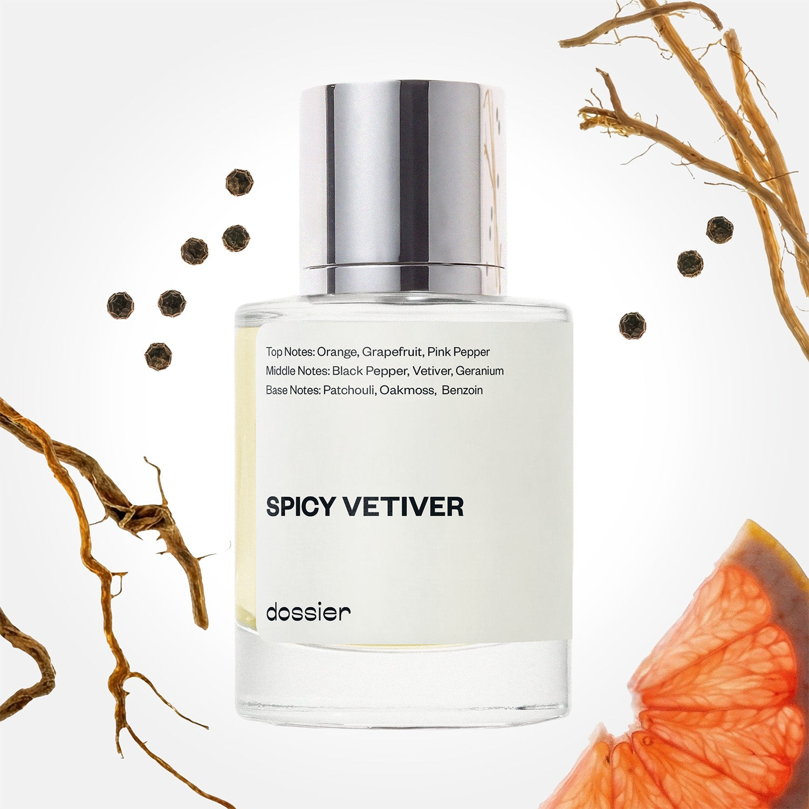

# Spicy Vetiver

- **Dossier Inspired by Hermes' Terre d'Hermes**
- **URL:** https://dossier.co/products/spicy-vetiver
- **SEO title:** Terre d'Hermes Dupe Perfume: Spicy Vetiver - Dossier Perfumes

## Pricing (sizes)

| Size/SKU | Member price | List price | Currency |
|---|---|---|---|
| 32017709498435 | 28.8 | 32 | USD |

## Content (scent notes, about, editorial)

Back Home / Perfumes / Dossier Impressions / SPICY VETIVER 

Men 

Sold out 

Spicy Vetiver

Eau de Toilette. Size: 50ml / 1.7oz 

members: $28.80

Guest:
$32

Inspired by Hermes's Terre d'Hermes Inspired by Hermes's Terre d'Hermes 
Inspired by Hermes's Terre d'Hermes 

Retail price 114 Crafted in France 
Scent Family: earthy 

Notify Me 

Scent Notes This perfume is: Stargazing late at night 
Main Notes:

Black Pepper

Vetiver

top: The first notes you smell 
Orange , Grapefruit, Pink Pepper 
middle: The heart of the perfume 
Black Pepper, Vetiver, Geranium 
base: The notes that linger all day 
Patchouli, Oakmoss, Benzoin 
ingredients: Alcohol, Water, Parfum/Perfume, Amyl Cinnamal, Hexyl Cinnamal, Benzyl Benzoate, Citral, Citronellol, Limonene, Eugenol, Farnesol, Geraniol, Hydroxycitronellal, Isoeugenol, Linalool, Evernia Prunastri (Oakmoss). 

Vegan
Cruelty-free

Clean ingredients

About In this fragrance, after the sun-dried rhizomes are steam distilled, the Vetiver root provides a resinous essence to the scent. In particular, this scent is fine and complex: woody, aromatic, green, and sometimes slightly smoky. Spicy Vetiver (inspired by Hermes' Terre d'Hermes) explores all the facets of this unique raw material, boosting its sparkling freshness with grapefruit and pepper, enhancing its deep and earthy notes with patchouli and oakmoss.

Highly qualitative, sophisticated, and natural all at once, Spicy Vetiver (our impression of Hermes' Terre d'Hermes) navigates the elements, breathing in the earth, feeling the water, and gazing at the sky. 

Scent Intensity: Soft 

Concentration: 12%

Gender: Masculine 

Shipping
Free shipping with 2+ items. 

Standard Shipping (with 2+ items) Auto-selected with 2+ items 
FREE 

Standard Shipping Auto-selected under 2 items 
$3.95 

Express shipping: 2 business days Select in checkout 
$19.00 

Returns
Free exchanges for all. Free returns with 

Exchanges
Free exchange, 1 time per order for all.

Returns
D+ members get 1 FREE return per order.
Non-members incur a $3.99/bottle return fee, 1 time per order.
Returns must be postmarked within 30 days of the initial order. Learn More 

FAQs Are these fragrances long lasting? They are designed to be very long lasting, just like designer fragrances, in some cases even longer, depending on the composition. 
When does the new packaging come out? We'll begin rolling out our new packaging across the U.S. and international markets soon! If you want to shop IRL - our new packaging first hits stores on January 11, 2026 at Walmart. Please note that if you are shopping online, you may receive a combination of our current and new packaging while we transition our inventory. 
How will I know what scent I like? We get it, shopping for perfumes online is hard! That's why we created a scent quiz, which will find the perfect scent for you Take the quiz (opens in new tab) 
Unsure about something? Ask us! help@dossier.co 

Details We are not associated or affiliated with the brands mentioned here in any way.
Spicy Vetiver

The secret ingredient is LOVE

Quintessentially French in style and culture, the Terre d’Hermes Eau de Parfum is the perfect choice for anybody looking for a subtle yet definitely attractive trademark. Launched in 2006, this fragrance has become a staple in the world of its kind. It is a chic classic that blends vivacity, effervescence, and urge in such a way as to provoke a feeling of sweet nostalgia.

Orange and grapefruit are the primary notes – they intertwine to deliver a rich and intense experience. Pepper and pelargonium are the middle notes – they complement each other to produce a fascinating mineral effect. Vetiver, cedar, patchouli, and benzoin are the base notes – they collaborate to provide an alluring scent that lasts really long on the skin. The Terre d’Hermes Eau de Parfum Spray is like good weather packaged in a bottle. It is a go-to option for summer.

Sensual but not intimidating, it is a deep breath of soapy freshness. Sophisticated but not complicated, it is uniquely, one-sidedly flattering. Beautifully intoxicating but not overpowering, it is a perfect day-to-day fragrance for those who proudly identify as ardent floral lovers.

The warmth and softness that accompanies a single application can be likened to the embrace of an angel. Wearing it is like letting the juices of vetiver, cedar, patchouli, and benzoin wash over you like a wave. If you want to sport a charismatic vibe to that occasion, the Terre d’Hermes perfume is your best bet. It is also perfect for when you want to concoct a mental picture of a holiday trip to the alluring turquoise lagoons, palm-fringed beaches, and volcanic summits of the Cook Islands.

If you love the style of this fragrance but would rather have a more down-to-earth alternative, Dossier’s Spicy Vertiver is a safe bet. A truly innovative fragrance, our Terre D’Hermes dupe activates your senses with earthy notes of grapefruit, pepper, patchouli, and oakmoss. It consoles the soul with note blends that let you ride on the wings of the wind, fly past Cloud 9, and touch the luminaries themselves. It is lovely, bold, and delicate – and it’ll almost certainly win your circle of friends over. If you want to stay fresh all the time, bursting with fresh flowers everywhere you go, this perfume is what you need.

You Might Love 

4.3 

Rated 4.3 out of 5 stars 

Based on 460 reviews 

Reviews 460 (tab expanded) Questions (tab collapsed) 

Filters 
Write a Review (Opens in a new window) 

460 reviews 
Sort Highest Rating Most Helpful Photos & Videos Most Recent Oldest Lowest Rating Least Helpful 

J 

Jimb 

3/19/26 

Rated 5 out of 5 stars 

Obsessed
Smells so good, lowkey better than the rubric (Hermes's Terre d'Hermes). Please restock before I run out.

Read More Read more about this review 

Was this helpful? Yes, this review from Jimb was helpful. 0 people voted yes No, this review from Jimb was not helpful. 0 people voted no 

DP 

Dossier Perfumes 
3/19/26 
Jimb! Thanks much for the love and we’re thrilled you’re enjoying it. We’ve shared your restock request with our team!

RH 

Rolando H. 

Verified Buyer 

1/3/26 

Rated 5 out of 5 stars 

Spicy V
Excellent fragrance. Love that spicy hint. Just wish it'd last longer. A fav for sure

Read More Read more about this review 

Was this helpful? Yes, this review from Rolando H. was helpful. 0 people voted yes No, this review from Rolando H. was not helpful. 0 people voted no 

DP 

Dossier Perfumes 
1/3/26 
Hey Rolando! We’re thrilled you love that spicy twist, though we get wanting more wear. Try applying on moisturized skin!

T 

Timothy 
Verified Buyer 

12/16/25 

Rated 5 out of 5 stars 

5 Stars
This is dead on, identical to Terre Herme. I tried them each on both wrists. Absolutely no difference. I really dig the magnetic cap. Will definitely buy this again. Thank you!

Read More Read more about this review 

Was this helpful? Yes, this review from Timothy was helpful. 0 people voted yes No, this review from Timothy was not helpful. 0 people voted no 

DP 

Dossier Perfumes 
12/16/25 
Love hearing that it delivered exactly what you expected, and those magnetic caps are a fan favorite around here too! Thanks for the kind words, and see you back soon 😊

T 

Timothy 

12/16/25 

Rated 5 out of 5 stars 

5 Stars
This is dead on, identical to Terre Herme. I tried them each on both wrists. Absolutely no difference. I really dig the magnetic cap. Will definitely buy this again. Thank you!

Read More Read more about this review 

Was this helpful? Yes, this review from Timothy was helpful. 0 people voted yes No, this review from Timothy was not helpful. 0 people voted no 

A 

Aaron 
Verified Buyer 

12/15/25 

Rated 5 out of 5 stars 

5 Stars
Picked up a second bottle because this is too much like TDH. Also this works wonders for layering, works on most fragrances.

Read More Read more about this review 

Was this helpful? Yes, this review from Aaron was helpful. 0 people voted yes No, this review from Aaron was not helpful. 0 people voted no 

DP 

Dossier Perfumes 
12/15/25 
Great move grabbing a second bottle, and yay that it layers effortlessly with most of your favorites 😊

Loading... 

Loading... 

Show More 

Inspired by  Baccarat Rouge 540 
Inspired by  Black Opium 
Inspired by  Love, Don't Be Shy 
Inspired by  Good Girl 
Inspired by  Libre 
Inspired by  Flowerbomb 
Inspired by  Light Blue 
Inspired by  Not a Perfume 
Inspired by  Aventus 
Inspired by  Bleu de Chanel 
Inspired by  Mon Paris 
Inspired by  Coco Mademoiselle 
Inspired by  Tom Ford for Men 
Inspired by  For Her 
Inspired by  J'Adore Dior 
Inspired by  Alien 
Inspired by  Black Opium Perfume 
Inspired by  Lost Cherry Perfume 

GET UP TO 30% OFF 

Find us at these retailers. 

Be the first to know. 
Submit 

Shop the following countries. United States 

Discover.
AI Scent Finder 
Blog (opens in new tab) 
Scent Family 
Layering 
Scent Quiz 

Help.
Contact Us 
Returns 
FAQ 
Testimonials 
Accessibility 

More.
Store Locator 
Boutique 
Refer A Friend 
Index 

Download our app now.

Find us at these retailers. 

Be the first to know. 
Submit 

Shop the following countries. United States 

Discover.
AI Scent Finder 
Blog (opens in new tab) 
Scent Family 
Layering 
Scent Quiz 

Help.
Contact Us 
Returns 
FAQ 
Testimonials 
Accessibility 

More.

## Main Image

