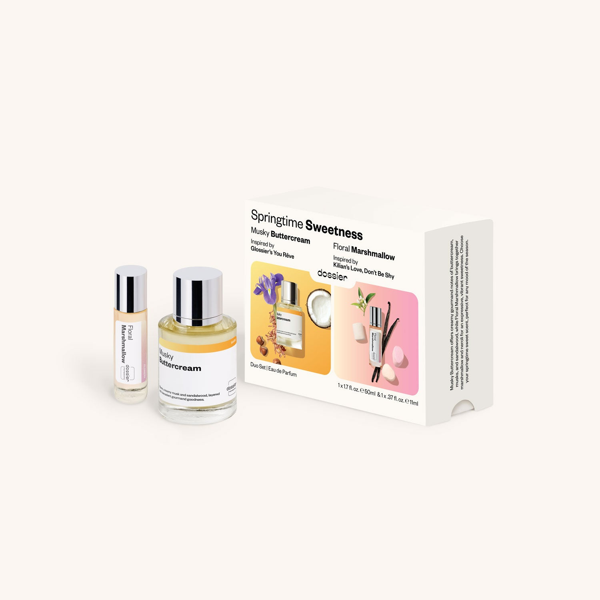

# Springtime Sweetness Duo

- **Dossier Dossier Perfumes**
- **URL:** https://dossier.co/products/springtime-sweetness-duo
- **SEO title:** Springtime Sweetness Duo

## Pricing (sizes)

| Size/SKU | Member price | List price | Currency |
|---|---|---|---|
| DOSTARGETDUO2026STS | 28.8 | 32 | USD |

## Content (scent notes, about, editorial)

Back Home / Perfumes / Gift Sets / SPRINGTIME SWEETNESS DUO 

$46 Value
New 

Springtime Sweetness Duo

Eau de Parfum. Size: 50ml / 1.7oz, 11ml / 0.39oz 

Musky Buttercream offers creamy gourmand notes of buttercream, musks, and sandalwood, while Floral Marshmallow brings together marshmallow and neroli for an expressive, vibrant sweetness. Choose your springtime sweet scent, perfect for any mood of the season.

members: $28.80

Guest:
$32

Crafted in France 

Add to Cart 

What is Included Includes: Musky Buttercream (50ml) Inspired by: Glossier's  You Rêve 
Floral Marshmallow (11ml) Inspired by: Kilian's  Love, Don’t Be Shy 

Shipping
Free shipping with 2+ items. 

Standard Shipping (with 2+ items) Auto-selected with 2+ items 
FREE 

Standard Shipping Auto-selected under 2 items 
$3.95 

Express shipping: 2 business days Select in checkout 
$19.00 

Returns
This product is not refundable.

FAQs Are these fragrances long lasting? They are designed to be very long lasting, just like designer fragrances, in some cases even longer, depending on the composition. 
When does the new packaging come out? We'll begin rolling out our new packaging across the U.S. and international markets soon! If you want to shop IRL - our new packaging first hits stores on January 11, 2026 at Walmart. Please note that if you are shopping online, you may receive a combination of our current and new packaging while we transition our inventory. 
How will I know what scent I like? We get it, shopping for perfumes online is hard! That's why we created a scent quiz, which will find the perfect scent for you Take the quiz (opens in new tab) 
Unsure about something? Ask us! help@dossier.co 

You Might Love 

4.0 

Rated 4.0 out of 5 stars 

Based on 7 reviews 

Reviews 7 (tab expanded) Questions (tab collapsed) 

Filters 
Write a Review (Opens in a new window) 

7 reviews 
Sort Highest Rating Most Helpful Photos & Videos Most Recent Oldest Lowest Rating Least Helpful 

BW 

Betsey W. 
Verified Buyer 

6/19/26 

Rated 5 out of 5 stars 

Delicious 
So happy with this set! The Glossier dupe, Musky Buttercream is a unique scent that is fresh and warm at the same time. It’s definitely a skin scent, which usually I find lacking in interest, but this one has depth and lasts. It reminds me of Play by Givenchy, which was my favorite perfume, that got discontinued (sadness!!). Floral Marshmallow is fun and sweet. Not a scent I’d reach for every day because it literally smells like candy, but I like it. Curious to see how it works when layered with other fragrances. 

Read More Read more about this review 

Was this helpful? Yes, this review from Betsey W. was helpful. 0 people voted yes No, this review from Betsey W. was not helpful. 0 people voted no 

DP 

Dossier Perfumes 
6/19/26 
Betsey! We’re thrilled these skin-hugging scents feel fresh, warm, and playful to you. Layering is such a fun way to mix depth and sweetness. Enjoy experimenting with combinations! ✨

CS 

Cheryl S. 
Verified Buyer 

6/15/26 

Rated 5 out of 5 stars 

Love both! 
Sweet and not too overpowering. Very pleasant to wear. 

Read More Read more about this review 

Was this helpful? Yes, this review from Cheryl S. was helpful. 0 people voted yes No, this review from Cheryl S. was not helpful. 0 people voted no 

DP 

Dossier Perfumes 
6/15/26 
Cheryl, we’re thrilled you found it sweet without being too much and super pleasant every day! Thanks for sharing 💛

A 

AmberVC 
Verified Buyer 

6/9/26 

Rated 5 out of 5 stars 

Springtime Sweetness Duo Musky Buttercream & Floral Marshmallow
I received the Springtime Sweetness Duo in the mail and when I opened each of the fragrances to Snif, I was a little underwhelmed. I thought I might return them. But three weeks later I thought I would try them again together as they were sold and the combination of the two fragrances is so good, my absolute favorite! The fragrances needed to sit a little bit to get stronger and now I cannot stop smelling the duo, just so brilliant together. I even pair the Musky Buttercream with some of my other scents and it’s really great with them as well. The Floral Marshmallow gets better and better as it sits and combined with the Musky Buttercream, it’s the best fragrance out there. I will be purchasing this duo as my staple fragrance in my collection. Thank you Dossier for this combination as it is pure beauty and I cannot get enough of them!

Read More Read more about this review 

Was this helpful? Yes, this review from AmberVC was helpful. 0 people voted yes No, this review from AmberVC was not helpful. 0 people voted no 

DP 

Dossier Perfumes 
6/9/26 
Amber, woohoo thanks for giving them another shot and sharing how beautifully they shine together! We love that you’re layering with other scents. Here’s to your new staple fragrance!

JC 

Julianna C. 
Verified Buyer 

5/23/26 

Rated 5 out of 5 stars 

Perfect Combo!
I bought this set for the Musky Buttercream, I knew from description it was right up my alley. The travel size Floral Marshmellow is such an amazing surprise! I normally don't reach for floral anything and was unsure about this scent. I love it and it is perfectly paired. These two scents blend well when worn together. But when I tried the Floral Marshmellow solo?! I spent the whole day thinking "what smells sooo good??oh! It's me!" LoL 
What an intuitive addition to offer with the Musky Buttercream! I wouldn't have ever ordered the Floral Marshmellow solo but to my surprise I absolutely love it! Not to mention this set being the same price as buying the Musky Buttercream solo was such a great idea! This is why I decided to venture out and try something new. Whoever put these two together knoes their stuff! 
10/10 Highly Recommend! 

Read More Read more about this review 

Was this helpful? Yes, this review from Julianna C. was helpful. 0 people voted yes No, this review from Julianna C. was not helpful. 0 people voted no 

DP 

Dossier Perfumes 
5/23/26 
Hey Julianna! We love hearing that our duo sparked such a fun surprise, especially when you found that solo scent boosting your whole day. Thanks for the glowing shout out! 🙌

GH 

Grace H. 
Verified Buyer 

5/11/26 

Rated 5 out of 5 stars 

Fan Favorite and New Favorite!
love don't be shy dupe is a fan favorite + I'm glad to have a travel size. love the glossier you reve dupe-- smells like clean, warm laundry.

Read More Read more about this review 

Was this helpful? Yes, this review from Grace H. was helpful. 0 people voted yes No, this review from Grace H. was not helpful. 0 people voted no 

DP 

Dossier Perfumes 
5/11/26 
Grace! So great that our fan favorite travel size is fitting into your routine, plus that clean warm laundry vibe 😊

Loading... 

Loading... 

Show More 

Inspired by  Baccarat Rouge 540 
Inspired by  Black Opium 
Inspired by  Love, Don't Be Shy 
Inspired by  Good Girl 
Inspired by  Libre 
Inspired by  Flowerbomb 
Inspired by  Light Blue 
Inspired by  Not a Perfume 
Inspired by  Aventus 
Inspired by  Bleu de Chanel 
Inspired by  Mon Paris 
Inspired by  Coco Mademoiselle 
Inspired by  Tom Ford for Men 
Inspired by  For Her 
Inspired by  J'Adore Dior 
Inspired by  Alien 
Inspired by  Black Opium Perfume 
Inspired by  Lost Cherry Perfume 

GET UP TO 30% OFF 

Find us at these retailers. 

Be the first to know. 
Submit 

Shop the following countries. United States 

Discover.
AI Scent Finder 
Blog (opens in new tab) 
Scent Family 
Layering 
Scent Quiz 

Help.
Contact Us 
Returns 
FAQ 
Testimonials 
Accessibility 

More.
Store Locator 
Boutique 
Refer A Friend 
Index 

Download our app now.

Find us at these retailers. 

Be the first to know. 
Submit 

Shop the following countries. United States 

Discover.
AI Scent Finder 
Blog (opens in new tab) 
Scent Family 
Layering 
Scent Quiz 

Help.
Contact Us 
Returns 
FAQ 
Testimonials 
Accessibility 

More.

## Main Image

