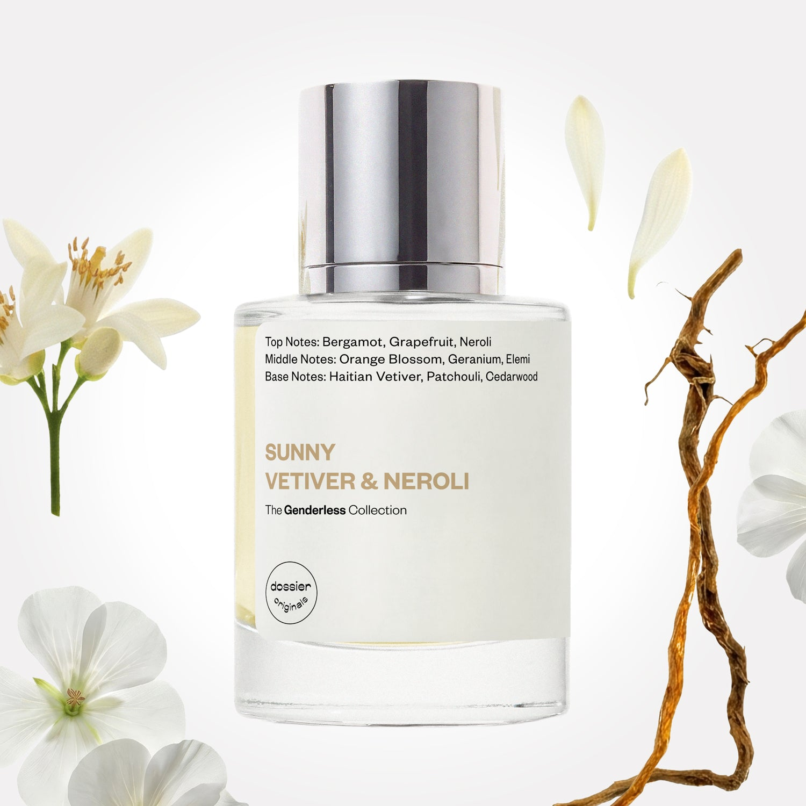

# Sunny Vetiver & Neroli

- **Dossier Dossier Originals**
- **URL:** https://dossier.co/products/sunny-vetiver-neroli
- **SEO title:** Sunny Vetiver & Neroli Perfume - Dossier Perfumes

## Pricing (sizes)

| Size/SKU | Member price | List price | Currency |
|---|---|---|---|
| 39919425290307 | 35.1 | 39 | USD |

## Content (scent notes, about, editorial)

Back Home / Perfumes / Dossier Originals / SUNNY VETIVER & NEROLI 

Unisex 

Sold out 

Sunny Vetiver & Neroli

Eau de Parfum. Size: 50ml / 1.7oz 

members: $35.10

Guest:
$39

Dossier Originals: The genderless collection 

The Genderless Collection melds traditionally masculine and traditionally feminine scents to create unique, genderfluid perfumes for all. 
Crafted in France 
Scent Family: earthy 

Notify Me 

Scent Notes Main Notes:

Orange Blossom

Geranium

Elemi

top: The first notes you smell 
Bergamot, Grapefruit, Neroli 
middle: The heart of the perfume 
Orange Blossom, Geranium, Elemi 
base: The notes that linger all day 
Haitian Vetiver, Patchouli, Cedarwood 
ingredients: Alcohol, Water, Parfum/Perfume, Benzyl alcohol, Citral, Citronellol, Limonene, Eugenol, Farnesol, Geraniol, Linalool. 

Vegan
Cruelty-free

Clean ingredients

About Sunny Vetiver & Neroli embodies a harmonious blend of floral and woody notes. This fragrance merges feminine notes of neroli and orange flowers with masculine smoky woodiness of Haitian vetiver. As the name suggests, it’s warm, fresh, sunny, and bright. 

Scent Intensity: Significant 

Concentration: 18%

Gender: Unisex 

Shipping
Free shipping with 2+ items. 

Standard Shipping (with 2+ items) Auto-selected with 2+ items 
FREE 

Standard Shipping Auto-selected under 2 items 
$3.95 

Express shipping: 2 business days Select in checkout 
$19.00 

Returns
Free exchanges for all. Free returns with 

Exchanges
Free exchange, 1 time per order for all.

Returns
D+ members get 1 FREE return per order.
Non-members incur a $3.99/bottle return fee, 1 time per order.
Returns must be postmarked within 30 days of the initial order. Learn More 

FAQs Are these fragrances long lasting? They are designed to be very long lasting, just like designer fragrances, in some cases even longer, depending on the composition. 
When does the new packaging come out? We'll begin rolling out our new packaging across the U.S. and international markets soon! If you want to shop IRL - our new packaging first hits stores on January 11, 2026 at Walmart. Please note that if you are shopping online, you may receive a combination of our current and new packaging while we transition our inventory. 
How will I know what scent I like? We get it, shopping for perfumes online is hard! That's why we created a scent quiz, which will find the perfect scent for you Take the quiz (opens in new tab) 
Unsure about something? Ask us! help@dossier.co 

You Might Love 

3.1 

Rated 3.1 out of 5 stars 

Based on 244 reviews 

Reviews 244 (tab expanded) Questions (tab collapsed) 

Filters 
Write a Review (Opens in a new window) 

244 reviews 
Sort Highest Rating Most Helpful Photos & Videos Most Recent Oldest Lowest Rating Least Helpful 

TB 

Tania B. 

Verified Buyer 

12/9/25 

Rated 5 out of 5 stars 

I loved it
It smells super delicious and everyone smells like my perfume thank you

Read More Read more about this review 
Translated from Spanish Show original 

Was this helpful? Yes, this review from Tania B. was helpful. 0 people voted yes No, this review from Tania B. was not helpful. 0 people voted no 

DP 

Dossier Perfumes 
12/9/25 
¡Qué alegría leer esto! Nos encanta que recibas tantos cumplidos 😊

M 

Merelyn 

4/11/25 

Rated 5 out of 5 stars 

Dossier Appreciation
I LOVE Dossier, I like most of you got it as a gift. I didn't like the smell at first, but would wear it at work and would get constant compliments and tips. People would stop me on the street to ask what I was wearing. Before this NO perfume ever stayed on my skin for long, I struggled to find scents I liked and that stayed. Through the Dossier membership I acquired over 14 perfume dupes and to this day I haven't had a bad bottle. I highly recommend this brand, their exchanging experience is also very easy. I've gifted these, kept some, explored different scents and I can sincerely say Dossier made me love perfumes.

Read More Read more about this review 

Was this helpful? Yes, this review from Merelyn was helpful. 0 people voted yes No, this review from Merelyn was not helpful. 1 person voted no 

DP 

Dossier Perfumes 
4/18/25 
Now that’s a love story we’ll never get tired of! Merelyn, thanks for letting Dossier be part of your scent journey. Here’s to even more bottles and even bigger compliments!

A 

Adrienne 

3/27/25 

Rated 5 out of 5 stars 

Surprisingly delightful
When I first received this perfume as a Christmas gift, I was unsure how I would feel about it. Initially, the scent seemed unusual—almost musty or mildew-like—which might not sound appealing. This is often the case when encountering a fragrance that differs from what you’re accustomed to; our first instinct is to categorize the smell based on our limited previous experiences.
However, as I continued to wear the perfume, I discovered its true beauty. As the day progresses, the scent transforms and becomes incredibly warm and lovely. As a 41-year-old woman who typically gravitates towards traditionally feminine fragrances, it took me some time to appreciate this unique fragrance. Now, I can confidently say it is one of the most beautiful scents I’ve ever worn.

Read More Read more about this review 

Was this helpful? Yes, this review from Adrienne was helpful. 0 people voted yes No, this review from Adrienne was not helpful. 0 people voted no 

DP 

Dossier Perfumes 
3/31/25 
From “musty” to “mesmerizing”—now that’s a fragrance journey, Adrienne! Thanks for sticking with it and discovering the magic.

C 

C 

12/28/24 

Rated 5 out of 5 stars 

Second Purchase
Lovely warm, dry scent. Like a field in the sun in summer.

Read More Read more about this review 

Was this helpful? Yes, this review from C was helpful. 0 people voted yes No, this review from C was not helpful. 0 people voted no 

DP 

Dossier Perfumes 
1/2/25 
A sunny field in a bottle—beautifully described, C.

SW 

Shay W. 

12/23/24 

Rated 5 out of 5 stars 

Makes me smile every time I use it!
Love it. Has the exact scent profile I was looking for, makes an impact, lasts a long time and makes me smile. Evokes a floral woodiness that I love.
I also love that it's made in Grasse, France and is vegan and cruelty-free. 
Way to go, Dossier!

Read More Read more about this review 

Was this helpful? Yes, this review from Shay W. was helpful. 0 people voted yes No, this review from Shay W. was not helpful. 0 people voted no 

DP 

Dossier Perfumes 
12/27/24 
A fragrance that delivers smiles? Mission accomplished! We’re thrilled you love every detail—Grasse, vegan vibes, and all. Thanks for the love, Shay!

Loading... 

Loading... 

Show More 

Inspired by  Baccarat Rouge 540 
Inspired by  Black Opium 
Inspired by  Love, Don't Be Shy 
Inspired by  Good Girl 
Inspired by  Libre 
Inspired by  Flowerbomb 
Inspired by  Light Blue 
Inspired by  Not a Perfume 
Inspired by  Aventus 
Inspired by  Bleu de Chanel 
Inspired by  Mon Paris 
Inspired by  Coco Mademoiselle 
Inspired by  Tom Ford for Men 
Inspired by  For Her 
Inspired by  J'Adore Dior 
Inspired by  Alien 
Inspired by  Black Opium Perfume 
Inspired by  Lost Cherry Perfume 

GET UP TO 30% OFF 

Find us at these retailers. 

Be the first to know. 
Submit 

Shop the following countries. United States 

Discover.
AI Scent Finder 
Blog (opens in new tab) 
Scent Family 
Layering 
Scent Quiz 

Help.
Contact Us 
Returns 
FAQ 
Testimonials 
Accessibility 

More.
Store Locator 
Boutique 
Refer A Friend 
Index 

Download our app now.

Find us at these retailers. 

Be the first to know. 
Submit 

Shop the following countries. United States 

Discover.
AI Scent Finder 
Blog (opens in new tab) 
Scent Family 
Layering 
Scent Quiz 

Help.
Contact Us 
Returns 
FAQ 
Testimonials 
Accessibility 

More.

## Main Image

