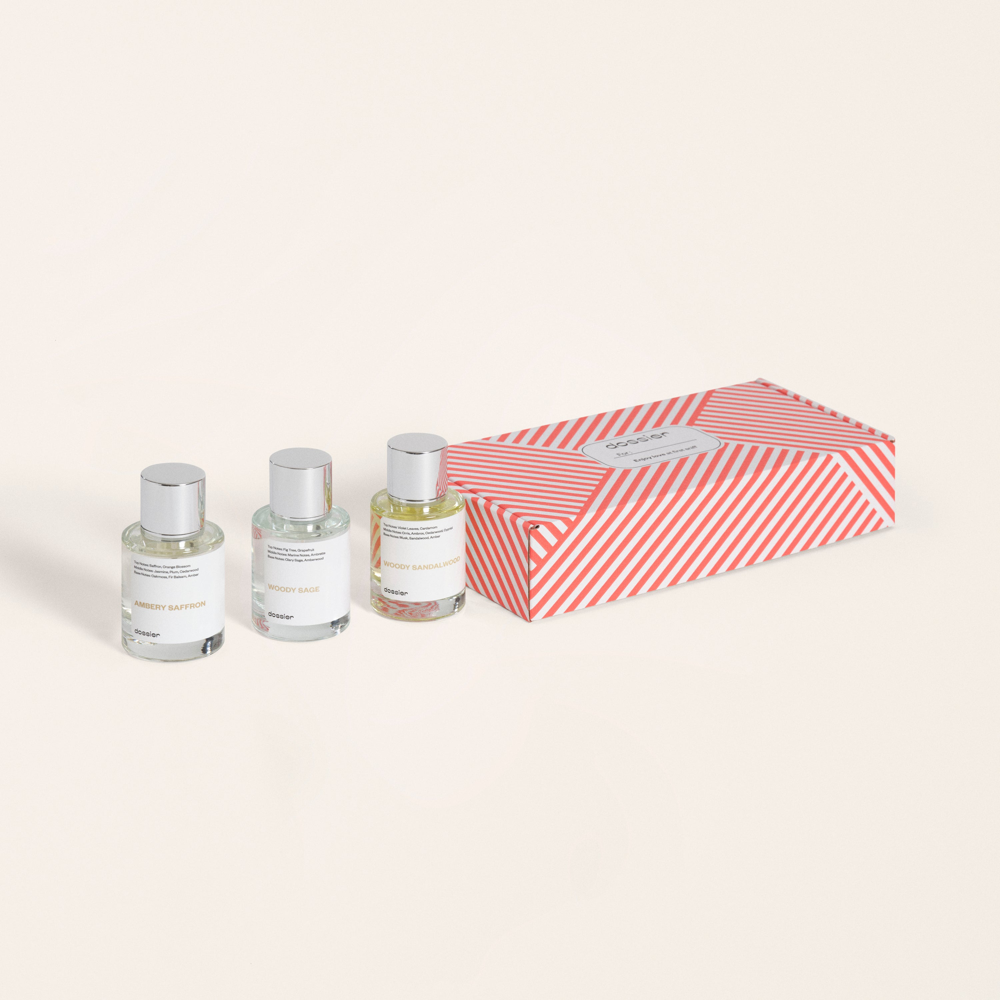

# Universal Crowd Pleasers.

- **Dossier Dossier Perfumes**
- **URL:** https://dossier.co/products/universal-crowd-pleasers
- **SEO title:** Universal Crowd Pleasers.

## Pricing (sizes)

| Size/SKU | Member price | List price | Currency |
|---|---|---|---|
| 41700079927363 | 114.3 | 127 | USD |

## Content (scent notes, about, editorial)

Back Home / Perfumes / Gift Sets / UNIVERSAL CROWD PLEASERS. 

$127 Value
Bestseller 

Universal Crowd Pleasers.

Size: 3 x 50ml / 1.7fl. oz per bottle
Eau de Parfum 

Meet our designer-inspired bestsellers for everyone with warm, spicy, woody, earthy, and fresh fragrances (inspired by MFK, Jo Malone, and Le Labo). Crafted with love in Grasse, France.

members: $114.30

Guest:
$127

Crafted in France 

Add to Cart 

What is Included Includes: Ambery Saffron Inspired by: MFK's Baccarat Rouge 540 
Woody Sage Inspired by: Jo Malone's Wood Sage & Sea Salt 
Woody Sandalwood Inspired by: Le Labo Fragrances's Santal 33 

Scent Notes Ambery Saffron
Main Notes:

Saffron

Orange Blossom

Cedarwood

Amber

top: The first notes you smell 
Saffron, Orange Blossom 
middle: The heart of the perfume 
Jasmine, Plum, Cedarwood 
base: The notes that linger all day 
Oakmoss, Fir Balsam, Amber 
ingredients: Alcohol Denat., Fragrance/Parfum, Water/Aqua/Eau, Citrus Aurantium Peel Oil, Limonene, Pinene, Linalool, Benzyl Alcohol. 

Vegan
Cruelty-free

Clean ingredients

Woody Sage
Main Notes:

Fig Tree

Grapefruit

Clary Sage

Amberwood

top: The first notes you smell 
Fig Tree, Grapefruit 
middle: The heart of the perfume 
Marine notes, Ambrette 
base: The notes that linger all day 
Clary Sage, Amberwood 
ingredients: Alcohol, Water, Parfum/Perfume, alpha-iso-Methylionone, Citral, Coumarin, Citronellol, Limonene, Farnesol, Geraniol, Linalool. 

Vegan
Cruelty-free

Clean ingredients

Woody Sandalwood
Main Notes:

Violet Leaf

Cardamom

Orris

Ambrox

Cedarwood

Cypriol

Sandalwood

top: The first notes you smell 
Violet Leaves, Cardamom 
middle: The heart of the perfume 
Orris, Ambrox, Cedarwood, Cypriol 
base: The notes that linger all day 
Musk, Sandalwood, Amber 
ingredients: Alcohol, Water, Parfum/Perfume, Citral, Citronellol, Limonene, Eugenol, Farnesol, Geraniol, Linalool. 

Vegan
Cruelty-free

Clean ingredients

About Our Everyone’s Favorite trio makes holiday gifting as easy as buying our 3 bestsellers for all genders in one box. genders. This limited-edition gift set includes our 3 unisex bestsellers: Ambery Saffron (inspired by MFK’s Baccarat Rouge 540), Woody Sage (inspired by Jo Malone’s Wood Sage & Sea Salt), and Woody Sandalwood (inspired by Le Labo’s Santal 33), and.

Eliminate seasonal decision fatigue with luxury fragrances for everyone. Smell like wealth, a fresh breath of nature, or a trendy loft space in a spritz.

Save over $500 when you buy Dossier’s luxury scents. Crafted with love in Grasse, France.

Shipping
Free shipping with 2+ items. 

Standard Shipping (with 2+ items) Auto-selected with 2+ items 
FREE 

Standard Shipping Auto-selected under 2 items 
$3.95 

Express shipping: 2 business days Select in checkout 
$19.00 

Returns
This product is not refundable.

FAQs Are these fragrances long lasting? They are designed to be very long lasting, just like designer fragrances, in some cases even longer, depending on the composition. 
When does the new packaging come out? We'll begin rolling out our new packaging across the U.S. and international markets soon! If you want to shop IRL - our new packaging first hits stores on January 11, 2026 at Walmart. Please note that if you are shopping online, you may receive a combination of our current and new packaging while we transition our inventory. 
How will I know what scent I like? We get it, shopping for perfumes online is hard! That's why we created a scent quiz, which will find the perfect scent for you Take the quiz (opens in new tab) 
Unsure about something? Ask us! help@dossier.co 

Best Layered With Combine 2 of our perfumes to create a third scent with layering, curated by our nose. Learn more 

You Might Love 

3.8 

Rated 3.8 out of 5 stars 

Based on 8 reviews 

Reviews 8 (tab expanded) Questions (tab collapsed) 

Filters 
Write a Review (Opens in a new window) 

8 reviews 
Sort Highest Rating Most Helpful Photos & Videos Most Recent Oldest Lowest Rating Least Helpful 

F 

Francheska 
Verified Buyer 

6/19/26 

Rated 5 out of 5 stars 

My favorites! 
These are crown pleasers for a reason! These are my absolute favorite scents. They can be layered together beautifully but each scent can stand alone on its own! I just love them!

Read More Read more about this review 

Was this helpful? Yes, this review from Francheska was helpful. 0 people voted yes No, this review from Francheska was not helpful. 0 people voted no 

DP 

Dossier Perfumes 
6/19/26 
Francheska, thanks for the love! 😊 We’re thrilled these scents are hitting the mark solo and layered. Have fun mixing and matching, and thanks for sharing your favorites!

M 

Mikayla 

4/6/26 

Rated 5 out of 5 stars 

Tiktok 
Guyssssssss don’t WALK RUNNNN I got this universal crowd pleaser of TikTok for 69 dollars great deals that was such and good steal I’m always and ambery saffron girly butttttt the ***** sandalwood surprised me the wood sage is great for a rainy day all are great just purchased the all time best set today waiting on it to be delivered got that one for 52 dollars I’ll keep u guys updated 

Read More Read more about this review 

Was this helpful? Yes, this review from Mikayla was helpful. 0 people voted yes No, this review from Mikayla was not helpful. 0 people voted no 

DP 

Dossier Perfumes 
4/6/26 
Mikayla, thanks for sharing excitement about Universal Crowd Pleasers! So happy the sandalwood shook things up and wood sage fits rainy vibes. Can’t wait to hear how delivery goes 😊

HG 

Heather G. 

12/16/25 

Rated 5 out of 5 stars 

Fragrance Dupes Smell exactly like original Brand
Ambery Saffron is absolutely amazing!!! I was hesitant to buy a Fragrance dupe but Dossier has accomplished replicas that smell like the originals and do not smell cheap. I’m very impressed & have given others as gifts & they never disappoint!

Read More Read more about this review 

Was this helpful? Yes, this review from Heather G. was helpful. 0 people voted yes No, this review from Heather G. was not helpful. 0 people voted no 

DP 

Dossier Perfumes 
12/16/25 
Hey Heather✨So glad Ambery Saffron won you over and that the gifts have been hits too. Thanks for trusting us and spreading the good scents around 💛

OG 

Olivia G. 

10/8/25 

Rated 5 out of 5 stars 

LOVE
I have purchased “Woody Sandalwood” before and my husband flew through it saying it was his favorite fragrance ever. So I got this set for him and he loves all of them. Each fragrance is truly unisex; I have used them all as well.

Read More Read more about this review 

Was this helpful? Yes, this review from Olivia G. was helpful. 0 people voted yes No, this review from Olivia G. was not helpful. 0 people voted no 

DP 

Dossier Perfumes 
10/8/25 
Oh Olivia, your feedback has us smiling wide! Knowing Woody Sandalwood flew off the shelf and the whole set’s winning his heart (and yours) is the best. Keep exploring vibes💛

LM 

Leslie M. 

10/1/25 

Rated 5 out of 5 stars 

Leslie
love Dossier, these are my favorite scents so far and i will try others

Read More Read more about this review 

Was this helpful? Yes, this review from Leslie M. was helpful. 0 people voted yes No, this review from Leslie M. was not helpful. 0 people voted no 

DP 

Dossier Perfumes 
10/1/25 
Wow Leslie, so pumped these scents hit the spot! Can’t wait to see which ones you try next 😊

Loading... 

Loading... 

Show More 

Inspired by  Baccarat Rouge 540 
Inspired by  Black Opium 
Inspired by  Love, Don't Be Shy 
Inspired by  Good Girl 
Inspired by  Libre 
Inspired by  Flowerbomb 
Inspired by  Light Blue 
Inspired by  Not a Perfume 
Inspired by  Aventus 
Inspired by  Bleu de Chanel 
Inspired by  Mon Paris 
Inspired by  Coco Mademoiselle 
Inspired by  Tom Ford for Men 
Inspired by  For Her 
Inspired by  J'Adore Dior 
Inspired by  Alien 
Inspired by  Black Opium Perfume 
Inspired by  Lost Cherry Perfume 

GET UP TO 30% OFF 

Find us at these retailers. 

Be the first to know. 
Submit 

Shop the following countries. United States 

Discover.
AI Scent Finder 
Blog (opens in new tab) 
Scent Family 
Layering 
Scent Quiz 

Help.
Contact Us 
Returns 
FAQ 
Testimonials 
Accessibility 

More.
Store Locator 
Boutique 
Refer A Friend 
Index 

Download our app now.

Find us at these retailers. 

Be the first to know. 
Submit 

Shop the following countries. United States 

Discover.
AI Scent Finder 
Blog (opens in new tab) 
Scent Family 
Layering 
Scent Quiz 

Help.
Contact Us 
Returns 
FAQ 
Testimonials 
Accessibility 

More.

## Main Image

