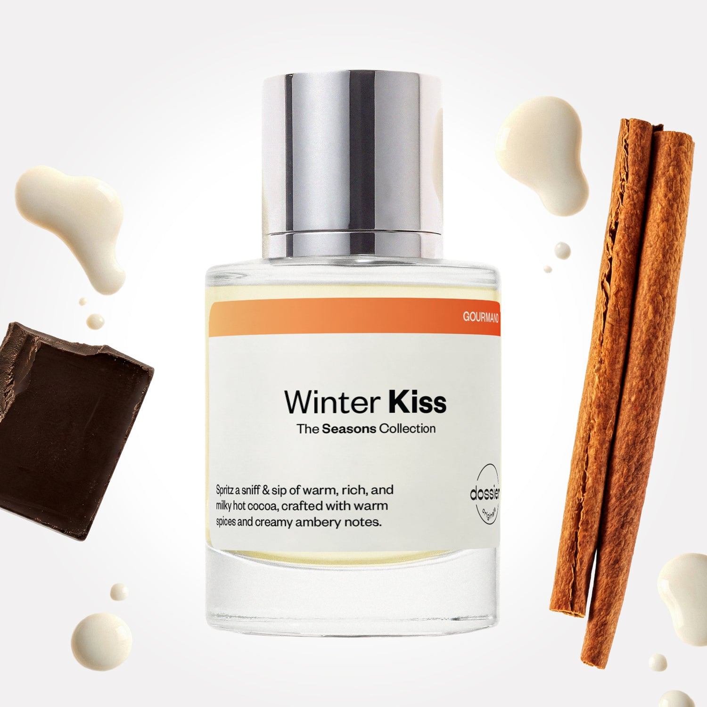

# Winter Kiss

- **Dossier Dossier Originals**
- **URL:** https://dossier.co/products/winter-kiss
- **SEO title:** Winter Kiss

## Pricing (sizes)

| Size/SKU | Member price | List price | Currency |
|---|---|---|---|
| DO50WKGLO | 35.1 | 39 | USD |

## Content (scent notes, about, editorial)

Back Home / Perfumes / Dossier Originals / WINTER KISS 

Unisex 

Winter Kiss

Eau de Parfum. Size: 50ml / 1.7oz 

members: $35.10

Guest:
$39

Dossier Originals: The seasons collection 

With The Seasons Collection, we’ve bottled the distinctive sights, tastes, and emotions that capture the core memories and essence of these 4 distinctive times of the year. 
Crafted in France 
Scent Family: gourmand 

Add to Cart 

Scent Notes Main Notes:

Milky Accord

Chocolate

Incense

Cinnamon

Vanilla

top: The first notes you smell 
milky accord , Clove, Nutmeg, Rum 
middle: The heart of the perfume 
Chocolate, Incense, Cinnamon 
base: The notes that linger all day 
Vanilla, Vetiver, Sandalwood 
ingredients: Alcohol Denat., Water, Parfum/Perfume, Camphor, Cananga Odorata Oil/Extract, Carvone, Citral, Citrus Aurantium Peel Oil, Eugenia Caryophyllus Oil, Tetramethyl Acetyloctahydronaphthalenes, Lavandula Oil/ Extract, Pinene, Terpineol, Hexamethylindanopyran, Trimetylcyclopentenyl Methylisopentenol, Alpha-Terpinene, Benzaldehyde, Benzyl Alcohol, Benzyl Benzoate, Benzyl Salicylate, Beta-caryophyllene, Cinnamal, Cinnamyl Alcohol, Cinnamomum Zeylanicum Bark Oil, Coumarin, Citronellol, Limonene, Eugenol, Farnesol, Geraniol, Isoeugenol, Isoeugenyl Acetate, Linalool, Linalyl Acetate, Pogostemon Cablin Oil, Terpinolene, Vanillin 

Vegan
Cruelty-free

Clean ingredients

About Cozy up with chemistry that smells like the perfect cup of hot cocoa on a snowy winter day. Winter Kiss celebrates the indulgence and gourmand sweetness of the winter season. 

This Dossier Originals scent opens with a warm, comforting embrace of milky accord, clove, nutmeg, and rum notes. The fragrance unfolds into a decadent, smoky, and rich heart of chocolate, incense, and cinnamon before unveiling a gourmand base of vanilla, vetiver, and creamy sandalwood.

A tribute to winter’s great small pleasures, this smooth and mellow scent is enveloping, soothing, and addictive. 

Scent Intensity: Significant 

Concentration: 15%

Gender: Unisex 

Shipping
Free shipping with 2+ items. 

Standard Shipping (with 2+ items) Auto-selected with 2+ items 
FREE 

Standard Shipping Auto-selected under 2 items 
$3.95 

Express shipping: 2 business days Select in checkout 
$19.00 

Returns
Free exchanges for all. Free returns with 

Exchanges
Free exchange, 1 time per order for all.

Returns
D+ members get 1 FREE return per order.
Non-members incur a $3.99/bottle return fee, 1 time per order.
Returns must be postmarked within 30 days of the initial order. Learn More 

FAQs Are these fragrances long lasting? They are designed to be very long lasting, just like designer fragrances, in some cases even longer, depending on the composition. 
When does the new packaging come out? We'll begin rolling out our new packaging across the U.S. and international markets soon! If you want to shop IRL - our new packaging first hits stores on January 11, 2026 at Walmart. Please note that if you are shopping online, you may receive a combination of our current and new packaging while we transition our inventory. 
How will I know what scent I like? We get it, shopping for perfumes online is hard! That's why we created a scent quiz, which will find the perfect scent for you Take the quiz (opens in new tab) 
Unsure about something? Ask us! help@dossier.co 

Best Layered With Combine 2 of our perfumes to create a third scent with layering, curated by our nose. Learn more 

You Might Love 

3.9 

Rated 3.9 out of 5 stars 

Based on 99 reviews 

Reviews 99 (tab expanded) Questions (tab collapsed) 

Filters 
Write a Review (Opens in a new window) 

99 reviews 
Sort Highest Rating Most Helpful Photos & Videos Most Recent Oldest Lowest Rating Least Helpful 

M 

Meg 
Verified Buyer 

5/30/26 

Rated 5 out of 5 stars 

Coziest scent ever!!!
Absolutely in love with this scent. Makes me wanna grab a book and curl up by the fireplace while it snows outside. A perfect blend of chocolate and spice.

Read More Read more about this review 

Was this helpful? Yes, this review from Meg was helpful. 0 people voted yes No, this review from Meg was not helpful. 0 people voted no 

DP 

Dossier Perfumes 
5/30/26 
Meg, we love that this scent inspires a cozy night by the fire and a good book. Your chocolate and spice vibe is pure winter magic. Thanks for sharing! ❄️

CW 

Carla W. 
Verified Buyer 

4/12/26 

Rated 5 out of 5 stars 

Only for Winter? I think not!
Ordered this and thought it would smell good. It exceeded my expectations. The scent is soft with a touch of sass, warmth, and overall wonderful. I am so glad I made the decision to get Winter Kiss. Will definitely be adding to my collection of good smelling scents. 

Read More Read more about this review 

Was this helpful? Yes, this review from Carla W. was helpful. 0 people voted yes No, this review from Carla W. was not helpful. 0 people voted no 

DP 

Dossier Perfumes 
4/12/26 
Carla, busting the idea that this scent is only for cold weather, right? We’re so happy Winter Kiss brought a cozy, sassy vibe and earns its spot in your collection. 😊

L 

Liz 
Verified Buyer 

3/25/26 

Rated 5 out of 5 stars 

It’s chocolate but ****
I’m so glad this has been restocked! It’s non-cloying spicy chocolate, just in time for Easter. 

Read More Read more about this review 

Was this helpful? Yes, this review from Liz was helpful. 0 people voted yes No, this review from Liz was not helpful. 0 people voted no 

DP 

Dossier Perfumes 
3/25/26 
We’re so glad it’s back and that you’re loving that spicy chocolate twist. Happy Easter spritzing!

P 

Patty 

1/19/26 

Rated 5 out of 5 stars 

Unique Winter Favorite
I got the advent calendar for Christmas and this was my favorite scent by far. It has a very slight earthly chocolate note to it but then it turn into something so beautiful and unique! You have to love spicy, wintery perfumes to really enjoy this one and I do. It may be one of my favorite winter perfumes so far (and I have hundreds). I'm checking my email on a daily basis to see when this comes back in stock so I can grab a full bottle. This is my first experience with Dossier and they do not disappoint, especially with their original scents!

Read More Read more about this review 

Was this helpful? Yes, this review from Patty was helpful. 0 people voted yes No, this review from Patty was not helpful. 0 people voted no 

DP 

Dossier Perfumes 
1/19/26 
Patty! So thrilled Winter Kiss topped your list (among hundreds!). We can’t wait for it either. Keep watch on your email to grab a full bottle soon 😊

L 

Leslie 

12/24/25 

Rated 5 out of 5 stars 

Sophisticated Solstice in a Bottle
I sampled this with the advent calendar (my daughter and I enjoyed that ver much. So fun!) I love it! I’m sad I can’t get a bottle right now but I’m happy there will be a restock. 
It smells like a walk in the woods on a crisp winters day with a gorgeous cozy dry down. It feels more interesting than a lot of the linear gourmands that are so popular right now. So beautiful. I’m really looking forward to this being my daily winter scent!

Read More Read more about this review 

Was this helpful? Yes, this review from Leslie was helpful. 0 people voted yes No, this review from Leslie was not helpful. 0 people voted no 

DP 

Dossier Perfumes 
12/24/25 
Leslie! We’re thrilled you and your daughter had fun with the advent calendar. We can’t wait to bring this one back so you can cozy up every day this winter!

Loading... 

Loading... 

Show More 

Inspired by  Baccarat Rouge 540 
Inspired by  Black Opium 
Inspired by  Love, Don't Be Shy 
Inspired by  Good Girl 
Inspired by  Libre 
Inspired by  Flowerbomb 
Inspired by  Light Blue 
Inspired by  Not a Perfume 
Inspired by  Aventus 
Inspired by  Bleu de Chanel 
Inspired by  Mon Paris 
Inspired by  Coco Mademoiselle 
Inspired by  Tom Ford for Men 
Inspired by  For Her 
Inspired by  J'Adore Dior 
Inspired by  Alien 
Inspired by  Black Opium Perfume 
Inspired by  Lost Cherry Perfume 

GET UP TO 30% OFF 

Find us at these retailers. 

Be the first to know. 
Submit 

Shop the following countries. United States 

Discover.
AI Scent Finder 
Blog (opens in new tab) 
Scent Family 
Layering 
Scent Quiz 

Help.
Contact Us 
Returns 
FAQ 
Testimonials 
Accessibility 

More.
Store Locator 
Boutique 
Refer A Friend 
Index 

Download our app now.

Find us at these retailers. 

Be the first to know. 
Submit 

Shop the following countries. United States 

Discover.
AI Scent Finder 
Blog (opens in new tab) 
Scent Family 
Layering 
Scent Quiz 

Help.
Contact Us 
Returns 
FAQ 
Testimonials 
Accessibility 

More.

## Main Image

