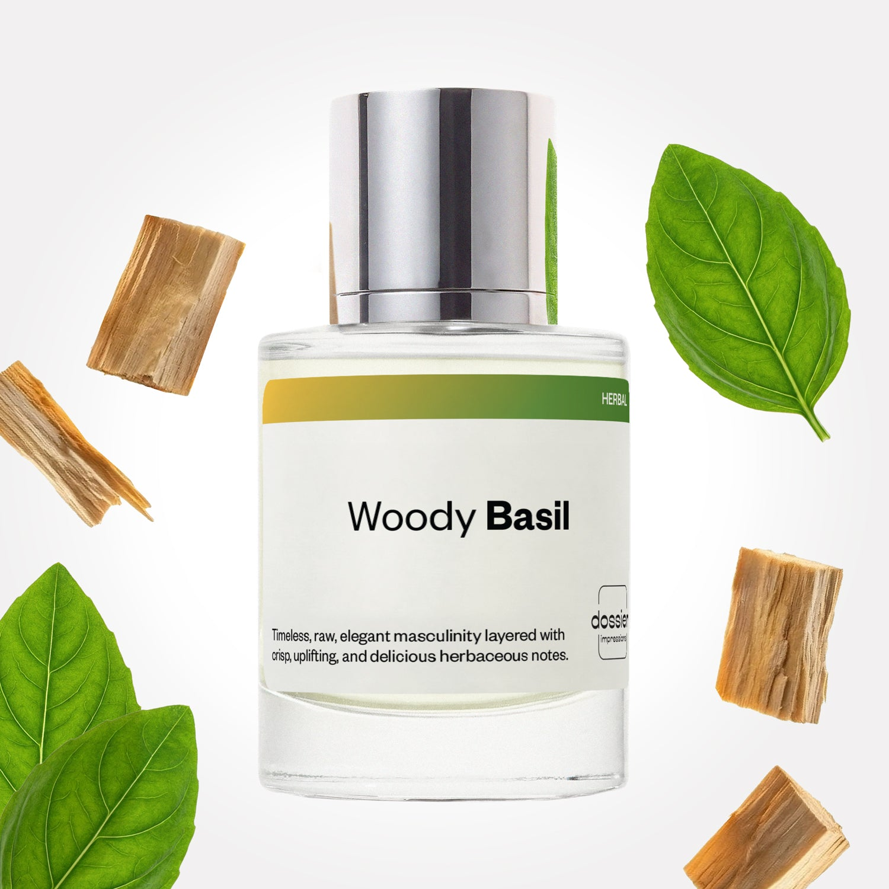

# Woody Basil

- **Dossier Inspired by YSL's L'Homme**
- **URL:** https://dossier.co/products/woody-basil
- **SEO title:** YSL's L'Homme Dupe Perfume: Woody Basil - Dossier Perfumes

## Pricing (sizes)

| Size/SKU | Member price | List price | Currency |
|---|---|---|---|
| DI50WBUS | 26.1 | 29 | USD |
| DOSWA50WB | 26.1 | 29 | USD |

## Content (scent notes, about, editorial)

Back Home / Perfumes / Dossier Impressions / WOODY BASIL 

Men 

It's back! 

Woody Basil

Eau de Parfum. Size: 50ml / 1.7oz 

members: $26.10

Guest:
$29

Inspired by YSL's L'Homme Inspired by YSL's L'Homme 
Inspired by YSL's L'Homme 

Retail price 97 Crafted in France 
Scent Family: herbal 

Add to Cart 

Scent Notes This perfume is: A fresh herb garden 
Main Notes:

Basil

Ginger

Blond Woods

top: The first notes you smell 
Basil, Ginger, Bergamot 
middle: The heart of the perfume 
Violet Leaf, Lavender, Black Pepper 
base: The notes that linger all day 
Tonka Bean, Patchouli, Blond Woods 
ingredients: Alcohol, Water, Parfum/Perfume, alpha-iso-Methylionone, Cinnamaldehyde, Citral, Coumarin, Citronellol, Limonene, Eugenol, Farnesol, Geraniol, Linalool. 

Vegan
Cruelty-free

Clean ingredients

About Woody Basil (inspired by YSL's L'Homme) explodes on top thanks to an uplifting and crisp combination of basil and ginger, with a hidden hint of violet. Next, the fragrance evolves toward a refined woods complex, sweetened with warm spices and tonka bean.

Unmistakably masculine, Woody Basil (our impression of YSL's L'Homme) is a fragrance of timeless elegance, embellished by a sprinkling of innovative raw materials.

Scent Intensity: Significant 

Concentration: 15%

Gender: Masculine 

Shipping
Free shipping with 2+ items. 

Standard Shipping (with 2+ items) Auto-selected with 2+ items 
FREE 

Standard Shipping Auto-selected under 2 items 
$3.95 

Express shipping: 2 business days Select in checkout 
$19.00 

Returns
Free exchanges for all. Free returns with 

Exchanges
Free exchange, 1 time per order for all.

Returns
D+ members get 1 FREE return per order.
Non-members incur a $3.99/bottle return fee, 1 time per order.
Returns must be postmarked within 30 days of the initial order. Learn More 

FAQs Are these fragrances long lasting? They are designed to be very long lasting, just like designer fragrances, in some cases even longer, depending on the composition. 
When does the new packaging come out? We'll begin rolling out our new packaging across the U.S. and international markets soon! If you want to shop IRL - our new packaging first hits stores on January 11, 2026 at Walmart. Please note that if you are shopping online, you may receive a combination of our current and new packaging while we transition our inventory. 
How will I know what scent I like? We get it, shopping for perfumes online is hard! That's why we created a scent quiz, which will find the perfect scent for you Take the quiz (opens in new tab) 
Unsure about something? Ask us! help@dossier.co 

Details We are not associated or affiliated with the brands mentioned here in any way.
Woody Basil

The Essence of Seduction

Exciting, thrilling, and adventurous – these are the characteristics of a fantastic men’s cologne. Whether it’s for a trip to the beach, a night out on the town, or a big meeting at the office, the right cologne can put you in the right frame of mind.

In that vein, enter Yves Saint Laurent’s L’Homme Eau de Toilette (EDT), which inspired Dossier’s Woody Basil fragrance.

The luxury fragrance that Woody Basil is inspired by is irresistible, sensual, and magnetic – a classic and arguably trademark scent for the brand. This floral musk combines the finest notes of bergamot and ginger, blended with sweet vetiver and warm cedar. All this to create a fragrance that captures the timeless elegance of the modern man.

But for all its masculinity, the fragrance is pleasantly airy and fresh. The scent may belong to the earthy scent family, but it stands out as something much more delicate due to its distinctive blend of wood and citrus notes. At the same time, it also remains true to the intriguing, mysterious, and alluring elements synonymous with the image of the YSL brand.

YSL’s L’Homme opens with the bright, warm scents of ginger, lemon, and bergamot. The fragrant heart of this scent is formed by iris and violet notes, giving it a lovely, yet simple floral touch. The cologne also features basil flowers and a whiff of white pepper, solidifying its reputation as a highly masculine scent.

Overall, this is a very light and airy fragrance. Performance-wise, it’s a bit thin on sillage. And it won’t project a whole lot. But we like the effect it creates. It’s a low-key pleasant scent that is easy to like and will definitely turn heads if people catch a whiff of it. This is the type of fragrance you can wear anywhere and at any time, no matter what the occasion.

Woody Basil is our thought-provoking interpretation of this iconic fragrance for men. Unmistakably masculine, our YSL L’Homme dupe is a stunning replica of the original, down to the most intricate of notes. This is a scent of timeless elegance, embellished with the wealth of innovative components, and without being burdened by a high price tag. A truly magnificent dupe fragrance on all fronts.

Best Layered With Combine 2 of our perfumes to create a third scent with layering, curated by our nose. Learn more 

You Might Love 

4.5 

Rated 4.5 out of 5 stars 

Based on 542 reviews 

Reviews 542 (tab expanded) Questions (tab collapsed) 

Filters 
Write a Review (Opens in a new window) 

542 reviews 
Sort Highest Rating Most Helpful Photos & Videos Most Recent Oldest Lowest Rating Least Helpful 

AC 

Andres C. 
Verified Buyer 

6/11/26 

Rated 5 out of 5 stars 

Amazing
Really like this fragrance

Read More Read more about this review 

Was this helpful? Yes, this review from Andres C. was helpful. 0 people voted yes No, this review from Andres C. was not helpful. 0 people voted no 

DP 

Dossier Perfumes 
6/11/26 
Andres, that’s awesome to hear! Thanks for sharing your love for our scent.

FS 

Fran S. 
Verified Buyer 

4/28/26 

Rated 5 out of 5 stars 

Scent
Hi I have purchased plenty of products from you, although, I’m not a fan of this scent😔 Can I exchange or return it?

Read More Read more about this review 

Was this helpful? Yes, this review from Fran S. was helpful. 0 people voted yes No, this review from Fran S. was not helpful. 0 people voted no 

DP 

Dossier Perfumes 
4/28/26 
Fran, sorry this one missed the mark. We’d love to help—please reach out to help@trydossier.ca 

J 

Julie 

4/17/26 

Rated 5 out of 5 stars 

5 Stars
Love this smell so much

Read More Read more about this review 

Was this helpful? Yes, this review from Julie was helpful. 0 people voted yes No, this review from Julie was not helpful. 0 people voted no 

VM 

Vince M 

4/2/26 

Rated 5 out of 5 stars 

5 Stars
Great quality, better price?

Read More Read more about this review 

Was this helpful? Yes, this review from Vince M was helpful. 0 people voted yes No, this review from Vince M was not helpful. 0 people voted no 

K 

Kevin 

3/14/26 

Rated 5 out of 5 stars 

5 Stars
Authentic fragrance I love it and I’m coming back soon. Thank you so much for product

Read More Read more about this review 

Was this helpful? Yes, this review from Kevin was helpful. 0 people voted yes No, this review from Kevin was not helpful. 0 people voted no 

Loading... 

Loading... 

Show More 

Inspired by  Baccarat Rouge 540 
Inspired by  Black Opium 
Inspired by  Love, Don't Be Shy 
Inspired by  Good Girl 
Inspired by  Libre 
Inspired by  Flowerbomb 
Inspired by  Light Blue 
Inspired by  Not a Perfume 
Inspired by  Aventus 
Inspired by  Bleu de Chanel 
Inspired by  Mon Paris 
Inspired by  Coco Mademoiselle 
Inspired by  Tom Ford for Men 
Inspired by  For Her 
Inspired by  J'Adore Dior 
Inspired by  Alien 
Inspired by  Black Opium Perfume 
Inspired by  Lost Cherry Perfume 

GET UP TO 30% OFF 

Find us at these retailers. 

Be the first to know. 
Submit 

Shop the following countries. United States 

Discover.
AI Scent Finder 
Blog (opens in new tab) 
Scent Family 
Layering 
Scent Quiz 

Help.
Contact Us 
Returns 
FAQ 
Testimonials 
Accessibility 

More.
Store Locator 
Boutique 
Refer A Friend 
Index 

Download our app now.

Find us at these retailers. 

Be the first to know. 
Submit 

Shop the following countries. United States 

Discover.
AI Scent Finder 
Blog (opens in new tab) 
Scent Family 
Layering 
Scent Quiz 

Help.
Contact Us 
Returns 
FAQ 
Testimonials 
Accessibility 

More.

## Main Image

