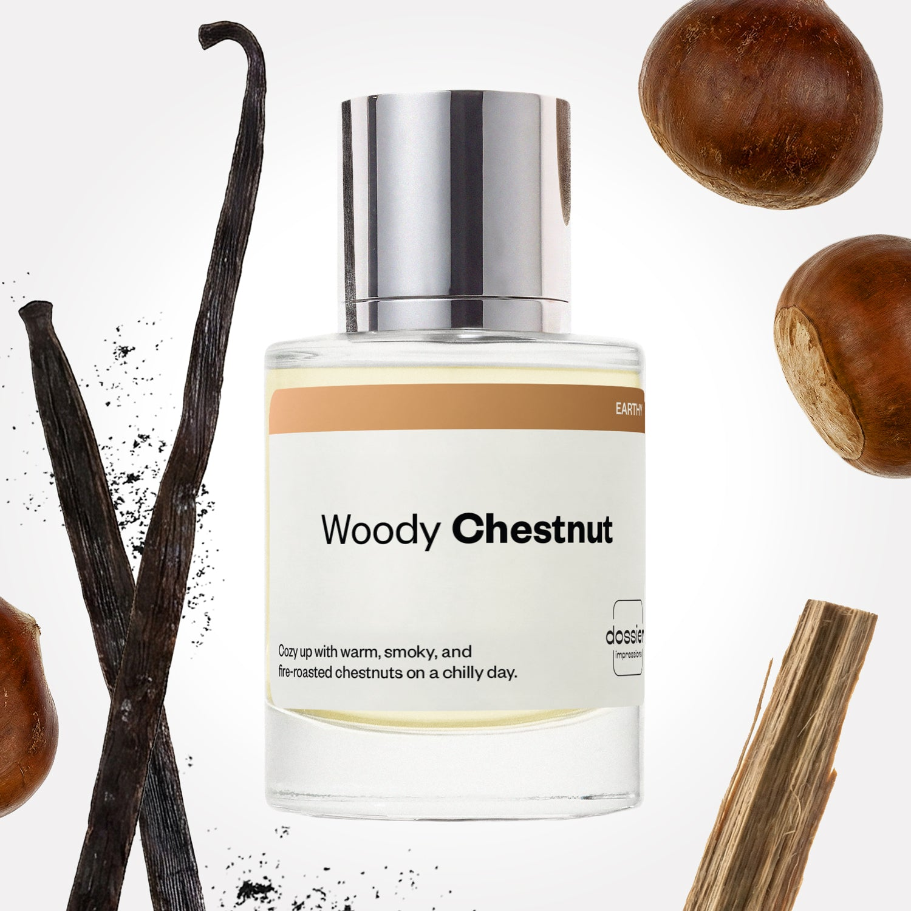

# Woody Chestnut

- **Dossier Inspired by Maison Margiela's Replica By the Fireplace**
- **URL:** https://dossier.co/products/woody-chestnut
- **SEO title:** Replica By the Fireplace by Maison Margiela Dupe Perfume: Woody Chestnut - Dossier Perfumes

## Pricing (sizes)

| Size/SKU | Member price | List price | Currency |
|---|---|---|---|
| DI50WCHUS | 28.8 | 32 | USD |

## Content (scent notes, about, editorial)

Back Home / Perfumes / Dossier Impressions / WOODY CHESTNUT 

Unisex 

Woody Chestnut

Eau de Toilette. Size: 50ml / 1.7oz 

members: $28.80

Guest:
$32

Inspired by Maison Margiela's Replica By the Fireplace Inspired by Maison Margiela's Replica By the Fireplace 
Inspired by Maison Margiela's Replica By the Fireplace 

Retail price 165 Crafted in France 
Scent Family: earthy 

Add to Cart 

Scent Notes This perfume is: A cup of cocoa on a snowy day 
Main Notes:

Chestnut

Guaiac Wood

Cade Wood

top: The first notes you smell 
Pink Pepper, Orange Blossom, Cloves 
middle: The heart of the perfume 
Chestnut, Gaïac Wood, Cade Wood 
base: The notes that linger all day 
Vanilla, Peru Balm, Cedarwood 
ingredients: Alcohol, Water, Parfum/Perfume, Benzyl alcohol, Benzyl Benzoate, Benzyl Cinnamate, Cinnamaldehyde, Cinnamyl alcohol, Limonene, Eugenol, Geraniol, Isoeugenol, Linalool. 

Vegan
Cruelty-free

Clean ingredients

About Woody Chestnut (inspired by Maison Margiela's Replica By the Fireplace) opens with a hint of pink pepper and cloves. Very quickly this spicy sparkle is relayed by an armful of woody notes. An overdose of Gaiac and Cade woods gives the fragrance its very particular smoky tone. The final touch is provided by a comfy gourmand accord centered on chestnut.

Warm, comfortable, evocative, Woody Chestnut (our impression of Maison Margiela's Replica By the Fireplace) reflects in a wonderfully expressive way the cocooning sensation of a gourmet moment by a wood fire at dusk. 

Scent Intensity: Statement 

Concentration: 18%

Gender: Unisex 

Shipping
Free shipping with 2+ items. 

Standard Shipping (with 2+ items) Auto-selected with 2+ items 
FREE 

Standard Shipping Auto-selected under 2 items 
$3.95 

Express shipping: 2 business days Select in checkout 
$19.00 

Returns
Free exchanges for all. Free returns with 

Exchanges
Free exchange, 1 time per order for all.

Returns
D+ members get 1 FREE return per order.
Non-members incur a $3.99/bottle return fee, 1 time per order.
Returns must be postmarked within 30 days of the initial order. Learn More 

FAQs Are these fragrances long lasting? They are designed to be very long lasting, just like designer fragrances, in some cases even longer, depending on the composition. 
When does the new packaging come out? We'll begin rolling out our new packaging across the U.S. and international markets soon! If you want to shop IRL - our new packaging first hits stores on January 11, 2026 at Walmart. Please note that if you are shopping online, you may receive a combination of our current and new packaging while we transition our inventory. 
How will I know what scent I like? We get it, shopping for perfumes online is hard! That's why we created a scent quiz, which will find the perfect scent for you Take the quiz (opens in new tab) 
Unsure about something? Ask us! help@dossier.co 

Details Woody Chestnut

Curl up next to the crackling fire on a chilly winter’s night

Find comforting solace and warmth in the midst of the blisteringly cold nights with Maison Margiela’s ‘Replica’ By the Fireplace fragrance for men and women, which inspired Dossier’s Woody Chestnut. Launched in 2015, the luxury fragrance that Woody Chestnut is inspired by oozes warmth through aromatic orange and fiery red – this soothing scent was meticulously crafted to resemble the woody scent of the fireside.

Nuanced and layered, the deep texture of this autumnal scent echoes the fiery orange, yellow and red marbled colors of vibrantly tumbling leaves in Fall. Although not an overly complex combination of tones, the woody top and base notes whisper melodiously to create an intimate fusion of security and homeliness.

Beginning with cloves and piquant pink pepper, smattered with hints of a citrusy potpourri, the cozy top tones of the luxury fragrance that Woody Chestnut is inspired by radiate goodness and comfort. Delightfully aromatic middle notes of roasted chestnut, Guaiac wood, and botanical juniper blend with the simplicity of creamy vanilla and deep Peru balsam base notes to transport you to a blisteringly cold December night – drinking eggnog in front of a fire and sleeping in heavenly peace.

Feel the heat radiating against your skin, setting it aglow and toasty. Bundled by the fireplace in cozy pyjamas, hearing the joyous shrieks of family Monopoly games. The comforting vision of Maison Margiela’s ‘Replica’ By the Fireplace fragrance mirrors the choice of aromas that are infused to create the warmth of such a scent. Staying in close contact with elegance and intimacy, the luxury fragrance that Woody Chestnut is inspired by keeps a relaxing air of reassurance, warming to the heart and soul of anyone who catches its restful scent. To put it simply: the luxury fragrance that Woody Chestnut is inspired by captures the essence of quiet peacefulness during the winter. It is a premium classic that shuts away the noise and grants you inner harmony.

If you are browsing for a vision of fiery Fall and cold winter, this replica of the crackling fire can be found on your favorite online retail website. The Maison Margiela ‘Replica’ By the Fireplace cologne can be bought in a range of 2 sizes (30 ml and 100 ml) at a cost of $76.00 and $144.00. Alternatively, you can have the 10 ml travel Eau de Toilette spray for $32.00. And if you want to indulge in the fragrance in the comfort of your home, you can purchase a candle for $65.00 with a burn time of up to 41 hours.

To experience a similar nostalgic scent of burning wood and chestnuts at a cheaper price, look no further than Dossier’s Woody Chestnut. Our Maison Margiela ‘Replica’ By the Fireplace dupe masterfully presents a memorable recollection of the crackling fire and rusty aromas of wood and roasting chestnuts. To embellish the smoky tones, we infused our Woody Chestnut fragrance with smoldering doses of Guaiac wood and our own twist of Cade wood, aromatic smoke, and ash. Woody Chestnut provides a sentimental sensation of reassuring snuggles under warm and comfy blankets. 

Best Layered With Combine 2 of our perfumes to create a third scent with layering, curated by our nose. Learn more 

You Might Love 

4.6 

Rated 4.6 out of 5 stars 

Based on 1,520 reviews 

Reviews 1,520 (tab expanded) Questions 2 (tab collapsed) 

Filters 
Write a Review (Opens in a new window) 

1,520 reviews 
Sort Highest Rating Most Helpful Photos & Videos Most Recent Oldest Lowest Rating Least Helpful 

M 

Meg 
Verified Buyer 

6/25/26 

Rated 5 out of 5 stars 

Cozy fireplace!!!
Love this! Got it to layer with winter kiss and it smells so good. Love it on its own, but layering it with winter kiss definitely takes it to another level 🥰 best winter combination ever. Now I can’t wait for snow and it’s the middle of summer.

Read More Read more about this review 

Was this helpful? Yes, this review from Meg was helpful. 0 people voted yes No, this review from Meg was not helpful. 0 people voted no 

N 

Noemi 

6/8/26 

Rated 5 out of 5 stars 

5 Stars
Love this scent. I can't wait for fall season!

Read More Read more about this review 

Was this helpful? Yes, this review from Noemi was helpful. 0 people voted yes No, this review from Noemi was not helpful. 0 people voted no 

K 

Kristin 

4/24/26 

Rated 5 out of 5 stars 

Smells so good & long lasting!
I am obsessed with this scent! It smells so close to the original, or even better, and it lasts long! I wish I could bathe in this. Love this!

Read More Read more about this review 

Was this helpful? Yes, this review from Kristin was helpful. 0 people voted yes No, this review from Kristin was not helpful. 0 people voted no 

DP 

Dossier Perfumes 
4/24/26 
Kristin, it’s awesome to hear this scent is nailing longevity and giving you the confidence boosts! Try spritzing on pulse points right after moisturizing for an extra enveloping experience ✨

IT 

Isaack T. 
Verified Buyer 

4/4/26 

Rated 5 out of 5 stars 

I LOVE IT
Its a perfect balance of sweet and *****, this is another personal favorite 

Read More Read more about this review 

Was this helpful? Yes, this review from Isaack T. was helpful. 0 people voted yes No, this review from Isaack T. was not helpful. 0 people voted no 

DP 

Dossier Perfumes 
4/4/26 
Isaack, thanks so much! We’re thrilled that perfect balance landed just right for you 🙌

A 

Adam 

2/13/26 

Rated 5 out of 5 stars 

5 Stars
Big fan. Id say the original is stronger and hits harder but this is still really good and worth the money. You dont have to spend 140-170 on the original to get the same compliments.

Read More Read more about this review 

Was this helpful? Yes, this review from Adam was helpful. 0 people voted yes No, this review from Adam was not helpful. 0 people voted no 

Loading... 

Loading... 

Show More 

Inspired by  Baccarat Rouge 540 
Inspired by  Black Opium 
Inspired by  Love, Don't Be Shy 
Inspired by  Good Girl 
Inspired by  Libre 
Inspired by  Flowerbomb 
Inspired by  Light Blue 
Inspired by  Not a Perfume 
Inspired by  Aventus 
Inspired by  Bleu de Chanel 
Inspired by  Mon Paris 
Inspired by  Coco Mademoiselle 
Inspired by  Tom Ford for Men 
Inspired by  For Her 
Inspired by  J'Adore Dior 
Inspired by  Alien 
Inspired by  Black Opium Perfume 
Inspired by  Lost Cherry Perfume 

GET UP TO 30% OFF 

Find us at these retailers. 

Be the first to know. 
Submit 

Shop the following countries. United States 

Discover.
AI Scent Finder 
Blog (opens in new tab) 
Scent Family 
Layering 
Scent Quiz 

Help.
Contact Us 
Returns 
FAQ 
Testimonials 
Accessibility 

More.
Store Locator 
Boutique 
Refer A Friend 
Index 

Download our app now.

Find us at these retailers. 

Be the first to know. 
Submit 

Shop the following countries. United States 

Discover.
AI Scent Finder 
Blog (opens in new tab) 
Scent Family 
Layering 
Scent Quiz 

Help.
Contact Us 
Returns 
FAQ 
Testimonials 
Accessibility 

More.

## Main Image

