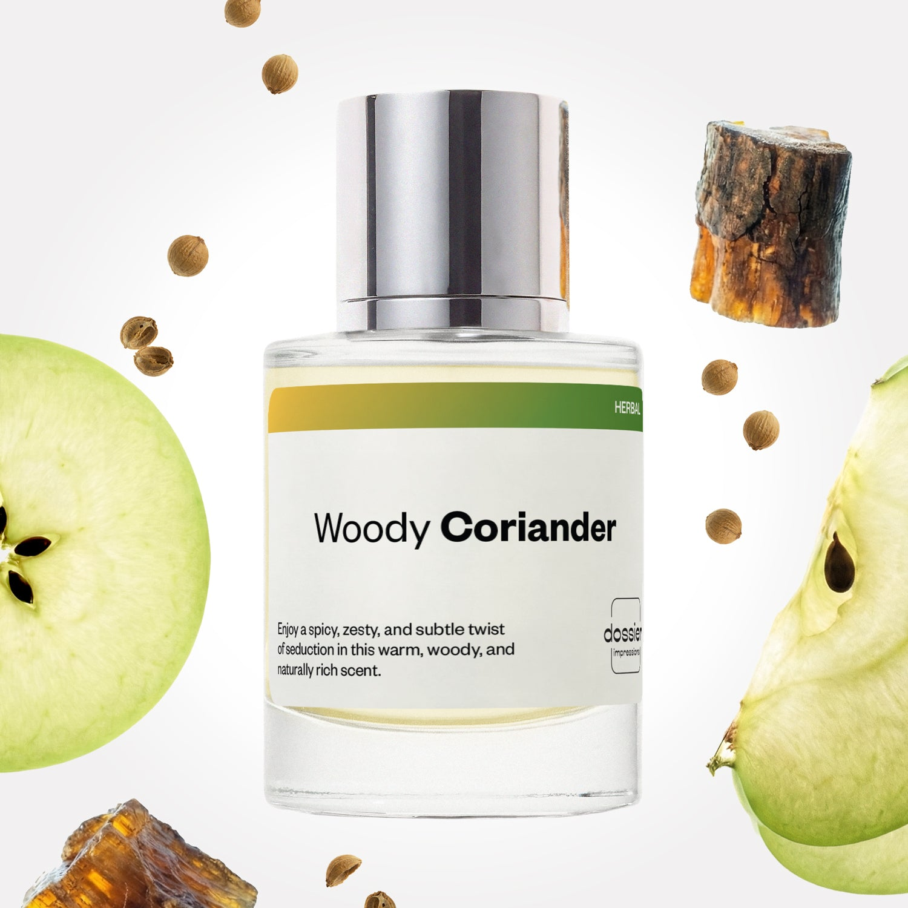

# Woody Coriander

- **Dossier Inspired by Dolce & Gabbana's The One**
- **URL:** https://dossier.co/products/woody-coriander
- **SEO title:** Dolce & Gabbana's The One Dupe Perfume: Woody Coriander - Dossier Perfumes

## Pricing (sizes)

| Size/SKU | Member price | List price | Currency |
|---|---|---|---|
| DI50WCOUS | 28.8 | 32 | USD |

## Content (scent notes, about, editorial)

Back Home / Perfumes / Dossier Impressions / WOODY CORIANDER 

Men 

It's back! 

Woody Coriander

Eau de Parfum. Size: 50ml / 1.7oz 

members: $28.80

Guest:
$32

Inspired by Dolce & Gabbana's The One Inspired by Dolce & Gabbana's The One 
Inspired by Dolce & Gabbana's The One 

Retail price 100 Crafted in France 
Scent Family: herbal 

Add to Cart 

Scent Notes This perfume is: A subtle twist of seduction 
Main Notes:

Amberwood

Tobacco

Cedarwood

top: The first notes you smell 
Coriander, Green Apple, Grapefruit 
middle: The heart of the perfume 
Cardamom, Orange Blossom, Basil 
base: The notes that linger all day 
Amberwood, Tobacco, Cedarwood 
ingredients: Alcohol, Water, Parfum/Perfume, alpha-iso-Methylionone, Citral, Citronellol, Limonene, Eugenol, Farnesol, Geraniol, Isoeugenol, Linalool. 

Vegan
Cruelty-free

Clean ingredients

About Woody Coriander (inspired by Dolce & Gabbana's The One) opens with vibrant spicy notes of coriander and cardamom, balanced with the freshness of grapefruit, green apple and basil. Next, sensual, ambery, woody notes develop with elegance, revealing the full personality of the fragrance.
Classic and contemporary, Woody Coriander (our impression of Dolce & Gabbana's The One) lends a warm and sensual trail, reminding us how to seduce with style.

Scent Intensity: Significant 

Concentration: 12%

Gender: Masculine 

Shipping
Free shipping with 2+ items. 

Standard Shipping (with 2+ items) Auto-selected with 2+ items 
FREE 

Standard Shipping Auto-selected under 2 items 
$3.95 

Express shipping: 2 business days Select in checkout 
$19.00 

Returns
Free exchanges for all. Free returns with 

Exchanges
Free exchange, 1 time per order for all.

Returns
D+ members get 1 FREE return per order.
Non-members incur a $3.99/bottle return fee, 1 time per order.
Returns must be postmarked within 30 days of the initial order. Learn More 

FAQs Are these fragrances long lasting? They are designed to be very long lasting, just like designer fragrances, in some cases even longer, depending on the composition. 
When does the new packaging come out? We'll begin rolling out our new packaging across the U.S. and international markets soon! If you want to shop IRL - our new packaging first hits stores on January 11, 2026 at Walmart. Please note that if you are shopping online, you may receive a combination of our current and new packaging while we transition our inventory. 
How will I know what scent I like? We get it, shopping for perfumes online is hard! That's why we created a scent quiz, which will find the perfect scent for you Take the quiz (opens in new tab) 
Unsure about something? Ask us! help@dossier.co 

Details We are not associated or affiliated with the brands mentioned here in any way.
Woody Coriander

Dark, Intriguing, And Oh-So-Masculine

For years, Dolce & Gabbana has released iconic designer men’s fragrances that have each gone on to claim worldwide acclaim. Among such scents is the fragrance that Dossier’s Woody Coriander is inspired by: D&G’s The One — yet another magnificent offering, and a timeless triumph from the Italian luxury beauty house.

A complex woody oriental amber concoction, the luxury scent that Woody Coriander is inspired by is soft and ageless, with a youthful feel that doesn’t cross the line into childish territory. It’s an effortless crowd-pleaser – even if said crowd might very well have smelled it before (after all, this is a popular scent).

The luxury fragrance that Woody Coriander is inspired by begins with an intense (and somewhat pungent) citrus and spice aroma that is oddly bitter. However, we don’t mind it at all. On the contrary, we like how it brings a powerful sense of masculinity to the scent. On the spice front, fresh basil and refreshing coriander are to be found. Edging its way into the heart, neroli offers a subtle sweetness, while spices like cardamom and nutmeg help provide a warm depth to the scent. Orange blossom and ginger add layers of sharpness to this otherwise mellow fragrance. As the heart notes subside, musk and woody resin begin to emerge. And therein truly lies the beauty of the luxury scent that Woody Coriander was inspired by — a deep, warm musky accord that gives the fragrance its iconic character. Here, citrus notes recede into the background, allowing the dark amber and earthy tobacco to rise to the surface. And though more discriminatory olfactory senses might detect hints of cedar, the remainder of the fragrance will remain mostly smoky tobacco.

Ultimately, the luxury scent that Woody Coriander was inspired by is a sensual experience. This sweet, spicy, aromatic oriental carries a very modern and warm feel. In other words, wear this anywhere, anytime. It’s a classic masculine scent that’s perfect for dates, clubs, or even work. Be aware, however, that this scent is not exactly known for its performance, exhibiting average longevity and projection.

The luxury fragrance that Woody Coriander was inspired by comes as an Eau de Toilette (EDT). A particularly notable mention is that an Eau de Parfum (EDP) launched in 2015, which is essentially the same scent but a lot richer and darker. Plus, it comes with improved performance over the original version of the EDT — something fans have been asking for. For something with even more power and intensity, check out the Eau de Parfum Intense.

Despite its iconic status in the fragrance community, D&G’s The One EDT suffers from one major flaw — its experience is relatively brief. There’s little longevity to it, and it only lasts for a few hours. But that’s precisely where our dupe perfume comes into play. Dossier’s Woody Coriander is a better performing replica that retains all the best qualities of D&G’s The One, down to its warm, sexy, and comforting tones. Fans of the fragrance will be pleased to know that the days of worrying about the fragrance’s longevity are long gone. And as an added bonus, it’s also a lot cheaper than the original.

You Might Love 

4.3 

Rated 4.3 out of 5 stars 

Based on 381 reviews 

Reviews 381 (tab expanded) Questions 2 (tab collapsed) 

Filters 
Write a Review (Opens in a new window) 

381 reviews 
Sort Highest Rating Most Helpful Photos & Videos Most Recent Oldest Lowest Rating Least Helpful 

MC 

MIT C. 
Verified Buyer 

6/26/26 

Rated 5 out of 5 stars 

Perfection and unisex. Layers perfectly with musky sandlewood
Perfection and unisex. Layers perfectly with musky sandlewood

Read More Read more about this review 

Was this helpful? Yes, this review from MIT C. was helpful. 0 people voted yes No, this review from MIT C. was not helpful. 0 people voted no 

DP 

Dossier Perfumes 
6/26/26 
Mistie we’re thrilled this unisex gem works so well with your favorite sandalwood vibe! 😊

R 

Rontrale 

5/29/26 

Rated 5 out of 5 stars 

5 Stars
They smell exactly like the originals which I have had prior to trying these. 10 out of 10

Read More Read more about this review 

Was this helpful? Yes, this review from Rontrale was helpful. 0 people voted yes No, this review from Rontrale was not helpful. 0 people voted no 

TC 

Tyler C. 

12/13/25 

Rated 5 out of 5 stars 

Love it
Amazing scent, wish it was back in stock need more. :hands_heart:

Read More Read more about this review 

Was this helpful? Yes, this review from Tyler C. was helpful. 0 people voted yes No, this review from Tyler C. was not helpful. 0 people voted no 

DP 

Dossier Perfumes 
12/13/25 
So glad you love it, Tyler! 💛 If you want more, be sure to hit the Notify Me button, and we'll let you know as soon as it's back in stock.

BC 

Bradley C. 

9/8/25 

Rated 5 out of 5 stars 

Surprised
I've bought plenty of imitation colognes in my life but I was actually surprised at how well the scent match excellent job

Read More Read more about this review 

Was this helpful? Yes, this review from Bradley C. was helpful. 0 people voted yes No, this review from Bradley C. was not helpful. 0 people voted no 

DP 

Dossier Perfumes 
9/10/25 
This is the best kind of surprise, Bradley: the “wow, this actually slaps” kind. 🙌

W 

Wilman 

8/22/25 

Rated 5 out of 5 stars 

5 Stars
Amazing, i love it

Read More Read more about this review 

Was this helpful? Yes, this review from Wilman was helpful. 0 people voted yes No, this review from Wilman was not helpful. 0 people voted no 

Loading... 

Loading... 

Show More 

Inspired by  Baccarat Rouge 540 
Inspired by  Black Opium 
Inspired by  Love, Don't Be Shy 
Inspired by  Good Girl 
Inspired by  Libre 
Inspired by  Flowerbomb 
Inspired by  Light Blue 
Inspired by  Not a Perfume 
Inspired by  Aventus 
Inspired by  Bleu de Chanel 
Inspired by  Mon Paris 
Inspired by  Coco Mademoiselle 
Inspired by  Tom Ford for Men 
Inspired by  For Her 
Inspired by  J'Adore Dior 
Inspired by  Alien 
Inspired by  Black Opium Perfume 
Inspired by  Lost Cherry Perfume 

GET UP TO 30% OFF 

Find us at these retailers. 

Be the first to know. 
Submit 

Shop the following countries. United States 

Discover.
AI Scent Finder 
Blog (opens in new tab) 
Scent Family 
Layering 
Scent Quiz 

Help.
Contact Us 
Returns 
FAQ 
Testimonials 
Accessibility 

More.
Store Locator 
Boutique 
Refer A Friend 
Index 

Download our app now.

Find us at these retailers. 

Be the first to know. 
Submit 

Shop the following countries. United States 

Discover.
AI Scent Finder 
Blog (opens in new tab) 
Scent Family 
Layering 
Scent Quiz 

Help.
Contact Us 
Returns 
FAQ 
Testimonials 
Accessibility 

More.

## Main Image

