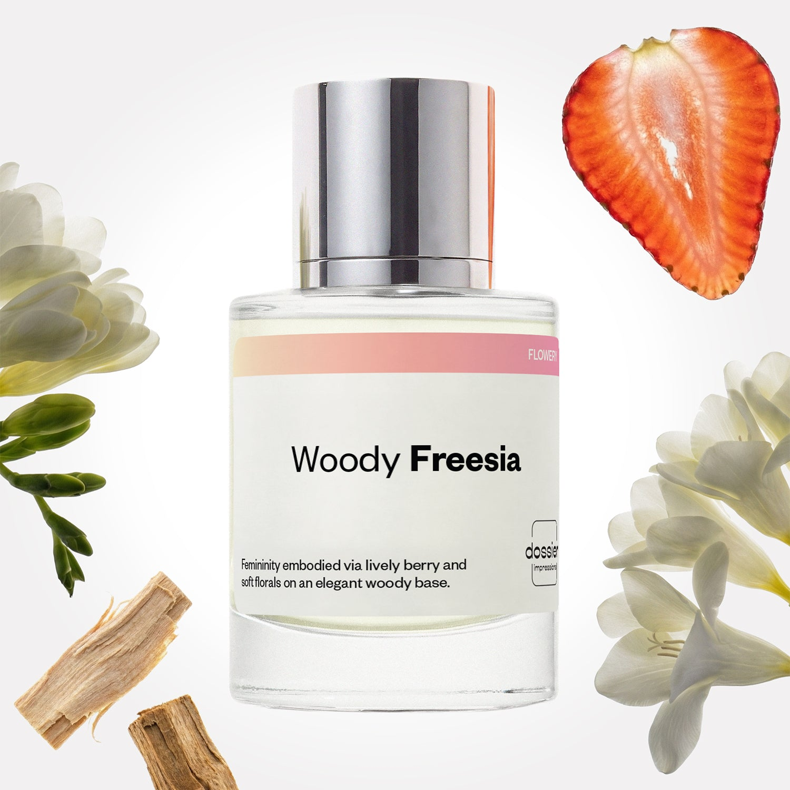

# Woody Freesia

- **Dossier Inspired by Armani's Sì**
- **URL:** https://dossier.co/products/woody-freesia
- **SEO title:** Armani's Sì Dupe Perfume : Woody Freesia - Dossier Perfumes

## Pricing (sizes)

| Size/SKU | Member price | List price | Currency |
|---|---|---|---|
| DI50WFRUS | 28.8 | 32 | USD |

## Content (scent notes, about, editorial)

Back Home / Perfumes / Dossier Impressions / WOODY FREESIA 

Women 

Woody Freesia

Eau de Parfum. Size: 50ml / 1.7oz 

members: $28.80

Guest:
$32

Inspired by Giorgio Armani's Sì Inspired by Giorgio Armani's Sì 
Inspired by Giorgio Armani's Sì 

Retail price 135 Crafted in France 
Scent Family: flowery 

Add to Cart 

Scent Notes This perfume is: Delectable strawberry candy 
Main Notes:

Freesia

Strawberry

Patchouli

Vanilla

Blond Woods

Musks

top: The first notes you smell 
Freesia, Blackcurrant, Strawberry 
middle: The heart of the perfume 
Rose, Jasmine, Peach 
base: The notes that linger all day 
Patchouli, Vanilla, Blond Woods, Musk 
ingredients: Alcohol, Water, Parfum/Perfume, Amyl Cinnamal, Hexyl Cinnamal, alpha-iso-Methylionone, Benzyl alcohol, Benzyl Benzoate, Benzyl Salicylate,
Cinnamaldehyde, Cinnamyl alcohol, Citral, Citronellol, Limonene, Eugenol, Farnesol, Geraniol, Hydroxycitronellal, Linalool. 

Vegan
Cruelty-free

Clean ingredients

About Woody Freesia (inspired by Armani's Sì) opening is a lively cocktail of berries melted with a delicate floral blend of freesias and fresh roses. 

On this soft and joyful alliance develops progressively a highly sophisticated woody structure.

Woody Freesia (our impression of Armani's Sì) is an ode to a playful femininity, combining a sensitive keenness with a strong and positive inner strength.

Scent Intensity: Significant 

Concentration: 15%

Gender: Feminine 

Shipping
Free shipping with 2+ items. 

Standard Shipping (with 2+ items) Auto-selected with 2+ items 
FREE 

Standard Shipping Auto-selected under 2 items 
$3.95 

Express shipping: 2 business days Select in checkout 
$19.00 

Returns
Free exchanges for all. Free returns with 

Exchanges
Free exchange, 1 time per order for all.

Returns
D+ members get 1 FREE return per order.
Non-members incur a $3.99/bottle return fee, 1 time per order.
Returns must be postmarked within 30 days of the initial order. Learn More 

FAQs Are these fragrances long lasting? They are designed to be very long lasting, just like designer fragrances, in some cases even longer, depending on the composition. 
When does the new packaging come out? We'll begin rolling out our new packaging across the U.S. and international markets soon! If you want to shop IRL - our new packaging first hits stores on January 11, 2026 at Walmart. Please note that if you are shopping online, you may receive a combination of our current and new packaging while we transition our inventory. 
How will I know what scent I like? We get it, shopping for perfumes online is hard! That's why we created a scent quiz, which will find the perfect scent for you Take the quiz (opens in new tab) 
Unsure about something? Ask us! help@dossier.co 

Details We are not associated or affiliated with the brands mentioned here in any way.
Woody Freesia

Refined elegance

Teeming with sophistication and intoxicating appeal, Armani Si perfume (the fragrance that Dossier’s Woody Freesia is inspired by) is what you wear to command the attention of everyone in the room. It combines some of the most audacious floral notes into a fragrance that rekindles the olfactories a thousand times over – and one that catapults you to the lush divine gardens of Mount Olympus. 
Ambitious and bold, this perfume is a unique take on beauty and luxury. It is a luscious chypre fruity fragrance that exudes opulence and extravagance. One smell can leave you in a trance – one that involves fruity blackcurrant top tones rolling out the red carpet for vanilla and patchouli base notes to deliver a scent as fresh as a winter’s morning.

The luxury brand has since released other gorgeous fragrances that mirror the style of the luxury fragrance that Woody Freesia is inspired by; one such fragrance is Armani Si Passione, which projects a seductive air of elegance with added notes of spicy pink pepper and freshly picked pear. It radiates classy boldness and decisiveness.

Coming in 2021, the latest addition to the range is Armani Si Intense, a beautiful floral that exudes feminine power. Floral rose top tones complement the oriental warmth of patchouli and vanilla to create an aura of seduction, sensuality, and class. Bottled in a bold shade of orange, this fragrance brings out the warrior aspect of a woman while acknowledging her princess side.

If you desire a scent of elegance and sophistication but want to spend less, Dossier’s Woody Freesia is the perfume for you. Our Armani Si dupe is a sophisticated blend of elegance and grace. It is a cocktail of freesias and fresh roses perfecting each other to create an air of seduction and love. The feeling you get here is akin to taking a stroll in a dreamy palace garden. Discover delicious fruity top notes woven into sensual undertones – hints of soft rose petals that land delicately on your nose to transport you to the great outdoors. If you’re looking to unlock perks of sensitive keenness and positive inner strength, Woody Freesia is the best choice.

You Might Love 

4.4 

Rated 4.4 out of 5 stars 

Based on 702 reviews 

Reviews 702 (tab expanded) Questions 2 (tab collapsed) 

Filters 
Write a Review (Opens in a new window) 

702 reviews 
Sort Highest Rating Most Helpful Photos & Videos Most Recent Oldest Lowest Rating Least Helpful 

J 

Jeanette 

6/10/26 

Rated 5 out of 5 stars 

5 Stars
Exceeded my expectations!

Read More Read more about this review 

Was this helpful? Yes, this review from Jeanette was helpful. 0 people voted yes No, this review from Jeanette was not helpful. 0 people voted no 

JB 

Jennifer B. 
Verified Buyer 

6/8/26 

Rated 5 out of 5 stars 

Smells Just Like It!
I love it!

Read More Read more about this review 

Was this helpful? Yes, this review from Jennifer B. was helpful. 0 people voted yes No, this review from Jennifer B. was not helpful. 0 people voted no 

DP 

Dossier Perfumes 
6/8/26 
Jennifer, we’re so happy you’re loving it and wearing it with joy! 😊

KR 

Kailene R. F. d. S. 
Verified Buyer 

5/31/26 

Rated 5 out of 5 stars 

Sample
I did not got my free sample .

Read More Read more about this review 

Was this helpful? Yes, this review from Kailene R. F. d. S. was helpful. 0 people voted yes No, this review from Kailene R. F. d. S. was not helpful. 0 people voted no 

DP 

Dossier Perfumes 
6/2/26 
We appreciate the 5 stars, Kailene! Hit us up anytime to look into your order.

CH 

Carolina H. 
Verified Buyer 

5/27/26 

Rated 5 out of 5 stars 

My 3rd one 
Love it!!!!

Read More Read more about this review 

Was this helpful? Yes, this review from Carolina H. was helpful. 0 people voted yes No, this review from Carolina H. was not helpful. 0 people voted no 

DP 

Dossier Perfumes 
5/27/26 
Carolina, we’re over the moon you love it! Thanks for grabbing it three times 😊

Y 

Yasmine 

5/3/26 

Rated 5 out of 5 stars 

5 Stars
Smells amazing and shipped so fast

Read More Read more about this review 

Was this helpful? Yes, this review from Yasmine was helpful. 0 people voted yes No, this review from Yasmine was not helpful. 0 people voted no 

Loading... 

Loading... 

Show More 

Inspired by  Baccarat Rouge 540 
Inspired by  Black Opium 
Inspired by  Love, Don't Be Shy 
Inspired by  Good Girl 
Inspired by  Libre 
Inspired by  Flowerbomb 
Inspired by  Light Blue 
Inspired by  Not a Perfume 
Inspired by  Aventus 
Inspired by  Bleu de Chanel 
Inspired by  Mon Paris 
Inspired by  Coco Mademoiselle 
Inspired by  Tom Ford for Men 
Inspired by  For Her 
Inspired by  J'Adore Dior 
Inspired by  Alien 
Inspired by  Black Opium Perfume 
Inspired by  Lost Cherry Perfume 

GET UP TO 30% OFF 

Find us at these retailers. 

Be the first to know. 
Submit 

Shop the following countries. United States 

Discover.
AI Scent Finder 
Blog (opens in new tab) 
Scent Family 
Layering 
Scent Quiz 

Help.
Contact Us 
Returns 
FAQ 
Testimonials 
Accessibility 

More.
Store Locator 
Boutique 
Refer A Friend 
Index 

Download our app now.

Find us at these retailers. 

Be the first to know. 
Submit 

Shop the following countries. United States 

Discover.
AI Scent Finder 
Blog (opens in new tab) 
Scent Family 
Layering 
Scent Quiz 

Help.
Contact Us 
Returns 
FAQ 
Testimonials 
Accessibility 

More.

## Main Image

