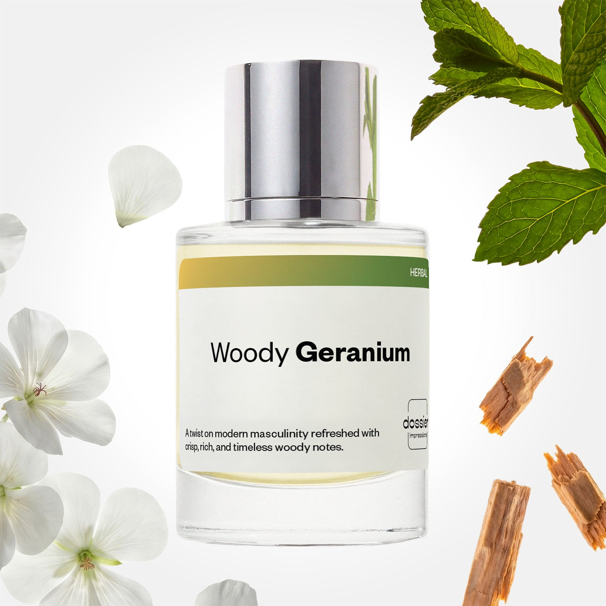

# Woody Geranium

- **Dossier Inspired by Montblanc's Legend**
- **URL:** https://dossier.co/products/woody-geranium
- **SEO title:** Montblanc's Legend Dupe Perfume: Woody Geranium - Dossier Perfumes

## Pricing (sizes)

| Size/SKU | Member price | List price | Currency |
|---|---|---|---|
| DI50WGEUS | 26.1 | 29 | USD |
| DOSWA50WGE | 26.1 | 29 | USD |

## Content (scent notes, about, editorial)

Back Home / Perfumes / Dossier Impressions / WOODY GERANIUM 

Men 

Woody Geranium

Eau de Toilette. Size: 50ml / 1.7oz 

members: $26.10

Guest:
$29

Inspired by Montblanc's Legend Inspired by Montblanc's Legend 
Inspired by Montblanc's Legend 

Retail price 80 Crafted in France 
Scent Family: herbal 

Add to Cart 

Scent Notes This perfume is: A modern twist on masculinity 
Main Notes:

Mint

Geranium

Cedarwood

top: The first notes you smell 
Mint, Red Apple, Pineapple 
middle: The heart of the perfume 
Geranium, Lavender 
base: The notes that linger all day 
Sandalwood , Cedarwood, Tonka Bean 
ingredients: Alcohol, Water, Parfum/Perfume, Citral, Coumarin, Citronellol, Limonene, Geraniol, Linalool. 

Vegan
Cruelty-free

Clean ingredients

About Woody Geranium (inspired by Montblanc's Legend) subtly flirts between refined woods and a very classic masculine structure named "Fougere" (a blend of citrus notes, lavender, geranium, and patchouli). This balanced fragrance opens with a burst of fresh green apple, mint, and an unexpected touch of pineapple.

Masculine, and modern yet timeless, Woody Geranium (our impression of Montblanc's Legend) offers an alliance between authenticity and innovation.

Scent Intensity: Significant 

Concentration: 15%

Gender: Masculine 

Shipping
Free shipping with 2+ items. 

Standard Shipping (with 2+ items) Auto-selected with 2+ items 
FREE 

Standard Shipping Auto-selected under 2 items 
$3.95 

Express shipping: 2 business days Select in checkout 
$19.00 

Returns
Free exchanges for all. Free returns with 

Exchanges
Free exchange, 1 time per order for all.

Returns
D+ members get 1 FREE return per order.
Non-members incur a $3.99/bottle return fee, 1 time per order.
Returns must be postmarked within 30 days of the initial order. Learn More 

FAQs Are these fragrances long lasting? They are designed to be very long lasting, just like designer fragrances, in some cases even longer, depending on the composition. 
When does the new packaging come out? We'll begin rolling out our new packaging across the U.S. and international markets soon! If you want to shop IRL - our new packaging first hits stores on January 11, 2026 at Walmart. Please note that if you are shopping online, you may receive a combination of our current and new packaging while we transition our inventory. 
How will I know what scent I like? We get it, shopping for perfumes online is hard! That's why we created a scent quiz, which will find the perfect scent for you Take the quiz (opens in new tab) 
Unsure about something? Ask us! help@dossier.co 

Details We are not associated or affiliated with the brands mentioned here in any way.
Woody Geranium

A Quality Alternative to a Luxury Cologne

Montblanc’s Legend (the fragrance that Dossier’s Woody Geranium is inspired by) is a best-selling, groundbreaking, special cologne that captures the modern gentleman. Aromatic scents of lavender, pineapple, and lemons are followed seamlessly by red apples and oakmoss. Sandalwood and tonka bean combine to round off this scent, adding great depth (but never dominating) in the process. All in all, the luxury fragrance that Woody Geranium is inspired by smells refreshing and is one of the most appealing masculine fragrances we’ve ever come across. Whether you need it for a night out or a productive morning meeting, the luxury fragrance that Woody Geranium is inspired by won’t disappoint.

Closely following this perfume is the equally notable, albeit more androgynous Montblanc Legend Spirit Eau de Toilette. This EDT retains the fruity characteristics of the original but forgoes the mellow opening for something much sharper. A large part of this is due to the inclusion of grapefruit and bergamot, lightly dipped in pink pepper. Middle notes of cardamom and lavender flow into a smooth white musk, signaling the end of this woody scent. As a whole, the EDT oozes timeless charisma, with a sense of reluctance towards making gender distinctions. It’s the epitome of confidence, beauty, and elegance — more than enough to make you feel like a man who’s comfortable in his own skin.

Next, Montblanc’s Legend Night is a warmer and more sensual version of the original EDT. With warm notes of vanilla, mint, and lavender, this woody aromatic cologne strikes a delicate balance between the original EDT’s bright headnotes and its woody base notes. This is a comforting, cozy scent and, as the name so aptly suggests, perfect for a night out with loved ones or a loved one .

Sometimes the best things in life take a while to manifest. Montblanc’s Legend Red is a testament to that. Launched in 2022, this is the brand’s newest fragrance for men. This fragrance’s intense aromatics serve to boost your confidence and help you embrace who you are. Meanwhile, the color red itself symbolizes the depth and variety of emotions inherent in a self-assured man. It’s a very citrusy-woody concoction, with strong notes of cedar accompanied by bright juniper and clary sage. Despite the intriguing note combination, the fragrance is not overpowering and makes for an excellent addition to the line of fragrances from the brand.

For an almost similar, bold contemporary feel found in these fabulous fragrances, find some inspiration in Dossier’s very own Woody Coriander. If you’re looking to make a statement, this is the fragrance for you. This high-quality dupe is stylish and irresistibly masculine, leaving a trail of warmth and sensuality that will turn heads wherever you go.

You Might Love 

4.3 

Rated 4.3 out of 5 stars 

Based on 292 reviews 

Reviews 292 (tab expanded) Questions (tab collapsed) 

Filters 
Write a Review (Opens in a new window) 

292 reviews 
Sort Highest Rating Most Helpful Photos & Videos Most Recent Oldest Lowest Rating Least Helpful 

JS 

juan s. 
Verified Buyer 

6/4/26 

Rated 5 out of 5 stars 

Great smell for men and also try lost Americana 
I've even sold 2 bottles at 45 bucks and I got them on a flash sale and I also have got the lost Americana and Ive sold 3 of the as well for 45 bucks

Read More Read more about this review 

Was this helpful? Yes, this review from juan s. was helpful. 0 people voted yes No, this review from juan s. was not helpful. 0 people voted no 

DP 

Dossier Perfumes 
6/4/26 
Juan that is awesome to hear! Scoring a flash sale and turning it into a side hustle, love it. Glad Lost Americana was crowd pleaser. Keep spreading those scent vibes!

KB 

Kathy B. 
Verified Buyer 

4/26/26 

Rated 5 out of 5 stars 

Smells amazing 
Smells amazing 

Read More Read more about this review 

Was this helpful? Yes, this review from Kathy B. was helpful. 0 people voted yes No, this review from Kathy B. was not helpful. 0 people voted no 

DP 

Dossier Perfumes 
4/26/26 
Woo! Happy to hear you love how it smells! Thanks Kathy 🙌

DM 

Deborah M. 
Verified Buyer 

4/22/26 

Rated 5 out of 5 stars 

Excellent Fragrance!
My husband has used ***** Geranium for several years (inspired by Mont Blanc). He has been very satisfied with the scent and we’re both pleased with the price!

Read More Read more about this review 

Was this helpful? Yes, this review from Deborah M. was helpful. 0 people voted yes No, this review from Deborah M. was not helpful. 0 people voted no 

DP 

Dossier Perfumes 
4/22/26 
Deborah, we’re thrilled to hear he’s enjoyed that scent for years and that it’s been so budget-friendly. Thanks for sharing this – here’s to more happy spritzes!

M 

Misael 

4/19/26 

Rated 5 out of 5 stars 

5 Stars
I’m really impressed with the fragrances I purchased from Dossier. The scents are high quality, smell very close to the originals, and perform much better than I expected for the price. They last a good amount of time on my skin and have a nice, noticeable projection without being overpowering.
Overall, great value for the money and a solid option if you want luxury-inspired fragrances without spending a fortune. I’ll definitely be buying mor

Read More Read more about this review 

Was this helpful? Yes, this review from Misael was helpful. 0 people voted yes No, this review from Misael was not helpful. 0 people voted no 

WL 

Willie L. J. 
Verified Buyer 

4/10/26 

Rated 5 out of 5 stars 

Awesome 
Smells great

Read More Read more about this review 

Was this helpful? Yes, this review from Willie L. J. was helpful. 0 people voted yes No, this review from Willie L. J. was not helpful. 0 people voted no 

DP 

Dossier Perfumes 
4/10/26 
Willie, thanks for the shout-out! So happy you’re loving it 🙌

Loading... 

Loading... 

Show More 

Inspired by  Baccarat Rouge 540 
Inspired by  Black Opium 
Inspired by  Love, Don't Be Shy 
Inspired by  Good Girl 
Inspired by  Libre 
Inspired by  Flowerbomb 
Inspired by  Light Blue 
Inspired by  Not a Perfume 
Inspired by  Aventus 
Inspired by  Bleu de Chanel 
Inspired by  Mon Paris 
Inspired by  Coco Mademoiselle 
Inspired by  Tom Ford for Men 
Inspired by  For Her 
Inspired by  J'Adore Dior 
Inspired by  Alien 
Inspired by  Black Opium Perfume 
Inspired by  Lost Cherry Perfume 

GET UP TO 30% OFF 

Find us at these retailers. 

Be the first to know. 
Submit 

Shop the following countries. United States 

Discover.
AI Scent Finder 
Blog (opens in new tab) 
Scent Family 
Layering 
Scent Quiz 

Help.
Contact Us 
Returns 
FAQ 
Testimonials 
Accessibility 

More.
Store Locator 
Boutique 
Refer A Friend 
Index 

Download our app now.

Find us at these retailers. 

Be the first to know. 
Submit 

Shop the following countries. United States 

Discover.
AI Scent Finder 
Blog (opens in new tab) 
Scent Family 
Layering 
Scent Quiz 

Help.
Contact Us 
Returns 
FAQ 
Testimonials 
Accessibility 

More.

## Main Image

