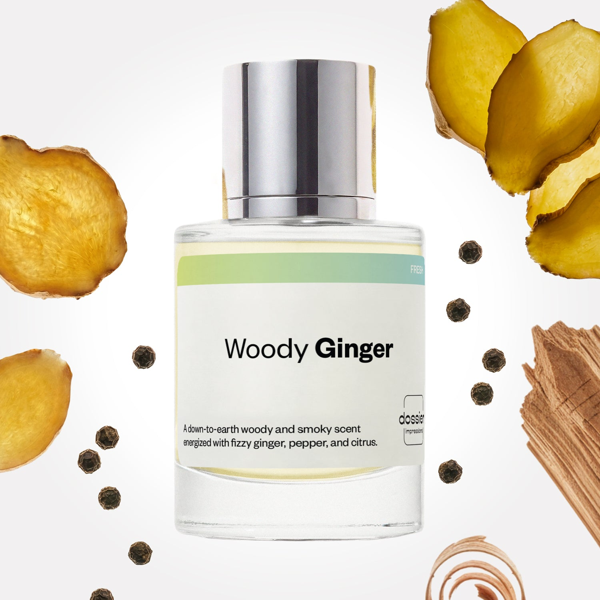

# Woody Ginger

- **Dossier Inspired by Tom Ford's Tom Ford for Men**
- **URL:** https://dossier.co/products/woody-ginger
- **SEO title:** Tom Ford for Men Dupe Perfume: Woody Ginger - Dossier Perfumes

## Pricing (sizes)

| Size/SKU | Member price | List price | Currency |
|---|---|---|---|
| DI50WGIUS | 28.8 | 32 | USD |

## Content (scent notes, about, editorial)

Back Home / Perfumes / Dossier Impressions / WOODY GINGER 

Men 

Woody Ginger

Eau de Toilette. Size: 50ml / 1.7oz 

members: $28.80

Guest:
$32

Inspired by Tom Ford's Tom Ford for Men Inspired by Tom Ford's Tom Ford for Men 
Inspired by Tom Ford's Tom Ford for Men 

Retail price 110 Crafted in France 
Scent Family: fresh 

Add to Cart 

Scent Notes This perfume is: Earthy, yet full of vibrance 
Main Notes:

Ginger

Lemon

Bergamot

Pepper

Cedarwood

top: The first notes you smell 
Ginger, Lemon, Bergamot, Pepper 
middle: The heart of the perfume 
Orange Blossom, Violet Leaves, Cypriol 
base: The notes that linger all day 
Patchouli, Amber, Cedarwood, Tobacco 
ingredients: Alcohol, Water, Parfum/Perfume, alpha-iso-Methylionone, Benzyl alcohol, Benzyl Benzoate, Benzyl Cinnamate, Benzyl Salicylate, Cinnamaldehyde,
Cinnamyl alcohol, Citral, Coumarin, Citronellol, Limonene, Eugenol, Farnesol, Geraniol, Hydroxycitronellal, Isoeugenol, Linalool. 

Vegan
Cruelty-free

Clean ingredients

About Woody Ginger (inspired by Tom Ford's Tom Ford for Men) opens with a fizzy ginger and pepper duet, progressively softening with violet and orange blossoms. However, the key personality of the fragrance is all about the woods. Most prominently, cedarwood is enhanced by tobacco and patchouli, and then reinforced by the earthy accent of cypriol roots, an Indian plant used to perfume traditional clothes.

Woody Ginger (our impression of Tom Ford's Tom Ford for Men) is a refined and assertive masculine fragrance, bringing together ingredients with a strong personality in an innovative composition that is all about harmony.

Scent Intensity: Significant 

Concentration: 15%

Gender: Masculine 

Shipping
Free shipping with 2+ items. 

Standard Shipping (with 2+ items) Auto-selected with 2+ items 
FREE 

Standard Shipping Auto-selected under 2 items 
$3.95 

Express shipping: 2 business days Select in checkout 
$19.00 

Returns
Free exchanges for all. Free returns with 

Exchanges
Free exchange, 1 time per order for all.

Returns
D+ members get 1 FREE return per order.
Non-members incur a $3.99/bottle return fee, 1 time per order.
Returns must be postmarked within 30 days of the initial order. Learn More 

FAQs Are these fragrances long lasting? They are designed to be very long lasting, just like designer fragrances, in some cases even longer, depending on the composition. 
When does the new packaging come out? We'll begin rolling out our new packaging across the U.S. and international markets soon! If you want to shop IRL - our new packaging first hits stores on January 11, 2026 at Walmart. Please note that if you are shopping online, you may receive a combination of our current and new packaging while we transition our inventory. 
How will I know what scent I like? We get it, shopping for perfumes online is hard! That's why we created a scent quiz, which will find the perfect scent for you Take the quiz (opens in new tab) 
Unsure about something? Ask us! help@dossier.co 

Details We are not associated or affiliated with the brands mentioned here in any way.
Woody Ginger

Join the table of men 

It’s safe to say that an all-time favorite best-selling fragrance like this one with several celebrity endorsements needs no introduction. The 2007 Tom Ford Cologne For Men (the luxury fragrance that Dossier’s Woody Ginger is inspired by) is a timeless fragrance that exudes beautiful tranquility and spiritual elegance. It gives off a musk, woody floral scent that translates you to the pristine palm islands of the Caribbean and back. 

An addictively fresh blend of ginger, bergamot, mandarin orange, lemon leaf oil, basil, and violet leaf, the scent comforts the spirit and enlivens the soul. It preps you to take on whatever you’ve got going on with its exquisitely calm yet luxurious aura. So, whether it’s for business or pleasure, the luxury fragrance that Woody Ginger is inspired by rises to the occasion each time, delivering a perfect introduction and communicating just the right message. It leverages its tangy, crispy, and zesty opening to conjure up a profound spiritual serenity and heightened luxury. 

As for duration, the cologne has just the right note concentrations to deliver a long-lasting and impactful fragrance – all day long and all night long. It is a pure, unadulterated elixir that provides an intense, seemingly unending experience – an experience that makes you reconsider all you thought you knew about class. 

As if that was not enough, the Tom Ford Cologne For Men boasts two extra pluses: the bottle and the packaging. Their bold color nearly parallels the steady course of the sun as it sets across the horizon. 

Research has it that fragrance can have a profound and enduring influence on our memories and emotions. And that’s why a classic scent such as this should always be on hand, living the moment with you. If you’re looking to build a wardrobe of olfactory favorite fragrances, don’t neglect to add the Tom Ford Cologne For Men. Because omitting it would leave your wardrobe woefully lacking. 

If you earnestly desire the Tom Ford Cologne For Men but are on a tight budget, Dossier’s Woody Ginger is your answer. With notes that include lemon leaf oil, basil, bergamot, mandarin orange, and violet leaf, our replica possesses a scent that conjures a fizzy cocktail, served over ice and twisted with a dash of rose petal. It is a strikingly fresh scent that can make your special occasions extra special. Fans of this legendary fragrance will easily know when anybody is wearing it – and right from the first spray, the scent lingers dependably on the skin for hours on end. 

Best Layered With Combine 2 of our perfumes to create a third scent with layering, curated by our nose. Learn more 

You Might Love 

4.3 

Rated 4.3 out of 5 stars 

Based on 437 reviews 

Reviews 437 (tab expanded) Questions (tab collapsed) 

Filters 
Write a Review (Opens in a new window) 

437 reviews 
Sort Highest Rating Most Helpful Photos & Videos Most Recent Oldest Lowest Rating Least Helpful 

RM 

Rosa M. A. 
Verified Buyer 

6/22/26 

Rated 5 out of 5 stars 

Smells great! 
Last long, smells great rlly recommend 

Read More Read more about this review 

Was this helpful? Yes, this review from Rosa M. A. was helpful. 0 people voted yes No, this review from Rosa M. A. was not helpful. 0 people voted no 

DP 

Dossier Perfumes 
6/22/26 
So glad Woody Ginger lasts on you, Rosa! Thanks for the rec 😊

PK 

Priya K. 

Verified Buyer 

12/18/25 

Rated 5 out of 5 stars 

Really good
My dad liked the fragrance. It will be great if the concentration is increased a bit so it stays longer.

Read More Read more about this review 

Was this helpful? Yes, this review from Priya K. was helpful. 0 people voted yes No, this review from Priya K. was not helpful. 0 people voted no 

DP 

Dossier Perfumes 
12/18/25 
Priya, thanks much! We’re glad your dad enjoyed it. For extra longevity, try layering or a spritz in warmer spots.

G 

Grace 
Verified Buyer 

12/8/25 

Rated 5 out of 5 stars 

5 Stars
Husband really likes this sent!

Read More Read more about this review 

Was this helpful? Yes, this review from Grace was helpful. 0 people voted yes No, this review from Grace was not helpful. 0 people voted no 

DP 

Dossier Perfumes 
12/10/25 
Grace, we’re thrilled your husband loves it! Thanks for sharing 😊

G 

Grace 

12/8/25 

Rated 5 out of 5 stars 

5 Stars
Husband really likes this sent!

Read More Read more about this review 

Was this helpful? Yes, this review from Grace was helpful. 0 people voted yes No, this review from Grace was not helpful. 0 people voted no 

A 

Alberta 
Verified Buyer 

12/1/25 

Rated 5 out of 5 stars 

5 Stars
Great, lasting fragrance

Read More Read more about this review 

Was this helpful? Yes, this review from Alberta was helpful. 0 people voted yes No, this review from Alberta was not helpful. 0 people voted no 

DP 

Dossier Perfumes 
12/10/25 
Hey Alberta, love hearing it lasts on you! Thanks for sharing your thoughts 😊

Loading... 

Loading... 

Show More 

Inspired by  Baccarat Rouge 540 
Inspired by  Black Opium 
Inspired by  Love, Don't Be Shy 
Inspired by  Good Girl 
Inspired by  Libre 
Inspired by  Flowerbomb 
Inspired by  Light Blue 
Inspired by  Not a Perfume 
Inspired by  Aventus 
Inspired by  Bleu de Chanel 
Inspired by  Mon Paris 
Inspired by  Coco Mademoiselle 
Inspired by  Tom Ford for Men 
Inspired by  For Her 
Inspired by  J'Adore Dior 
Inspired by  Alien 
Inspired by  Black Opium Perfume 
Inspired by  Lost Cherry Perfume 

GET UP TO 30% OFF 

Find us at these retailers. 

Be the first to know. 
Submit 

Shop the following countries. United States 

Discover.
AI Scent Finder 
Blog (opens in new tab) 
Scent Family 
Layering 
Scent Quiz 

Help.
Contact Us 
Returns 
FAQ 
Testimonials 
Accessibility 

More.
Store Locator 
Boutique 
Refer A Friend 
Index 

Download our app now.

Find us at these retailers. 

Be the first to know. 
Submit 

Shop the following countries. United States 

Discover.
AI Scent Finder 
Blog (opens in new tab) 
Scent Family 
Layering 
Scent Quiz 

Help.
Contact Us 
Returns 
FAQ 
Testimonials 
Accessibility 

More.

## Main Image

