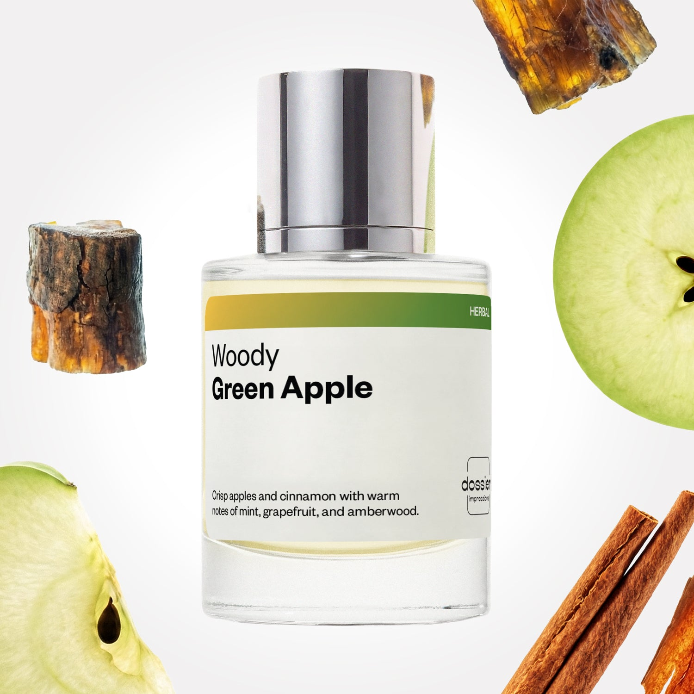

# Woody Green Apple

- **Dossier Inspired by Paco Rabanne's One Million**
- **URL:** https://dossier.co/products/woody-green-apple
- **SEO title:** One Million by Paco Rabanne Dupe Perfume: Woody Green Apple - Dossier Perfumes

## Pricing (sizes)

| Size/SKU | Member price | List price | Currency |
|---|---|---|---|
| DI50WGAUS | 26.1 | 29 | USD |
| DOSWA50WGA | 26.1 | 29 | USD |

## Content (scent notes, about, editorial)

Back Home / Perfumes / Dossier Impressions / WOODY GREEN APPLE 

Men 

Woody Green Apple

Eau de Parfum. Size: 50ml / 1.7oz 

members: $26.10

Guest:
$29

Inspired by Paco Rabanne's One Million Inspired by Paco Rabanne's One Million 
Inspired by Paco Rabanne's One Million 

Retail price 122 Crafted in France 
Scent Family: herbal 

Add to Cart 

Scent Notes This perfume is: Crisp with dash of cinnamon 
Main Notes:

Green Apple

Grapefruit

Mint

Cinnamon

Amberwood

top: The first notes you smell 
Green Apple, Grapefruit, Mint 
middle: The heart of the perfume 
Lavender, Rose, Cinnamon 
base: The notes that linger all day 
Cedarwood, Patchouli, Amberwood 
ingredients: Alcohol, Water, Parfum/Perfume, alpha-iso-Methylionone, Benzyl alcohol, Benzyl Benzoate, Cinnamaldehyde, Citral, Coumarin, Citronellol, Limonene, Eugenol, Farnesol, Geraniol, Hydroxycitronellal, Isoeugenol, Linalool. 

Vegan
Cruelty-free

Clean ingredients

About Woody Green Apple opens on a colorful combination of hot cinnamon, fresh apple, mint, and grapefruit. Then, the fragrance evolves towards a warm, rich, woody, and ambery background, with a subtle grooming effect.

Masculine, warm, and crisp, Woody Green Apple is a fragrance full of harmoniously combined contrasts, making it refined yet relaxed, sensuous yet playful: a perfect smell for men of character.

Scent Intensity: Statement 

Concentration: 12%

Gender: Masculine 

Shipping
Free shipping with 2+ items. 

Standard Shipping (with 2+ items) Auto-selected with 2+ items 
FREE 

Standard Shipping Auto-selected under 2 items 
$3.95 

Express shipping: 2 business days Select in checkout 
$19.00 

Returns
Free exchanges for all. Free returns with 

Exchanges
Free exchange, 1 time per order for all.

Returns
D+ members get 1 FREE return per order.
Non-members incur a $3.99/bottle return fee, 1 time per order.
Returns must be postmarked within 30 days of the initial order. Learn More 

FAQs Are these fragrances long lasting? They are designed to be very long lasting, just like designer fragrances, in some cases even longer, depending on the composition. 
When does the new packaging come out? We'll begin rolling out our new packaging across the U.S. and international markets soon! If you want to shop IRL - our new packaging first hits stores on January 11, 2026 at Walmart. Please note that if you are shopping online, you may receive a combination of our current and new packaging while we transition our inventory. 
How will I know what scent I like? We get it, shopping for perfumes online is hard! That's why we created a scent quiz, which will find the perfect scent for you Take the quiz (opens in new tab) 
Unsure about something? Ask us! help@dossier.co 

Details We are not associated or affiliated with the brands mentioned here in any way.
Woody Green Apple

Sate your wildest dreams and fantasies of elegance and luxury

Redefining the scent of lavish expense and opulent luxury, Paco Rabanne’s One Million (the fragrance that Dossier’s Woody Green Apple is inspired by) main ambition is quite literally in the name – to make any man feel like one million dollars. An exquisitely deep fragrance, radiating warmth and self-assurance, the luxury fragrance for men that Woody Green Apple is inspired by resembles the leathery scent of extravagant novelty and grandeur in excess – a ride in a brand-new classic Rolls Royce, dripping with comfort and spice. Released in 2008, the luxury fragrance that Woody Green Apple is inspired by is for a taste of the riches.

A smooth blend of woody spice, sprinkled with a fusion of zesty fruit, the luxury fragrance that Woody Green Apple is inspired by confidently attracts the attention of any woman walking by. Opening with a tangy cocktail of blood mandarin, bitter grapefruit and distinct notes of mint, a wintery scene is crafted of acidic aromas brushed neatly with fresh piquant leaves. These are a complement to the brazen middle notes that radiate warmth and masculine energy in bold rays of cinnamon and spicy notes. To leave a lingering presence, these middle notes have been finely laced with the woody base notes – a lavish array of deep amber, spicy leather and Indian patchouli to scintillate the senses and request discovery.

Any man wearing the luxury fragrance that Woody Green Apple is inspired by will feel the dreams of dazzling car and house with sleek Hollywood couture. This breath-taking fragrance is a banquet of lusciousness that oozes splendor, without holding back.

Seeing its design boasts its lavish scent prior to even being worn, Paco Rabanne’s One Million drips in effusive gold, the bottle emulating a luxurious gold bar, with a calligraphic font of its name forged on the front. You will certainly know that this fragrance isn’t one to shy away from grandiosity and magnificence at its finest.

You can find the signature Paco Rabanne One Million parfum in many online retailers, such as Macys and Ulta, as well as its official online store. Find this fragrance in 3 sizes (50 ml, 100 ml and 200 ml) going for $66.00, $91.00 and $129.00 each. Or, if you prefer a longer lasting, more intense experience, the best-selling elixir costs $80.00, $110.00 and $155.00, in the same sizes. Alternatively, treat loved ones to the gift set, which includes the aftershave, Eau de Toilette and a travel rollerball that comes in 2 sizes, either 50 ml with for $66.00 or $99.00.

Alternatively, to experience the essence of lavish luxury and refined exquisiteness for a cheaper price point, shop for Dossier’s Woody Green Apple to pleasurably satisfy the senses. Our Paco Rabanne One Million dupe is a splashy mix of warm base notes – hot cinnamon and deep amber, balanced perfectly with vibrant top notes of playful apple, mint and fresh grapefruit to embody a charismatic air of excellence and assurance. We designed our Woody Green Apple to provide a kaleidoscopic mix of opulent warmth and refreshing fruits – a treat of masculine warmth and energy, with a dose of confidence and grandeur.

You Might Love 

4.6 

Rated 4.6 out of 5 stars 

Based on 515 reviews 

Reviews 515 (tab expanded) Questions 3 (tab collapsed) 

Filters 
Write a Review (Opens in a new window) 

515 reviews 
Sort Highest Rating Most Helpful Photos & Videos Most Recent Oldest Lowest Rating Least Helpful 

R 

Robbie 

6/23/26 

Rated 5 out of 5 stars 

5 Stars
Extremely cozy, and has great performance as well. I haven’t smelled the original fragrance it’s based on, however dossier inspirations are usally very close to the original in my experience.

Read More Read more about this review 

Was this helpful? Yes, this review from Robbie was helpful. 0 people voted yes No, this review from Robbie was not helpful. 0 people voted no 

AE 

Andrea E. 
Verified Buyer 

6/20/26 

Rated 5 out of 5 stars 

Girls can rock this 2 
I bought this for my son and I loved it so much I kept it for my self. It’s defiantly has a strong earthy opening but the dry down is where it’s at. I think this could be a unisex fragrance very easily. 

Read More Read more about this review 

Was this helpful? Yes, this review from Andrea E. was helpful. 0 people voted yes No, this review from Andrea E. was not helpful. 0 people voted no 

DP 

Dossier Perfumes 
6/20/26 
Andrea, we’re thrilled you discovered a new favorite by surprise and that it feels effortlessly unisex. Isn’t the shift from opening to dry down such a magic moment?

SC 

Sam C. 
Verified Buyer 

6/19/26 

Rated 5 out of 5 stars 

I can't believe how much this smells like One Million
This was the first time I've actually owned both the original and the Dossier impression. It smells EXACTLY like Paco Rabanne's One Million (a tiny bit more sweet smelling but I kind of prefer it to be honest). I couldn't believe that I found One Million for just $29, It's basically the same! Adding this one to the rotation.

Read More Read more about this review 

Was this helpful? Yes, this review from Sam C. was helpful. 0 people voted yes No, this review from Sam C. was not helpful. 0 people voted no 

DP 

Dossier Perfumes 
6/19/26 
Sam, we’re thrilled you love those sweet, rich vibes and gave it a permanent spot in your rotation. Happy experimenting as you explore more of our scent collection ✨

J 

Jeanette 

6/17/26 

Rated 5 out of 5 stars 

5 Stars
Amazing by itself or to layer. Long lasting!

Read More Read more about this review 

Was this helpful? Yes, this review from Jeanette was helpful. 0 people voted yes No, this review from Jeanette was not helpful. 0 people voted no 

MJ 

Marlon J. 
Verified Buyer 

6/13/26 

Rated 5 out of 5 stars 

Love it
People in Jamaica 🇯🇲 Love this one a lot 

Read More Read more about this review 

Was this helpful? Yes, this review from Marlon J. was helpful. 0 people voted yes No, this review from Marlon J. was not helpful. 0 people voted no 

DP 

Dossier Perfumes 
6/13/26 
Marlon, that’s awesome to hear Jamaica is loving it! Thanks for sharing 😊

Loading... 

Loading... 

Show More 

Inspired by  Baccarat Rouge 540 
Inspired by  Black Opium 
Inspired by  Love, Don't Be Shy 
Inspired by  Good Girl 
Inspired by  Libre 
Inspired by  Flowerbomb 
Inspired by  Light Blue 
Inspired by  Not a Perfume 
Inspired by  Aventus 
Inspired by  Bleu de Chanel 
Inspired by  Mon Paris 
Inspired by  Coco Mademoiselle 
Inspired by  Tom Ford for Men 
Inspired by  For Her 
Inspired by  J'Adore Dior 
Inspired by  Alien 
Inspired by  Black Opium Perfume 
Inspired by  Lost Cherry Perfume 

GET UP TO 30% OFF 

Find us at these retailers. 

Be the first to know. 
Submit 

Shop the following countries. United States 

Discover.
AI Scent Finder 
Blog (opens in new tab) 
Scent Family 
Layering 
Scent Quiz 

Help.
Contact Us 
Returns 
FAQ 
Testimonials 
Accessibility 

More.
Store Locator 
Boutique 
Refer A Friend 
Index 

Download our app now.

Find us at these retailers. 

Be the first to know. 
Submit 

Shop the following countries. United States 

Discover.
AI Scent Finder 
Blog (opens in new tab) 
Scent Family 
Layering 
Scent Quiz 

Help.
Contact Us 
Returns 
FAQ 
Testimonials 
Accessibility 

More.

## Main Image

