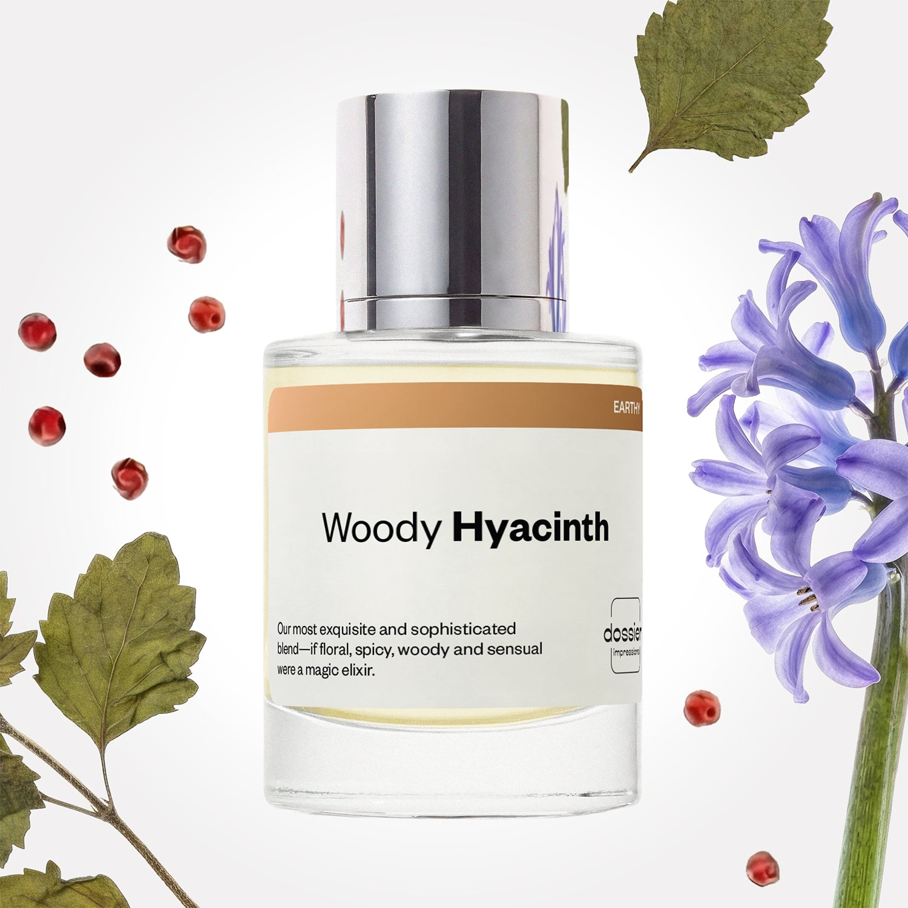

# Woody Hyacinth

- **Dossier Inspired by Chanel's Chance**
- **URL:** https://dossier.co/products/woody-hyacinth
- **SEO title:** Chanel's Chance Dupe Perfume: Woody Hyacinth - Dossier Perfumes

## Pricing (sizes)

| Size/SKU | Member price | List price | Currency |
|---|---|---|---|
| DI50WHUS | 28.8 | 32 | USD |

## Content (scent notes, about, editorial)

Back Home / Perfumes / Dossier Impressions / WOODY HYACINTH 

Women 

Woody Hyacinth

Eau de Parfum. Size: 50ml / 1.7oz 

members: $28.80

Guest:
$32

Inspired by Chanel's Chance Inspired by Chanel's Chance 
Inspired by Chanel's Chance 

Retail price 143 Crafted in France 
Scent Family: earthy 

Add to Cart 

Scent Notes This perfume is: Poise with a youthful twist 
Main Notes:

Hyacinth

Lemon

Pineapple

Patchouli

top: The first notes you smell 
Hyacinth, Lemon, Pineapple 
middle: The heart of the perfume 
Jasmine, Pink Pepper, Patchouli 
base: The notes that linger all day 
Vanilla, Vetiver, Orris 
ingredients: Alcohol, Water, Parfum/Perfume, Amyl Cinnamal, Hexyl Cinnamal, Benzyl alcohol, Benzyl Benzoate, Benzyl Salicylate, Citral, Coumarin, Citronellol, Limonene, Eugenol,
Geraniol, Hydroxycitronellal, Linalool. 

Vegan
Cruelty-free

Clean ingredients

About Woody Hyacinth (inspired by Chanel's Chance) re-vamps one of the most exclusive perfume writing structures: The Chypre. A blend of bergamot, rose, oakmoss, and patchouli, our take on The Chypre plays with new, airy, shimmering raw materials instead of the traditional ones.

Sophisticated, qualitative, and high-end, Woody Hyacinth (our impression of Chanel's Chance) is an ever-changing fragrance, transforming from fresh and floral to spicy and sensual. 

Scent Intensity: Significant 

Concentration: 18%

Gender: Feminine 

Shipping
Free shipping with 2+ items. 

Standard Shipping (with 2+ items) Auto-selected with 2+ items 
FREE 

Standard Shipping Auto-selected under 2 items 
$3.95 

Express shipping: 2 business days Select in checkout 
$19.00 

Returns
Free exchanges for all. Free returns with 

Exchanges
Free exchange, 1 time per order for all.

Returns
D+ members get 1 FREE return per order.
Non-members incur a $3.99/bottle return fee, 1 time per order.
Returns must be postmarked within 30 days of the initial order. Learn More 

FAQs Are these fragrances long lasting? They are designed to be very long lasting, just like designer fragrances, in some cases even longer, depending on the composition. 
When does the new packaging come out? We'll begin rolling out our new packaging across the U.S. and international markets soon! If you want to shop IRL - our new packaging first hits stores on January 11, 2026 at Walmart. Please note that if you are shopping online, you may receive a combination of our current and new packaging while we transition our inventory. 
How will I know what scent I like? We get it, shopping for perfumes online is hard! That's why we created a scent quiz, which will find the perfect scent for you Take the quiz (opens in new tab) 
Unsure about something? Ask us! help@dossier.co 

Details We are not associated or affiliated with the brands mentioned here in any way.
Woody Hyacinth

A Fragrance For The Spirited Woman

Meet the girl who has decided to explore the world on her own. This is a young woman who loves life and reaches for adventure. Impetuous and determined, she is a force to be reckoned with.

Her fragrance of choice? Chance by Chanel.

Chanel Chance (the luxury fragrance that inspired Dossier’s Woody Hyacinth) is a chypré floral fragrance for women, containing sweet notes of jasmine and amber patchouli along with accents of warm spice. Launched in 2002, it’s one of the more prominent fragrances from the House of Chanel. And that’s saying something, considering how many incredible fragrances the house has created over the years. Another superb scent, this one is perfect for any woman who enjoys life, is fearless, and is ready to take on the world. 

The luxury perfume that Woody Hyacinth is inspired by is a sweet aroma with a slightly spicy undertone. Although, we have to admit it was harder to identify the single notes in this one. There’s a lot of harmony in the scent since both the floral and citrus notes complement each other exceptionally well.

The fragrance opens with fresh pink pepper that immediately adds some spiciness to the mix. There’s also a hint of zesty citrus here, although it isn’t all that pronounced. At its heart is a floral scent that contains sensual jasmine notes overlaid with an earthy hyacinth. As the fragrance progresses, white musk, amber patchouli, and vanilla appear, adding a unique depth to its base. Together, these notes blend beautifully, much like the instruments in an orchestra.

The luxury fragrance that Woody Hyacinth is inspired by is a perfume that makes a great fragrance for every occasion. It’s a simple and clean scent, perfect for work or classy events. We’d refrain from calling it a nighttime fragrance, though. This is another one of those light and all-so-dainty perfumes, so when it comes to performance, you don’t have to worry too much about being overwhelmed by its powerful notes. For general use, we recommend three to four sprays.

Several versions of the luxury perfume that Woody Hyacinth is inspired by have been released since the original Eau de Parfum was launched in 2005 with its signature musky patchouli jasmine scent. You can also get the Eau de Toilette, a lighter interpretation of the original.

Dossier’s Woody Hyacinth is a dupe that hits a lot of the same beats, but for a much lower price. Woody Hyacinth is a versatile fragrance that can be at the same time fresh and floral; spicy and sensual. With notes of bergamot, rose, oakmoss, and patchouli, our replica of Chanel Chance opens with a pleasant citrus aroma before settling down with the slightly musky qualities of the original. 

You Might Love 

4.3 

Rated 4.3 out of 5 stars 

Based on 1,164 reviews 

Reviews 1,164 (tab expanded) Questions 3 (tab collapsed) 

Filters 
Write a Review (Opens in a new window) 

1,164 reviews 
Sort Highest Rating Most Helpful Photos & Videos Most Recent Oldest Lowest Rating Least Helpful 

MH 

Melanie H. 
Verified Buyer 

6/17/26 

Rated 5 out of 5 stars 

Awesome 👏 
Love it!

Read More Read more about this review 

Was this helpful? Yes, this review from Melanie H. was helpful. 0 people voted yes No, this review from Melanie H. was not helpful. 0 people voted no 

DP 

Dossier Perfumes 
6/17/26 
Thanks Melanie! We’re so happy you’re loving it 😊 Enjoy every spritz!

CT 

Crystal T. 
Verified Buyer 

6/1/26 

Rated 5 out of 5 stars 

Nice perfume 
I really like the scent. It's so close to the real fragrance.

Read More Read more about this review 

Was this helpful? Yes, this review from Crystal T. was helpful. 0 people voted yes No, this review from Crystal T. was not helpful. 0 people voted no 

DP 

Dossier Perfumes 
6/1/26 
Crystal, we love hearing that it hit the mark so well and feels spot on. Enjoy every spritz!

JP 

Jordan P. 
Verified Buyer 

5/4/26 

Rated 5 out of 5 stars 

Chanel, who?
Perfect dupe, the Chance scent with a reasonable price tag.

Read More Read more about this review 

Was this helpful? Yes, this review from Jordan P. was helpful. 0 people voted yes No, this review from Jordan P. was not helpful. 0 people voted no 

DP 

Dossier Perfumes 
5/4/26 
Jordan, so glad our scent hit the sweet spot at a great price! ✨

L 

LaSha 

4/14/26 

Rated 5 out of 5 stars 

5 Stars
I like this and it definitely smells like the fragrance it’s inspired by!!

Read More Read more about this review 

Was this helpful? Yes, this review from LaSha was helpful. 0 people voted yes No, this review from LaSha was not helpful. 0 people voted no 

EB 

Elaine B. 
Verified Buyer 

3/30/26 

Rated 5 out of 5 stars 

My forever perfume....
My daughter gifted me this scent a few years ago and I love it! Not only does it have the perfect light, pleasant scent that mixes well with my body, but it has also garnered me compliments galore from friends and strangers alike. Ten/ten love ***** hyacinth!!

Read More Read more about this review 

Was this helpful? Yes, this review from Elaine B. was helpful. 0 people voted yes No, this review from Elaine B. was not helpful. 0 people voted no 

DP 

Dossier Perfumes 
3/30/26 
Elaine, that’s so wonderful! The way it blends with your skin and gathers compliments makes us smile. Thanks for sharing your joy with us! 💛

Loading... 

Loading... 

Show More 

Inspired by  Baccarat Rouge 540 
Inspired by  Black Opium 
Inspired by  Love, Don't Be Shy 
Inspired by  Good Girl 
Inspired by  Libre 
Inspired by  Flowerbomb 
Inspired by  Light Blue 
Inspired by  Not a Perfume 
Inspired by  Aventus 
Inspired by  Bleu de Chanel 
Inspired by  Mon Paris 
Inspired by  Coco Mademoiselle 
Inspired by  Tom Ford for Men 
Inspired by  For Her 
Inspired by  J'Adore Dior 
Inspired by  Alien 
Inspired by  Black Opium Perfume 
Inspired by  Lost Cherry Perfume 

GET UP TO 30% OFF 

Find us at these retailers. 

Be the first to know. 
Submit 

Shop the following countries. United States 

Discover.
AI Scent Finder 
Blog (opens in new tab) 
Scent Family 
Layering 
Scent Quiz 

Help.
Contact Us 
Returns 
FAQ 
Testimonials 
Accessibility 

More.
Store Locator 
Boutique 
Refer A Friend 
Index 

Download our app now.

Find us at these retailers. 

Be the first to know. 
Submit 

Shop the following countries. United States 

Discover.
AI Scent Finder 
Blog (opens in new tab) 
Scent Family 
Layering 
Scent Quiz 

Help.
Contact Us 
Returns 
FAQ 
Testimonials 
Accessibility 

More.

## Main Image

