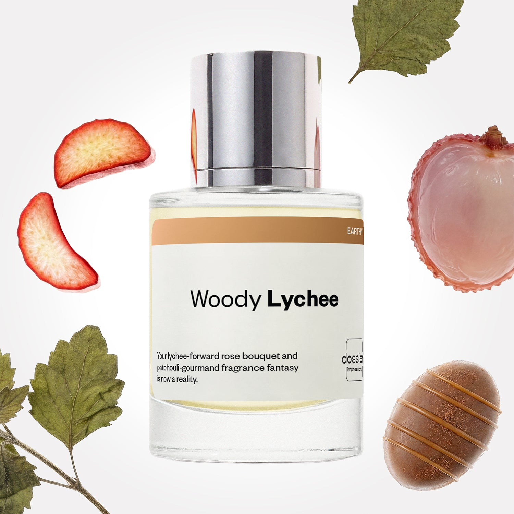

# Woody Lychee

- **Dossier Inspired by Louis Vuitton’s Attrape-Rêves**
- **URL:** https://dossier.co/products/woody-lychee
- **SEO title:** Woody Lychee

## Pricing (sizes)

| Size/SKU | Member price | List price | Currency |
|---|---|---|---|
| DI50WLUS | 44.1 | 49 | USD |

## Content (scent notes, about, editorial)

Back Home / Perfumes / Dossier Impressions / WOODY LYCHEE 

Women 

New 

Woody Lychee

Eau de Parfum. Size: 50ml / 1.7oz 

members: $44.10

Guest:
$49

Inspired by Louis Vuitton's Attrape-Rêves Inspired by Louis Vuitton's Attrape-Rêves 
Inspired by Louis Vuitton's Attrape-Rêves 

Retail price 345 Crafted in France 
Scent Family: earthy 

Add to Cart 

Scent Notes Main Notes:

Lychee

Rhubarb

Rose

Patchouli

Praline

top: The first notes you smell 
lychee, rhubarb, raspberry, bergamot 
middle: The heart of the perfume 
rose, violet, magnolia, lily of the valley 
base: The notes that linger all day 
patchouli, praline, sandalwood, vanilla 
ingredients: Alcohol Denat., Water, Parfum/Perfume, Citral, Citrus Aurantium Peel Oil, Citrus Aurantium Bergamia Peel Oil, Tetramethyl Acetyloctahydronaphthalenes, Jasmine Oil/Extract, Pinene, Rose Flower Oil/Extract, Rose Ketones, Terpineol, Acetyl cedrene, Amyl Cinnamal, Alpha-isomethyl Ionone, Alpha-Terpinene, Benzaldehyde, Benzyl Alcohol, Benzyl Benzoate, Benzyl Salicylate, Beta-caryophyllene, Coumarin, Citronellol, Limonene, Eugenol, Farnesol, Geraniol, Geranyl Acetate, Pelargonium Graveolens Flower Oil, Hexadecanolactone, Hydroxycitronellal, Isoeugenol, Linalool, Linalyl Acetate, Terpinolene, Vanillin.

Vegan
Cruelty-free

Clean ingredients

About Decadent and down-to-earth, this fragrance balances bright, blooming, and dark, rich bliss. Woody Lychee (inspired by Louis Vuitton’s Attrape-Rêves) opens with tangy, colorful, and tender notes of lychee and rhubarb interlaced with raspberry and bergamot to awaken the senses. The scent then evolves into a flourishing rose-forward heart with violet, magnolia, and lily of the valley. Once settled, this floral radiance unleashes its dark and devourable side. At the base, the scent coats the skin with earthy patchouli and edible praline notes, blended with sandalwood and vanilla for a scent that smells like an echo of olfactory euphoria.

Scent Intensity: Significant 

Concentration: 20%

Gender: Feminine 

Shipping
Free shipping with 2+ items. 

Standard Shipping (with 2+ items) Auto-selected with 2+ items 
FREE 

Standard Shipping Auto-selected under 2 items 
$3.95 

Express shipping: 2 business days Select in checkout 
$19.00 

Returns
Free exchanges for all. Free returns with 

Exchanges
Free exchange, 1 time per order for all.

Returns
D+ members get 1 FREE return per order.
Non-members incur a $3.99/bottle return fee, 1 time per order.
Returns must be postmarked within 30 days of the initial order. Learn More 

FAQs Are these fragrances long lasting? They are designed to be very long lasting, just like designer fragrances, in some cases even longer, depending on the composition. 
When does the new packaging come out? We'll begin rolling out our new packaging across the U.S. and international markets soon! If you want to shop IRL - our new packaging first hits stores on January 11, 2026 at Walmart. Please note that if you are shopping online, you may receive a combination of our current and new packaging while we transition our inventory. 
How will I know what scent I like? We get it, shopping for perfumes online is hard! That's why we created a scent quiz, which will find the perfect scent for you Take the quiz (opens in new tab) 
Unsure about something? Ask us! help@dossier.co 

Best Layered With Combine 2 of our perfumes to create a third scent with layering, curated by our nose. Learn more 

You Might Love 

4.4 

Rated 4.4 out of 5 stars 

Based on 92 reviews 

Reviews 92 (tab expanded) Questions (tab collapsed) 

Filters 
Write a Review (Opens in a new window) 

92 reviews 
Sort Highest Rating Most Helpful Photos & Videos Most Recent Oldest Lowest Rating Least Helpful 

MC 

Melissa C. 
Verified Buyer 

6/29/26 

Rated 5 out of 5 stars 

Smells amazing 
It spells exactly like LV . 

Read More Read more about this review 

Was this helpful? Yes, this review from Melissa C. was helpful. 0 people voted yes No, this review from Melissa C. was not helpful. 0 people voted no 

DP 

Dossier Perfumes 
6/29/26 
Melissa, thanks for sharing! We’re thrilled it’s a match for you ✨

E 

Elisabeth 

6/29/26 

Rated 5 out of 5 stars 

5 Stars
Closest I’ve found to LV, and for the price its a perfecf every day alternative. Love that its clean and animal friendly as well. 😊

Read More Read more about this review 

Was this helpful? Yes, this review from Elisabeth was helpful. 0 people voted yes No, this review from Elisabeth was not helpful. 0 people voted no 

DC 

Dawn C. 
Verified Buyer 

6/22/26 

Rated 5 out of 5 stars 

Finally a real winner
After a bad experience with some of the other scents..this scent is strong and smells like a spent quite a lot of money..lasts and lasts...floral but rich...go ahead a grab this...I have not sampled the original..but this is a winner

Read More Read more about this review 

Was this helpful? Yes, this review from Dawn C. was helpful. 0 people voted yes No, this review from Dawn C. was not helpful. 0 people voted no 

DP 

Dossier Perfumes 
6/22/26 
Dawn! We’re thrilled Woody Lychee hit the spot after those less-than-great finds. So glad you’re enjoying its strength and longevity. Thanks for sharing, and happy exploring our catalog!

NK 

nashon k. 
Verified Buyer 

6/3/26 

Rated 5 out of 5 stars 

Smells similar to the original.
I have received so many compliments.. It smells similar to the original perfume. The notes are all similar, which is why it smells so pleasingly nice.

Read More Read more about this review 

Was this helpful? Yes, this review from nashon k. was helpful. 0 people voted yes No, this review from nashon k. was not helpful. 0 people voted no 

DP 

Dossier Perfumes 
6/3/26 
Nashon, thanks for sharing this love! So glad it’s earning all those compliments and feeling just right.

ML 

Mariana L. 
Verified Buyer 

5/24/26 

Rated 5 out of 5 stars 

Woody Lychee
Smelled really good, recommend! 

Read More Read more about this review 

Was this helpful? Yes, this review from Mariana L. was helpful. 0 people voted yes No, this review from Mariana L. was not helpful. 0 people voted no 

DP 

Dossier Perfumes 
5/24/26 
Thanks for the recommendation, Mariana! We’re so happy you love it 😊

Loading... 

Loading... 

Show More 

Inspired by  Baccarat Rouge 540 
Inspired by  Black Opium 
Inspired by  Love, Don't Be Shy 
Inspired by  Good Girl 
Inspired by  Libre 
Inspired by  Flowerbomb 
Inspired by  Light Blue 
Inspired by  Not a Perfume 
Inspired by  Aventus 
Inspired by  Bleu de Chanel 
Inspired by  Mon Paris 
Inspired by  Coco Mademoiselle 
Inspired by  Tom Ford for Men 
Inspired by  For Her 
Inspired by  J'Adore Dior 
Inspired by  Alien 
Inspired by  Black Opium Perfume 
Inspired by  Lost Cherry Perfume 

GET UP TO 30% OFF 

Find us at these retailers. 

Be the first to know. 
Submit 

Shop the following countries. United States 

Discover.
AI Scent Finder 
Blog (opens in new tab) 
Scent Family 
Layering 
Scent Quiz 

Help.
Contact Us 
Returns 
FAQ 
Testimonials 
Accessibility 

More.
Store Locator 
Boutique 
Refer A Friend 
Index 

Download our app now.

Find us at these retailers. 

Be the first to know. 
Submit 

Shop the following countries. United States 

Discover.
AI Scent Finder 
Blog (opens in new tab) 
Scent Family 
Layering 
Scent Quiz 

Help.
Contact Us 
Returns 
FAQ 
Testimonials 
Accessibility 

More.

## Main Image

