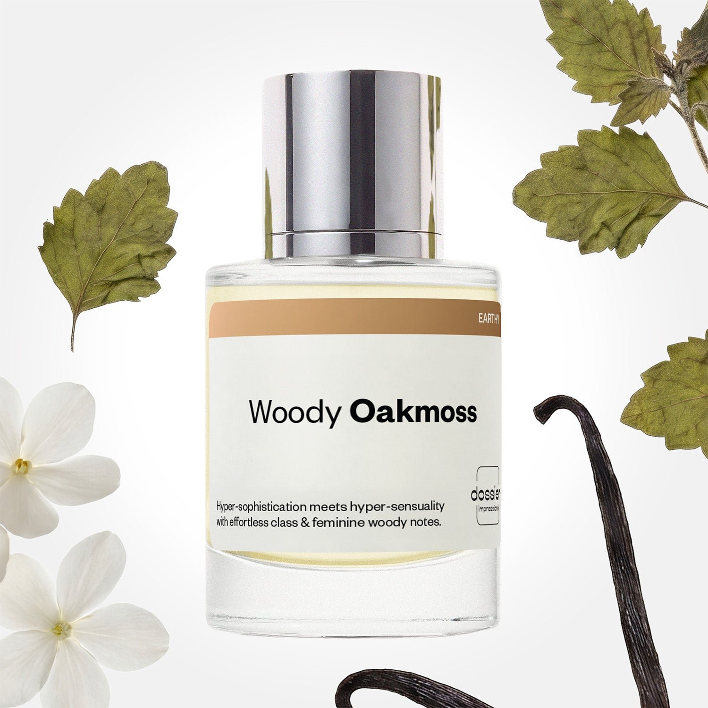

# Woody Oakmoss

- **Dossier Inspired by Chanel's Coco Mademoiselle**
- **URL:** https://dossier.co/products/woody-oakmoss
- **SEO title:** Chanel's Coco Mademoiselle Dupe Perfume: Woody Oakmoss - Dossier Perfumes

## Pricing (sizes)

| Size/SKU | Member price | List price | Currency |
|---|---|---|---|
| Fragrance+50ml/1.7oz | 28.8 | 32 | USD |
| 100ml | 44.1 | 49 | USD |
| 50ml+2.0+retail | 28.8 | 32 | USD |

## Content (scent notes, about, editorial)

Back Home / Perfumes / Dossier Impressions / WOODY OAKMOSS 

Women 

Bestseller 

Woody Oakmoss

Eau de Parfum. Size: 100ml / 3.4oz 

members: $44.10

Guest:
$49

Inspired by Chanel's Coco Mademoiselle Inspired by Chanel's Coco Mademoiselle 
Inspired by Chanel's Coco Mademoiselle 

Retail price 176 Size
50ml $32

Best Value
100ml $49

Crafted in France 
Scent Family: earthy 

Add to Cart 

Scent Notes This perfume is: Subtly sweet, a twist of orange 
Main Notes:

Patchouli

Oakmoss

Vanilla

Vetiver

top: The first notes you smell 
Bergamot, Orange, Peach 
middle: The heart of the perfume 
Jasmine, Rose, Patchouli 
base: The notes that linger all day 
Oakmoss, Vanilla, Vetiver 
ingredients: Alcohol, Water, Parfum/Perfume, Amyl Cinnamal, Hexyl Cinnamal, Benzyl alcohol, Benzyl Benzoate, Benzyl Salicylate, Citral, Coumarin, Citronellol, Limonene, Eugenol, Geraniol, Hydroxycitronellal, Linalool. 

Vegan
Cruelty-free

Clean ingredients

About Woody Oakmoss (inspired by Chanel's Coco Mademoiselle) is inspired by one of the most iconic perfume structures: The Chypre (a blend of bergamot, rose, oakmoss, and patchouli). The fragrance’s re-balanced raw materials offer more room for a highly qualitative floralcy, married with a warm ambery base 

Perfect for the evening, Woody Oakmoss (our impression of Chanel's Coco Mademoiselle) is a multifaceted fragrance, sensual and sophisticated, all at the same time.

Scent Intensity: Significant 

Concentration: 15%

Gender: Feminine 

Shipping
Free shipping with 2+ items. 

Standard Shipping (with 2+ items) Auto-selected with 2+ items 
FREE 

Standard Shipping Auto-selected under 2 items 
$3.95 

Express shipping: 2 business days Select in checkout 
$19.00 

Returns
Free exchanges for all. Free returns with 

Exchanges
Free exchange, 1 time per order for all.

Returns
D+ members get 1 FREE return per order.
Non-members incur a $3.99/bottle return fee, 1 time per order.
Returns must be postmarked within 30 days of the initial order. Learn More 

FAQs Are these fragrances long lasting? They are designed to be very long lasting, just like designer fragrances, in some cases even longer, depending on the composition. 
When does the new packaging come out? We'll begin rolling out our new packaging across the U.S. and international markets soon! If you want to shop IRL - our new packaging first hits stores on January 11, 2026 at Walmart. Please note that if you are shopping online, you may receive a combination of our current and new packaging while we transition our inventory. 
How will I know what scent I like? We get it, shopping for perfumes online is hard! That's why we created a scent quiz, which will find the perfect scent for you Take the quiz (opens in new tab) 
Unsure about something? Ask us! help@dossier.co 

Best Layered With Combine 2 of our perfumes to create a third scent with layering, curated by our nose. Learn more 

You Might Love 

4.5 

Rated 4.5 out of 5 stars 

Based on 1,974 reviews 

Reviews 1,974 (tab expanded) Questions 1 (tab collapsed) 

Filters 
Write a Review (Opens in a new window) 

1,974 reviews 
Sort Highest Rating Most Helpful Photos & Videos Most Recent Oldest Lowest Rating Least Helpful 

FM 

Francisco M. 
Verified Buyer 

6/26/26 

Rated 5 out of 5 stars 

NUMBER 1 Women's Fragrance for us
This has been our number 1 since the first time. Can't miss.

Read More Read more about this review 

Was this helpful? Yes, this review from Francisco M. was helpful. 0 people voted yes No, this review from Francisco M. was not helpful. 0 people voted no 

DP 

Dossier Perfumes 
6/26/26 
Francisco, love knowing this has been your go-to scent from day one!

N 

Natasha 

6/6/26 

Rated 5 out of 5 stars 

5 Stars
These 2 items are my absolute favorite

Read More Read more about this review 

Was this helpful? Yes, this review from Natasha was helpful. 0 people voted yes No, this review from Natasha was not helpful. 0 people voted no 

J 

Jordan 
Verified Buyer 

5/29/26 

Rated 5 out of 5 stars 

Especially Yum for Millenial Mamas On A Mission
This smells truly divine! It stayed on my skin for 8+ hours. But that's not the impressive part.

The impressive part is this: I wanted to find a flexible fragrance that fit my average busy day and could "elevate" joggers and a Tshirt or yoga pants and a messy-bun: Home, School, Work, Coffee Shop, Kid-Sports, Errands, and finally Couch Cuddles with my Cuties. And you know what? Woody Oakmoss is the one. I keep her either by my front door or in my purse.
"Add to Cart" if you're a Millenial mama who makes the yoga pants and a hoodie uniform look cute--not because you want to, but because you don't have time to change. You still need to return a stack of books to the library, grab your grocery order, pick up the dog from the vet, and snag a soccer jersey from the dryer. So you make this lewk work. 
Since "making it work" is what every Millenial Mama calls a Thursday afternoon with a hot gluegun, 2 cups of day-old coffee in a sparkly tumbler, and 15 minute intervals to work back-to-back miracles--you're justifiably confident you can do it all in leggings and a hoodie and still feel appropriately dressed. 
Triage is your middle name, so when you get everything done with 48 seconds to spare, you start thinking, "with all this free time, I could have put on 'real' clothes after all". No you could not. We both know it, sister.
But could you have have spritzed yourself with misting of "I've got it all handled?" Yes. 
Woody Oakmoss says, "I'm moving with a sense of purpose,…

Read More Read more about this review 

Was this helpful? Yes, this review from Jordan was helpful. 0 people voted yes No, this review from Jordan was not helpful. 0 people voted no 

KF 

Kim F. 
Verified Buyer 

5/26/26 

Rated 5 out of 5 stars 

Amazing smell
Smells exactly like the original expensive brand.

Read More Read more about this review 

Was this helpful? Yes, this review from Kim F. was helpful. 0 people voted yes No, this review from Kim F. was not helpful. 0 people voted no 

DP 

Dossier Perfumes 
5/26/26 
Kim, we’re thrilled you’re loving that luxe feel without the splurge!

NA 

Naila A. 
Verified Buyer 

5/25/26 

Rated 5 out of 5 stars 

Rewiev
Smells like original parfume The scent lasts a very long time, almost the entire day
I constantly buy products for my husband and family members, and everyone is very satisfied because the fragrances and colognes are no different from the original brand-name ones
Very like this product. Recommended 

Read More Read more about this review 

Was this helpful? Yes, this review from Naila A. was helpful. 0 people voted yes No, this review from Naila A. was not helpful. 0 people voted no 

DP 

Dossier Perfumes 
5/25/26 
Thanks for the love, Naila! We’re thrilled Woody Oakmoss holds strong all day and keeps everyone happy. Can’t wait for you to explore more of our lineup 😊

Loading... 

Loading... 

Show More 

Inspired by  Baccarat Rouge 540 
Inspired by  Black Opium 
Inspired by  Love, Don't Be Shy 
Inspired by  Good Girl 
Inspired by  Libre 
Inspired by  Flowerbomb 
Inspired by  Light Blue 
Inspired by  Not a Perfume 
Inspired by  Aventus 
Inspired by  Bleu de Chanel 
Inspired by  Mon Paris 
Inspired by  Coco Mademoiselle 
Inspired by  Tom Ford for Men 
Inspired by  For Her 
Inspired by  J'Adore Dior 
Inspired by  Alien 
Inspired by  Black Opium Perfume 
Inspired by  Lost Cherry Perfume 

GET UP TO 30% OFF 

Find us at these retailers. 

Be the first to know. 
Submit 

Shop the following countries. United States 

Discover.
AI Scent Finder 
Blog (opens in new tab) 
Scent Family 
Layering 
Scent Quiz 

Help.
Contact Us 
Returns 
FAQ 
Testimonials 
Accessibility 

More.
Store Locator 
Boutique 
Refer A Friend 
Index 

Download our app now.

Find us at these retailers. 

Be the first to know. 
Submit 

Shop the following countries. United States 

Discover.
AI Scent Finder 
Blog (opens in new tab) 
Scent Family 
Layering 
Scent Quiz 

Help.
Contact Us 
Returns 
FAQ 
Testimonials 
Accessibility 

More.

## Main Image

