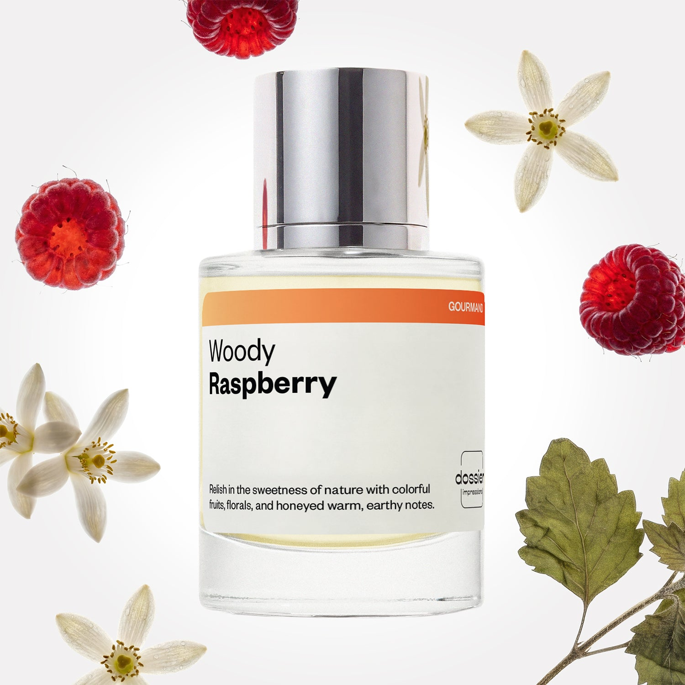

# Woody Raspberry

- **Dossier Inspired by Paco Rabanne's Lady Million**
- **URL:** https://dossier.co/products/woody-raspberry
- **SEO title:** Paco Rabanne's Lady Million Dupe Perfume: Woody Raspberry - Dossier Perfumes

## Pricing (sizes)

| Size/SKU | Member price | List price | Currency |
|---|---|---|---|
| DI50WRAUS | 28.8 | 32 | USD |

## Content (scent notes, about, editorial)

Back Home / Perfumes / Dossier Impressions / WOODY RASPBERRY 

Women 

It's back! 

Woody Raspberry

Eau de Parfum. Size: 50ml / 1.7oz 

members: $28.80

Guest:
$32

Inspired by Paco Rabanne's Lady Million Inspired by Paco Rabanne's Lady Million 
Inspired by Paco Rabanne's Lady Million 

Retail price 96 Crafted in France 
Scent Family: gourmand 

Add to Cart 

Scent Notes This perfume is: Bubbly, yet sophisticated 
Main Notes:

Raspberry

Orange Blossom

Patchouli

top: The first notes you smell 
Raspberry, Neroli, Lemon 
middle: The heart of the perfume 
Jasmine, Orange Blossom, Gardenia 
base: The notes that linger all day 
Patchouli , Amber, Honey 
ingredients: Alcohol, Water, Parfum/Perfume, Amyl Cinnamal, Hexyl Cinnamal, alpha-iso-Methylionone, Benzyl alcohol, Benzyl Benzoate, Benzyl Salicylate, Citral,
Coumarin, Citronellol, Limonene, Eugenol, Farnesol, Geraniol, Hydroxycitronellal. 

Vegan
Cruelty-free

Clean ingredients

About Woody Raspberry (inspired by Paco Rabanne's Lady Million) lets you discover its depth gradually. At first impression, you’re met with a very colorful, gourmand, fruity mix dominated by raspberries. Then, the floral heart blooms around orange blossom. The final intensity of the fragrance is slowly revealed in the background, comprising a dense and powerful patchouli tempered by a touch of honey, transporting you back to the initial edible notes.

Sensual and lavish yet playful, Woody Raspberry (our impression of Paco Rabanne's Lady Million) is a surprising composition of intertwined fruits, flowers, and woods.

Scent Intensity: Statement 

Concentration: 18%

Gender: Feminine 

Shipping
Free shipping with 2+ items. 

Standard Shipping (with 2+ items) Auto-selected with 2+ items 
FREE 

Standard Shipping Auto-selected under 2 items 
$3.95 

Express shipping: 2 business days Select in checkout 
$19.00 

Returns
Free exchanges for all. Free returns with 

Exchanges
Free exchange, 1 time per order for all.

Returns
D+ members get 1 FREE return per order.
Non-members incur a $3.99/bottle return fee, 1 time per order.
Returns must be postmarked within 30 days of the initial order. Learn More 

FAQs Are these fragrances long lasting? They are designed to be very long lasting, just like designer fragrances, in some cases even longer, depending on the composition. 
When does the new packaging come out? We'll begin rolling out our new packaging across the U.S. and international markets soon! If you want to shop IRL - our new packaging first hits stores on January 11, 2026 at Walmart. Please note that if you are shopping online, you may receive a combination of our current and new packaging while we transition our inventory. 
How will I know what scent I like? We get it, shopping for perfumes online is hard! That's why we created a scent quiz, which will find the perfect scent for you Take the quiz (opens in new tab) 
Unsure about something? Ask us! help@dossier.co 

Details We are not associated or affiliated with the brands mentioned here in any way.
Woody Raspberry

A bottle that drips with golden wealth and exquisite brilliance

Radiating glitz and glamor, Paco Rabanne’s Lady Million (the fragrance Dossier’s Woody Raspberry is inspired by) is a refined scent of beauty and splendor. Released two years after the immense success of its masculine counterpart, One Million, the luxury fragrance Woody Raspberry is inspired by offers the same feeling of elegance and grandeur. An intense fragrance for any woman wanting to feel like a million dollars, the luxury fragrance Woody Raspberry is inspired by is a bottle of ostentatious affluence and expensive class.

Designed to convey a message of sophistication and passion, this cosmopolitan cocktail of delicious floral and fruity tones manifests an air of exclusivity. It opens with an enticingly fizzy concoction of fruits. The top tones are elegantly comprised of soft raspberry, zesty Amalfi lemon, and neroli. These aromas fuse to invite you to dive into a refreshing ocean of chilly blue water.

The sumptuous floral middle tones of the luxury fragrance Woody Raspberry is inspired by melt into the fragrance with polished poise and traditional opulence – a beautifully seamless blend of jasmine, gardenia, and African orange flower. Underscoring these aromas are saccharine white honey, warm amber, and patchouli. These notes fuse naturally to craft a lavishly splendid scent of diamond and wealth. This is a richly sexy fragrance that leaves a lingering charm even as you leave the room.

Bottled in a hard aureate diamond, resembling an enchanted philosopher’s stone, the Paco Rabanne Lady Million Eau de Parfum is grandly held in a flacon of dignity and golden shine. Designed to emulate the elegance and sophisticated style of the aroma, the bottle is embellished with a calligraphic font, kept simple to not deter from its breathtaking shape and golden glow.

Paco Rabanne’s Lady Million can be bought in 3 different sizes (30 ml, 50 ml and 80 ml) at prices of $64.00, $87.00 and $109.00 respectively.

Finally, if you want to experience a lavish taste of elegance and radiant shine for a cheaper price, simply shop for Dossier’s Woody Raspberry. Our Paco Rabanne Lady Million dupe simulates a hyper-realistic feeling of grandeur and refinement. It is a layered fragrance of extravagant aromas that is revealed gradually. Woody Raspberry is a tribute to sensuality, sophistication, and innocent playfulness. With top notes of luscious raspberry, clad in citrusy orange blossom, and complemented by denser deep base undertones of patchouli and woody notes, this fragrance dances on the taste buds and tingles the nose. 

You Might Love 

4.4 

Rated 4.4 out of 5 stars 

Based on 674 reviews 

Reviews 674 (tab expanded) Questions 1 (tab collapsed) 

Filters 
Write a Review (Opens in a new window) 

674 reviews 
Sort Highest Rating Most Helpful Photos & Videos Most Recent Oldest Lowest Rating Least Helpful 

MW 

Marman W. 
Verified Buyer 

6/7/26 

Rated 5 out of 5 stars 

So fabulous 
So gorgeous on, it’s fruity & fun I spray it often. It works s. Pretty long lasting scent I’d buy again!!!

Read More Read more about this review 

Was this helpful? Yes, this review from Marman W. was helpful. 0 people voted yes No, this review from Marman W. was not helpful. 0 people voted no 

DP 

Dossier Perfumes 
6/7/26 
Marman, thanks for sharing how much you’re loving it! We’re thrilled it feels fun and lasts all day. Can’t wait to have you spray away and explore more soon!

DR 

Dominque R. 
Verified Buyer 

5/24/26 

Rated 5 out of 5 stars 

Love it! 
I never thought I would be a woody scent type of girl, but I do love this. It's a nice balance of fruit and woody/ nutty.

Read More Read more about this review 

Was this helpful? Yes, this review from Dominque R. was helpful. 0 people voted yes No, this review from Dominque R. was not helpful. 0 people voted no 

DP 

Dossier Perfumes 
5/24/26 
Dominque, we’re thrilled you gave this woody number a spin and found that perfect fruit-wood harmony. It’s fun when unexpected scents surprise you. Keep spritzing and exploring! 😊

IC 

Ivis c. 
Verified Buyer 

5/20/26 

Rated 5 out of 5 stars 

Very nice fragrance 
Very quick shipping.. and the fragrance lasts all day

Read More Read more about this review 

Was this helpful? Yes, this review from Ivis c. was helpful. 0 people voted yes No, this review from Ivis c. was not helpful. 0 people voted no 

DP 

Dossier Perfumes 
5/21/26 
Ivis, we love that shipping was speedy and your scent lasted all day! 😊

L 

Lafateia 

5/14/26 

Rated 5 out of 5 stars 

5 Stars
Amazing scent!!! And shipped very fast!!!

Read More Read more about this review 

Was this helpful? Yes, this review from Lafateia was helpful. 0 people voted yes No, this review from Lafateia was not helpful. 0 people voted no 

VR 

Vanessa R. 
Verified Buyer 

5/10/26 

Rated 5 out of 5 stars 

One of my favorites
I was skeptical to buy fragrances online if I don't know what they smell like but... and this is a big BUT, this turned out to be amazing! It smells delicious and I will be adding it to my favorite collection from now on.

Read More Read more about this review 

Was this helpful? Yes, this review from Vanessa R. was helpful. 0 people voted yes No, this review from Vanessa R. was not helpful. 0 people voted no 

DP 

Dossier Perfumes 
5/11/26 
Hey Vanessa! We love hearing that your leap of faith paid off and that it’s made its way to your favorites list. Thanks so much for sharing!

Loading... 

Loading... 

Show More 

Inspired by  Baccarat Rouge 540 
Inspired by  Black Opium 
Inspired by  Love, Don't Be Shy 
Inspired by  Good Girl 
Inspired by  Libre 
Inspired by  Flowerbomb 
Inspired by  Light Blue 
Inspired by  Not a Perfume 
Inspired by  Aventus 
Inspired by  Bleu de Chanel 
Inspired by  Mon Paris 
Inspired by  Coco Mademoiselle 
Inspired by  Tom Ford for Men 
Inspired by  For Her 
Inspired by  J'Adore Dior 
Inspired by  Alien 
Inspired by  Black Opium Perfume 
Inspired by  Lost Cherry Perfume 

GET UP TO 30% OFF 

Find us at these retailers. 

Be the first to know. 
Submit 

Shop the following countries. United States 

Discover.
AI Scent Finder 
Blog (opens in new tab) 
Scent Family 
Layering 
Scent Quiz 

Help.
Contact Us 
Returns 
FAQ 
Testimonials 
Accessibility 

More.
Store Locator 
Boutique 
Refer A Friend 
Index 

Download our app now.

Find us at these retailers. 

Be the first to know. 
Submit 

Shop the following countries. United States 

Discover.
AI Scent Finder 
Blog (opens in new tab) 
Scent Family 
Layering 
Scent Quiz 

Help.
Contact Us 
Returns 
FAQ 
Testimonials 
Accessibility 

More.

## Main Image

