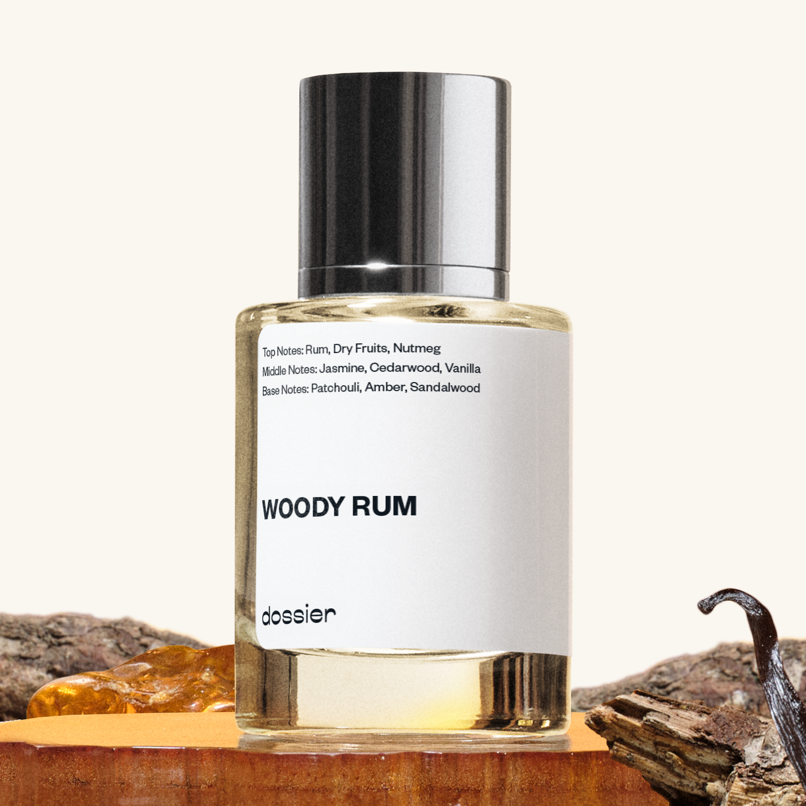

# Woody Rum

- **Dossier Inspired by By Kilian's Straight to Heaven**
- **URL:** https://dossier.co/products/woody-rum
- **SEO title:** By Kilian's Straight to Heaven Dupe Perfume : Woody Rum - Dossier Perfumes

## Pricing (sizes)

| Size/SKU | Member price | List price | Currency |
|---|---|---|---|
| 39277155844163 | 38.7 | 43 | USD |

## Content (scent notes, about, editorial)

Back Home / Perfumes / Dossier Impressions / WOODY RUM 

Men 

Sold out 

Woody Rum

Eau de Parfum. Size: 50ml / 1.7oz 

members: $38.70

Guest:
$43

Inspired by Kilian's Straight to Heaven Inspired by Kilian's Straight to Heaven 
Inspired by Kilian's Straight to Heaven 

Retail price 290 Crafted in France 
Scent Family: warm 

Notify Me 

Scent Notes This perfume is: Hot spiked cider on a cold day 
Main Notes:

Rum

Dry Fruits

Cedarwood

Patchouli

top: The first notes you smell 
Rum, Dry Fruits, Nutmeg 
middle: The heart of the perfume 
Jasmine, Cedarwood, Vanilla 
base: The notes that linger all day 
Patchouli, Amber, Sandalwood 
ingredients: Alcohol, Water, Parfum/Perfume, Benzyl alcohol, Benzyl Benzoate, Benzyl Cinnamate, Cinnamaldehyde, Limonene, Eugenol, Isoeugenol, Linalool. 

Vegan
Cruelty-free

Clean ingredients

About Woody Rum (inspired by By Kilian's Straight to Heaven) takes you straight to its core, with a daring cocktail of rum, dry fruits and nutmeg. This evocative blend is reinforced by assertive woods and softened by an enveloping vanilla touch.

Warm and insolent, Woody Rum (our impression of By Kilian's Straight to Heaven) is unique in combining bold intense notes, thus creating a scent evocative of innocent (maybe even forbidden?) pleasures...

Scent Intensity: Statement 

Concentration: 18%

Gender: Masculine 

Shipping
Free shipping with 2+ items. 

Standard Shipping (with 2+ items) Auto-selected with 2+ items 
FREE 

Standard Shipping Auto-selected under 2 items 
$3.95 

Express shipping: 2 business days Select in checkout 
$19.00 

Returns
Free exchanges for all. Free returns with 

Exchanges
Free exchange, 1 time per order for all.

Returns
D+ members get 1 FREE return per order.
Non-members incur a $3.99/bottle return fee, 1 time per order.
Returns must be postmarked within 30 days of the initial order. Learn More 

FAQs Are these fragrances long lasting? They are designed to be very long lasting, just like designer fragrances, in some cases even longer, depending on the composition. 
When does the new packaging come out? We'll begin rolling out our new packaging across the U.S. and international markets soon! If you want to shop IRL - our new packaging first hits stores on January 11, 2026 at Walmart. Please note that if you are shopping online, you may receive a combination of our current and new packaging while we transition our inventory. 
How will I know what scent I like? We get it, shopping for perfumes online is hard! That's why we created a scent quiz, which will find the perfect scent for you Take the quiz (opens in new tab) 
Unsure about something? Ask us! help@dossier.co 

Details We are not associated or affiliated with the brands mentioned here in any way.
Woody Rum

The chieftain of luxury perfume brands

The Kilian Straight to Heaven Eau de Parfum For Men(the fragrance that Dossier’s Woody Rum is inspired by) is a powerful elixir that lures you with seduction and shadowy deception. It is an entrancing scent that entangles you in a web of intoxication and alluring desire. Landing on shelves in 2007, this fragrance was an instant hit. And that didn’t even come as a surprise.

Infused with streaks of rich Hennessy rum and topped up with creamy tones of vanilla, this breath-taking scent will cast a love spell on you and everyone in your locus. It is an ice-cold pool of rum blended with sweet gourmand and laced with irresistibly sweet, dried fruit. It is a masterpiece aroma that thrusts you to the pristine honeycomb lands of Cappadocia. Taste a classic collection of notes in velvety vanilla, cedar, patchouli, and peppercorn as it reaches into your spirit and deposits a heightened sense of inner peace. Each opening reverberates the zest, drive, and verve strong men are known for.

The luxury Eau de Parfum that Woody Rum is inspired by is the fragrance you wear if you seek unadulterated happiness. It is a drop of heavenly ecstasy that lathers you in white crystal. Spritz calmly to create a veil of intrigue, enticing allure, and timeless glamor. Spray copiously and be transported to the flower gardens of Keukenhof.

Kilian is an olfactive feast for the senses. It is a floral that celebrates masculine beauty, grace, and strength. There’s never a dull moment when you have this scent on. It is everything you need to bloom into the best version of yourself.

And the allure doesn’t even end there. The bottle that holds the Eau de Parfum that Woody Rum is inspired by is an incentive on its own. It is a thought-provoking take on luxury and opulence. It’s so good, it’s bad.

You can get the 50 ml refillable Kilian Straight to Heaven cologne for $250.00 and the Limited Edition for $350.00. You can also get travel set (including a smaller 30 ml sample spray and 3 refills) for $195.00 and the for $900.00. Finally, if you want the newest rendition of this fragrance, you’ll find it in the Special Blend 2021 Oud and Musk. The 50 ml bottle sells for $109.99.

For those who want a share of the captivating experience the Kilian Straight to Heaven provides, but at a more affordable fee, Dossier’s Woody Rum is a good place to start. Our dupe entices you with its uniquely evocative blend of creamy vanilla bean top notes and decisive woodsy tones of cedar and warming rum. It is expertly designed to provoke a chain reaction of love and refined affection. It is a chic classic that leverages perfumes’ ability to transport the mind. Wear this for your country vacation, or when you simply want to concoct a mental photograph of one.

Best Layered With Combine 2 of our perfumes to create a third scent with layering, curated by our nose. Learn more 

You Might Love 

4.3 

Rated 4.3 out of 5 stars 

Based on 461 reviews 

Reviews 461 (tab expanded) Questions 1 (tab collapsed) 

Filters 
Write a Review (Opens in a new window) 

461 reviews 
Sort Highest Rating Most Helpful Photos & Videos Most Recent Oldest Lowest Rating Least Helpful 

T 

Trevor 
Verified Reviewer 

3/26/26 

Rated 5 out of 5 stars 

When are you bringing it back?
I bought it once, and I have been waiting for it to be back in stock; can you update everyone with its return date?

Read More Read more about this review 

Was this helpful? Yes, this review from Trevor was helpful. 0 people voted yes No, this review from Trevor was not helpful. 0 people voted no 

DP 

Dossier Perfumes 
3/26/26 
Hey Trevor! We don’t have a return date yet, but you can sign up for restock alerts on dossier.co.

L 

Lili 

1/29/26 

Rated 5 out of 5 stars 

Bring it back pleaaae
I adore this beautiful scent ….

Read More Read more about this review 

Was this helpful? Yes, this review from Lili was helpful. 0 people voted yes No, this review from Lili was not helpful. 0 people voted no 

DP 

Dossier Perfumes 
1/29/26 
Lili! We’re thrilled you adore this scent, and we’ll share your wish with the team 😊

R 

Rae 

1/25/26 

Rated 5 out of 5 stars 

I check every day. Like every single dayyy
Take my dog, take my Social security check, take the title to my old Nissan, TAKE AN ORGAN. TAKE IT ALL I DON'T CARE JUST BRING IT BACK PLEASE 😭😭😭😭😭

Read More Read more about this review 

Was this helpful? Yes, this review from Rae was helpful. 0 people voted yes No, this review from Rae was not helpful. 0 people voted no 

KA 

Kevin A. 

12/4/25 

Rated 5 out of 5 stars 

Bring it back please!
Pleassseeee bring it back asap!!! I have 37 of your scents and woody rum is my favorite by far!!

Read More Read more about this review 

Was this helpful? Yes, this review from Kevin A. was helpful. 0 people voted yes No, this review from Kevin A. was not helpful. 0 people voted no 

DP 

Dossier Perfumes 
12/4/25 
Oh, we love your energy, Kevin! Woody Rum clearly has a special place in your lineup, and having 37 scents already makes you basically Dossier royalty. We'll pass the love along to the team; loud and clear! ✨

P 

Phil 

11/12/25 

Rated 5 out of 5 stars 

Bring it back!!!
ase bring this back!!! I will buy 5 bottles immediately. . Was my favorite and I am out of it. . Been waiting. . .

Read More Read more about this review 

Was this helpful? Yes, this review from Phil was helpful. 0 people voted yes No, this review from Phil was not helpful. 0 people voted no 

DP 

Dossier Perfumes 
11/12/25 
Hey Phil, we’re thrilled you loved it that much and really feel your frustration. We’ve passed your request along, so hopefully you’ll see it return soon!

Loading... 

Loading... 

Show More 

Inspired by  Baccarat Rouge 540 
Inspired by  Black Opium 
Inspired by  Love, Don't Be Shy 
Inspired by  Good Girl 
Inspired by  Libre 
Inspired by  Flowerbomb 
Inspired by  Light Blue 
Inspired by  Not a Perfume 
Inspired by  Aventus 
Inspired by  Bleu de Chanel 
Inspired by  Mon Paris 
Inspired by  Coco Mademoiselle 
Inspired by  Tom Ford for Men 
Inspired by  For Her 
Inspired by  J'Adore Dior 
Inspired by  Alien 
Inspired by  Black Opium Perfume 
Inspired by  Lost Cherry Perfume 

GET UP TO 30% OFF 

Find us at these retailers. 

Be the first to know. 
Submit 

Shop the following countries. United States 

Discover.
AI Scent Finder 
Blog (opens in new tab) 
Scent Family 
Layering 
Scent Quiz 

Help.
Contact Us 
Returns 
FAQ 
Testimonials 
Accessibility 

More.
Store Locator 
Boutique 
Refer A Friend 
Index 

Download our app now.

Find us at these retailers. 

Be the first to know. 
Submit 

Shop the following countries. United States 

Discover.
AI Scent Finder 
Blog (opens in new tab) 
Scent Family 
Layering 
Scent Quiz 

Help.
Contact Us 
Returns 
FAQ 
Testimonials 
Accessibility 

More.

## Main Image

