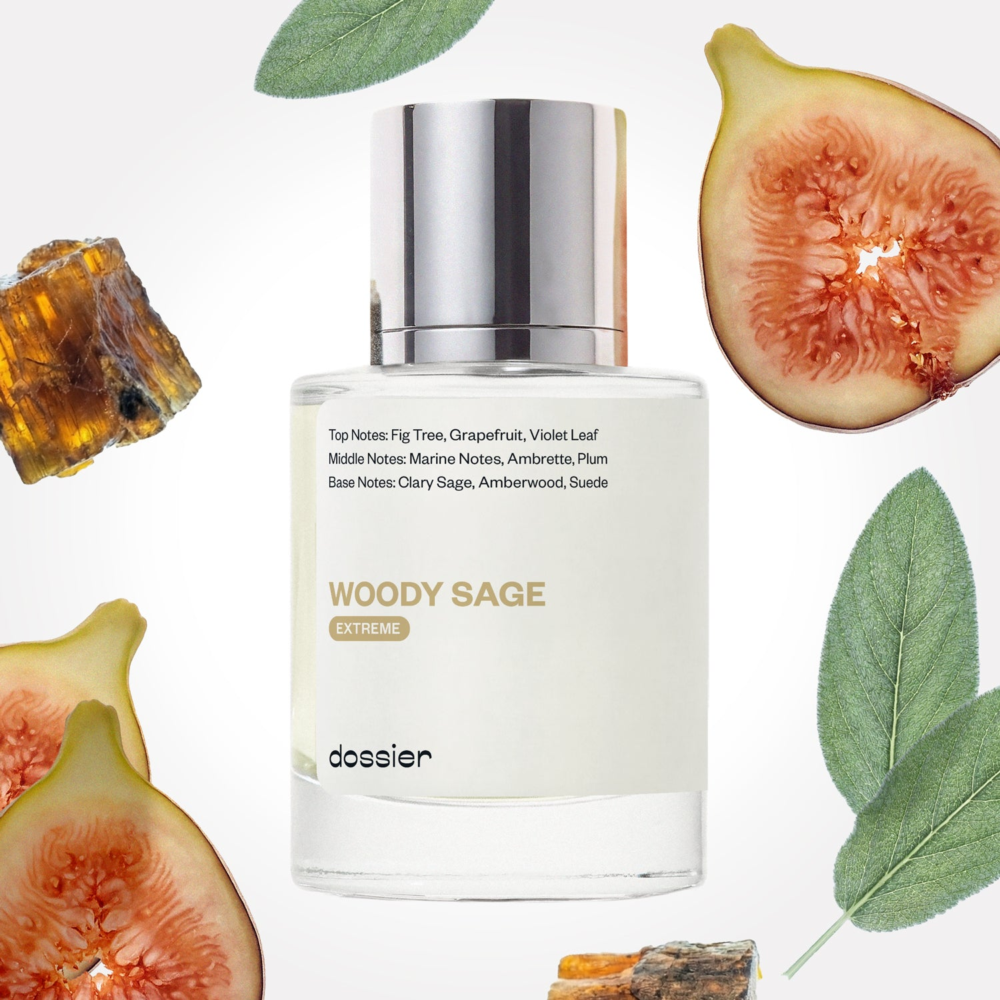

# Woody Sage (Extreme)

- **Dossier Inspired by Jo Malone's Wood Sage & Sea Salt**
- **URL:** https://dossier.co/products/woody-sage-extreme
- **SEO title:** Woody Sage (Extreme)

## Pricing (sizes)

| Size/SKU | Member price | List price | Currency |
|---|---|---|---|
| 41369300238403 | 35.1 | 39 | USD |
| 6 | 0 | 0 | USD |

## Content (scent notes, about, editorial)

Back Home / Perfumes / Dossier Impressions / WOODY SAGE (EXTREME) 

Unisex 

New 

Extreme 

Woody Sage (Extreme)

Eau de Parfum. Size: 1.7 fl. oz / 50ml 

members: $35.10

Guest:
$39

Inspired by Jo Malone's Wood Sage & Sea Salt Inspired by Jo Malone's Wood Sage & Sea Salt 
Inspired by Jo Malone's Wood Sage & Sea Salt 

Retail price 168 Crafted in France 
Scent Family: herbal 

Add to Cart 

Scent Notes Main Notes:

Fig Tree

Grapefruit

Clary Sage

Amberwood

top: The first notes you smell 
Fig Tree, Grapefruit, Violet Leaf 
middle: The heart of the perfume 
Marine notes, Ambrette, Plum 
base: The notes that linger all day 
Clary Sage, Amberwood, Suede 
ingredients: Alcohol, Water, Parfum/Perfume, alpha-iso-Methylionone, Citral, Coumarin, Citronellol, Limonene, Farnesol, Geraniol, Linalool. 

Vegan
Cruelty-free

Clean ingredients

About Enjoy the bliss of nature taken to the EXTREME. We’ve up to the ante (and concentration) to create Woody Sage Extreme. Here are some notes on how we’ve made our bestselling Woody Sage, inspired by Jo Malone’s Wood Sage and Sea Salt more intense by upping the fragrance concentration from 18% to 25%. 

Explore a more intoxicating breath of fresh air with amplified fig tree and violet leaf top notes to open to the scent with a fresher and greener breeze. The heart’s crisp marine, warm, and fruity notes unfold into the most prominent boosted note––clary sage, the fragrance’s DNA. The other base notes amberwood and suede also get a boost to craft an overall more woody, sumptuous dry down on the skin. 

Concentration: 25%

Gender: Unisex 

Shipping
Free shipping with 2+ items. 

Standard Shipping (with 2+ items) Auto-selected with 2+ items 
FREE 

Standard Shipping Auto-selected under 2 items 
$3.95 

Express shipping: 2 business days Select in checkout 
$19.00 

Returns
Free exchanges for all. Free returns with 

Exchanges
Free exchange, 1 time per order for all.

Returns
D+ members get 1 FREE return per order.
Non-members incur a $3.99/bottle return fee, 1 time per order.
Returns must be postmarked within 30 days of the initial order. Learn More 

FAQs Are these fragrances long lasting? They are designed to be very long lasting, just like designer fragrances, in some cases even longer, depending on the composition. 
When does the new packaging come out? We'll begin rolling out our new packaging across the U.S. and international markets soon! If you want to shop IRL - our new packaging first hits stores on January 11, 2026 at Walmart. Please note that if you are shopping online, you may receive a combination of our current and new packaging while we transition our inventory. 
How will I know what scent I like? We get it, shopping for perfumes online is hard! That's why we created a scent quiz, which will find the perfect scent for you Take the quiz (opens in new tab) 
Unsure about something? Ask us! help@dossier.co 

Best Layered With Combine 2 of our perfumes to create a third scent with layering, curated by our nose. Learn more 

You Might Love 

3.0 

Rated 3.0 out of 5 stars 

Based on 75 reviews 

Reviews 75 (tab expanded) Questions (tab collapsed) 

Filters 
Write a Review (Opens in a new window) 

75 reviews 
Sort Highest Rating Most Helpful Photos & Videos Most Recent Oldest Lowest Rating Least Helpful 

S 

Sharon 

6/19/26 

Rated 5 out of 5 stars 

5 Stars
Love

Read More Read more about this review 

Was this helpful? Yes, this review from Sharon was helpful. 0 people voted yes No, this review from Sharon was not helpful. 0 people voted no 

B 

Brandon 
Verified Reviewer 

5/2/26 

Rated 5 out of 5 stars 

It grew on me! 10/10
Honestly, compared to other fragrances I got from here I hated this one, didn’t use it for a month or 2 then I decided to try it as like my at home scent. But then my friends started to compliment me out of the blue on it, asking me what I’m wearing. I’ve even been told by a stranger that she loved my smell, that I smelled super good. Haven’t really had a girl outright say that. I know it’s on the sweeter side but I’m a guy and idk , I’ve genuinely been complemented a few times on this more than my other name brand fragrances lol. I will buy again when this runs low . Plz don’t remove the extreme 

Read More Read more about this review 

Was this helpful? Yes, this review from Brandon was helpful. 0 people voted yes No, this review from Brandon was not helpful. 0 people voted no 

DP 

Dossier Perfumes 
5/2/26 
Hey Brandon! We’re so happy you gave it a shot and are getting all those compliments. Don’t worry, the extreme blend’s here to stay. Pick it up when you’re ready 😊

JS 

Joanna S. 
Verified Reviewer 

4/4/26 

Rated 5 out of 5 stars 

AMAZING
LOVE this!I have been wearing this with the Bath and Body Works Jo Malone body spray and both smell wonderful!Good longevity and great value!

Read More Read more about this review 

Was this helpful? Yes, this review from Joanna S. was helpful. 0 people voted yes No, this review from Joanna S. was not helpful. 0 people voted no 

DP 

Dossier Perfumes 
4/5/26 
Joanna! We’re thrilled you’re loving the longevity and value, and layering it with a favorite spritz. Keep enjoying! 😊

J 

JZ 

Verified Buyer 

11/27/25 

Rated 5 out of 5 stars 

it actually lasts LONGER
I got this one as a free one during the Black Friday Sale. I didn't purchase this one because I've already owned the Jo Malone's, however, to my great surprise, this one actually lasts longer. . . . Highly recommend for an easygoing everyday wear.

Read More Read more about this review 

Was this helpful? Yes, this review from JZ was helpful. 0 people voted yes No, this review from JZ was not helpful. 0 people voted no 

DP 

Dossier Perfumes 
11/27/25 
We love a good surprise, JZ! Thanks for giving it a shot and for the high praise; we'll take the everyday compliment any day.

MR 

Magdalena R. 

Verified Buyer 

11/25/25 

Rated 5 out of 5 stars 

Love this scent!
Exactly the strength of scent I desired. . . very satisfied!

Read More Read more about this review 

Was this helpful? Yes, this review from Magdalena R. was helpful. 0 people voted yes No, this review from Magdalena R. was not helpful. 0 people voted no 

DP 

Dossier Perfumes 
11/25/25 
We’re thrilled you found your perfect strength! Enjoy every spritz, Magdalena 😊

Loading... 

Loading... 

Show More 

Inspired by  Baccarat Rouge 540 
Inspired by  Black Opium 
Inspired by  Love, Don't Be Shy 
Inspired by  Good Girl 
Inspired by  Libre 
Inspired by  Flowerbomb 
Inspired by  Light Blue 
Inspired by  Not a Perfume 
Inspired by  Aventus 
Inspired by  Bleu de Chanel 
Inspired by  Mon Paris 
Inspired by  Coco Mademoiselle 
Inspired by  Tom Ford for Men 
Inspired by  For Her 
Inspired by  J'Adore Dior 
Inspired by  Alien 
Inspired by  Black Opium Perfume 
Inspired by  Lost Cherry Perfume 

GET UP TO 30% OFF 

Find us at these retailers. 

Be the first to know. 
Submit 

Shop the following countries. United States 

Discover.
AI Scent Finder 
Blog (opens in new tab) 
Scent Family 
Layering 
Scent Quiz 

Help.
Contact Us 
Returns 
FAQ 
Testimonials 
Accessibility 

More.
Store Locator 
Boutique 
Refer A Friend 
Index 

Download our app now.

Find us at these retailers. 

Be the first to know. 
Submit 

Shop the following countries. United States 

Discover.
AI Scent Finder 
Blog (opens in new tab) 
Scent Family 
Layering 
Scent Quiz 

Help.
Contact Us 
Returns 
FAQ 
Testimonials 
Accessibility 

More.

## Main Image

