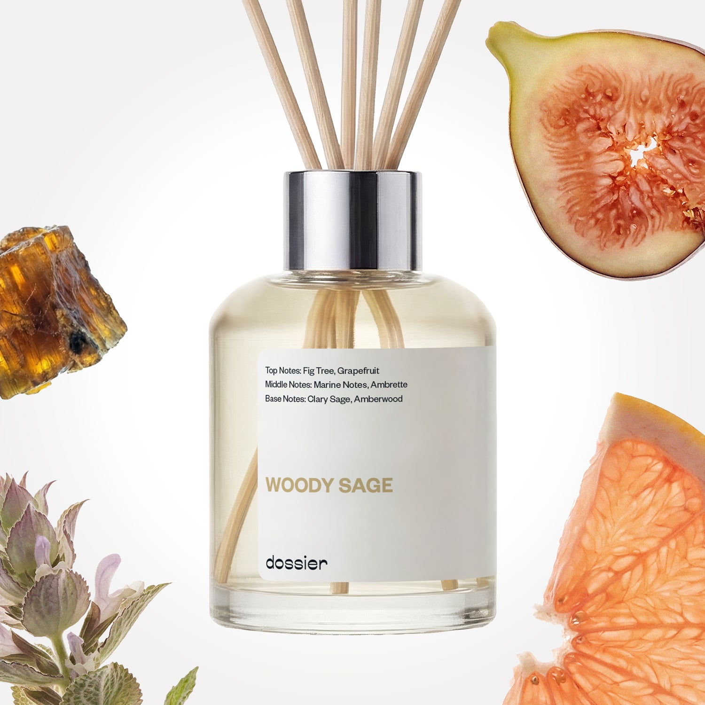

# Woody Sage Room Diffuser

- **Dossier Inspired by Jo Malone's Wood Sage & Sea Salt**
- **URL:** https://dossier.co/products/woody-sage-room-diffuser
- **SEO title:** Woody Sage Room Diffuser

## Pricing (sizes)

| Size/SKU | Member price | List price | Currency |
|---|---|---|---|
| 41570854764611 | 34.2 | 38 | USD |

## Content (scent notes, about, editorial)

Back Home / Home Scents / Diffusers / WOODY SAGE ROOM DIFFUSER 

Sold out 

Woody Sage Room Diffuser

Size: 3.4 fl. oz / 100ml 

members: $34.20

Guest:
$38

Inspired by Jo Malone's Wood Sage & Sea Salt Perfume Inspired by Jo Malone's Wood Sage & Sea Salt Perfume 
Inspired by Jo Malone's Wood Sage & Sea Salt Perfume 

Crafted in France 
Scent Family: herbal 

Notify Me 

Scent Notes This perfume is: Refreshing, crisp, earthy, and woody. 
Main Notes:

Fig Tree

Grapefruit

Clary Sage

Amberwood

top: The first notes you smell 
Fig Tree, Grapefruit 
middle: The heart of the perfume 
Marine notes, Ambrette 
base: The notes that linger all day 
Clary Sage, Amberwood 
ingredients: Alcohol Denat, Water, Parfum/Perfume, Carvone, Citral, Citrus Aurantium Peel Oil, Tetramethyl Acetyloctahydronaphthalenes, Pinene, Rose Ketones, Alpha-isomethyl Ionone, Beta-caryophyllene, Citrus Limon Peel Oil, Coumarin, Citronellol, Limonene, Geraniol, Geranyl Acetate, Linalool, Linalyl Acetate, Terpinolene. 

Vegan
Cruelty-free

Clean ingredients

About Enjoy a breath of fresh seaside cliff air with the mind-unwinding aroma of a refreshing, crisp breeze on a woodland nature walk. It’s refreshingly earthy, minty, vegetal, and aromatic––the ultimate natural scent-uary escape for all your spaces.

Concentration: 22%

About this diffuser. 
The perfume diffuses in its environment by a natural and gradual evaporation through the wooden sticks.
The oil concentrate is diluted in alcohol, just like your favorite EDP or perfume is.
The formula of each diffuser has been reworked to both comply with the air care standards and to function optimally when used with wooden sticks.
Our diffusers are formulated for safe and stress free sniffing, no additives necessary.

LEARN MORE 

Tips How to Use.
Set up is easy: Place the reeds into the fragrance, sit back and relax as the smell of luxury fills the room.
Keep it fresh: Turn the reeds over from time to time. Doing this every 2-3 days will improve the diffusion of fragrance in the room.
24/7 luxury: For every 100ml diffuser, the fragrance will last at least one month when used continuously.
Hit pause: Reeds can be removed to "take a break" from the scent, and put back in the fragrance whenever you want. Save it for a special occasion or keep the good smells flowing 24/7, it’s up to you!

Shipping + Returns
Free exchanges for all. Free returns with 

Standard Shipping (with 2+ items) Auto-selected with 2+ items 
FREE 

Standard Shipping Auto-selected under 2 items 
$3.95 

Express shipping: 2 business days Select in checkout 
$19.00 

Returns for Diffusers
We cannot accept any returns for diffusers that had been used. In order to return a diffuser, proceed to our regular returns portal, and upload and image of your unused diffuser. If your diffuser has been used, your return request will be denied. 

FAQs Are these fragrances long lasting? They are designed to be very long lasting, just like designer fragrances, in some cases even longer, depending on the composition. 
When does the new packaging come out? We'll begin rolling out our new packaging across the U.S. and international markets soon! If you want to shop IRL - our new packaging first hits stores on January 11, 2026 at Walmart. Please note that if you are shopping online, you may receive a combination of our current and new packaging while we transition our inventory. 
How will I know what scent I like? We get it, shopping for perfumes online is hard! That's why we created a scent quiz, which will find the perfect scent for you Take the quiz (opens in new tab) 
Unsure about something? Ask us! help@dossier.co 

You Might Love 

4.2 

Rated 4.2 out of 5 stars 

Based on 13 reviews 

Reviews 13 (tab expanded) Questions (tab collapsed) 

Filters 
Write a Review (Opens in a new window) 

13 reviews 
Sort Highest Rating Most Helpful Photos & Videos Most Recent Oldest Lowest Rating Least Helpful 

LO 

Liz O. 

9/6/25 

Rated 5 out of 5 stars 

So fresh, so clean!
Really liked this scent. . . when it was in stock. "Patiently" waiting for it to restock

Read More Read more about this review 

Was this helpful? Yes, this review from Liz O. was helpful. 0 people voted yes No, this review from Liz O. was not helpful. 0 people voted no 

DP 

Dossier Perfumes 
9/9/25 
Fresh and effortless is always a win, Liz. Can’t wait for you to grab it again once it’s back! 🌿

KS 

Katherine S. 

12/26/24 

Rated 5 out of 5 stars 

Very nice
I have this by the door to my bedroom, and it is an incredible welcome when I walk into the room. Love this. Will be purchasing more. I wish Dossier would allow any of their scents to be purchased as a reed diffuser.

Read More Read more about this review 

Was this helpful? Yes, this review from Katherine S. was helpful. 0 people voted yes No, this review from Katherine S. was not helpful. 0 people voted no 

DP 

Dossier Perfumes 
12/29/24 
Noted! Thanks for the love, Katherine—we’re thrilled you’re enjoying it.

GH 

Ginger H. 

12/20/24 

Rated 5 out of 5 stars 

CAN. NOT. GET. ENOUGH!!
I have this diffuser on my vanity and I so enjoy getting my makeup on in the mornings. I then find excuses to go over there multiple times throughout the day just for a little whiff. Really great projection! Beautiful scent.

Read More Read more about this review 

Was this helpful? Yes, this review from Ginger H. was helpful. 0 people voted yes No, this review from Ginger H. was not helpful. 0 people voted no 

DP 

Dossier Perfumes 
12/21/24 
Now that’s a morning routine upgrade, Ginger! A vanity that doubles as a mini aromatherapy station? Genius. Keep enjoying those “excuse” whiffs!

B 

Barbara 

12/13/24 

Rated 5 out of 5 stars 

5 Stars
Always great!!

Read More Read more about this review 

Was this helpful? Yes, this review from Barbara was helpful. 0 people voted yes No, this review from Barbara was not helpful. 0 people voted no 

DP 

Dossier Perfumes 
1/7/25 
We’re here to keep it great, Barbara! Thanks for the love!

B 

Barbara 

12/13/24 

Rated 5 out of 5 stars 

5 Stars
Always great!!

Read More Read more about this review 

Was this helpful? Yes, this review from Barbara was helpful. 0 people voted yes No, this review from Barbara was not helpful. 0 people voted no 

DP 

Dossier Perfumes 
1/7/25 
We’re here to keep it great, Barbara! Thanks for the love!

Loading... 

Loading... 

Show More 

Inspired by  Baccarat Rouge 540 
Inspired by  Black Opium 
Inspired by  Love, Don't Be Shy 
Inspired by  Good Girl 
Inspired by  Libre 
Inspired by  Flowerbomb 
Inspired by  Light Blue 
Inspired by  Not a Perfume 
Inspired by  Aventus 
Inspired by  Bleu de Chanel 
Inspired by  Mon Paris 
Inspired by  Coco Mademoiselle 
Inspired by  Tom Ford for Men 
Inspired by  For Her 
Inspired by  J'Adore Dior 
Inspired by  Alien 
Inspired by  Black Opium Perfume 
Inspired by  Lost Cherry Perfume 

GET UP TO 30% OFF 

Find us at these retailers. 

Be the first to know. 
Submit 

Shop the following countries. United States 

Discover.
AI Scent Finder 
Blog (opens in new tab) 
Scent Family 
Layering 
Scent Quiz 

Help.
Contact Us 
Returns 
FAQ 
Testimonials 
Accessibility 

More.
Store Locator 
Boutique 
Refer A Friend 
Index 

Download our app now.

Find us at these retailers. 

Be the first to know. 
Submit 

Shop the following countries. United States 

Discover.
AI Scent Finder 
Blog (opens in new tab) 
Scent Family 
Layering 
Scent Quiz 

Help.
Contact Us 
Returns 
FAQ 
Testimonials 
Accessibility 

More.

## Main Image

