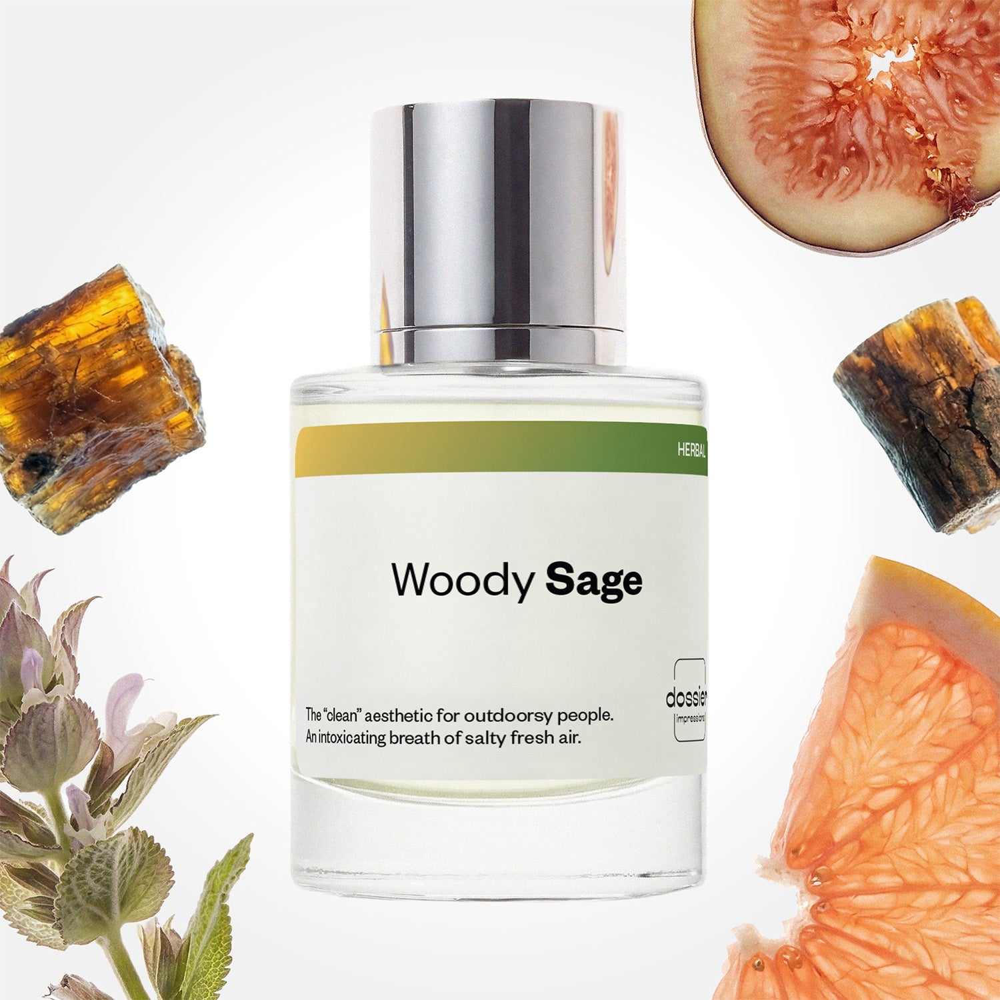

# Woody Sage

- **Dossier Inspired by Jo Malone's Wood Sage & Sea Salt**
- **URL:** https://dossier.co/products/woody-sage
- **SEO title:** Jo Malone Wood Sage & Sea Salt Dupe Perfume: Woody Sage - Dossier Perfumes

## Pricing (sizes)

| Size/SKU | Member price | List price | Currency |
|---|---|---|---|
| Fragrance+50ml/1.7oz | 26.1 | 29 | USD |
| 100ml | 44.1 | 49 | USD |
| BF+Free | 0 | 0 | USD |

## Content (scent notes, about, editorial)

Back Home / Perfumes / Dossier Impressions / WOODY SAGE 

Unisex 

Bestseller 

Woody Sage

Eau de Parfum. Size: 100ml / 3.4oz 

members: $44.10

Guest:
$49

Inspired by Jo Malone's Wood Sage & Sea Salt Inspired by Jo Malone's Wood Sage & Sea Salt 
Inspired by Jo Malone's Wood Sage & Sea Salt 

Retail price 165 Size
50ml $29

Best Value
100ml $49

Crafted in France 
Scent Family: herbal 

Add to Cart 

Scent Notes This perfume is: An airy hike through nature // sea salt 
Main Notes:

Fig Tree

Grapefruit

Clary Sage

Amberwood

top: The first notes you smell 
Fig Tree, Grapefruit 
middle: The heart of the perfume 
Marine notes, Ambrette 
base: The notes that linger all day 
Clary Sage, Amberwood 
ingredients: Alcohol, Water, Parfum/Perfume, alpha-iso-Methylionone, Citral, Coumarin, Citronellol, Limonene, Farnesol, Geraniol, Linalool. 

Vegan
Cruelty-free

Clean ingredients

About Woody Sage (inspired by Jo Malone's Wood Sage & Sea Salt) opens with a lively cocktail of fig and grapefruit, pierced by the scent of the sea. Utilizing a mineral salty accord and calone, this combination perfectly mimics a fresh sea breeze. Next, we travel greater depths with notes of ambery driftwoods and sage stepping on the scene. The result is a combination of aromatic raw materials paired with floral, minty, earthy, and camphorated notes. 

Natural, evocative, and lively, Woody Sage (our impression of Jo Malone's Wood Sage & Sea Salt) is a breath of fresh air while standing atop a seaside cliff.

Scent Intensity: Soft 

Concentration: 18%

Gender: Unisex 

Shipping
Free shipping with 2+ items. 

Standard Shipping (with 2+ items) Auto-selected with 2+ items 
FREE 

Standard Shipping Auto-selected under 2 items 
$3.95 

Express shipping: 2 business days Select in checkout 
$19.00 

Returns
Free exchanges for all. Free returns with 

Exchanges
Free exchange, 1 time per order for all.

Returns
D+ members get 1 FREE return per order.
Non-members incur a $3.99/bottle return fee, 1 time per order.
Returns must be postmarked within 30 days of the initial order. Learn More 

FAQs Are these fragrances long lasting? They are designed to be very long lasting, just like designer fragrances, in some cases even longer, depending on the composition. 
When does the new packaging come out? We'll begin rolling out our new packaging across the U.S. and international markets soon! If you want to shop IRL - our new packaging first hits stores on January 11, 2026 at Walmart. Please note that if you are shopping online, you may receive a combination of our current and new packaging while we transition our inventory. 
How will I know what scent I like? We get it, shopping for perfumes online is hard! That's why we created a scent quiz, which will find the perfect scent for you Take the quiz (opens in new tab) 
Unsure about something? Ask us! help@dossier.co 

Details We are not associated or affiliated with the brands mentioned here in any way.
Woody Sage

Escape to the Sea

Jo Malone’s Wood Sage and Sea Salt cologne (the fragrance that Dossier’s Woody Sage is inspired by) is inspired by the ephemeral quality and unpredictability of the English seaside: the shifting weather, rugged cliffs, wind, and a few glimpses of the setting sun. Master perfumer Christine Nagel created this cologne for both men and women, to evoke a sense of joy, freedom, and escape from the mundane.

As the name implies, the fragrance contains ambrette seeds, sea salt, sage, grapefruit, and red algae. Nagel also mentions buchu leaves, plum, dried fruits, driftwood, and musk as compositional elements in the perfume. 

Overall, this is a simple and linear composition, with a scent somewhat reminiscent of something more synthetic. But not the lab-made kind. Quite the opposite, the luxury fragrance that Woody Sage is inspired by delivers a rather landscape-esque fragrance, like that of a natural outdoor scent. This comes with a powerful sense of place that transports you to a small secluded beach where you can contemplate the waves and watch the sun set over the water.

The luxury fragrance that Woody Sage is inspired by opens bright, with juicy citrus and a distinct saline touch that doesn’t overpower. As soon as the grapefruit and bergamot clear, the main accord takes shape, enhanced by a musky, sweet ambrette and a slightly salty undertone. It contrasts nicely with hints of herbal, peppery sage, and the musky-wood base (with more strength and sweetness than most). In the end, the scent settles into this translucent, woody fragrance with subtle hints of wood in between.

Jo Malone Wood Sage and Sea Salt is available in flacons of 30 ml (1 oz) and 100 ml (3.4 oz) cologne. As part of the fragrance collection, Jo Malone offers a Scented Candle, as well as a Body and Hand-Wash and Body Crème. You can also get the perfume as part of a matching body care collection – a limited-edition Fragrance Combining Trio that includes the original fragrance and two other complementary perfumes. Those who enjoy a spirited, woody fragrance on the road will also appreciate the Car Diffuser Set. 

This is a scent that every woman and every man should own. Dossier’s Woody Sage is an equally empowering scent that takes after Jo Malone Wood Sage and Sea Salt. Woody Sage offers a breath of fresh air, combining natural beauty with evocative notes on an ocean breeze. Very much in a manner reminiscent of a woman standing on a seaside cliff. Our dupe allows you to experience the salty wind of the ocean, wet rocks, and the pristine scent of the sea – all for a fraction of the original cost.

Best Layered With Combine 2 of our perfumes to create a third scent with layering, curated by our nose. Learn more 

You Might Love 

4.4 

Rated 4.4 out of 5 stars 

Based on 3,208 reviews 

Reviews 3,208 (tab expanded) Questions 3 (tab collapsed) 

Filters 
Write a Review (Opens in a new window) 

3,208 reviews 
Sort Highest Rating Most Helpful Photos & Videos Most Recent Oldest Lowest Rating Least Helpful 

AM 

Andrea M. 
Verified Buyer 

6/28/26 

Rated 5 out of 5 stars 

Exceptional!!! 
Exceptional, delicious fragrance, unique, fresh, elegant, it could be an absolute addiction!!!
Love it!! 1000/1000

Read More Read more about this review 

Was this helpful? Yes, this review from Andrea M. was helpful. 0 people voted yes No, this review from Andrea M. was not helpful. 0 people voted no 

DP 

Dossier Perfumes 
6/28/26 
Andrea, thanks a bunch for this amazing review! We’re so happy it’s hitting all the right notes for you ✨

R 

Robbie 

6/23/26 

Rated 5 out of 5 stars 

5 Stars
The grapefruit and fig really shine in the opening, and it dries down to a nice refreshing woody smell.

Read More Read more about this review 

Was this helpful? Yes, this review from Robbie was helpful. 0 people voted yes No, this review from Robbie was not helpful. 0 people voted no 

J 

Jeanette 

6/17/26 

Rated 5 out of 5 stars 

5 Stars
Amazing by itself or to layer. Long lasting!

Read More Read more about this review 

Was this helpful? Yes, this review from Jeanette was helpful. 0 people voted yes No, this review from Jeanette was not helpful. 0 people voted no 

TB 

tiff B. 
Verified Buyer 

6/15/26 

Rated 5 out of 5 stars 

Beautiful 
This is just a beautiful scent and I will continue to try others as I am really starting to love dossier

Read More Read more about this review 

Was this helpful? Yes, this review from tiff B. was helpful. 0 people voted yes No, this review from tiff B. was not helpful. 0 people voted no 

DP 

Dossier Perfumes 
6/15/26 
Hey Tiff! We’re thrilled you’re loving our scents, and exploring new picks is such a fun journey 😊

MJ 

Marlon J. 
Verified Buyer 

6/13/26 

Rated 5 out of 5 stars 

Love the the fragrance 
Jamaican people love it

Read More Read more about this review 

Was this helpful? Yes, this review from Marlon J. was helpful. 0 people voted yes No, this review from Marlon J. was not helpful. 0 people voted no 

DP 

Dossier Perfumes 
6/13/26 
Marlon! That’s awesome to hear. We’re thrilled Jamaican folks are loving it too 😊

Loading... 

Loading... 

Show More 

Inspired by  Baccarat Rouge 540 
Inspired by  Black Opium 
Inspired by  Love, Don't Be Shy 
Inspired by  Good Girl 
Inspired by  Libre 
Inspired by  Flowerbomb 
Inspired by  Light Blue 
Inspired by  Not a Perfume 
Inspired by  Aventus 
Inspired by  Bleu de Chanel 
Inspired by  Mon Paris 
Inspired by  Coco Mademoiselle 
Inspired by  Tom Ford for Men 
Inspired by  For Her 
Inspired by  J'Adore Dior 
Inspired by  Alien 
Inspired by  Black Opium Perfume 
Inspired by  Lost Cherry Perfume 

GET UP TO 30% OFF 

Find us at these retailers. 

Be the first to know. 
Submit 

Shop the following countries. United States 

Discover.
AI Scent Finder 
Blog (opens in new tab) 
Scent Family 
Layering 
Scent Quiz 

Help.
Contact Us 
Returns 
FAQ 
Testimonials 
Accessibility 

More.
Store Locator 
Boutique 
Refer A Friend 
Index 

Download our app now.

Find us at these retailers. 

Be the first to know. 
Submit 

Shop the following countries. United States 

Discover.
AI Scent Finder 
Blog (opens in new tab) 
Scent Family 
Layering 
Scent Quiz 

Help.
Contact Us 
Returns 
FAQ 
Testimonials 
Accessibility 

More.

## Main Image

