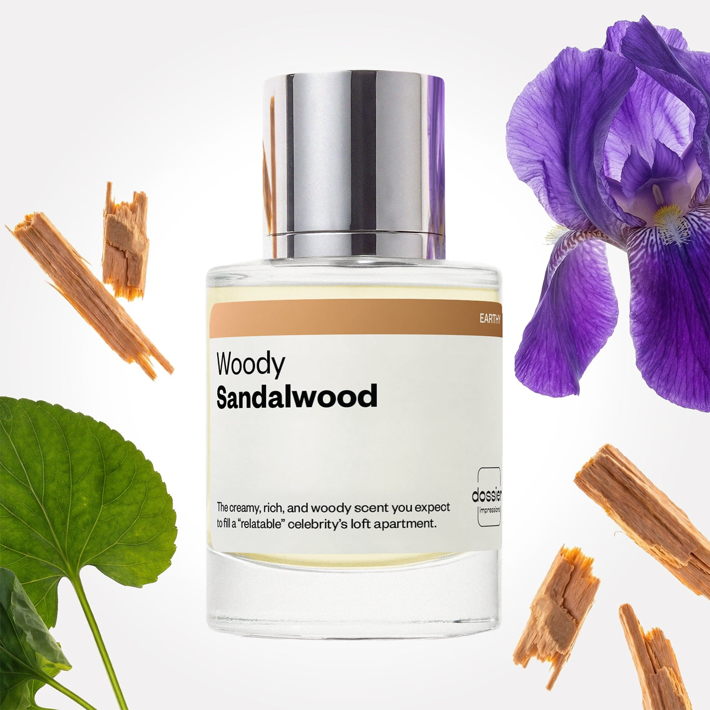

# Woody Sandalwood

- **Dossier Inspired by Le Labo Fragrances' Santal 33**
- **URL:** https://dossier.co/products/woody-sandalwood
- **SEO title:** Santal 33 Dupe Perfume Inspired by Le Labo: Woody Sandalwood - Dossier Perfumes

## Pricing (sizes)

| Size/SKU | Member price | List price | Currency |
|---|---|---|---|
| Fragrance+50ml/1.7oz | 44.1 | 49 | USD |
| 100ml | 71.1 | 79 | USD |
| 2x100ml | 142.2 | 158 | USD |
| 50ml+2.0+retail | 44.1 | 49 | USD |
| 2x50ml+2.0+retail | 88.2 | 98 | USD |
| travel+duo+(50ml+11ml) | 56.7 | 63 | USD |

## Content (scent notes, about, editorial)

Back Home / Perfumes / Dossier Impressions / WOODY SANDALWOOD 

Unisex 

Bestseller 

Woody Sandalwood

Eau de Parfum. Size: 100ml / 3.4oz 

members: $71.10

Guest:
$79

Inspired by Le Labo's Santal 33 Inspired by Le Labo's Santal 33 
Inspired by Le Labo's Santal 33 

Retail price 335 Size
50ml $49

Best Value
100ml $79

Crafted in France 
Scent Family: earthy 

Add to Cart 

Scent Notes This perfume is: Cozy and cocooning, a warm hug 
Main Notes:

Violet Leaf

Cardamom

Orris

Ambrox

Cedarwood

Cypriol

Sandalwood

top: The first notes you smell 
Violet Leaves, Cardamom 
middle: The heart of the perfume 
Orris, Ambrox, Cedarwood, Cypriol 
base: The notes that linger all day 
Musk, Sandalwood, Amber 
ingredients: Alcohol, Water, Parfum/Perfume, Citral, Citronellol, Limonene, Eugenol, Farnesol, Geraniol, Linalool. 

Vegan
Cruelty-free

Clean ingredients

About Woody Sandalwood (inspired by Le Labo Fragrances' Santal 33) is a tribute to the often underutilized precious nature of Sandalwood. Often considered a second player in the perfume industry, this scent capitalizes on the highest quality sandalwood: the Mysore variety from India. The result is uncomparable sandalwood that highlights its creamy facets, perfectly balancing the sharpness of other woods, while simultaneously giving a smooth continuity to floral bouquets. Pair that with the magical nature of sweet violet, classic orris, and woodsy musk, and Woodsy Sandalwood will soon become a new classic. 

Qualitative and minimalistic, Woody Sandalwood (our impression of Le Labo Fragrances' Santal 33) brings to mind the comfort of a warm hug, conveying a strong feeling of inner sensuality that’s unmatched by any comparable scent. 

Scent Intensity: Significant 

Concentration: 25%

Gender: Unisex 

Shipping
Free shipping with 2+ items. 

Standard Shipping (with 2+ items) Auto-selected with 2+ items 
FREE 

Standard Shipping Auto-selected under 2 items 
$3.95 

Express shipping: 2 business days Select in checkout 
$19.00 

Returns
Free exchanges for all. Free returns with 

Exchanges
Free exchange, 1 time per order for all.

Returns
D+ members get 1 FREE return per order.
Non-members incur a $3.99/bottle return fee, 1 time per order.
Returns must be postmarked within 30 days of the initial order. Learn More 

FAQs Are these fragrances long lasting? They are designed to be very long lasting, just like designer fragrances, in some cases even longer, depending on the composition. 
When does the new packaging come out? We'll begin rolling out our new packaging across the U.S. and international markets soon! If you want to shop IRL - our new packaging first hits stores on January 11, 2026 at Walmart. Please note that if you are shopping online, you may receive a combination of our current and new packaging while we transition our inventory. 
How will I know what scent I like? We get it, shopping for perfumes online is hard! That's why we created a scent quiz, which will find the perfect scent for you Take the quiz (opens in new tab) 
Unsure about something? Ask us! help@dossier.co 

Details We are not associated or affiliated with the brands mentioned here in any way.
Woody Sandalwood

A Deep, Warm Sandalwood Experience

Le Labo’s Santal 33 (the luxury fragrance that inspired Dossier’s Woody Sandalwood) is a long-standing fragrance and is undoubtedly one of the most defining scents of the decade. It’s so well-known that even some of the most iconic celebrities have taken to the unisex scent, such as Alexa Chung and Justin Bieber. 

This is a fragrance that has transcended cult status to become something that is at the same time coveted and ubiquitous. It’s a scent celebrated by perfumistas all over, and yet still enjoyably accessible to those who don’t know it.

Developed by perfumer Frank Voelkl, the luxury fragrance that Woody Sandalwood is inspired by was unveiled in 2011. With its woodsy-sweet scent, it has a rugged, yet not overly masculine appeal; if anything, it seems more androgynous. In any case, there is something universally sensual about this perfume, one that intoxicates both men and women alike.

The luxury scent that Woody Sandalwood is inspired by greets you with a smoky, almost leathery aroma. This is accented by a woody accord (with bits of cedar, sandalwood, and turpentine) fused with a cream-like scent (thanks to the coconut and tonka bean). Iris, papyrus, and violet make up the top and middle notes, giving it an overall floral, musky aroma. In the background, a green cedar note is briefly discernible, together with a dab of cardamom, though they don’t stay around long. Late in Santal 33’s dry-down, sandalwood’s deep, warm character completely takes over, cementing its dominant run throughout the scent.

The luxury fragrance that Woody Sandalwood is inspired by, as a whole, gives off a subtle aroma of milk and roses mixed with dense, old woods. It’s a lovely, comforting, smooth scent as it opens and develops, although by the end, what you’re left with is a bunch of smoky, milky notes that capture the distinctive scent of Australian sandalwood. Many will love it — others not so much. But regardless of how you look at it, this is a very mature scent, one that is suited for anyone so inclined to appreciate the finer side of life.

The luxury scent that Woody Sandalwood was inspired by is available as an Eau de Parfum, body wash, body lotion, and candle.

Unfortunately, there is a downside to Le Labo’s signature scent, and that’s the price. It’s not cheap . On the plus side though, you can get the same scent for much less.

Enter Woody Sandalwood. This Le Labo’s Santal 33 dupe from Dossier.co is a lot cheaper than the original, and uses 100% Indian sandalwood — an ingredient rawer, earthier, and creamier than its Australian counterpart. The result is a much richer scent, one that strikes an ideal balance between the sharpness of woody notes and the smoothness of floral notes.

Best Layered With Combine 2 of our perfumes to create a third scent with layering, curated by our nose. Learn more 

You Might Love 

4.3 

Rated 4.3 out of 5 stars 

Based on 4,866 reviews 

Reviews 4,866 (tab expanded) Questions 10 (tab collapsed) 

Filters 
Write a Review (Opens in a new window) 

4,866 reviews 
Sort Highest Rating Most Helpful Photos & Videos Most Recent Oldest Lowest Rating Least Helpful 

VB 

Vanessa B. 
Verified Buyer 

6/30/26 

Rated 5 out of 5 stars 

So many compliments!
I discovered this fragrance when a vintage item I purchased smelled AMAZING and I asked the seller what it was. I ordered it immediately and have received so many compliments from both men and women when I wear it. Everyone thinks its the original Santal, even people who wear the original can't tell the difference and are jealous that I found it at much more affordable price. The reasonable cost means I don't have to use it sparingly and can truly wear it as my everyday scent, which elevates both my mood and presentation on "sweatpants days". I've already ordered a second bottle. 

Read More Read more about this review 

Was this helpful? Yes, this review from Vanessa B. was helpful. 0 people voted yes No, this review from Vanessa B. was not helpful. 0 people voted no 

DP 

Dossier Perfumes 
7/1/26 
Wow Vanessa, we’re so happy you’re getting all those compliments and loving it every day—even on sweatpants days 😊 Thanks for sharing your experience!

A 

alexandra 

6/23/26 

Rated 5 out of 5 stars 

5 Stars
smells sooooo good

Read More Read more about this review 

Was this helpful? Yes, this review from alexandra was helpful. 0 people voted yes No, this review from alexandra was not helpful. 0 people voted no 

CC 

Cruz C. 
Verified Buyer 

6/23/26 

Rated 5 out of 5 stars 

The bestttttt! One of my favvvvvvvssss!!! 
Yummy yummy scent. I get so many compliments. I’ve already bought a few bottles of this one. Very close to the real thing. 

Read More Read more about this review 

Was this helpful? Yes, this review from Cruz C. was helpful. 0 people voted yes No, this review from Cruz C. was not helpful. 0 people voted no 

DP 

Dossier Perfumes 
6/23/26 
Hey Cruz! We’re thrilled you’re loving it and turning heads wherever you go. Buying a few bottles is the ultimate compliment to us. Thanks so much for sharing!

C 

Christian 

6/21/26 

Rated 5 out of 5 stars 

5 Stars
Excellent

Read More Read more about this review 

Was this helpful? Yes, this review from Christian was helpful. 0 people voted yes No, this review from Christian was not helpful. 0 people voted no 

LH 

Laura H. 
Verified Buyer 

6/20/26 

Rated 5 out of 5 stars 

Polarizing Earthy Fragrance (I love it)
I received Wo*dy Sandalwood as a gift from Dossier in response to a previous return issue, of which they had already done a thorough job helping me. Throughout that process, I chatted with several folks over email, and their customer service has been consistently fast, thorough, warm, and solution-oriented. Even when there isn't an issue and I just have a question on a sale or something, they are quick to respond. So shout out to Dossier's help team, thanks for helping me out and hooking me up! 
Now for Wo*dy Sandalwood, let me say this fragrance is very intriguing. I get where people could smell pickles, but it's not in a vinegar, pickling solution kind of way. It's in this dry wood + aromatic + "green" combination that is kind of reminiscent of dried dill (like the herb). What I love most about this fragrance is that I smell something different about the scent profile each time I wear it, which feels like an adventure. 
That being said, this is a polarizing scent that not everyone will agree with. As such, I don't find myself reaching for this when I'm going out in public, so much as I enjoy wearing this when I'm winding down for bed. I prefer to spray this on when I'm about to lie down and read at night. I can smell remnants on my skin in the morning, and it even lingers about a day on any fabric it touched while fresh too, like my robe or bedsheets. Longevity like that is what I love in a fragrance, and Wo*dy Sandalwood delivers. 
Would I recommend this…

Read More Read more about this review 

Was this helpful? Yes, this review from Laura H. was helpful. 0 people voted yes No, this review from Laura H. was not helpful. 0 people voted no 

DP 

Dossier Perfumes 
6/20/26 
Laura, thanks a bunch for the props about our team—they’ll be thrilled 😊. We’re glad Woody Sandalwood’s uniqueness feels like an adventure at bedtime. Your detail helps others too!

Loading... 

Loading... 

Show More 

Inspired by  Baccarat Rouge 540 
Inspired by  Black Opium 
Inspired by  Love, Don't Be Shy 
Inspired by  Good Girl 
Inspired by  Libre 
Inspired by  Flowerbomb 
Inspired by  Light Blue 
Inspired by  Not a Perfume 
Inspired by  Aventus 
Inspired by  Bleu de Chanel 
Inspired by  Mon Paris 
Inspired by  Coco Mademoiselle 
Inspired by  Tom Ford for Men 
Inspired by  For Her 
Inspired by  J'Adore Dior 
Inspired by  Alien 
Inspired by  Black Opium Perfume 
Inspired by  Lost Cherry Perfume 

GET UP TO 30% OFF 

Find us at these retailers. 

Be the first to know. 
Submit 

Shop the following countries. United States 

Discover.
AI Scent Finder 
Blog (opens in new tab) 
Scent Family 
Layering 
Scent Quiz 

Help.
Contact Us 
Returns 
FAQ 
Testimonials 
Accessibility 

More.
Store Locator 
Boutique 
Refer A Friend 
Index 

Download our app now.

Find us at these retailers. 

Be the first to know. 
Submit 

Shop the following countries. United States 

Discover.
AI Scent Finder 
Blog (opens in new tab) 
Scent Family 
Layering 
Scent Quiz 

Help.
Contact Us 
Returns 
FAQ 
Testimonials 
Accessibility 

More.

## Main Image

