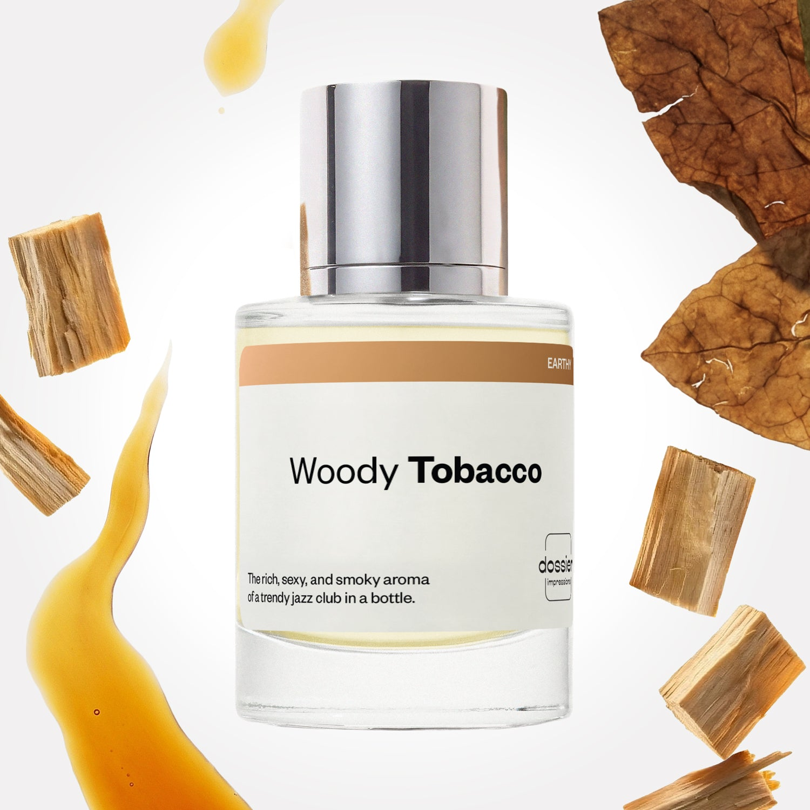

# Woody Tobacco

- **Dossier Inspired by Maison Margiela's Replica Jazz Club**
- **URL:** https://dossier.co/products/woody-tobacco
- **SEO title:** Replica Jazz Club by Maison Margiela Dupe Perfume: Woody Tobacco - Dossier Perfumes

## Pricing (sizes)

| Size/SKU | Member price | List price | Currency |
|---|---|---|---|
| DI50WTUS | 35.1 | 39 | USD |

## Content (scent notes, about, editorial)

Back Home / Perfumes / Dossier Impressions / WOODY TOBACCO 

Unisex 

Woody Tobacco

Eau de Toilette. Size: 50ml / 1.7oz 

members: $35.10

Guest:
$39

Inspired by Maison Margiela's Replica Jazz Club Inspired by Maison Margiela's Replica Jazz Club 
Inspired by Maison Margiela's Replica Jazz Club 

Retail price 165 Crafted in France 
Scent Family: earthy 

Add to Cart 

Scent Notes This perfume is: A late night out in NYC 
Main Notes:

Lemon

Pink Pepper

Neroli

Styrax

Tobacco Leaves

Vanilla

top: The first notes you smell 
Lemon, Pink Pepper, Neroli 
middle: The heart of the perfume 
Rum, Dry fruits, Blond Woods 
base: The notes that linger all day 
Styrax, Tobacco Leaves, Vanilla 
ingredients: Alcohol, Water, Parfum/Perfume, Anise Alcohol, Benzyl alcohol, Benzyl Benzoate, Benzyl Cinnamate, Cinnamaldehyde, Cinnamyl alcohol, Citral, Coumarin, Limonene, Eugenol, Farnesol, Geraniol, Isoeugenol, Linalool. 

Vegan
Cruelty-free

Clean ingredients

About Woody Tobacco (inspired by Maison Margiela's Replica Jazz Club) signature is a blond wood and tobacco leaves blend. This very textured combination is colored by a dry fruits and rum accord, sparkled by the effervescence of lemon and pink pepper. In the background, the fragrance confirms its glowing character with oriental notes of styrax and vanilla. 

Warm, bold, with a hint of craziness, Woody Tobacco (our impression of Maison Margiela's Replica Jazz Club) encapsulates the exhilarating atmosphere of Brooklyn music clubs. 

Scent Intensity: Statement 

Concentration: 18%

Gender: Unisex 

Shipping
Free shipping with 2+ items. 

Standard Shipping (with 2+ items) Auto-selected with 2+ items 
FREE 

Standard Shipping Auto-selected under 2 items 
$3.95 

Express shipping: 2 business days Select in checkout 
$19.00 

Returns
Free exchanges for all. Free returns with 

Exchanges
Free exchange, 1 time per order for all.

Returns
D+ members get 1 FREE return per order.
Non-members incur a $3.99/bottle return fee, 1 time per order.
Returns must be postmarked within 30 days of the initial order. Learn More 

FAQs Are these fragrances long lasting? They are designed to be very long lasting, just like designer fragrances, in some cases even longer, depending on the composition. 
When does the new packaging come out? We'll begin rolling out our new packaging across the U.S. and international markets soon! If you want to shop IRL - our new packaging first hits stores on January 11, 2026 at Walmart. Please note that if you are shopping online, you may receive a combination of our current and new packaging while we transition our inventory. 
How will I know what scent I like? We get it, shopping for perfumes online is hard! That's why we created a scent quiz, which will find the perfect scent for you Take the quiz (opens in new tab) 
Unsure about something? Ask us! help@dossier.co 

Details We are not associated or affiliated with the brands mentioned here in any way.
Woody Tobacco

The sound of a melodic Brooklyn jazz club melting through the early evening

Indistinct chatter and hearty laughter served with an ice-cold glass of your favorite cocktails – that is the feeling that accompanies the Maison Margiela ‘Replica’ Jazz Club Fragrance For Men and Women (the scent that inspired Dossier’s Woody Tobacco). It is an aromatic resemblance of peaceful piano and jiving saxophone. Sink into the leathery scent of low-profile couches aged with rich tobacco and smoke with this cologne.

Replicating the scintillating sensations of rich grandeur sprinkled with atmospheric comfort and ambience, the Maison Margiela’s ‘Replica’ Jazz Club cologne masterfully captures a picturesque snapshot of aesthetic and a lowly lit band that continues to accompany the evening’s conversation. Top notes of spicy pink pepper, citrusy neroli, and lemon fuse delightfully to create an opening akin to a sanguine string quartet. These are befriended by bartending middle notes of poignant rum, a powdery sage, and syrupy vetiver oil, served neat on the rocks for a spicy punch of intoxicating aromas. All this is balanced by the dry and rich scent of tobacco and leafy styrax subtly underscored with sweet and smooth vanilla bean. The fragrance that Woody Tobacco is inspired by is an original cocktail for the senses. It is designed to convey your olfactory to a downtown basement jazz club where soulful music wafts over the piquant aromas of tobacco and liquor.

The fragrance that Woody Tobacco is inspired by simulates an evening air of sophistication and relaxation. It is an auburn liquid that conjures cognitive visuals of the ethereal bamboo groves of Arashiyama. Even the bottle is iconic. It is a modest package adorned with a vintage typewritten calligraphy to match the tone of the aroma it holds. One spritz of this fragrance will transform a boring evening into a night of live jazz and heady richness.

To indulge in the mixture of rich tobacco and harmonious sweetness, browse your favorite online shop for this collection. The 30 ml bottle of Maison Margiela ‘Replica’ Jazz Club Eau de Toilette goes for $61.00, while the bigger 100 ml bottle costs $135.00. You can also get smaller travel size spray for $24.00. There is also a wide array of sample sprays available from online retailers, ranging from 1 ml – 5 ml, and costing between $5.00 to $15.00. And if you want to spice up your mood with this spellbinding scent, you can purchase the 165 g candle for $60.00 and the 40 ml body lotion for $25.00.

For an affordable fragrance that lets you experience the oscillations of jazzy melodies, turn to Dossier’s Woody Tobacco. Our Maison Margiela ‘Replica’ Jazz Club dupe faintly echoes the harmonies of nature with a mix of dried fruit accords. The signature edge of Woody Tobacco offers the scent of blond wood coupled wistfully with rum and vanilla. Dancing soulfully is an effervescent lemon that is carefully infused to create the ensemble of flavors and divine sensations. Look no further if you want a sensory escape to the Angel Falls.

Best Layered With Combine 2 of our perfumes to create a third scent with layering, curated by our nose. Learn more 

You Might Love 

4.5 

Rated 4.5 out of 5 stars 

Based on 943 reviews 

Reviews 943 (tab expanded) Questions 1 (tab collapsed) 

Filters 
Write a Review (Opens in a new window) 

943 reviews 
Sort Highest Rating Most Helpful Photos & Videos Most Recent Oldest Lowest Rating Least Helpful 

EM 

Eduardo M. 
Verified Buyer 

6/19/26 

Rated 5 out of 5 stars 

I love it
This perfume is absolutely delicious—it’s deep and sweet at the same time. My new favorite.

Read More Read more about this review 

Was this helpful? Yes, this review from Eduardo M. was helpful. 0 people voted yes No, this review from Eduardo M. was not helpful. 0 people voted no 

DP 

Dossier Perfumes 
6/19/26 
Eduardo so glad this scent feels just right for you. Thanks for sharing your favorite pick with us! 😊

J 

Jeff 

5/16/26 

Rated 5 out of 5 stars 

5 Stars
Smells just like the real thing!

Read More Read more about this review 

Was this helpful? Yes, this review from Jeff was helpful. 0 people voted yes No, this review from Jeff was not helpful. 0 people voted no 

L 

Lisangie 

5/10/26 

Rated 5 out of 5 stars 

5 Stars
Loved this for my husband !

Read More Read more about this review 

Was this helpful? Yes, this review from Lisangie was helpful. 0 people voted yes No, this review from Lisangie was not helpful. 0 people voted no 

L 

Lindsay 

4/2/26 

Rated 5 out of 5 stars 

Beautiful dry down 
I love this. I don't like the initial spray but the dry down is so pretty on my skin. The original jazz club is one of my favorites. I do have to say, they dry down differently on me but I love them both.

Read More Read more about this review 

Was this helpful? Yes, this review from Lindsay was helpful. 0 people voted yes No, this review from Lindsay was not helpful. 0 people voted no 

DP 

Dossier Perfumes 
4/2/26 
Lindsay, so glad the dry down is winning you over even if the first spritz isn’t your favorite. Skin chemistry really makes each scent unique, and exploring more helps too!

AD 

Angelica D. 
Verified Buyer 

3/28/26 

Rated 5 out of 5 stars 

***** Tobacco 
I’ve been using this scent for years! It’s become my signature scent this point! People will literally stop me in the street to ask me what I am wearing!!

Read More Read more about this review 

Was this helpful? Yes, this review from Angelica D. was helpful. 0 people voted yes No, this review from Angelica D. was not helpful. 0 people voted no 

DP 

Dossier Perfumes 
3/28/26 
Angelica! We’re so thrilled this scent has become your signature vibe, and that compliments are raining. There’s nothing like people pausing you for that question. More spritz moments ahead!

Loading... 

Loading... 

Show More 

Inspired by  Baccarat Rouge 540 
Inspired by  Black Opium 
Inspired by  Love, Don't Be Shy 
Inspired by  Good Girl 
Inspired by  Libre 
Inspired by  Flowerbomb 
Inspired by  Light Blue 
Inspired by  Not a Perfume 
Inspired by  Aventus 
Inspired by  Bleu de Chanel 
Inspired by  Mon Paris 
Inspired by  Coco Mademoiselle 
Inspired by  Tom Ford for Men 
Inspired by  For Her 
Inspired by  J'Adore Dior 
Inspired by  Alien 
Inspired by  Black Opium Perfume 
Inspired by  Lost Cherry Perfume 

GET UP TO 30% OFF 

Find us at these retailers. 

Be the first to know. 
Submit 

Shop the following countries. United States 

Discover.
AI Scent Finder 
Blog (opens in new tab) 
Scent Family 
Layering 
Scent Quiz 

Help.
Contact Us 
Returns 
FAQ 
Testimonials 
Accessibility 

More.
Store Locator 
Boutique 
Refer A Friend 
Index 

Download our app now.

Find us at these retailers. 

Be the first to know. 
Submit 

Shop the following countries. United States 

Discover.
AI Scent Finder 
Blog (opens in new tab) 
Scent Family 
Layering 
Scent Quiz 

Help.
Contact Us 
Returns 
FAQ 
Testimonials 
Accessibility 

More.

## Main Image

