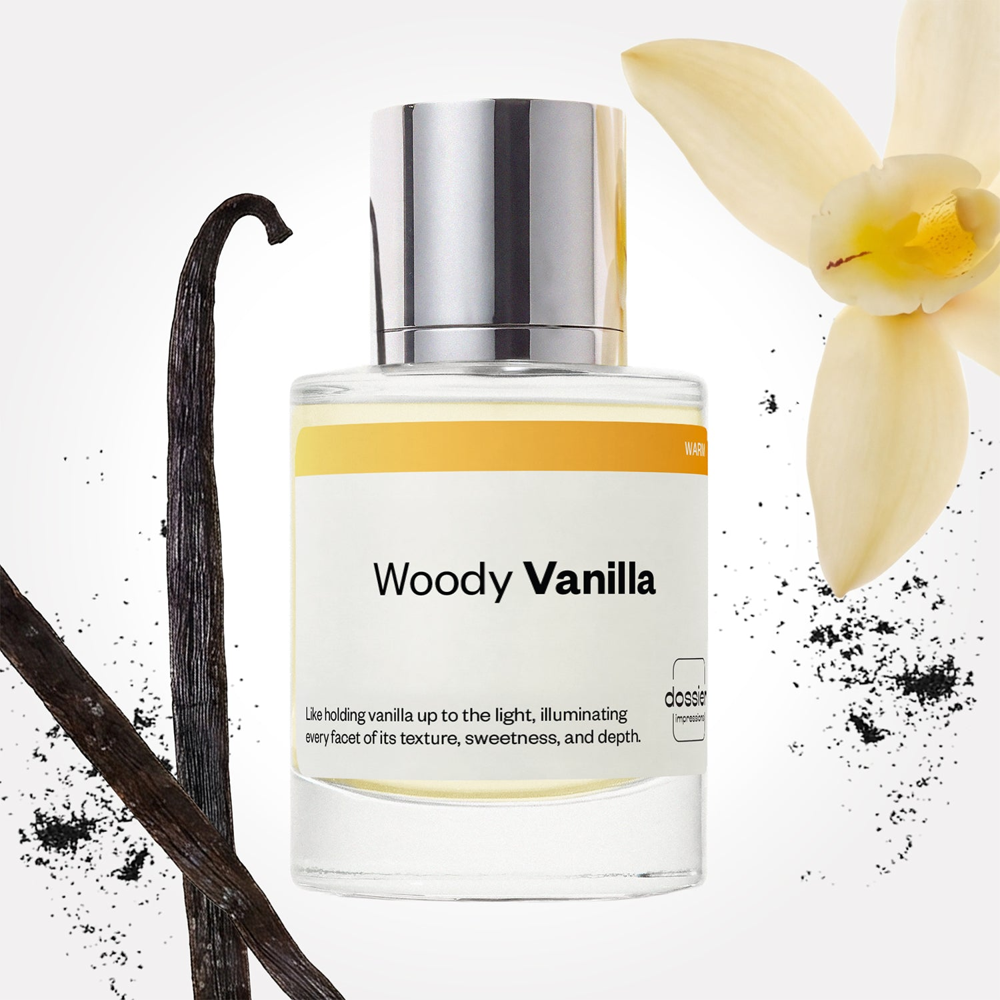

# Woody Vanilla

- **Dossier Inspired by Kayali's Vanilla 28**
- **URL:** https://dossier.co/products/woody-vanilla
- **SEO title:** Woody Vanilla

## Pricing (sizes)

| Size/SKU | Member price | List price | Currency |
|---|---|---|---|
| 50ml | 28.8 | 32 | USD |

## Content (scent notes, about, editorial)

Back Home / Perfumes / Dossier Impressions / WOODY VANILLA 

Unisex 

New 

Woody Vanilla

Eau de Parfum. Size: 50ml / 1.7oz 

members: $28.80

Guest:
$32

Inspired by Kayali's Vanilla 28 Inspired by Kayali's Vanilla 28 
Inspired by Kayali's Vanilla 28 

Retail price 150 Crafted in France 
Scent Family: warm 

Add to Cart 

Scent Notes Main Notes:

Vanilla

top: The first notes you smell 
Davans, Creamy Notes 
middle: The heart of the perfume 
Jasmine, Muguet, Brown Sugar 
base: The notes that linger all day 
Vanilla, Patchouli, Labdanum, Tonka Bean 
ingredients: Alcohol Denat., Fragrance/Parfum, Water/Aqua/Eau, Vanillin, Hexamethylindanopyran, Tetramethyl Acetyloctahydronaphthalenes, Linalyl Acetate, Pogostemon Cablin Oil, Coumarin, Juniperus Virginiana Oil, Limonene, Pinene, Citrus Aurantium Peel Oil, Beta-Caryophyllene, Benzyl Salicylate, Geranyl Acetate, Hexadecanolactone, Benzyl Benzoate, Citronellol, Rose Ketones, Dimethyl Phenethyl Acetate, Benzyl Alcohol. 

Vegan
Cruelty-free

Clean ingredients

About 

Woody Vanilla (inspired by Kayali’s Vanilla 28) is a true ode to vanilla—with its addictive comfort taking center stage from first spritz to final dry down.

At its opening, davana essence coaxes out vanilla’s boozy side, while creamy notes accentuate its smooth, silky nature.

Then, it evolves into a delicate floral heart, highlighting vanilla’s blooming origins with a sprinkle of brown sugar to heighten its sweet, gourmand character.

The fragrance culminates into a lasting base of ambery notes that pay homage to vanilla’s warmth and patchouli to deepen its dark, earthy side.

Turns out vanilla isn’t so…vanilla.

Scent Intensity: Significant 

Concentration: 25%

Gender: Unisex 

Shipping
Free shipping with 2+ items. 

Standard Shipping (with 2+ items) Auto-selected with 2+ items 
FREE 

Standard Shipping Auto-selected under 2 items 
$3.95 

Express shipping: 2 business days Select in checkout 
$19.00 

Returns
Free exchanges for all. Free returns with 

Exchanges
Free exchange, 1 time per order for all.

Returns
D+ members get 1 FREE return per order.
Non-members incur a $3.99/bottle return fee, 1 time per order.
Returns must be postmarked within 30 days of the initial order. Learn More 

FAQs Are these fragrances long lasting? They are designed to be very long lasting, just like designer fragrances, in some cases even longer, depending on the composition. 
When does the new packaging come out? We'll begin rolling out our new packaging across the U.S. and international markets soon! If you want to shop IRL - our new packaging first hits stores on January 11, 2026 at Walmart. Please note that if you are shopping online, you may receive a combination of our current and new packaging while we transition our inventory. 
How will I know what scent I like? We get it, shopping for perfumes online is hard! That's why we created a scent quiz, which will find the perfect scent for you Take the quiz (opens in new tab) 
Unsure about something? Ask us! help@dossier.co 

Best Layered With Combine 2 of our perfumes to create a third scent with layering, curated by our nose. Learn more 

You Might Love 

4.3 

Rated 4.3 out of 5 stars 

Based on 24 reviews 

Reviews 24 (tab expanded) Questions (tab collapsed) 

Filters 
Write a Review (Opens in a new window) 

24 reviews 
Sort Highest Rating Most Helpful Photos & Videos Most Recent Oldest Lowest Rating Least Helpful 

JH 

Jayden H. 
Verified Buyer 

7/1/26 

Rated 5 out of 5 stars 

Very nice 
love the mellowed smell of the cologne it’s very warm and blends w your natural scent 

Read More Read more about this review 

Was this helpful? Yes, this review from Jayden H. was helpful. 0 people voted yes No, this review from Jayden H. was not helpful. 0 people voted no 

DP 

Dossier Perfumes 
7/1/26 
Hey Jayden! We’re so happy you love how it warms up and blends with your own scent 😊 Enjoy!

EC 

Emily C. 
Verified Reviewer 

6/24/26 

Rated 5 out of 5 stars 

Love at first smell
I was looking for a vanilla scent that was more mature and not necessarily gourmand…this is it! More of a vanilla for adults and very elegant. Smells way more expensive than the price point suggests. It leans in more to the spicier, vintage, more incense-y aspect of vanilla in my opinion. 

Read More Read more about this review 

Was this helpful? Yes, this review from Emily C. was helpful. 0 people voted yes No, this review from Emily C. was not helpful. 0 people voted no 

DP 

Dossier Perfumes 
6/24/26 
Emily, you nailed it! We’re thrilled this one hit that grown-up vanilla vibe... thanks for sharing your elegant take and happy spritzing as you explore more scents!

T 

Teresa 

6/19/26 

Rated 5 out of 5 stars 

5 Stars
Wonderful ❣️❣️❣️

Read More Read more about this review 

Was this helpful? Yes, this review from Teresa was helpful. 0 people voted yes No, this review from Teresa was not helpful. 0 people voted no 

A 

Alisa 

6/12/26 

Rated 5 out of 5 stars 

5 Stars
Loved

Read More Read more about this review 

Was this helpful? Yes, this review from Alisa was helpful. 0 people voted yes No, this review from Alisa was not helpful. 0 people voted no 

SH 

Sherella H. 
Verified Buyer 

5/12/26 

Rated 5 out of 5 stars 

Love Woody Vanilla 
This amazing and it last so long. I dont have spray it again. The notes in this scent are super pronounced and I love it

Read More Read more about this review 

Was this helpful? Yes, this review from Sherella H. was helpful. 0 people voted yes No, this review from Sherella H. was not helpful. 0 people voted no 

DP 

Dossier Perfumes 
5/12/26 
Sherella! Wow, we’re thrilled you love the lasting power and those bold notes. It’s awesome not having to re-spray all day ✨ Thanks so much for sharing the love!

Loading... 

Loading... 

Show More 

Inspired by  Baccarat Rouge 540 
Inspired by  Black Opium 
Inspired by  Love, Don't Be Shy 
Inspired by  Good Girl 
Inspired by  Libre 
Inspired by  Flowerbomb 
Inspired by  Light Blue 
Inspired by  Not a Perfume 
Inspired by  Aventus 
Inspired by  Bleu de Chanel 
Inspired by  Mon Paris 
Inspired by  Coco Mademoiselle 
Inspired by  Tom Ford for Men 
Inspired by  For Her 
Inspired by  J'Adore Dior 
Inspired by  Alien 
Inspired by  Black Opium Perfume 
Inspired by  Lost Cherry Perfume 

GET UP TO 30% OFF 

Find us at these retailers. 

Be the first to know. 
Submit 

Shop the following countries. United States 

Discover.
AI Scent Finder 
Blog (opens in new tab) 
Scent Family 
Layering 
Scent Quiz 

Help.
Contact Us 
Returns 
FAQ 
Testimonials 
Accessibility 

More.
Store Locator 
Boutique 
Refer A Friend 
Index 

Download our app now.

Find us at these retailers. 

Be the first to know. 
Submit 

Shop the following countries. United States 

Discover.
AI Scent Finder 
Blog (opens in new tab) 
Scent Family 
Layering 
Scent Quiz 

Help.
Contact Us 
Returns 
FAQ 
Testimonials 
Accessibility 

More.

## Main Image

