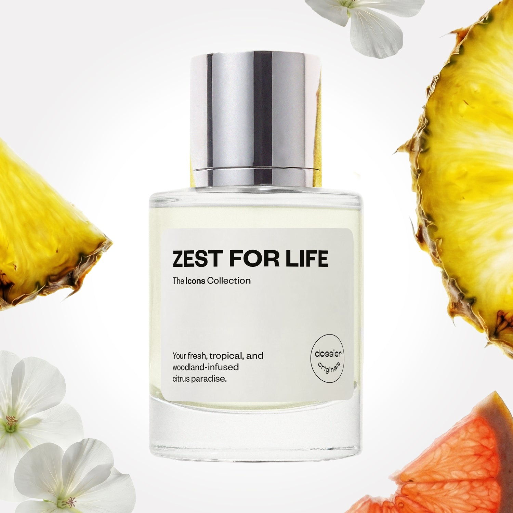

# Zest for Life

- **Dossier Dossier Originals**
- **URL:** https://dossier.co/products/zest-for-life
- **SEO title:** Zest for Life

## Pricing (sizes)

| Size/SKU | Member price | List price | Currency |
|---|---|---|---|
| 41570582528067 | 35.1 | 39 | USD |

## Content (scent notes, about, editorial)

Back Home / Perfumes / Dossier Originals / ZEST FOR LIFE 

Men 

New 

Zest for Life

Eau de Parfum. Size: 50ml / 1.7oz 

members: $35.10

Guest:
$39

Dossier Originals: The icons collection 

Our most noteworthy fragrances EVER.
Expertly crafted magic with your most beloved notes via the Creative Lab.

Crafted in France 
Scent Family: fresh 

Add to Cart 

Scent Notes Main Notes:

Grapefruit

Pineapple

Green Apple

Aromatic Notes

Geranium

Cedarwood

top: The first notes you smell 
Grapefruit, Bergamot, Pineapple, Green Apple, Melon 
middle: The heart of the perfume 
Aromatic Notes, Lavender, Geranium, Ginger 
base: The notes that linger all day 
Cedarwood, Woody Ambery Notes, Incense 
ingredients: Alcohol Denat., Water, Parfum/Perfume, Camphor, Citral, Citrus Aurantium Bergamia Peel Oil, Tetramethyl Acetyloctahydronaphthalenes, Juniperus Virginiana Oil, Pinene, Rose Ketones, Terpineol, Acetyl cedrene, Alpha-isomethyl Ionone, Alpha-Terpinene, Anise Alcohol, Beta-caryophyllene, Citrus Limon Peel Oil, Coumarin, Citronellol, Limonene, Eugenol, Farnesol, Geraniol, Geranyl Acetate, Linalool, Linalyl Acetate, Terpinolene 

Vegan
Cruelty-free

Clean ingredients

About Escape to a citrusy, natural paradise with Zest for Life ––an oasis of fruity, aromatic, and woody notes. This fragrance was conceived via a magic recipe of juicy, citrus, and tropical fruit notes with a woodland twist of aromatic, geranium, and textured woody notes.

Zest for Life opens with prominent fruity top notes of grapefruit, pineapple, and green apple interlaced with hints of bergamot and melon. It folds into a mélange of aromatic, geranium, and undeniably masculine lavender and ginger heart notes–––before settling into the skin with cedarwood-forward, smoky amber, and incense base notes.

Your daily fresh citrus escape awaits. 

Concentration: 18%

Gender: Masculine 

Shipping
Free shipping with 2+ items. 

Standard Shipping (with 2+ items) Auto-selected with 2+ items 
FREE 

Standard Shipping Auto-selected under 2 items 
$3.95 

Express shipping: 2 business days Select in checkout 
$19.00 

Returns
Free exchanges for all. Free returns with 

Exchanges
Free exchange, 1 time per order for all.

Returns
D+ members get 1 FREE return per order.
Non-members incur a $3.99/bottle return fee, 1 time per order.
Returns must be postmarked within 30 days of the initial order. Learn More 

FAQs Are these fragrances long lasting? They are designed to be very long lasting, just like designer fragrances, in some cases even longer, depending on the composition. 
When does the new packaging come out? We'll begin rolling out our new packaging across the U.S. and international markets soon! If you want to shop IRL - our new packaging first hits stores on January 11, 2026 at Walmart. Please note that if you are shopping online, you may receive a combination of our current and new packaging while we transition our inventory. 
How will I know what scent I like? We get it, shopping for perfumes online is hard! That's why we created a scent quiz, which will find the perfect scent for you Take the quiz (opens in new tab) 
Unsure about something? Ask us! help@dossier.co 

Best Layered With Combine 2 of our perfumes to create a third scent with layering, curated by our nose. Learn more 

You Might Love 

4.5 

Rated 4.5 out of 5 stars 

Based on 61 reviews 

Reviews 61 (tab expanded) Questions (tab collapsed) 

Filters 
Write a Review (Opens in a new window) 

61 reviews 
Sort Highest Rating Most Helpful Photos & Videos Most Recent Oldest Lowest Rating Least Helpful 

A 

Andrea 

6/10/26 

Rated 5 out of 5 stars 

5 Stars
I got this as a sample and I absolutely loved this fragrance so fresh and very pretty

Read More Read more about this review 

Was this helpful? Yes, this review from Andrea was helpful. 0 people voted yes No, this review from Andrea was not helpful. 0 people voted no 

M 

Mistie 
Verified Reviewer 

5/16/26 

Rated 5 out of 5 stars 

Clean like soap and first kisses. 
Beautiful scent. Reminds me of a cologne I can’t remember name of from 90’s. Smells exceptionally clean. With the slightest skin scent underneath. Remember your first makeout session with a boy? This is his smell. Clean freshly showered and you smell his warm skin. 

Read More Read more about this review 

Was this helpful? Yes, this review from Mistie was helpful. 0 people voted yes No, this review from Mistie was not helpful. 0 people voted no 

DP 

Dossier Perfumes 
5/16/26 
Mistie! Love how it brings back those fresh first-kiss memories and that cozy just-showered vibe. We’re thrilled it’s giving you that warm nostalgia. Thanks for sharing!

K 

Katrina 
Verified Reviewer 

5/14/26 

Rated 5 out of 5 stars 

Amazing!
I got the sample of this perfume not expecting too much from it. It surprised me! The initial spray is very refreshing with a zest of grapefruit, but it settles down to a beautiful, slightly warm scent that lasts for a long time. I'm buying the full size now!

Read More Read more about this review 

Was this helpful? Yes, this review from Katrina was helpful. 0 people voted yes No, this review from Katrina was not helpful. 0 people voted no 

S 

Shane 
Verified Reviewer 

5/13/26 

Rated 5 out of 5 stars 

Best of the samples I got 
Love the freshness of this one. I got 3 samples and this one was by FAR my favorite. Def a freshie for warm weather. We’ll see how longevity is to justify the price. 

Read More Read more about this review 

Was this helpful? Yes, this review from Shane was helpful. 0 people voted yes No, this review from Shane was not helpful. 0 people voted no 

JF 

Jeffrey F. F. 
Verified Buyer 

4/20/26 

Rated 5 out of 5 stars 

TOP TIER SCENT 
It’s probably the best scent I've purchased with my membership so far 10/10

Read More Read more about this review 

Was this helpful? Yes, this review from Jeffrey F. F. was helpful. 0 people voted yes No, this review from Jeffrey F. F. was not helpful. 0 people voted no 

DP 

Dossier Perfumes 
4/20/26 
We love hearing this, Jeffrey! 10/10 back at you. So glad this one tops your membership picks.

Loading... 

Loading... 

Show More 

Inspired by  Baccarat Rouge 540 
Inspired by  Black Opium 
Inspired by  Love, Don't Be Shy 
Inspired by  Good Girl 
Inspired by  Libre 
Inspired by  Flowerbomb 
Inspired by  Light Blue 
Inspired by  Not a Perfume 
Inspired by  Aventus 
Inspired by  Bleu de Chanel 
Inspired by  Mon Paris 
Inspired by  Coco Mademoiselle 
Inspired by  Tom Ford for Men 
Inspired by  For Her 
Inspired by  J'Adore Dior 
Inspired by  Alien 
Inspired by  Black Opium Perfume 
Inspired by  Lost Cherry Perfume 

GET UP TO 30% OFF 

Find us at these retailers. 

Be the first to know. 
Submit 

Shop the following countries. United States 

Discover.
AI Scent Finder 
Blog (opens in new tab) 
Scent Family 
Layering 
Scent Quiz 

Help.
Contact Us 
Returns 
FAQ 
Testimonials 
Accessibility 

More.
Store Locator 
Boutique 
Refer A Friend 
Index 

Download our app now.

Find us at these retailers. 

Be the first to know. 
Submit 

Shop the following countries. United States 

Discover.
AI Scent Finder 
Blog (opens in new tab) 
Scent Family 
Layering 
Scent Quiz 

Help.
Contact Us 
Returns 
FAQ 
Testimonials 
Accessibility 

More.

## Main Image

