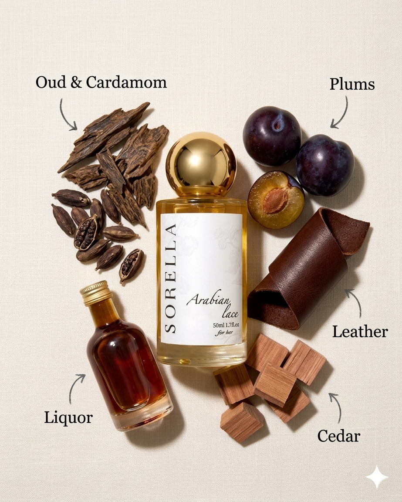

# Arabian lace tester

- **Handle:** `arabian-lace-tester`
- **URL:** https://sorella-eg.com/products/arabian-lace-tester
- **Vendor:** Sorella
- **Type:** 
- **Published:** 2026-02-12T01:55:59+02:00

## Variants / Pricing

| Variant | Price | SKU | Available |
|---|---|---|---|
| 5ml | 85.00 | None | True |

## Description

Arabian lace
Notes:
Liquor
Black currant
Oud

Vibe:
Extremely chic, attractive, and unapologetically feminine.
This scent feels like quiet luxury silk kaftans, gold jewelry, and soft candlelight after iftar. It’s powerful yet graceful, bold but refined. A woman who wears this doesn’t need to speak loudly; her presence does the work. Elegant, magnetic, and timeless with a modern edge.

When to Wear:
Ramadan iftar gatherings & suhoor nights
Elegant family evenings
Special Ramadan events & launches
Perfect for night wear or any moment you want to feel polished, confident, and unforgettable

## Images

