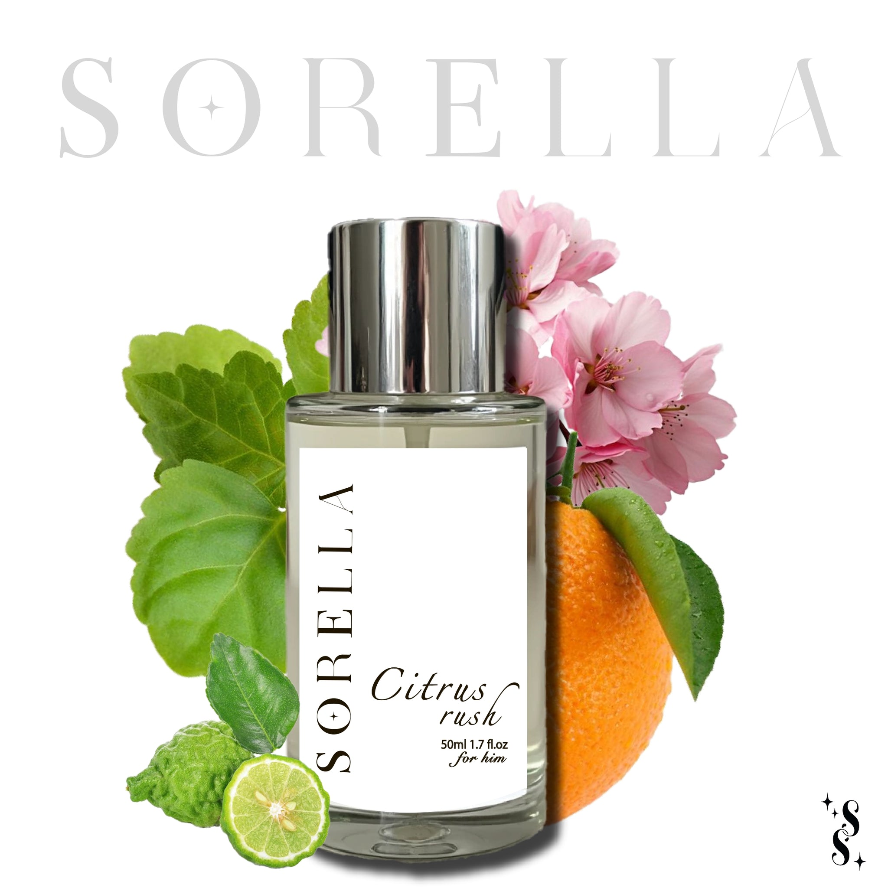

# Citrus Rush

- **Handle:** `citrus-rush`
- **URL:** https://sorella-eg.com/products/citrus-rush
- **Vendor:** Sorella
- **Type:** 
- **Published:** 2025-05-02T15:13:26+03:00

## Variants / Pricing

| Variant | Price | SKU | Available |
|---|---|---|---|
| Default Title | 850.00 | None | True |

## Description

Citrus rush gives off a vibe that’s clean, modern, and effortlessly confident. It’s fresh at first with a hint of citrus, then settles into something soft, woody, and
slightly sensual.

When to wear it:
Perfect for daytime, whether it’s a work meeting, a brunch, or a casual date. It’s also versatile enough for evenings out when you want to smell polished but not overdone. Ideal for spring and summer, but works year-round for those who love a fresh-woody balance.

Top Notes:
Calabrian Bergamot
Heart Notes:
Tunisian Orange Blossom
Base Notes:
Patchouli
Woodsy notes

## Images

