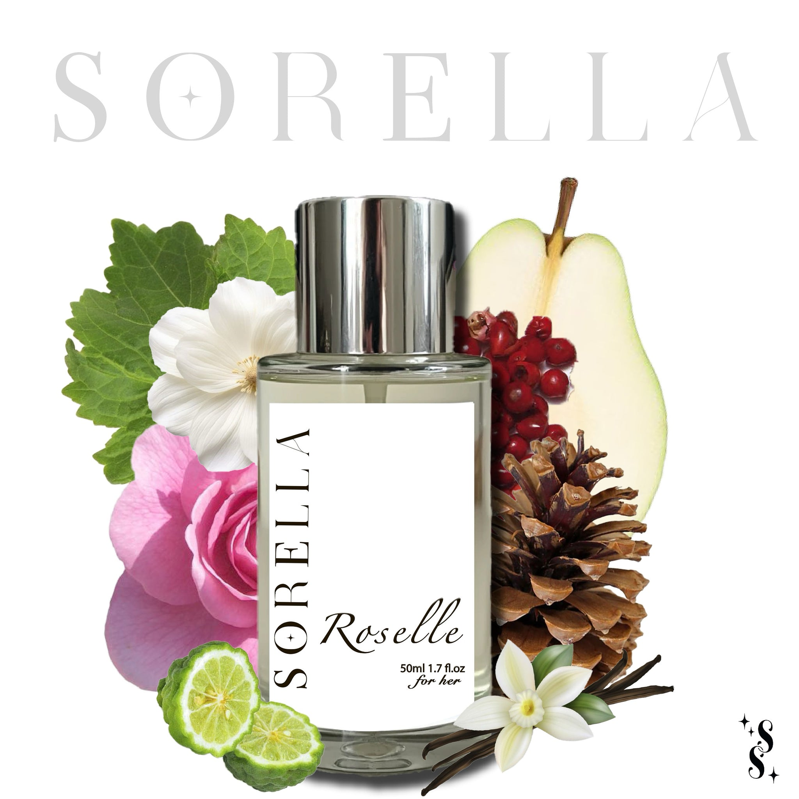

# Roselle tester

- **Handle:** `roselle-tester`
- **URL:** https://sorella-eg.com/products/roselle-tester
- **Vendor:** Sorella
- **Type:** 
- **Tags:** free-gift-5ml
- **Published:** 2025-12-30T13:40:35+02:00

## Variants / Pricing

| Variant | Price | SKU | Available |
|---|---|---|---|
| 5 ML | 85.00 | None | True |

## Description

Top notes
Pear, Bergamot, pink pepper
Middle notes
Rose, jasmine
Base notes
White musk, patchouli, vanilla, cedar

The Vibe:
Clean, radiant, and ultra-feminine. Roselle is like a fresh bouquet kissed by soft musk and juicy pear, wrapped in rose petals and modern elegance. It feels empowering, luminous, and effortlessly chic—like confidence in a bottle with a polished, pretty glow.

When to Wear:
Perfect for daytime meetings, elegant brunches, or romantic evenings out. Wear it when you want to feel powerful yet graceful, charming yet composed. The best when
 you want your scent to say “I’ve arrived” without shouting.

## Images

